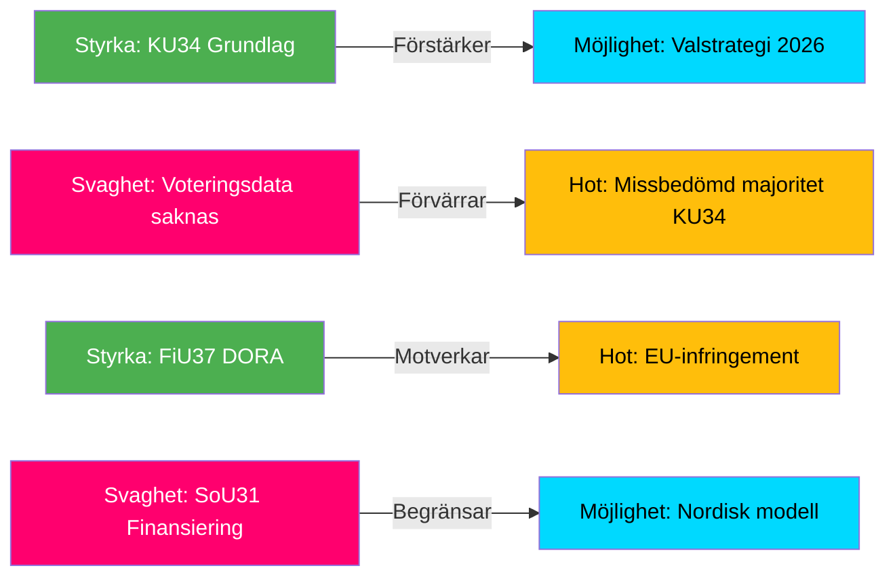

# SWOT Analysis — Committee Reports 2026-05-12

## Primary Focus: KU34 Constitutional Package + CU31 Rental Market Reform

---

## Strengths

| Evidence row | dok_id / source | Admiralty |
|---|---|---|
| Grundlagsskydd för aborträtt stärker rättssäkerheten och är EU/ECHR-kompatibelt | HD01KU34 [A2] | A2 |
| Konstruktiv koalitionsöverenskommelse möjliggör två skilda politiska mål i ett RF-beslut | HD01KU34 [A2] | B2 |
| CU31 hyresreform möter marknadens efterfrågan på flexibla hyreskontrakt — ekonomisk effektivitet | HD01CU31 [A3] | B3 |
| FiU37 krishanteringsfunktion DORA-kompatibel — minskar EU-lagöverträdelsesrisk | HD01FiU37 [B2] | B2 |
| JuU39 psykiskt våld harmoniserar med Istanbulkonventionen (GREVIO rapport 2023) | HD01JuU39 [B3] | B3 |

## Weaknesses

| Evidence row | dok_id / source | Admiralty |
|---|---|---|
| KU34:s dubbelkonstruktion riskerar mobilisera motstånd från båda hållen — aborträttskritiker (SD, KD) och föreningsfrihetsvakter (S, V, MP) | HD01KU34 [A2] | B2 |
| CU31 hyresreform kräver komplex omstrukturering av Hyresnämnden — implementeringsrisk 18–24 månader | HD01CU31 [A3] | B3 |
| SoU31 saknar tydlig finansieringsplan för den nya utredningsfunktionen — risk budgetberoende | HD01SoU31 [B3] | C3 |
| Voteringsdata ej tillgänglig för 2025/26 — partipositioner ej verifierbara med säkerhet [unconfirmed] | Voteringar saknas 2025/26 | D4 |

## Opportunities

| Evidence row | dok_id / source | Admiralty |
|---|---|---|
| KU34 grundlagsabort skapar valfrågefördelar för S/MP i valet 2026 — potentiell aktivering av unga väljare | HD01KU34 + valanalytisk kontext | B3 |
| CU31 kan lösa del av bostadsbristen (700 000 bostäder, SCB 2025) om implementering lyckas | HD01CU31 + SCB bostadsstatistik | B3 |
| FiU37 stärker Sveriges position i ECB/ESM-samarbetet om finansiell stabilitet | HD01FiU37 [B2] | B3 |
| SoU31 kan bli nordisk modell — Finland och Norge saknar likvärdig statlig funktion | HD01SoU31 [B3] | C3 |

## Threats

| Evidence row | dok_id / source | Admiralty |
|---|---|---|
| KU34 föreningsfrihetsbegränsning kan missbrukas politiskt mot civilt samhälle post-valet 2026 — demokratirisk | HD01KU34 [A2] | B2 |
| CU31 hyresreform kan driva ut låginkomsthushåll från centrala stadsdelar (gentrifiering) | HD01CU31 + forskning hyresmarknad | B3 |
| Ny riksmöte 2025/26 utan röstdata — analyssäkerhet begränsad [unconfirmed] | Metodologisk begränsning | D5 |
| SD motstånd mot CU31 kan förändra coalitionsdynamiken om partiet väljer att rösta med S/V | Koalitionsanalys | C3 |

## TOWS Matrix

| | Strengths (S) | Weaknesses (W) |
|---|---|---|
| **Opportunities (O)** | SO: Grundlagsabort + valstrategi 2026 skapar S/MP-valvind | WO: Finansiera SoU31 via budgetomstrukturering — undvika ny myndighet |
| **Threats (T)** | ST: FiU37 DORA-kompatibilitet minskar EU-hotet | WT: Utan voteringsdata — risk att missbedöma KU34:s riksdagsmajoritet |

## Cross-SWOT

KU34:s styrka (konstitutionell kompromiss) samspelar med hotet (politisk missbedömning av partisplittringen). CU31:s ekonomiska möjlighet (bostadsmarknad) är direkt hotad av implementeringssvaghet (Hyresnämnden-reform).

