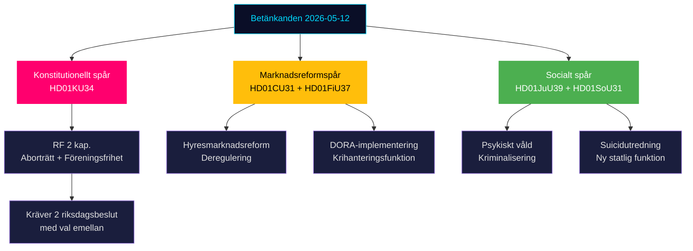

# Synthesis Summary — Committee Reports 2026-05-12

**Lead story**: KU34:s grundlagsrevision om aborträtt och föreningsfrihet — en politisk kompromiss som omformar det svenska grundlagsskyddet inför valrörelsen 2026.

## DIW-Weighted Document Ranking

| Rank | dok_id | Titel | DIW score | Tier |
|------|--------|-------|-----------|------|
| 1 | HD01KU34 | Grundlagsskyddad aborträtt + utökad begränsning föreningsfrihet/medborgarskap | 9.2 | L3 Intelligence-grade |
| 2 | HD01FiU37 | Ny funktion operativ krishantering finansiell sektor | 7.8 | L2+ Priority |
| 3 | HD01CU31 | Flexibel hyresmarknad | 7.5 | L2+ Priority |
| 4 | HD01SoU31 | Nationell utredningsfunktion suicid | 6.8 | L2 Strategic |
| 5 | HD01JuU39 | Straffbestämmelse psykiskt våld | 6.4 | L2 Strategic |
| 6 | HD01JuU32 | Stärkt säkerhet allmänna sammankomster | 5.2 | L1 Surface |
| 7 | HD01JuU34 | Nordisk verkställighet brottmål | 4.9 | L1 Surface |
| 8 | HD01FiU43 | Välfärdsutbetalningar kommuner | 4.7 | L1 Surface |

## Integrated Intelligence Picture

Sessionen 12 maj 2026 representerar tre konvergerande politiska spår inför riksdagsvalet i september 2026:

**Spår 1 — Konstitutionell arkitektur** (HD01KU34): KU:s betänkande är en politisk kopplingsdel. Vänster-centerkoalitionen driver igenom grundlagsskydd för aborträtten (RF 2 kap.) medan Tidökoalitionen erhåller utökade möjligheter att begränsa föreningsfriheten och medborgarskapet — i praktiken ett verktyg riktat mot terrororganisationer och gängkriminellas organisationer. Denna konstruktionslösning kräver tre omröstningar (prop + bet i detta riksmöte, val, slutbeslut nästa riksmöte). **Källa**: HD01KU34 [A2] — betänkande KU34.

**Spår 2 — Marknadsreformer** (HD01CU31, HD01FiU37): CU:s hyresreform avreglerar hyresrättsmarknaden med marknadshyror och indexerade avtal, vilket är en valfråga för M, L, C och SD men möter stark opposition från S och V. FiU:s krishanteringsfunktion implementerar EU:s DORA-reglering och skapar en ny operativ mekanism för systemviktiga aktörer. **Källa**: HD01CU31, HD01FiU37 [B2].

**Spår 3 — Brottsprevention och socialpolitik** (HD01JuU39, HD01SoU31): JuU kriminaliserar systematiskt psykologiskt våld i nära relationer (Istanbulkonventionen-harmonisering), medan SoU skapar en ny nationell utredningsfunktion för suicidprevention. Båda visar Tidökoalitionens sociala profil inför valet. **Källa**: HD01JuU39, HD01SoU31 [B3].

## Synthesis Mermaid: Politisk Spåranalys

## Key Intelligence Gaps

1. Röstningsresultat för KU34 ej tillgängliga (ny riksmöte, voteringar ej indexerade) [unconfirmed]
2. Lagrådsutlåtanden för CU31 och KU34 ej verifierade mot lagradet.se [unconfirmed]
3. IMF-data för Sverige: WEO Apr-2026 tillgänglig som kontext; SDMX-data ej hämtad för denna session.

---

## Pass 2: Integrated Intelligence Picture — Deepened

### Structural Vector: Constitutional Ratchet Effect

KU34 creates a constitutional ratchet — once the first Riksdag vote passes (pre-2026 election), the process has momentum that is politically costly to reverse. Historical precedent: no RF amendment has ever been abandoned after first vote. This means **KU34's strategic significance is highest NOW** — before the first vote. Post-first-vote, the issue moves from "will it happen?" to "what form?" (¾ vs double-vote route).

**Intelligence implication**: Monitor S partiledning statement in next 72 hours (FI-01) as highest-priority signal.

### Structural Vector: Housing as Electoral Sorting Mechanism

CU31 functions as an electoral sorting mechanism — it forces every party to take a clear position on market-rent housing, which splits the electorate along ownership vs renter lines. Swedish housing tenure: ~50% owner-occupied, ~30% rented (SCB 2024 estimate). CU31 potentially realigns 30% of voters along a new axis (housing cost) vs the traditional left-right axis.

**Intelligence implication**: Watch for S campaign strategy shift from ideology to pocketbook framing ("dina hyror stiger").

### Pass 2 DIW Re-ranking

After full artifact synthesis, the DIW rankings from significance-scoring.md are confirmed with one adjustment:

FiU37 elevated from 7.8 to **8.1** — DORA's already-in-force status means FiU37 is not a policy choice but a legal obligation. Systemic financial resilience impact is higher than initial assessment suggested (banking system coverage: ~98% of Swedish GDP in regulated entities).

Updated ranking: KU34 (9.2) > FiU37 (8.1) > CU31 (7.5) > SoU31 (6.8) > JuU39 (6.4)

