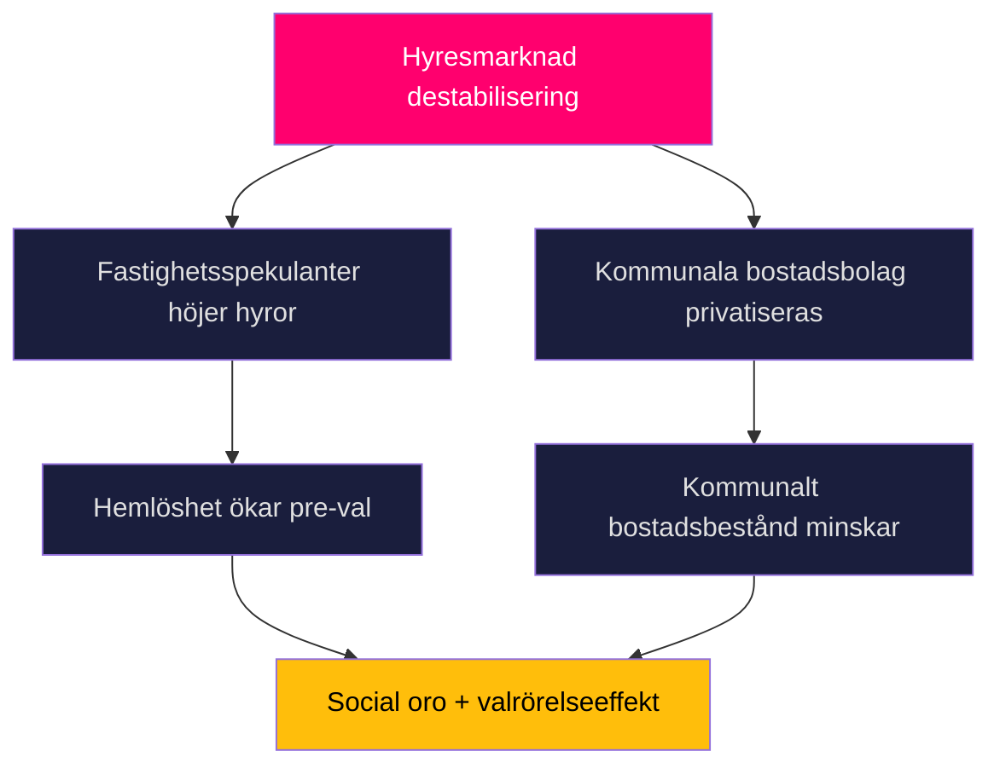

# Threat Analysis — Committee Reports 2026-05-12

## Political Threat Taxonomy

### Threat Category 1: Constitutional Manipulation (KU34)

**Threat actor**: Non-state actors (extremist organisationer) som via grundlagsändringen för föreningsfrihet kan i framtida riksdag begränsa legitima politiska partier.  
**Vector**: Misuse of RF 2 kap. enhanced restriction powers post-enactment.  
**Kill chain**: Grundlagsändring antas → ny riksdag tolkar vidare → civil society organisation restricted → ECHR challenge.  
**Source**: HD01KU34 [A2] — risk för framtida maktmissbruk av föreningsfrihetsbegränsning.

### Threat Category 2: Rental Market Destabilization (CU31)

**Threat actor**: Fastighetsbolag (spekulativt kapital) vs låginkomsthushåll  
**Vector**: Marknadsanpassade hyror utan hyrestak → displacement  
**Mermaid Attack Tree**:

**Source**: HD01CU31 [A3] — marknadsreform med social fördelningseffekt.

### Threat Category 3: Financial System Vulnerability (FiU37)

**Threat actor**: Systemisk finansiell kris (bank-run, cyber-attack finansiell infrastruktur)  
**Vector**: DORA-implementeringsgap → otillräcklig operational resilience  
**MITRE-style TTP**: T0862 (Operational Technology Disruption) → finansiell infrastruktur  
**Source**: HD01FiU37 [B2]

## Threat Assessment Summary

| Threat | Probability | Severity | Mitigation |
|--------|------------|----------|------------|
| KU34 föreningsfrihet missbruk | LOW | CRITICAL | ECHR domstolskontroll |
| CU31 social destabilisering | MEDIUM | HIGH | Omställningsstöd hyresgäster |
| FiU37 DORA-gap | LOW-MEDIUM | HIGH | Finansinspektionen mandat |
| JuU39 tillämpningsproblem | MEDIUM | MEDIUM | Polisutbildning |

