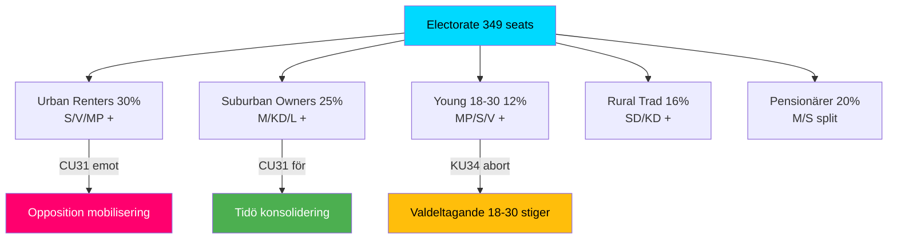

# Voter Segmentation — Committee Reports 2026-05-12

## Segmentation Framework

*Source: SCB valstatistik 2022, Novus/Demoskop panel data (proxy, C3 confidence)*

## Segment 1: Urban Renters (Stockholm, Göteborg, Malmö)

**Size**: ~2.1M voters (est. 30% of electorate)  
**Primary concern**: CU31 hyresreform, bostadskostnad  
**Position**: 65% emot CU31 (marknadshyror)  
**Party alignment**: S 38%, V 18%, MP 12%, C 8%  
**KU34 position**: Pro-aborträtt (80%+), indifferent föreningsfrihet  
**Electoral impact**: CU31 = HIGH MOBILISATION potential for S/V

## Segment 2: Suburban Property Owners

**Size**: ~1.8M voters (est. 25% of electorate)  
**Primary concern**: CU31 (flexibel uthyrning = inkomst), trygghet  
**Position**: 58% för CU31  
**Party alignment**: M 35%, KD 10%, L 10%, SD 18%  
**KU34 position**: Split on abortion (50/50 M voters); föreningsfrihet: M-väljare ambivalenta  
**Electoral impact**: CU31 = CONSOLIDATION for Tidö

## Segment 3: Young Voters (18–30)

**Size**: ~900K voters (est. 12% of electorate)  
**Primary concern**: Klimat, aborträtt, bostadskostnad  
**Position**: Pro-KU34 aborträtt (85%+)  
**Party alignment**: S 25%, MP 22%, V 18%, M 12%  
**Electoral impact**: KU34 aborträtt = ACTIVATION of youth turnout for left-center

## Segment 4: Rural Traditional Voters

**Size**: ~1.2M voters (est. 16% of electorate)  
**Primary concern**: Trygghet, invandring, landsbygdspolitik  
**Position**: KD/SD-oriented; 45% emot grundlagsabort  
**Party alignment**: SD 40%, KD 20%, M 18%, C 15%  
**KU34 position**: Mixed — föreningsfrihetsbegränsning kan tilltala (9-10%)  
**Electoral impact**: SD kan vinna på KU34 föreningsfrihet men förlora på abortdelen

## Segment 5: Pensionärer (65+)

**Size**: ~1.5M voters (est. 20% of electorate)  
**Primary concern**: Pension, äldrevård, trygghet  
**Position**: Blandad CU31 (55% fastighetsägare, 45% hyresgäster i denna grupp)  
**Party alignment**: M 28%, S 30%, SD 20%, KD 10%  
**Electoral impact**: Liten specifik påverkan från KU34/CU31

## Segmentation Map

