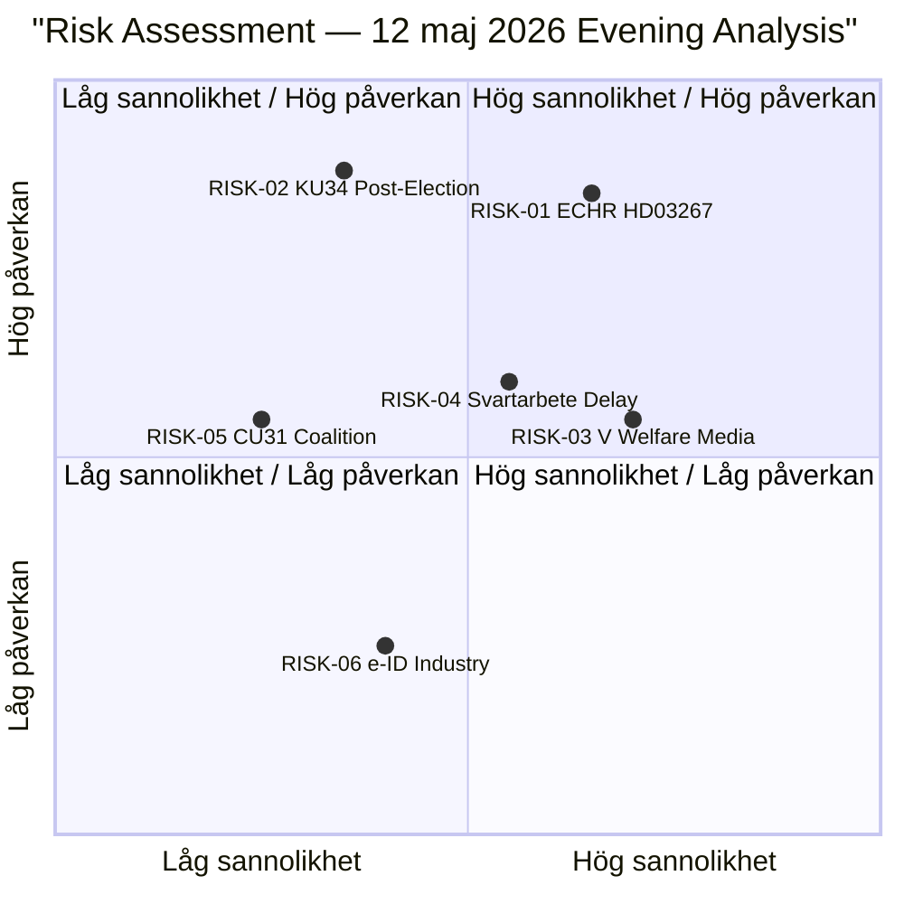

# Risk Assessment — Evening Analysis 2026-05-12

**Author**: James Pether Sörling  
**Date**: 2026-05-12  
**Classification**: 🟢 PUBLIC  
**Admiralty**: B2–C3 per risk dimension

---

## Risk Register

### RISK-01 — ECHR Non-Compliance on HD03267 [HIGH]
**Category**: Legal/Constitutional  
**Probability**: 65% that Lagrådet raises substantive objections  
**Impact**: HIGH — negative Lagrådet yttrande could delay or substantially amend the proposition; political damage to Tidö's rule-of-law credentials  
**Evidence**: ECHR Art. 3 (non-refoulement), Art. 8 (family life), RF kap. 2 § 21 (proportionality). Comparable SÄPO-expansion cases (REVA 2012–2013) encountered Lagrådet pushback.  
**Mitigation**: Pre-emptive committee amendments to narrow expulsion grounds; explicit proportionality safeguards  
**Admiralty**: B2

### RISK-02 — Constitutional Reform Defeat Post-Election [MEDIUM-HIGH]
**Category**: Political/Constitutional  
**Probability**: 35% if election produces SD-reduced coalition  
**Impact**: HIGH — KU34 requires second riksdag vote post-election; if election changes bloc balance, second vote could fail  
**Evidence**: KU34 requires RF 8 kap. 14 § two-decision process; new riksdag composition unknown  
**Mitigation**: Build cross-bloc supermajority for both components of the deal  
**Admiralty**: B3 (inference on post-election composition)

### RISK-03 — V Welfare Offensive Media Penetration [MEDIUM]
**Category**: Political/Electoral  
**Probability**: 70% that HD10484/HD10486 generate sustained media coverage through 29 maj ministerial deadline  
**Impact**: MEDIUM — amplifies V's valnarrativ; creates pressure on M (Tenje) and L (Britz)  
**Evidence**: Three simultaneous interpellations targeting two ministers; SVT/SR interest in eldercare scandals documented  
**Mitigation**: Government can issue strong ministerial responses with factual rebuttals by 29 maj  
**Admiralty**: B2

### RISK-04 — Svartarbete Proposal Delay [MEDIUM]
**Category**: Governance/Electoral  
**Probability**: 55% that no proposal tabled before summer recess  
**Impact**: MEDIUM — confirms S's "delivery gap" narrative; ESO 2026:1 quantification (SEK 189 mdr/year) makes silence electorally costly  
**Evidence**: ESO 2026:1 published; investigation completed 2 years ago per HD10482; parliamentary interpellation deadline 29 maj  
**Mitigation**: Pre-emptive announcement of proposal timeline before Riksdag summer recess  
**Admiralty**: B2

### RISK-05 — Housing Market Reform Coalition Fracture [LOW-MEDIUM]
**Category**: Coalition/Social  
**Probability**: 25% that SD softens position on CU31 under urban voter pressure  
**Impact**: MEDIUM — delays or weakens hyresmarknadsreform; signals coalition incoherence on social issues  
**Evidence**: SD has historically positioned on housing affordability (valfråga for renters); market-rent reform conflicts with SD's tenant voter base  
**Mitigation**: SD secures concrete affordability safeguards in betänkande  
**Admiralty**: C3 (inference — SD internal dynamics not directly documented)

### RISK-06 — e-ID Industry Opposition [LOW]
**Category**: Economic/Regulatory  
**Probability**: 40% of significant industry lobbying delaying HD03250 implementation  
**Impact**: LOW — primarily timeline impact; broad cross-party support insulates against defeat  
**Evidence**: BankID (market incumbent) and Freja eID have commercial interests in limiting state e-ID scope; TU hearing expected  
**Mitigation**: Clear level-playing-field provisions in proposition  
**Admiralty**: B3

---

## Risk Heat Map

