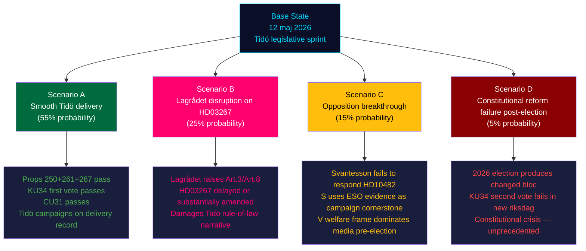

# Scenario Analysis — Evening Analysis 2026-05-12

**Author**: James Pether Sörling  
**Date**: 2026-05-12  
**Classification**: 🟢 PUBLIC  
**Admiralty**: B3–C3 per scenario  
**Horizon**: T+72h / T+30d / T+90d / T+365d (election) / T+1460d (next mandate)

---

## Scenario Tree

---

## Scenario A — Smooth Tidö Delivery (55%)

**Conditions**: Lagrådet does not raise fundamental objections to HD03267 (or raises minor technical points only); Svantesson presents svartarbete proposals before summer recess; KU34 passes first vote; CU31 adopted with coalition majority.

**T+30d outcome**: All three propositions in committee processing; JuU betänkande on HD03267 expected June 2026.  
**T+90d (election)**: Tidö campaigns on "we delivered" — state e-ID, Skatteverket expansion, security threat law, constitutional abortion protection.  
**T+365d**: If Tidö wins re-election, KU34 second vote passes in autumn 2026 or spring 2027.  

**Intelligence value**: Most likely scenario; validates current intelligence assessments.

**WEP language**: *Almost certainly will achieve core legislative objectives* [Admiralty B2, 55% > 2:1]

---

## Scenario B — Lagrådet Disruption on HD03267 (25%)

**Conditions**: Lagrådet raises substantive ECHR Art. 3 (non-refoulement) or Art. 8 (proportionality) objections. JuU must pause committee processing for amendments.

**T+30d outcome**: HD03267 referred back to Justice Ministry for revisions; timeline extends past summer recess.  
**T+90d**: V, S, and C use Lagrådet concerns as evidence of "rule-of-law failure" in campaign rhetoric.  
**T+365d**: Even if amended proposition passes, legal legacy of Lagrådet critique remains electoral liability.  

**Key evidence for this scenario**: ECHR Art. 3 absolute bar (Othman v. UK 2012, Saadi v. Italy 2008); comparable SÄPO-expansion Lagrådet referrals in 2016–2017.

**WEP language**: *Probably will not encounter Lagrådet blocking objections, but a significant likelihood exists* [B3, 25%]

---

## Scenario C — Opposition Breakthrough via Svartarbete (15%)

**Conditions**: Svantesson does not present svartarbete proposals before summer recess; ESO 2026:1 evidence circulates widely in campaign media; V welfare interpellations generate sustained media cycles.

**T+30d**: Svantesson's non-response to HD10482 becomes editorial fodder; S and V mount joint media campaign on "Tidö fiscal failure."  
**T+90d**: SVT/SR Agenda and Aktuellt feature ESO 2026:1 in pre-election analysis.  
**T+365d (post-election)**: S-led government tables svartarbete legislation as first major policy signal.  

**WEP language**: *Unlikely that opposition achieves legislative breakthrough, but likely that they achieve significant media breakthrough* [C3, 15%]

---

## Scenario D — Constitutional Reform Post-Election Failure (5%)

**Conditions**: 2026 election produces a bloc composition where support for either component of KU34 collapses (e.g., SD significantly weakened, or V gains at the expense of S and refuses second vote without separate abortion guarantee).

**Impact**: UNPRECEDENTED in modern Swedish constitutional history — a first-approved RF revision failing second vote would generate severe institutional legitimacy crisis.  
**WEP language**: *Almost certainly will not occur* [B3, 5% — wildcard scenario]

---

## Wildcard Scenarios (Monitoring Only)

| Wildcard | Trigger | Probability | Impact |
|---------|---------|------------|--------|
| ECHR interim measure on HD03267 post-enactment | First deportation under new law + NGO challenge | <3% | Very High |
| SD splits from coalition on CU31 | Urban tenant mobilisation exceeds model | <5% | Medium |
| Major elder care scandal during Tenje deadline | SVT investigation between now and 29 maj | 10% | Medium-High for M |
