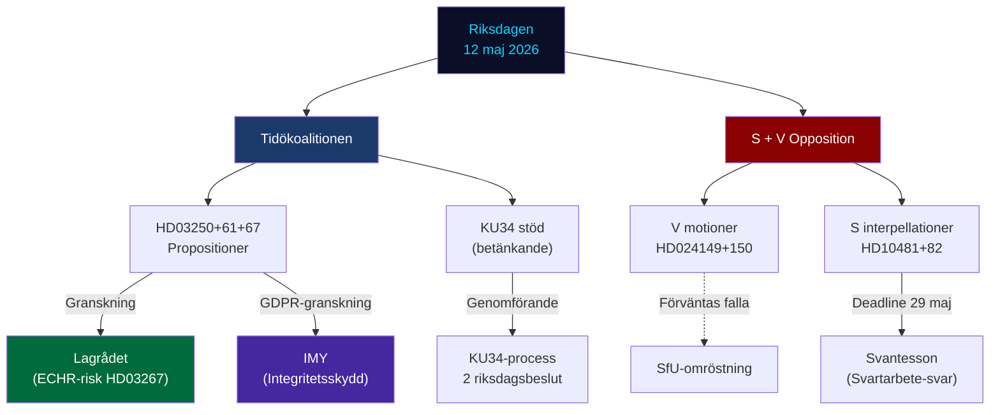

# Stakeholder Perspectives — Evening Analysis 2026-05-12

**Author**: James Pether Sörling  
**Date**: 2026-05-12  
**Classification**: 🟢 PUBLIC  
**Admiralty**: B2–C3 per stakeholder  

---

## Primary Parliamentary Stakeholders

### Tidökoalitionen (M + SD + KD + L)

**Position**: In delivery mode — pushing three propositions and supporting committee report packages in the final legislative sprint before September 2026 election.

**Key actors today**:
- **Elisabeth Svantesson (M), Finansminister**: Central target of HD10482 (svartarbete). Under deadline pressure (29 maj). Also drives HD03261 (Skatteverket) and HD03250 (e-ID) agendas.
- **Anna Tenje (M), Socialminister**: Target of HD10484 (äldreomsorg). Pressure to demonstrate elder care governance competence.
- **Johan Britz (L), Vikarierade Klimatminister**: Target of HD10481 (withdrawn) and HD10486 (jämst. löner). Withdrawal of HD10481 paradoxically reduces pressure on Britz today.
- **Gunnar Strömmer (M), Justitieminister**: Behind HD03267 (säkerhetshot). Lagrådet risk is his primary legal exposure.

**Strategic interest**: Pass all three propositions + KU34 (first vote) before summer recess. Frame the session as "Tidö delivers".

**WEP assessment**: 80% probability of achieving core legislative objectives this session.

### Vänsterpartiet (V)

**Key actors today**:
- **Nadja Awad**: Interpellant on both HD10484 (äldreomsorg) and HD10486 (jämst. löner) — dual welfare accountability track.
- **V party group** (collective): HD024149 and HD024150 immigration motions — full-party commitment, not individual initiative.

**Strategic interest**: Establish V as the consistent, principled defender of ECHR rights, welfare state, and gender equality. Build electoral differentiation from S.

**WEP assessment**: 5% probability of any motion succeeding in SfU; 90% probability of achieving media and campaign objectives.

### Socialdemokraterna (S)

**Key actors today**:
- **Åsa Westlund**: Withdrew HD10481 (klimat) — tactical sophistication. No formal debate today but strong strategic signal.
- **Marie Olsson**: HD10482 (svartarbete) — strongest S parliamentary action today, ESO-backed.
- **Ida Ekeroth Clausson**: HD10485 (prostitution tax) — niche but revealing of S's multi-issue pre-election strategy.

**Strategic interest**: Establish S as the fiscally responsible, evidence-based alternative government. Use ESO data to embarrass Svantesson. Avoid giving government ministers debate platforms.

### Centerpartiet (C)

**Position**: Swing voter on HD03267 (säkerhetshot). C supports coalition on security but maintains rule-of-law profile. Expected to express rule-of-law reservations in JuU committee process without blocking passage.

**Strategic interest**: Distinguish C from the harder Tidö line without breaking the government. Balance security credibility with constitutional integrity.

---

## External Stakeholders

### Lagrådet (Council on Legislation)
**Role**: Likely to be referred HD03267 for constitutional review.  
**Interest**: Assess proportionality of expanded expulsion grounds under RF kap. 2 and ECHR.  
**Expected timeline**: Referral within 2–4 weeks if JuU committee decides to seek yttrande.

### Hyresgästföreningen (Tenants' Association)
**Role**: Primary civil society opponent of CU31 (hyresmarknadsreform).  
**Interest**: Prevent market rent deregulation that would increase housing costs for the ~3 million Swedish tenants in rent-regulated apartments.  
**Likely action**: Public campaign + political lobbying + potential alliance with S and V in media.

### IMY (Integritetsskyddsmyndigheten)
**Role**: Data protection authority with review power over Skatteverket expansion (HD03261) and welfare-data sharing (HD03261 + prop.263).  
**Interest**: GDPR compliance of new data-sharing mechanisms.  
**Expected action**: Formal yttrande expected in SkU committee process.

### Migrationsverket
**Role**: Operational implementer of HD03267 (security threat expansion) and prop.263 (deportation data sharing).  
**Interest**: Clear legal framework and adequate resources for new mandates.  
**Expected action**: JuU/SfU remissvar on implementation feasibility.

### SÄPO (Säkerhetspolisen)
**Role**: Advisory role expanded under HD03267.  
**Interest**: Operational autonomy in security-threat assessments + legal clarity on advisory responsibilities.  
**Admiralty**: C3 (SÄPO internal positions not publicly documented)

### ESO (Expertgruppen för studier i offentlig ekonomi)
**Role**: Authoritative source for HD10482 (svartarbete).  
**Interest**: Research findings applied; policy recommendations followed.  
**Impact**: ESO 2026:1's SEK 189 billion quantification is the single most powerful piece of evidence in today's parliamentary record.

### BankID / Freja eID Consortia
**Role**: Commercial stakeholders in HD03250 (statlig e-legitimation).  
**Interest**: Limit state e-ID's market displacement; ensure level playing field.  
**Expected action**: TU lobbying for "competitive neutrality" amendments.

---

## Stakeholder Influence Map

