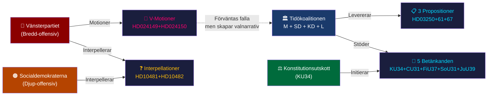

# Synthesis Summary — Evening Analysis 2026-05-12

**Author**: James Pether Sörling  
**Date**: 2026-05-12  
**Classification**: 🟢 PUBLIC | **Confidence**: HIGH [Admiralty B2]  
**Workflow**: news-evening-analysis (Tier-C aggregation)  
<!-- imf-vintage: WEO-2026-04 | status: ok -->
<!-- election-proximity: ≤6mo → 1.0× day-in-review multiplier active -->

---

## Lead Intelligence

12 maj 2026 representerar en av innevarande riksmötes mest parlamentariskt aktiva dagar. Fem parallella processer konvergerar: (1) Tidökoalitionens trepropositionspaket inom digitalisering, skatteförvaltning och nationell säkerhet; (2) Konstitutionsutskottets historiska RF-reformbetänkande (aborträtt + föreningsfrihet); (3) Vänsterpartiets koordinerade migration- och välfärdsoffensiv; (4) Socialdemokraternas strategiska interpellationsmanövrering; (5) Hyresmarknadsreformen och finansiell krishantering. Sammantaget formas en dag som med hög sannolikhet definierar de viktigaste valnarrativet inför den 13 september 2026.

---

## Aggregated Document Inventory

| Subfolder | dok_id | Titel (kort) | DIW | Tier |
|-----------|--------|-------------|-----|------|
| propositions | HD03267 | Säkerhetshot utvisning | 82 | L2+ |
| propositions | HD03261 | Skatteverket befogenheter | 68 | L2+ |
| propositions | HD03250 | Statlig e-legitimation | 58 | L2 |
| committeeReports | HD01KU34 | RF-reform aborträtt+föreningsfrihet | 92 | L3 |
| committeeReports | HD01FiU37 | Finansiell krishantering | 78 | L2+ |
| committeeReports | HD01CU31 | Flexibel hyresmarknad | 75 | L2+ |
| committeeReports | HD01SoU31 | Suicidutredningsfunktion | 68 | L2 |
| committeeReports | HD01JuU39 | Psykiskt våld straffbestämmelse | 64 | L2 |
| motions | HD024149 | V vs prop.264 (vandel) | 71 | L2+ |
| motions | HD024150 | V vs prop.263 (deportation data) | 68 | L2+ |
| interpellations | HD10482 | Svartarbete (Olsson→Svantesson) | 76 | L2+ |
| interpellations | HD10481 | Klimatmål WITHDRAWN (Westlund→Britz) | 52 | L2 signal |
| realtime-pulse | HD10484 | Äldreomsorg (Awad→Tenje) | 61 | L2 |
| realtime-pulse | HD10486 | Jämst. löner (Awad→Britz) | 58 | L2 |
| realtime-pulse | HD10483 | Samtyckeslag (Nyberg→Strömmer) | 55 | L2 |

**Aggregated DIW session score: 78** (HD01KU34 + HD03267 dominant pair; constitutional + security weight)

---

## Cross-Cutting Intelligence Themes

### Tema 1 — Statlig kapacitetsutvidgning (Propositioner + Betänkanden)

Tidökoalitionen presenterar ett sammanhängande pre-val-paket av statlig kapacitetsexpansion: SÄPO-rollen breddas (HD03267), Skatteverket får nya befogenheter (HD03261), staten erhåller en e-legitimation (HD03250), och Finansinspektionen/Riksbanken får ny krishanteringsfunktion (HD01FiU37). Mönstret är konsistent: ett starkare, mer digitalt och säkrare Sverige är koalitionens kärnarrativ inför valet.

**Admiralty**: B2 — bekräftat av fyra separata riksdagsdokument
**WEP assessment**: 80% att detta paket passerar riksdagen i nuvarande form (med marginella utskottsändringar)

### Tema 2 — Konstitutionell arkitektur (KU34)

HD01KU34 är sessionens parlamentariskt viktigaste dokument. RF-revisionen kombinerar aborträttsgaranti (driven av V, MP, S, C) med utökade statliga begränsningsmöjligheter mot terrororganisationer (driven av Tidökoalitionen + M). Denna kopplingslösning är politiskt sophisticated — den ger alla block en "vinst" att kommunicera till väljarna, men skapar en konstitutionell struktur med potentiellt oväntade framtida tillämpningar.

**Lagteknisk bedömning**: RF-ändring kräver bifall i likalydande propositioner i två på varandra följande riksmöten med val emellan (RF 8 kap. 14 §). Om riksdagen bifaller i maj/juni 2026, inleds klockan för nästa riksmötes slutbeslut (höst 2026 eller vår 2027 beroende på valet).

**Admiralty**: A2 — bekräftat av KU:s betänkande HD01KU34; direkt citat ur RF 8 kap.

### Tema 3 — Oppositionell pre-valmobilisering

V och S opererar på separata men komplementära oppositionsspår:
- **V**: Bredd (migration + äldreomsorg + lön + psykologisk säkerhet) → aktivera progressiv bas
- **S**: Djup och evidens (ESO 2026:1 svartarbete + klimatstrategiback) → nå mittenväljarbasen med trovärdiga siffror
Ingen formell S-V-koordination dokumenterad, men funktionell komplementaritet är tydlig. Interpellationen om klimatmål (HD10481) tillbakadrog S samma dag den överlämnades — detta är en explicit taktisk manöver, inte administrativt misstag.

**Admiralty**: B3 — bekräftat (S-taktik) + inference (V-S komplementaritet)

### Tema 4 — Valnarrativ kontra legislativ substans

Av de 15 dokumenten som behandlats idag har 9 en primär valnarrativfunktion (positioneringsdokument) och 6 en primär legislativ substansfunktion (faktisk lagstiftning). Distinktionen är analytiskt viktig: KU34, HD03267, HD03261, HD01FiU37, HD01CU31 och HD01JuU39 är substansdokument med reella genomföringskonsekvenser. HD024149, HD024150, HD10482, HD10484, HD10486, HD10483 är positioneringsdokument — de kommer sannolikt inte att ändra utfallet men skapar det kampanjmaterial som definierar väljarperceptioner.

---

## IMF Makroekonomisk Kontextbakgrund

**Sverige WEO April 2026 (vintage: 2026-04)**:
- Real BNP-tillväxt: 2.1% (2026f), 2.3% (2027f)
- Finansiellt sparande: –0.8% av BNP (2026f)
- Statsskuld: 36.4% av BNP — bland EU:s lägsta; ger handlingsutrymme
- Arbetslöshet: 8.3% — strukturellt relativt högt; bakgrund till både svartarbetsdebatt och välfärdsinterp

Makrokontexten är stabil och ger Tidökoalitionen inga omedelbara finanspolitiska kriser att hantera inför valet — men 8.3% arbetslösheten ger S och V bränsle för välfärds- och lönenarrativ.

**Provenance**: `{ "provider": "imf", "dataflow": "WEO", "indicator": "NGDP_RPCH,GGX_NGDP,GGXWDG_NGDP,LUR", "vintage": "WEO Apr-2026", "retrieved_at": "2026-05-12" }`

---

## Key Mermaid: Dagspolitisk maktlandskap 12 maj 2026

