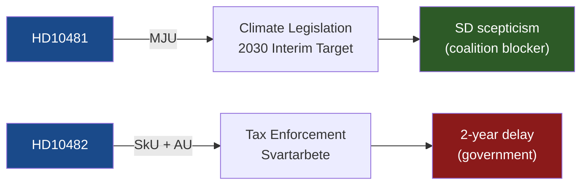

# Classification Results — 12 May 2026 Interpellations

**Author**: James Pether Sörling  
**Date**: 2026-05-12  

## Classification Summary

| dok_id | Policy Area | Committee | Government Dimension | L/R Spectrum | Priority |
|--------|-------------|-----------|----------------------|--------------|----------|
| HD10481 | Climate/Environment | Miljö- och jordbruksutskottet (MJU) | Climate legislation | Centre-Left (S) vs Centre-Right (L coalition) | L2 Strategic |
| HD10482 | Taxation / Labour Crime | Skatteutskottet (SkU) + Arbetsmarknadsutskottet (AU) | Fiscal enforcement / undeclared work | Left (S enforcement-push) vs Right (M delay) | L2+ Priority |

## Detailed Classification

### HD10481 — Klimatmålen

**Policy domain**: Climate targets; environmental governance  
**Primary committee**: Miljö- och jordbruksutskottet (MJU)  
**Secondary**: Finansutskottet (cost implications of binding climate targets)  
**Government vs. Opposition**: Opposition (S) challenging coalition minister (L acting as climate minister)  
**Ideological framing**: S pushes binding 2030 interim target; Tidö coalition (especially SD) resists binding legislative commitments  
**GDPR Art. 9 assessment**: No special-category personal data — political opinions are those of named public officials in their official capacity (Art. 9(2)(e))  
**Withdrawn**: Yes — see devils-advocate.md §H1 and synthesis-summary.md §Lead Story  

### HD10482 — Effektivare kontrollmöjligheter för att förhindra svartarbete

**Policy domain**: Tax enforcement; labour market crime; criminal economy  
**Primary committee**: Skatteutskottet (SkU)  
**Secondary**: Arbetsmarknadsutskottet (AU); Justitieutskottet (JuU) (gang crime dimension)  
**Government vs. Opposition**: Opposition (S) using ESO 2026:1 evidence against M Finance Minister  
**Ideological framing**: S frames as fiscal responsibility + crime fighting; government delay implies coalition friction  
**Key actors**: Marie Olsson (S), Elisabeth Svantesson (M); Skatteverket (implementation agency)  
**GDPR Art. 9 assessment**: No special-category personal data — political opinions of named public officials (Art. 9(2)(e)); ESO data is aggregate socioeconomic statistics  

## Mermaid Classification Map

## Policy Classification Confidence

| Classification | Confidence | Basis |
|----------------|------------|-------|
| HD10481 → MJU | HIGH (A2) | Standard routing for klimatmål interpellations; Britz holds vikarierande klimatminister title |
| HD10482 → SkU | HIGH (A2) | rot/rut/grön teknik systems are Skatteutskottet jurisdiction; personalliggare also SkU |
| HD10482 → gang crime / JuU | MEDIUM (B3) | Inferred from ESO 2026:1 gang-finance finding; not explicit in interpellation routing |
