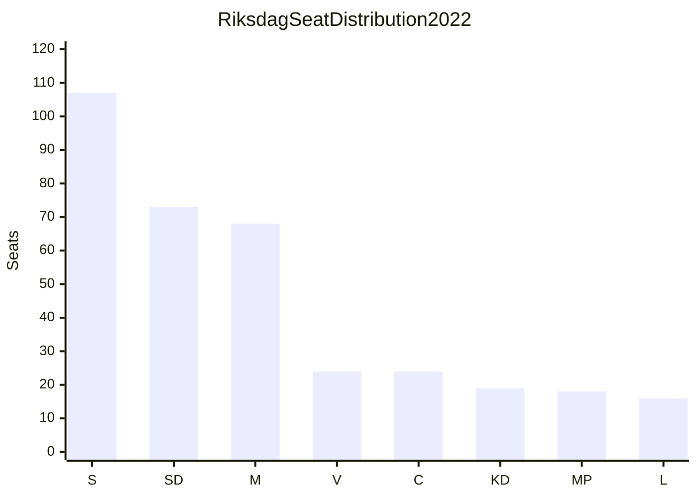

# Coalition Mathematics — 12 May 2026 Interpellations

**Author**: James Pether Sörling  
**Date**: 2026-05-12  

## Current Riksdag Seat Distribution (2022 Election Baseline)

| Party | Seats | % | Coalition Block |
|-------|-------|---|-----------------|
| Sverigedemokraterna (SD) | 73 | 20.5% | Tidö support (formal) |
| Socialdemokraterna (S) | 107 | 30.3% | Opposition (S-bloc leader) |
| Moderaterna (M) | 68 | 19.1% | Tidö (governing) |
| Sverigedemokraterna (SD) | 73 | 20.5% | Tidö |
| Vänsterpartiet (V) | 24 | 6.7% | Opposition |
| Kristdemokraterna (KD) | 19 | 5.3% | Tidö |
| Centerpartiet (C) | 24 | 6.7% | Tidö support (variable) |
| Liberalerna (L) | 16 | 4.6% | Tidö |
| Miljöpartiet (MP) | 18 | 5.1% | Opposition |

**Tidö bloc total (M+SD+KD+L)**: 176 seats  
**With C support**: 200 seats  
**Opposition total (S+V+MP)**: 149 seats  
**S alone**: 107 seats  

## Coalition Mathematics for HD10482 (Svartarbete Enforcement)

The svartarbete interpellation (HD10482) concerns government executive action (tabling a proposition), not a Riksdag vote. However, if proposals are tabled, the following vote scenario applies:

### Hypothetical Vote: Comprehensive Svartarbete Enforcement Proposition

**For proposition** (if all enforcement advocates vote Ja):
- S (107) + V (24) + MP (18) = 149 — **NOT sufficient alone** (need 175 for majority)
- If C joins: 149 + 24 = 173 — still short (175 needed for majority of 349)
- If L defects from coalition: 149 + 16 = 165 — insufficient
- If both C + L: 149 + 24 + 16 = 189 — **majority achieved**

**Against proposition** (if SD blocks):
- SD (73) + government majority: SD veto is not automatic — M/KD/L still have 103 seats without SD; SD cannot unilaterally block but can threaten coalition crisis

### SD Veto Analysis

SD's formal status is "parliamentary support" (not cabinet ministers). SD cannot directly block government legislation but can:
1. Threaten to withdraw support (confidence + budget)
2. Refuse to vote for legislation in Riksdag, forcing narrow M+KD+L vote (103 seats) — insufficient majority
3. SD must rely on C abstention or defection to block

**Conclusion**: SD has effective veto over any svartarbete enforcement tools that threaten its construction-sector base, because M cannot pass legislation with only 103 Tidö-cabinet seats. Government needs SD, C, or some opposition cooperation.

## Coalition Mathematics for HD10481 (Klimatmål Legislation)

### Hypothetical Vote: Binding 2030 Interim Climate Target

**For binding target**:
- S (107) + V (24) + MP (18) + C (24) = 173 — short by 2 seats
- Adding L (16): 173 + 16 = 189 — **majority if L crosses coalition line**
- S + V + MP alone: 149 — no majority without centre parties

**Against binding target**:
- SD (73) + M (68) + KD (19) = 160 — minority but with L (16) = 176 — blocks opposition
- SD+M+KD+L = 176 majority: defeats binding climate legislation

**Key bottleneck**: L (16 seats) is the swing vote. L defecting to support climate legislation would give S-bloc a majority but would collapse the Tidö coalition.

## Seat-Count Summary Table

| Scenario | Seats For | Seats Against | Result |
|----------|-----------|---------------|--------|
| Opposition alone (svartarbete) | 149 | 176 | ❌ Fails |
| Opposition + C (svartarbete) | 173 | 160 | ❌ Fails (174 needed) |
| Opposition + C + L (svartarbete) | 189 | 144 | ✅ Passes |
| Opposition alone (climate) | 149 | 176 | ❌ Fails |
| Opposition + C + L (climate) | 189 | 144 | ✅ Passes but collapses Tidö |
| Government tables proposition (svartarbete) | — | — | Depends on SD vote |

## Coalition Stability Assessment

**Tidö coalition is a minority government** held together by SD parliamentary support. The interpellations this cycle reveal two fault lines:
1. **Svartarbete**: SD's construction sector vs. M/S fiscal enforcement goals
2. **Climate**: SD's anti-binding-targets vs. L's green identity

Both fault lines are pre-existing but become electorally salient at 124-day proximity to the 2026 election.

**Coalition stability rating**: FRAGILE on both issues; no acute threat of confidence vote but increased defection risk on specific votes as election approaches.
