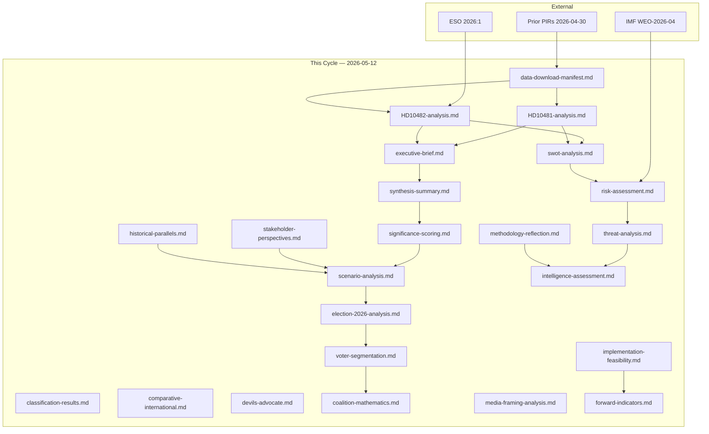

# Cross-Reference Map — 12 May 2026 Interpellations

**Author**: James Pether Sörling  
**Date**: 2026-05-12  

## Cross-Sibling Folder References

### Prior Interpellations Cycles

| Cycle | Folder | Relevant Docs | Link |
|-------|--------|---------------|------|
| 2026-04-30 | interpellations | 4 open PIRs (ESA topic, Heritage topic) | `analysis/daily/2026-04-30/interpellations/pir-status.json` |
| 2026-04-28 | propositioner | Budget propositions referenced in economic context | `analysis/daily/2026-04-28/propositioner/` |

### Propositioner Cross-References

| Proposition | Relevance | Folder |
|-------------|-----------|--------|
| Klimatpropositioner (pending) | HD10481 demands new climate proposition before election | `analysis/daily/*/propositioner/` |
| Skatteproposition (pending) | HD10482 demands svartarbete enforcement legislation before summer | `analysis/daily/*/propositioner/` |

### Betänkanden Cross-References

| Betänkande | Committee | Relevance |
|------------|-----------|-----------|
| AU10 2024/25 | Arbetsmarknadsutskottet | Labour market context for svartarbete; voting records available |
| AU10 2025/26 | Arbetsmarknadsutskottet | Same committee track — no direct vote found on HD10482 topic but committee active |

### External Source Cross-References

| Source | Document | Relevance |
|--------|----------|-----------|
| ESO 2026:1 "Svarta siffror" | Government expert report | Primary evidence in HD10482 (dok_id HD10482 full text cites directly) |
| Miljömålsberedningen betänkande | Expert commission | Referenced in HD10481 as awaiting government action |
| IMF WEO-2026-04 | Vintage WEO Apr-2026 | Sweden macroeconomic context; fiscal capacity baseline |

## Document Dependency Graph

## File Listing (This Cycle)

All in `analysis/daily/2026-05-12/interpellations/`:

- `data-download-manifest.md`
- `documents/HD10481-analysis.md`
- `documents/HD10482-analysis.md`
- `executive-brief.md`
- `synthesis-summary.md`
- `significance-scoring.md`
- `classification-results.md`
- `swot-analysis.md`
- `risk-assessment.md`
- `threat-analysis.md`
- `stakeholder-perspectives.md`
- `cross-reference-map.md` ← this file
- `scenario-analysis.md`
- `comparative-international.md`
- `devils-advocate.md`
- `intelligence-assessment.md`
- `methodology-reflection.md`
- `election-2026-analysis.md`
- `voter-segmentation.md`
- `coalition-mathematics.md`
- `historical-parallels.md`
- `media-framing-analysis.md`
- `implementation-feasibility.md`
- `forward-indicators.md`
- `README.md`
- `pir-status.json`
