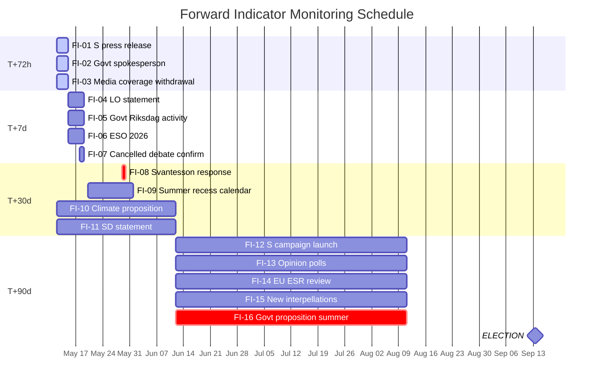

# Forward Indicators — 12 May 2026 Interpellations

**Author**: James Pether Sörling  
**Date**: 2026-05-12  

## Indicator Framework

10+ dated indicators across 4 horizons per pipeline requirement (04-analysis-pipeline.md §Forward Indicators).

---

## Horizon 1: T+72 hours (by 2026-05-15)

| # | Indicator | Observable Signal | Significance |
|---|-----------|-------------------|--------------|
| FI-01 | S press release on HD10482 filing | S publishes ESO 2026:1 talking points | Confirms coordinated campaign; amplifies media coverage |
| FI-02 | Government spokesperson response to HD10481 withdrawal | L/M press office statement on climate policy | H2 (government concession) confirmation or denial |
| FI-03 | Media coverage of interpellation withdrawal | Svt.se, dn.se, aftonbladet.se — HD10481 withdrawal reported | High coverage = S campaign effective; low = tactical success (quiet withdrawal) |

## Horizon 2: T+7 days (by 2026-05-19)

| # | Indicator | Observable Signal | Significance |
|---|-----------|-------------------|--------------|
| FI-04 | LO press statement on svartarbete | LO cites ESO 2026:1 + HD10482 | Confirms union amplification network activated |
| FI-05 | Government Riksdag activity on svartarbete | Any Finansdepartementet statement on enforcement proposals | Signals Scenario A1 (tabling) vs A2 (delay) trajectory |
| FI-06 | ESO 2026:1 media citations | Search news archives for "ESO 2026:1" or "Svarta siffror" citations | Measures primary-source penetration of S messaging |
| FI-07 | Cancelled parliamentary debate ANM 2026-05-18 confirmation | Riksdag protokoll — climate debate confirmed cancelled post-withdrawal | Administrative confirmation of HD10481 withdrawal effect |

## Horizon 3: T+30 days (by 2026-06-12)

| # | Indicator | Observable Signal | Significance |
|---|-----------|-------------------|--------------|
| FI-08 | Svantesson written response to HD10482 (svarsdatum 2026-05-29) | Riksdag protokoll; government press office | Key bifurcation: proposition timeline vs. continued delay |
| FI-09 | Riksdag summer recess calendar | Official Riksdag calendar announcement for summer recess | Defines close of legislative window for pre-election action |
| FI-10 | Climate proposition announcement | Government press release on 2030 interim target proposition | Confirms B1 (government acts) vs B2 (delay persists) |
| FI-11 | SD statement on personalliggare reform | SD party congress; SD press release on construction sector | Confirms or disconfirms SD coalition friction hypothesis |

## Horizon 4: T+90 days (by 2026-08-11)

| # | Indicator | Observable Signal | Significance |
|---|-----------|-------------------|--------------|
| FI-12 | S campaign launch with svartarbete as core plank | S party congress or campaign material citing ESO 2026:1 | Confirms KJ-3 (coordinated campaign) crystallised |
| FI-13 | Opinion poll shifts on law-and-order / crime economy | Demoskop, Sifo, Kantar polling on crime-economy issue salience | Measures electoral impact of sustained ESO 2026:1 framing |
| FI-14 | EU Effort Sharing Regulation review of Sweden | European Commission ESR progress review for Sweden | External pressure amplifier for climate delay; Scenario B3 trigger |
| FI-15 | New government interpellations on same topics | Any S, V, or MP filing new interpellations on svartarbete or klimat before summer | Escalation signal; second-wave accountability campaign |
| FI-16 | Government proposition table before summer recess | Riksdag.se — any svartarbete enforcement proposition announced | Critical: defines entire post-summer election narrative |

## Priority Indicators for Monitoring

🔴 **FI-08** (Svantesson response 2026-05-29): Single most important near-term indicator. Bifurcates scenarios A1 vs A2.  
🔴 **FI-16** (Government proposition before summer): Determines whether S retains full attack line through election.  
🟠 **FI-10** (Climate proposition): Second-tier but L-specific; determines green credibility trajectory.  
🟠 **FI-11** (SD statement on reform): Confirms or refutes coalition friction hypothesis.  
🟡 **FI-12** (S campaign launch): Confirms coordinated strategy at scale.  
🟡 **FI-14** (EU ESR review): External pressure amplifier; medium-probability high-impact.

## Mermaid Indicator Timeline

