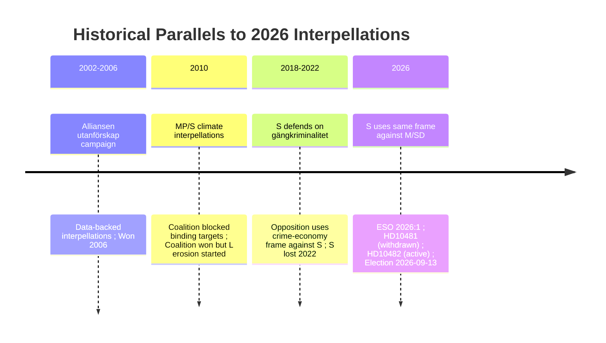

# Historical Parallels — 12 May 2026 Interpellations

**Author**: James Pether Sörling  
**Date**: 2026-05-12  

## Parallel 1: Pre-2006 Alliansen Election — Jobb och Utanförskap (HD10482 Comparator)

**Period**: 2002-2006 Swedish parliamentary cycle  
**Opposition actor**: Moderaterna (Alliansen), Fredrik Reinfeldt  
**Government actor**: S government (Persson)  
**Parliamentary tactic**: Sustained interpellation and motion campaign on "utanförskap" (labour market exclusion), using Statistics Sweden data to document chronic welfare dependency  
**Evidence base**: SCB labour market statistics; think-tank reports on structural unemployment  
**Outcome**: Alliansen won 2006 election primarily on labour market reform platform; interpellation campaign created cumulative pressure record  

**Parallel to HD10482**:
- Same pattern: opposition uses authoritative government data (ESO 2026:1 ≈ SCB 2003-2006) to document government failure
- Same structure: single-issue interpellation campaign building a parliamentary accountability record
- Different direction: S in 2026 is the opposition using a right-of-centre technique against the right-of-centre government

**Lesson**: Pre-election interpellation campaigns based on credible primary-source data have documented electoral efficacy. 2026 timeline is compressed vs. Alliansen's 4-year campaign, but ESO 2026:1's direct evidence chain makes a shorter campaign viable.

## Parallel 2: 2010 Swedish Climate Debate — Miljöpartiet vs. Reinfeldt Government (HD10481 Comparator)

**Period**: 2010 election cycle  
**Opposition actor**: Miljöpartiet (MP) + S on climate  
**Government actor**: Reinfeldt Alliansen government  
**Parliamentary tactic**: Climate interpellations + motions on renewable energy targets; Alliansen had limited binding climate commitments  
**Evidence base**: SMHI/Naturvårdsverket projections; EU targets  
**Outcome**: Alliansen won 2010; climate was not decisive; MP gained seats but S lost; Alliansen maintained coalition  

**Parallel to HD10481**:
- Coalition government (Alliansen 2010 ≈ Tidö 2026) resisted binding climate commitments
- Opposition (S+MP 2010 ≈ S+MP 2026) pressed through parliamentary tools
- Climate interpellation as electoral signal — same structure

**Lesson**: Climate interpellations alone did not determine 2010 election outcome; however, long-term erosion of L's green credibility (already notable in 2010-2014 cycle) began in this period. 2026 cycle has accelerated this dynamic with explicit SD coalition friction on binding targets.

## Parallel 3: Pre-2022 Criminal Economy Debate — S Government Failures (HD10482 Counter-Case)

**Period**: 2018-2022 Swedish parliamentary cycle  
**Government actor**: S government (Löfven/Andersson)  
**Issue**: Gang crime and criminal economy; S government slow on enforcement despite documented gang escalation  
**Parliamentary tactic**: Alliansen + SD used interpellations on gängkriminalitet; S defended  
**Evidence base**: Police authority statistics; Brå crime reports  
**Outcome**: S government lost 2022 election partly on law-and-order frame; Tidö coalition won on crime-fighting mandate  

**Parallel to HD10482**:
- S is now in the opposition, using the same law-and-order + criminal economy frame against M/SD coalition
- The irony is that S is now deploying a technique successfully used against it in 2022
- Government (M/SD) is defending the same "delay" position that S defended 2018-2022

**Lesson**: The criminal economy / gang crime frame has proven electoral efficacy in 2022; S using ESO 2026:1 to reactivate this frame against the Tidö coalition is a sophisticated counter-move that puts M/SD in S's 2018-2022 position.

## Parallel 4: Riksdag Interpellation Withdrawal — 2019 (HD10481 Procedural Comparator)

**Period**: 2019  
**Example**: Multiple interpellation withdrawals in the 2018-2022 cycle where opposition parties withdrew before expected debate  
**Pattern**: Withdrawal followed by campaign material use of the published interpellation text  
**Lesson**: The published text of HD10481 is a permanent Riksdag record regardless of withdrawal; S can reference dok_id HD10481 in campaign materials without the debate having occurred.

## Summary Table

| Parallel | Year | Technique | Outcome | Applicability |
|----------|------|-----------|---------|--------------|
| Alliansen utanförskap campaign | 2002-2006 | Data-backed interpellation series | Won 2006 election | HIGH — same technique, different actors |
| MP/S climate 2010 | 2010 | Climate interpellations vs. coalition | Coalition won; long-term L credibility erosion | MEDIUM — climate track but coalition survived |
| S criminal economy defence | 2018-2022 | Defending against interpellations | Lost 2022 election | HIGH — S now deploying same frame against M/SD |
| Interpellation withdrawal 2019 | 2019 | Withdrawal + campaign text use | Varied | MEDIUM — procedural parallel |

## Mermaid Historical Timeline

