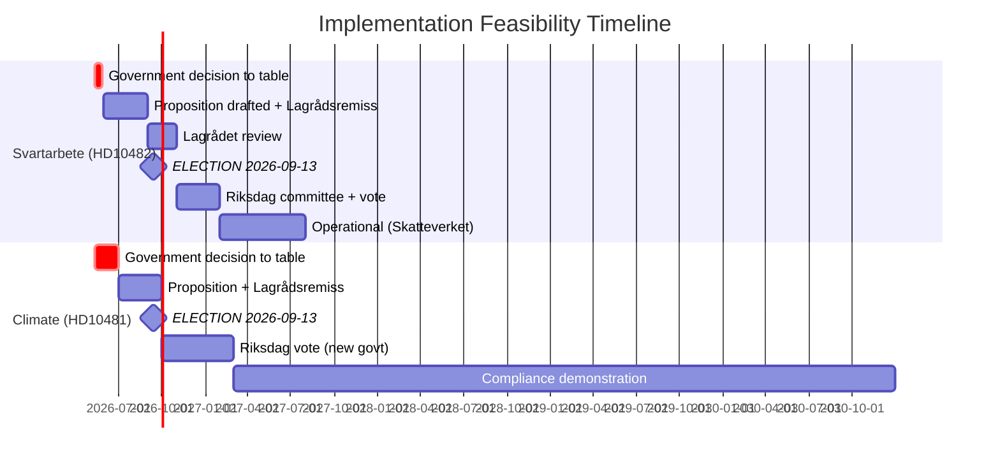

# Implementation Feasibility — 12 May 2026 Interpellations

**Author**: James Pether Sörling  
**Date**: 2026-05-12  

## HD10482 — Svartarbete Enforcement Tools Feasibility

### Skatteverket Operational Assessment

| Dimension | Assessment | Evidence |
|-----------|------------|---------|
| Skatteverket mandate | ✅ Existing; would require legislative expansion | Personalliggare (construction/hospitality register) already operated by Skatteverket |
| Skatteverket enforcement capacity | ⚠️ Constrained; staffing dependent on government appropriation | No specific 2026 Skatteverket capacity statement in HD10482; inferred from general enforcement context |
| IT infrastructure | ⚠️ Expansion of coverage sectors requires IT system updates | Not cited in HD10482; standard implementation assessment |
| Implementation timeline | 12-18 months from royal decree to operational | Based on prior personalliggare expansion timeline (2019 restaurant sector expansion) |
| International cooperation | 🔴 Cross-border evasion requires EU coordination (not legislated in HD10482) | ESO 2026:1 notes international displacement risk |

### Statskontoret Assessment

| Trigger | Finding |
|---------|---------|
| Statskontoret evaluation of Skatteverket enforcement programmes | Not triggered — no recent Statskontoret report on Skatteverket svartarbete activities found in document set |
| Compliance cost analysis | Not available — not cited in HD10482 or found in MCP search results |

**Statskontoret row**: No direct Statskontoret evaluation for svartarbete enforcement tool expansion available this cycle. The previous Statskontoret evaluation of Skatteverket's personalliggare systems dates to 2021; an updated evaluation would be needed for any new sector expansion.

### Legislative Pathway for HD10482 Proposals

1. Government tables proposition (requires Lagrådsremiss for enforcement-tool legislation)
2. Lagrådet review (typically 4-8 weeks)
3. Riksdag committee assignment (SkU primary)
4. Committee hearing and betänkande
5. Riksdag vote
6. Royal decree → Skatteverket operational

**Minimum timeline from proposition to operation**: 10-14 months  
**Feasibility for election cycle (before 2026-09-13)**: ❌ Even if tabled today, not operationally feasible before election  
**Political feasibility of tabling**: MEDIUM-LOW (coalition SD friction; see coalition-mathematics.md)

## HD10481 — Climate Proposition Implementation Feasibility

### Policy Content Assessment

| Dimension | Assessment | Evidence |
|-----------|------------|---------|
| Miljömålsberedningens betänkande completeness | ✅ Complete; in Regeringskansliet | HD10481 full text: "betänkandet har legat i Regeringskansliet under lång tid" |
| Lagrådsremiss status | 🔴 Not yet sent (precedes proposition) | Implied by absence of proposition; withdrawal of HD10481 removes pressure |
| SD coalition alignment | 🔴 SD blocks binding targets | Coalition structure analysis; no explicit SD statement in document set |
| EU Effort Sharing Regulation alignment | ⚠️ Compliance risk if 2030 target not legislated | Analytical inference; EU ESR compliance tracked independently |
| Implementation timeline for 2030 target | 4-6 years from legislation to demonstrable compliance | Standard climate target implementation; Swedish Climate Act process |

### Feasibility Verdict

| Proposal | Technical Feasibility | Political Feasibility | Timeline | Verdict |
|----------|----------------------|----------------------|----------|---------|
| Svartarbete enforcement tools | ✅ HIGH | ⚠️ MEDIUM (SD friction) | 10-14 months to operation | Feasible but unlikely pre-election |
| Binding 2030 climate target | ✅ HIGH (betänkande ready) | 🔴 LOW (SD blocks) | 4-6 years to compliance | Very unlikely pre-election |
| Narrow svartarbete pilot | ✅ HIGH | ✅ MEDIUM-HIGH (SD can accept narrow) | 6-8 months | Possible pre-election as partial measure |

## Cross-Cutting Feasibility Issues

### Coalition Budget Constraint

Sweden's fiscal position (IMF WEO-2026-04 vintage: general govt deficit ~1-2% GDP, debt ~35% GDP) does not present absolute constraint on either measure. Enforcement tools are fiscally positive (revenue recovery); climate targets have fiscal implications but are investment-oriented.

**Feasibility constraint is political (SD alignment), not fiscal.**

### Administrative Capacity

Both proposals require Skatteverket (enforcement) and Naturvårdsverket/Energimyndigheten (climate) operational build-up. Administrative capacity is a medium-term constraint, not a hard short-term block.

### EU Context

**Svartarbete**: No immediate EU legislative driver forcing Swedish action in the 2026 calendar.  
**Climate**: EU Effort Sharing Regulation creates external compliance pressure with potential infringement risk for Sweden if 2030 interim target is missed without legislative commitment.

## Mermaid Implementation Timeline

