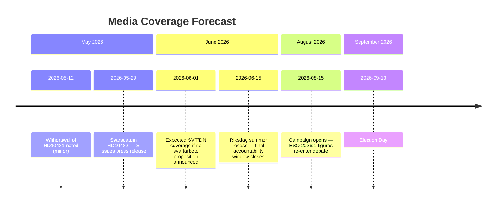

# Media Framing Analysis — 12 May 2026 Interpellations

**Author**: James Pether Sörling  
**Date**: 2026-05-12  

## Dominant Narrative Frames

### Frame 1: "Government of Inaction" (S-led frame)

**Primary drivers**: HD10481 (climate delay) + HD10482 (svartarbete delay)  
**Key message**: Two completed expert reports; two years of government inaction; 124 days before voters decide  
**Evidence chain**: ESO 2026:1 (SEK 189bn/year); Miljömålsberedningen betänkande; both awaiting government tabling  
**Amplifiers**: LO press releases; environmental NGOs; S press releases citing ESO 2026:1  
**Target media**: Aftonbladet (S-leaning), SVT Nyheter (neutral, will cover ESO figures), DN debate pages  

### Frame 2: "Government Diligence" (Coalition counter-frame)

**Primary drivers**: M/SD/L response to interpellations  
**Key message**: Comprehensive proposals require coalition alignment and legal review; ESO 2026:1 is an input, not a mandate  
**Evidence chain**: Standard government response: "investigation ongoing," "quality assurance required"  
**Amplifiers**: Riksdag opposition party responses; Finansdepartementet press office  
**Target media**: Svenska Dagbladet (M-leaning), Expressen economy pages  
**Weakness**: 2-year delay is documented; "diligence" framing is weak against specific timeline evidence  

### Frame 3: "Crime-Economy Crisis" (Cross-partisan)

**Primary drivers**: ESO 2026:1 gang-financing link in HD10482 full text  
**Key message**: SEK 189bn in shadow economy directly finances gang crime; government inaction on enforcement perpetuates gang violence  
**Evidence chain**: ESO 2026:1 (primary); Police authority crime statistics (secondary)  
**Amplifiers**: Crime-focused media (Expressen crime desk, TV4 reporting); LO; victims' organisations  
**Target media**: All major outlets — crime-economy crossover is highest-salience story in Sweden 2026  
**Advantage for S**: Cross-partisan salience allows S to own both fiscal AND crime frames simultaneously  

### Frame 4: "Climate Leadership Failure" (L-specific)

**Primary drivers**: HD10481 — L acting climate minister (Britz) owns the delay  
**Key message**: L promised green credentials in Tidö coalition; climate legislation delayed indefinitely; 2030 targets at risk  
**Evidence chain**: Miljömålsberedningen betänkande; HD10481 published text; EU ESR compliance risk (Scenario B3)  
**Amplifiers**: MP press releases; environmental NGOs; green media  
**Target media**: Sydsvenskan (L-leaning coverage area), SVT Miljö, Aftonbladet  
**Damage specifically to L**: L's differentiation within the coalition depended on green credibility; delay eliminates this  

## DISARM TTP Assessment (Disinformation/Framing Manipulation)

| TTP | Description | Applicability | Risk |
|-----|-------------|---------------|------|
| T0023 (Distort statistics) | Cherry-pick ESO 2026:1 figures out of context | LOW — figures are cited with clear sourcing | LOW |
| T0046 (Seed distrust of opponents' sources) | Attack ESO's independence or methodology | LOW — ESO is government body; hard to delegitimise | LOW |
| T0057 (Create scapegoat) | Government attributes delay to EU requirements or earlier S government mistakes | MEDIUM — "S left us with this problem" is plausible counter-narrative | MEDIUM |
| T0077 (Flood the information space) | Pre-election campaign coverage dilutes svartarbete/climate signal | MEDIUM — natural media saturation risk pre-election | MEDIUM |
| T0106 (Frame context to create confusion) | SD frames personalliggare reform as "surveillance state overreach" | MEDIUM — potential civil liberties counter-narrative | MEDIUM |

## Key Quotes and Counter-Quote Analysis

### HD10482 — Expected S Messaging

**S attack (expected, based on interpellation text)**:
> "ESO:s rapport Svarta siffror visar att det svarta arbetet kostar samhället 189 miljarder kronor per år, varav en stor del finansierar gängkriminaliteten. Regeringen har haft utredningen klar i två år och ännu inte lagt fram en proposition."

**Expected government counter**:
> "Vi tar svartarbete på allvar. Vi säkerställer att förslagen är effektiva och rättssäkra innan vi presenterar dem."

**Weakness in counter**: "Two years" is a specific temporal claim that the counter does not address.

### HD10481 — Expected S/MP Messaging

**S attack (expected)**:
> "Miljömålsberedningens betänkande om 2030-målet har legat i Regeringskansliet i månader. Sverige riskerar att missa sina klimatmål. Miljöministern valde att inte svara på min interpellation."

**L counter**:
> "Vi arbetar aktivt med klimatpolitiken i koalitionen. Klimatbetänkandet bereds noggrant."

**Weakness in counter**: Withdrawal of interpellation removes the formal record of any debate.

## Media Amplification Forecast

