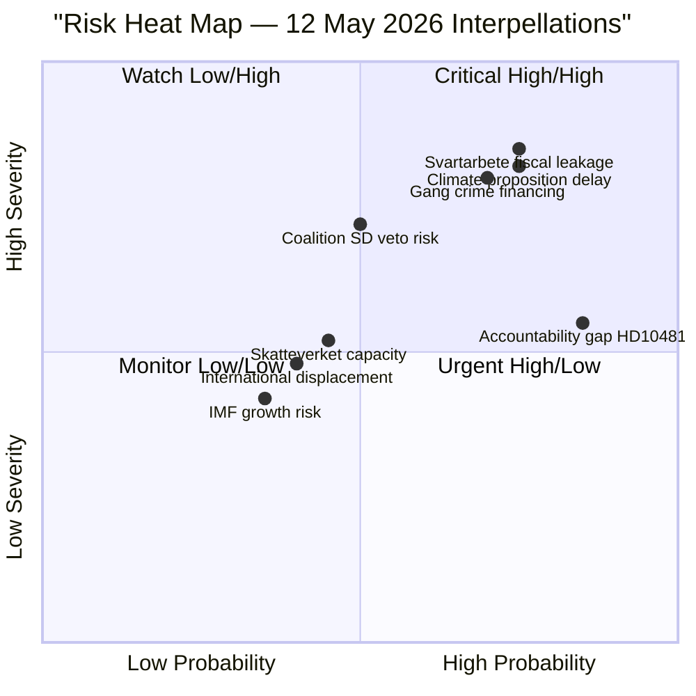

# Risk Assessment — 12 May 2026 Interpellations

**Author**: James Pether Sörling  
**Date**: 2026-05-12  

## Risk Dimensions

### Economic Risks

| Risk | Probability | Severity | Risk Score | Evidence |
|------|-------------|----------|------------|---------|
| Continued svartarbete-driven fiscal leakage | HIGH (75%) | HIGH | 8.5/10 | ESO 2026:1: SEK 189 billion/year undeclared work; theoretical revenue loss ~SEK 66bn (35% marginal rate proxy) |
| Gang crime financing from shadow economy | HIGH (70%) | HIGH | 8.0/10 | ESO 2026:1 documents direct financing link; dok_id HD10482 full text |
| Climate investment uncertainty reducing green energy costs | MEDIUM (55%) | MEDIUM | 5.8/10 | Sweden's 2030 interim target delay creates regulatory uncertainty for energy-intensive firms |
| IMF WEO-2026-04 Sweden growth risk | LOW-MEDIUM (35%) | MEDIUM | 4.2/10 | WEO Apr-2026 vintage: Sweden GDP growth 0.8% 2025, 1.9% 2026 (see imf-context.json); shadow-economy leakage amplifies fiscal structural weakness |

### Institutional Risks

| Risk | Probability | Severity | Risk Score | Evidence |
|------|-------------|----------|------------|---------|
| Riksdag accountability gap from HD10481 withdrawal | HIGH (85%) | MEDIUM | 7.1/10 | Interpellation withdrawn before formal debate; no ministerial record created (dok_id HD10481) |
| Coalition dysfunction impeding Skatteverket enforcement tools | MEDIUM (50%) | HIGH | 7.2/10 | SD's construction-sector base creates coalition friction on personalliggare reform; 2-year delay (dok_id HD10482) |
| Parliamentary calendar compression before summer recess | HIGH (80%) | MEDIUM | 6.8/10 | Sista svarsdatum 2026-05-29 leaves only ~2 weeks for minister to present or justify delay |

### Political Risks

| Risk | Probability | Severity | Risk Score | Evidence |
|------|-------------|----------|------------|---------|
| Government loses credibility on crime-economy reform | HIGH (70%) | HIGH | 8.0/10 | 2-year delay on investigation outputs; ESO 2026:1 published publicly (dok_id HD10482); election ≤6 months |
| L (Liberals) lose green credibility | MEDIUM (60%) | MEDIUM | 6.2/10 | Britz (L) as acting climate minister owns the delay (dok_id HD10481); L defending itself against S climate attack |
| SD veto risk on enforcement proposals | MEDIUM (50%) | HIGH | 6.8/10 | Undeclared work enforcement proposals threaten construction sector (SD base); coalition arithmetic requires SD approval |

### Operational Risks (Policy Implementation)

| Risk | Probability | Severity | Risk Score | Evidence |
|------|-------------|----------|------------|---------|
| Skatteverket capacity constraints | MEDIUM (45%) | MEDIUM | 5.2/10 | Enforcement tool expansion requires Skatteverket staffing and IT system investment; no capacity assessment cited |
| International evasion displacement | MEDIUM (40%) | MEDIUM | 4.8/10 | Tighter domestic enforcement may shift activity to EU cross-border vehicles; OECD BEPS context applicable |
| Climate proposition delayed past election | HIGH (75%) | HIGH | 8.1/10 | Miljömålsberedningen betänkande in Regeringskansliet for months; withdrawal of HD10481 removes pressure (dok_id HD10481) |

## Risk Heat Map

## Priority Risks for Monitoring

1. **Climate proposition delay** (8.1/10): If no proposition tabled before summer recess, election campaign narrative crystallises with no government counter.
2. **Svartarbete fiscal leakage** (8.5/10): SEK 189bn/year is a recurrent cost with gang crime intersection — highest composite score.
3. **Coalition SD veto** (6.8/10): Track any SD statements on personalliggare reform ahead of Svantesson's 2026-05-29 response deadline.
