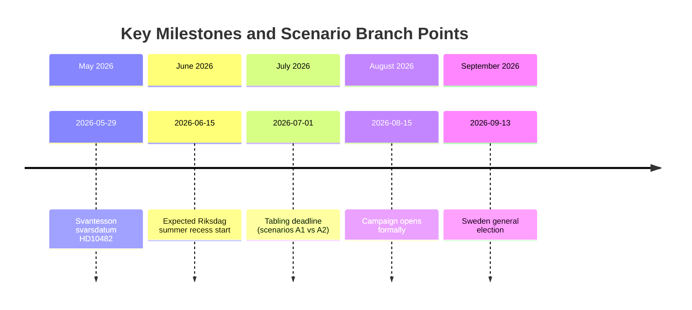

# Scenario Analysis — 12 May 2026 Interpellations

**Author**: James Pether Sörling  
**Date**: 2026-05-12  

## Scenario Framework

**Horizon**: T+72h (immediate) to T+90d (election campaign)  
**Election anchor**: 2026-09-13 (124 days from 2026-05-12)  
**Documents in scope**: HD10481 (klimat, withdrawn), HD10482 (svartarbete, active)

---

## Scenario Set A: HD10482 Svartarbete — Government Response Scenarios

### Scenario A1: Government Tables Substantive Proposals Before Summer Recess (P=30%)

**Trigger**: Svantesson responds by 2026-05-29 with confirmed proposition timeline (pre-July tabling)  
**Pathway**: ESO 2026:1 + S parliamentary pressure + election proximity forces government action  
**Outcome**: Government co-opts S narrative; partial enforcement tools enacted; S loses primary attack line but can claim credit for opposition pressure  
**Electoral implication**: M + KD benefit from "action government" framing; SD loses construction-sector protection  
**WEP**: Unlikely within budget window but consistent with pre-election political incentive  
**Evidence requirement**: Svantesson press release by 2026-05-29 or Riksdag protokoll entry

### Scenario A2: Government Delays Past Summer Recess (P=55%)

**Trigger**: Svantesson provides non-committal written response by 2026-05-29; proposals tabled post-election if government wins  
**Pathway**: SD coalition friction on construction-sector implications; Finansdepartementet capacity constraints  
**Outcome**: S retains full attack line through election; ESO 2026:1 figures (SEK 189bn) dominate campaign coverage  
**Electoral implication**: S + V benefit from "government neglect" framing; LO amplification through union networks  
**WEP**: Most likely given coalition dynamics and 2-year delay baseline  
**Evidence requirement**: No proposition announced by 2026-07-01; S campaign materials cite ESO 2026:1

### Scenario A3: Government Tables Narrow/Symbolic Measure (P=15%)

**Trigger**: Svantesson responds with a limited "working group on enforcement methodology" or pilot programme  
**Pathway**: Coalition pressure + election proximity without full SD alignment  
**Outcome**: S attacks diluted response; government claims action; ESO 2026:1 remains in public sphere  
**Electoral implication**: Draw — neither side achieves clean narrative; issue persists but loses urgency  
**WEP**: Possible but requires M willingness to accept partial SD win  
**Evidence requirement**: Narrow legislative instrument rather than comprehensive enforcement framework

---

## Scenario Set B: HD10481 Climate — Post-Withdrawal Scenarios

### Scenario B1: Government Announces Climate Proposition Before Election (P=20%)

**Trigger**: Informal backchannels (possible reason for S withdrawal) produce a government climate action announcement  
**Pathway**: L pressure on coalition partners; EU alignment incentives; business sector lobbying  
**Outcome**: S withdrawal partially validated; L's green credibility partially restored; 2030 targets debate shifts to implementation  
**Electoral implication**: Reduces S attack on climate; MP benefits from "government finally acted" framing  
**WEP**: Possible but requires SD not vetoing; currently assessed unlikely given Tidö coalition dynamics  
**Evidence requirement**: Government press release or statsrådsberedning announcement before 2026-07-01

### Scenario B2: Climate Delay Becomes Persistent Election Campaign Issue (P=65%)

**Trigger**: No government action; S uses HD10481 record as campaign ammunition without formal debate  
**Pathway**: S withdrawal prevents L from creating a "we debated it" counter-narrative; S controls the climate attack line  
**Outcome**: Climate inaction is S+MP election framing; L defends on "complexity" grounds  
**Electoral implication**: L voter base erosion on green credentials; potential MP vote share expansion  
**WEP**: Most likely scenario given withdrawal timing and coalition SD obstruction  
**Evidence requirement**: S campaign materials; L defensive statements on climate; MP amplification

### Scenario B3: Sweden EU Climate Compliance Risk Emerges (P=15%)

**Trigger**: EU Effort Sharing Regulation compliance review reveals Sweden at risk of missing 2030 interim target  
**Pathway**: Delayed climate proposition + EU ESR enforcement machinery  
**Outcome**: External compliance pressure forces government action; EU framing amplifies domestic political risk  
**Electoral implication**: Bipartisan embarrassment; potential emergency legislative session  
**WEP**: Lower probability but high-impact if triggered  
**Evidence requirement**: European Commission progress report; Swedish Klimatpolitiska rådet assessment

---

## Compound Scenario: C1 — Double Delay (P=35%)

**Both** climate proposition AND svartarbete enforcement tools delayed past election.  
**Pathway**: SD coalition friction on both issues; summer recess closes parliamentary calendar  
**Outcome**: S runs unified "government of inaction" campaign with two documented cases  
**Electoral implication**: High risk for M/L; potential for S outperforming current polling  
**WEP**: Moderate probability; requires sustained coalition dysfunction

## Scenario Probability Matrix

| Scenario | Label | P | T+30d Impact | T+90d Impact |
|----------|-------|---|-------------|-------------|
| A1 | Govt tables svartarbete | 30% | Neutralises S attack | M benefits |
| A2 | Svartarbete delayed | 55% | S dominant narrative | S+V gain |
| A3 | Narrow svartarbete measure | 15% | Ambiguous | Draw |
| B1 | Climate proposition | 20% | L credibility up | Reduced S line |
| B2 | Climate delay persists | 65% | L erosion | S+MP gain |
| B3 | EU compliance risk | 15% | External pressure | Bipartisan stress |
| C1 | Double delay | 35% | Government vulnerability | S campaign unified |

