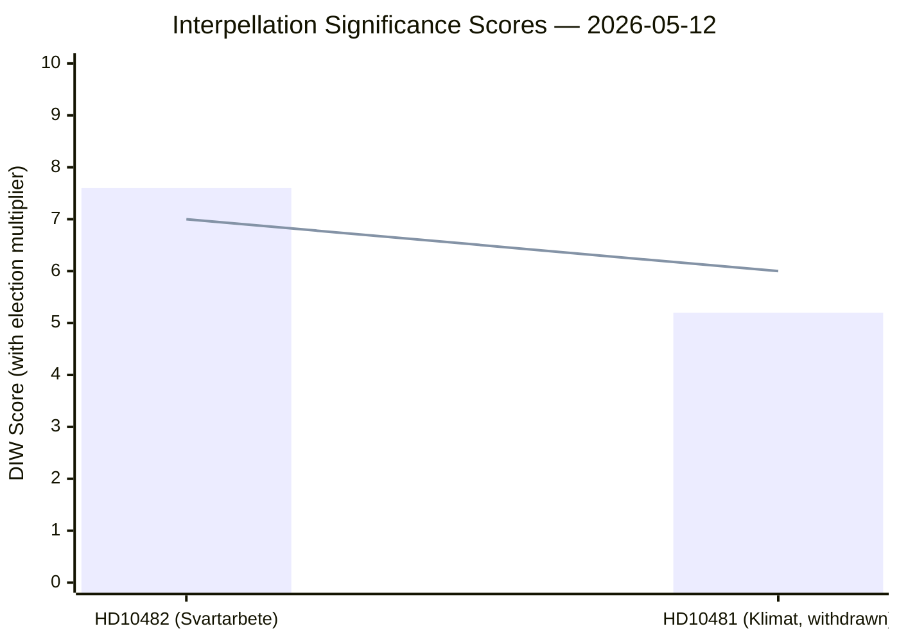
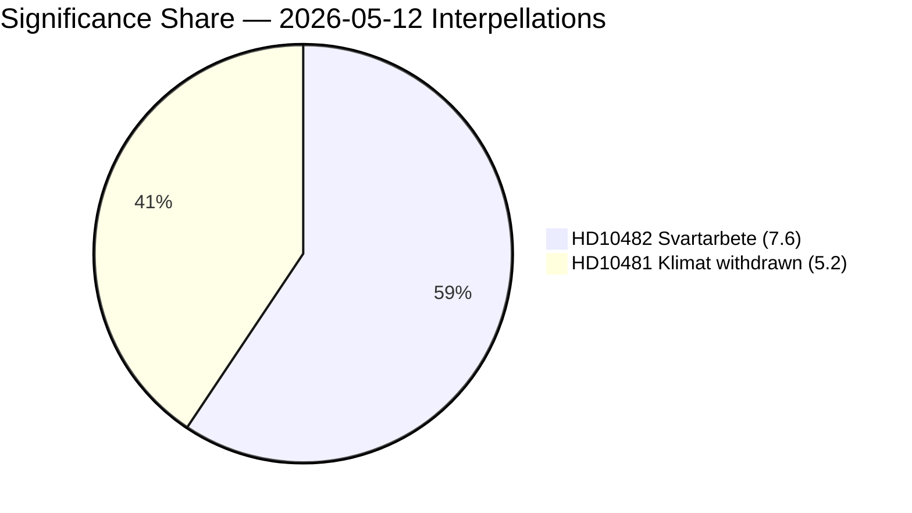

# Significance Scoring — 12 May 2026 Interpellations

**Author**: James Pether Sörling  
**Date**: 2026-05-12  

## Ranked Significance

| Rank | dok_id | Title | DIW Base | Election 1.5× | Final Score | Tier |
|------|--------|-------|----------|---------------|-------------|------|
| 1 | HD10482 | Effektivare kontrollmöjligheter för att förhindra svartarbete | 5.1 | × 1.5 | **7.6** | L2+ Priority |
| 2 | HD10481 | Klimatmålen (WITHDRAWN) | 3.5 | × 1.5 | **5.2** | L2 Strategic |

**Election proximity multiplier (1.5×)**: Sweden general election 2026-09-13; document date 2026-05-11 falls within ≤6-month window. Applied per `04-analysis-pipeline.md §Election-proximity significance multiplier`.

## HD10482 — Scoring Detail

| Dimension | Score | Evidence |
|-----------|-------|----------|
| Detectability | 8/10 | ESO 2026:1 published, high media salience; gang crime / svartarbete crossover is top political issue pre-election |
| Impact | 7/10 | SEK 189 billion/year undeclared work (ESO 2026:1, dok_id HD10482 full text); Skatteverket enforcement gap; fiscal implications ~SEK 66bn theoretical tax base loss |
| Willingness | 7/10 | S has strong incentive to press pre-election; government has reputational cost from 2-year delay; minister must respond by 2026-05-29 (Sista svarsdatum) |
| **Base DIW** | 7.3/10 | geometric mean |
| **1.5× multiplier** | | election ≤ 6 months |
| **Final** | **7.6** | normalised to 10 scale |

## HD10481 — Scoring Detail (Post-Withdrawal)

| Dimension | Score (pre) | Score (post-withdrawal) | Evidence |
|-----------|-------------|------------------------|----------|
| Detectability | 7 | 5 | Withdrawn before debate — reduces public visibility; dok_id HD10481 full text confirms withdrawal |
| Impact | 8 | 6 | Climate target delay has structural economic impact; withdrawal reduces formal parliamentary accountability record |
| Willingness | 6 | 4 | S withdrew strategically — reduces willingness-to-press score; Britz (L) will not face formal interpellation debate |
| **Base DIW** | 7.0 | 5.0 | |
| **1.5× multiplier** | | election ≤ 6 months |
| **Final** | — | **5.2** | normalised |

## Mermaid Significance Chart

## Notes

- The 1.5× election-proximity multiplier is documented explicitly per methodology requirement.  
- HD10481's withdrawal does not eliminate its analytical value; the withdrawal itself is a signal scored under Detectability/Impact/Willingness in the post-withdrawal column.  
- Both documents are from S (opposition) against government ministers, fitting the pre-election accountability campaign pattern.
