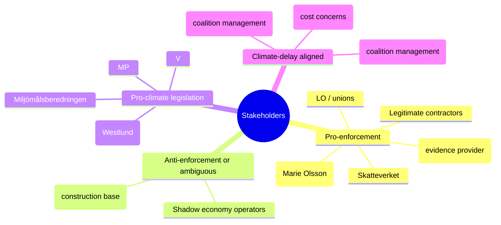

# Stakeholder Perspectives — 12 May 2026 Interpellations

**Author**: James Pether Sörling  
**Date**: 2026-05-12  

## Political Party Perspectives

### Socialdemokraterna (S)

**Stance**: Opposition accountability campaign  
**HD10481**: Filed then withdrew climate interpellation — preserving campaign flexibility while documenting the policy vacuum. Strategic signal: L (acting climate minister) owns the delay.  
**HD10482**: Active interpellation using ESO 2026:1 as primary-source evidence. Marie Olsson (S) pressing Svantesson with a hard deadline (2026-05-29). S is positioned as the "responsible fiscal enforcer" against government paralysis.  
**Electoral calculus**: Both actions maximise pre-election attack surface while minimising commitments to specific parliamentary formats.

### Moderaterna (M) / Elisabeth Svantesson (Finance Minister)

**Stance**: Managing government response timeline  
**HD10482 implications**: Must respond by 2026-05-29. Options: (a) announce proposition timeline, (b) announce continuing work, (c) question framing. Any response creates a record that S can cite in campaign.  
**Constraint**: Cannot cite coalition friction publicly without signalling government weakness; must defend 2-year delay without the word "delay."

### Liberalerna (L) / Johan Britz (Acting Climate Minister)

**Stance**: Defending coalition climate record while holding party's green identity  
**HD10481 implications**: Withdrawal prevents formal ministerial record, but the interpellation text is public record (dok_id HD10481). L risks owning the climate policy vacuum.  
**Internal tension**: L's traditional voter base expects climate action; SD coalition partner blocks binding targets. Britz must perform credibility without delivering commitments.

### Sverigedemokraterna (SD)

**Stance**: Constructive ambiguity on svartarbete reform  
**HD10482 implication**: Any enforcement strengthening (personalliggare expansion, Skatteverket powers) potentially threatens SD's construction-sector base. SD likely to demand narrow scope or compensation for compliance costs.  
**HD10481 implication**: Climate targets impose regulatory costs on energy-intensive industries — SD constituencies. SD benefits from L blocking binding legislation.

### Vänsterpartiet (V)

**Stance**: Will support both S initiatives but has no formal interpellation this cycle  
**Climate**: V has been pushing harder 2030 targets than S — aligned but not co-authoring  
**Svartarbete**: V supports strong enforcement from worker-protection angle; may add to media framing

### Miljöpartiet (MP)

**Stance**: Active on climate; HD10481 withdrawal is a missed debate opportunity  
**Climate**: MP would have welcomed formal ministerial debate on 2030 interim targets. Withdrawal reduces pressure but MP can reference the published interpellation text in committee.

### Centerpartiet (C) / Kristdemokraterna (KD)

**Stance**: Coalition members — defend government timeline on both issues  
**C**: Formally supports climate action but prioritises market mechanisms over binding targets  
**KD**: Law-and-order credibility aligned with svartarbete enforcement; may privately pressure government to table proposals before election

## Civil Society and Institutional Perspectives

### ESO (Expertgruppen för studier i offentlig ekonomi)

**Role**: ESO 2026:1 "Svarta siffror" provides the evidentiary foundation for HD10482 (SEK 189bn/year undeclared work, gang crime financing link). ESO is independent of government political control; its findings cannot be dismissed as partisan.

### Skatteverket

**Implementation agency**: Any enforcement tool expansion requires Skatteverket operational capacity, IT systems, and staff. Skatteverket has publicly stated enforcement gap awareness; delayed proposals extend the enforcement vacuum.

### Miljömålsberedningen

**Role**: Expert commission whose betänkande on 2030 interim targets has been awaiting government action for "several months" (dok_id HD10481). The commission's work is complete; the delay is in Regeringskansliet, not in expert analysis.

### LO (Landsorganisationen) / Trade Unions

**Stance**: Strong interest in svartarbete enforcement — undeclared work undercuts collective agreements, wages, and safety standards. LO likely to reinforce S framing publicly ahead of 2026-05-29 deadline.

### Byggföretagen / Contractors

**Stance**: Legitimate construction firms benefit from enforcement (removes unfair price competition from shadow-economy operators). But sector lobby has mixed signals from SD-aligned smaller operators who may oppose specific control instruments.

## Stakeholder Alignment Map

## Stakeholder Dynamics Timeline

| Date | Actor | Action | Significance |
|------|-------|--------|--------------|
| 2026-05-08 | Åsa Westlund (S) | Files HD10481 (klimat) | Opens parliamentary accountability track |
| 2026-05-08 | Marie Olsson (S) | Files HD10482 (svartarbete) | ESO 2026:1 cited; accountability track opened |
| 2026-05-11 | Westlund (S) | Withdraws HD10481 | Strategic move — denies L/Britz formal debate platform; signals informal channel activity |
| 2026-05-29 | Svantesson (M) | Sista svarsdatum HD10482 | Hard deadline for written or formal response |
| 2026-06-?? | Riksdag summer recess | Calendar closes | Any un-tabled proposition falls to post-election period |
| 2026-09-13 | Sweden election | Election Day | All pre-election manoeuvrings crystallise into voter messaging |
