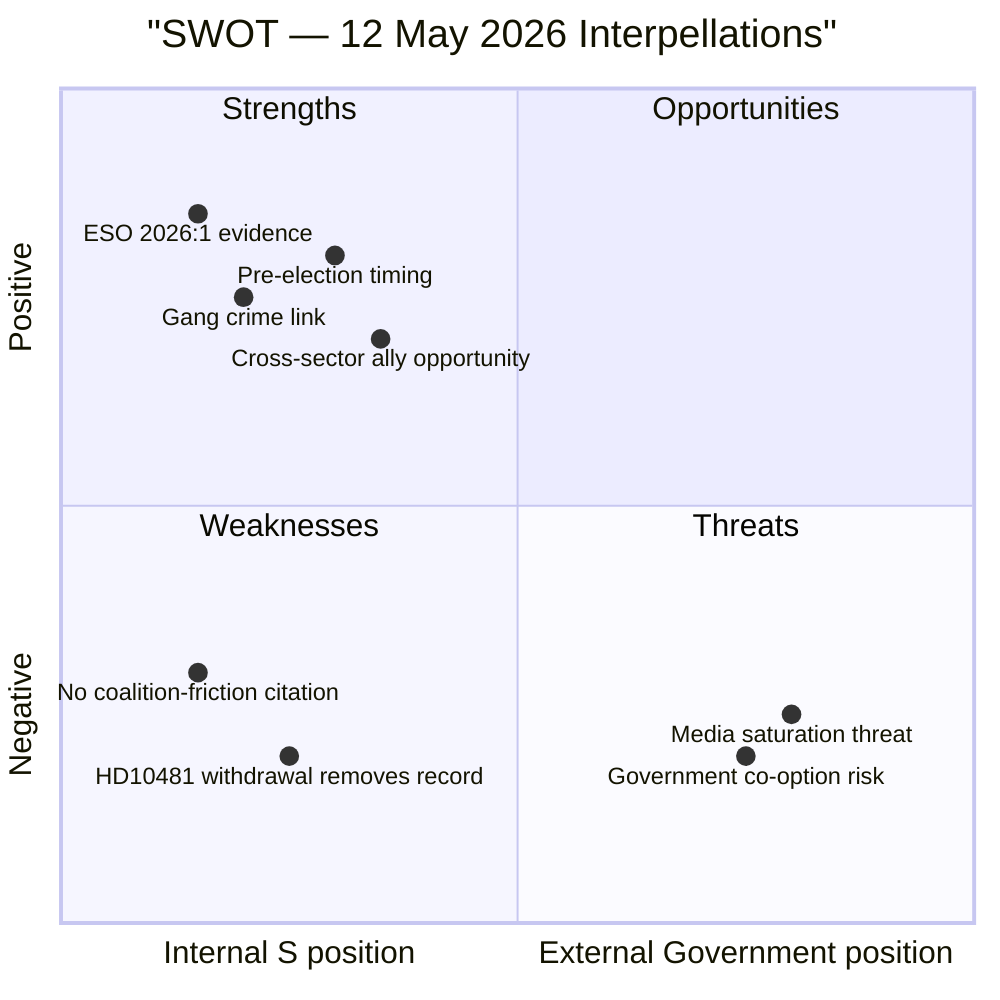

# SWOT Analysis — 12 May 2026 Interpellations

**Author**: James Pether Sörling  
**Date**: 2026-05-12  

## HD10482 — Svartarbete SWOT

### Strengths

- **ESO 2026:1 evidence base**: S has an authoritative government-commissioned report showing SEK 189 billion in annual undeclared work (dok_id HD10482 full text citing ESO 2026:1 "Svarta siffror"). This is unusually strong primary-source backing for an interpellation.
- **Cross-cutting gang crime link**: ESO 2026:1 documents direct financing of gängkriminaliteten from shadow economy proceeds — connecting fiscal enforcement with Sweden's #1 security concern (dok_id HD10482).
- **Predecessor investigation**: The investigation (utredning) that produced the proposals was initiated by S government — S can claim ownership of the solution while attacking M for delay.
- **Riksdag deadline**: Sista svarsdatum 2026-05-29, giving S a hard accountability marker before summer recess.

### Weaknesses

- **No direct coalition friction evidence**: HD10482 asserts that the government is delaying without documenting internal coalition disagreement. The SD construction-sector conflict is analytically inferred, not cited in the document (dok_id HD10482).
- **Single-party authorship**: S alone drives this interpellation — no cross-party co-signatories to signal broader coalition concern.
- **Counter-narrative availability**: Government can cite that proposals are being prepared and quality-assured, framing delay as diligence rather than obstruction.

### Opportunities

- **Pre-election framing**: With election 2026-09-13 within ≤6 months, ESO 2026:1 data gives S a persistent campaign narrative regardless of whether a proposition appears before summer recess.
- **Gang crime intersection**: If government delays into summer recess without tabling, S can conflate svartarbete delay with perceived M/SD softness on gang crime — a powerful electoral frame.
- **Cross-sector allies**: Trade unions (LO), Företagarna, and serious contractors all benefit from svartarbete enforcement — S can broaden the coalition supporting action.

### Threats

- **Government co-option**: Svantesson can promise pre-summer action, neutralising the opposition attack by announcing a proposition timeline before 2026-05-29.
- **Scope dilution**: Government may present a narrow version of the proposals that doesn't close the enforcement gaps S documented.
- **Media saturation**: Sweden's pre-election media environment is crowded; svartarbete may be overshadowed by migration, security, and energy cost headlines.

## HD10481 — Klimatmål SWOT (Post-Withdrawal)

### Strengths

- **Documented policy vacuum**: Miljömålsberedningens betänkande has been in Regeringskansliet processing for "several months" (dok_id HD10481) — the delay is publicly documented.
- **L coalition responsibility**: L holds the acting climate minister post; S can hold L — a nominally pro-environment party — accountable for blocking legislation.

### Weaknesses

- **Withdrawal removes formal record**: By withdrawing HD10481, S has eliminated the parliamentary debate that would have created a formal ministerial record (dok_id HD10481 full text: "Interpellationen är återtagen").
- **Signal is ambiguous**: Withdrawal could indicate S received informal assurance of action, reducing the attack line's potency.

### Opportunities

- **Campaign reserve**: S keeps the climate issue live without committing it to a specific parliamentary format — maximum campaign flexibility.

### Threats

- **Government climate move**: If government announces a climate proposition before election, S loses the attack line entirely.
- **Issue suppression**: Withdrawal means no formal Riksdag debate record; mainstream media may underreport the climate delay without a debate peg.

## Mermaid SWOT Matrix

