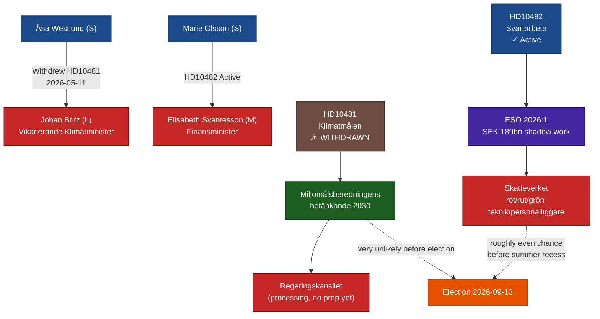

# Synthesis Summary — Interpellation Debates 12 May 2026

**Author**: James Pether Sörling  
**Date**: 2026-05-12  

## Lead Story

The 12 May 2026 interpellation cycle delivers two significant pre-election accountability signals. **HD10481** (Klimatmålen, Åsa Westlund / S → Johan Britz / L) was filed on 8 May and **withdrawn on 11 May** — the same day it was transferred to the minister — depriving the debate of a formal parliamentary record on climate legislation delay. **HD10482** (Effektivare kontrollmöjligheter för att förhindra svartarbete, Marie Olsson / S → Elisabeth Svantesson / M) is active and backed by the newly-published ESO Report 2026:1 documenting SEK 189 billion in annual undeclared work losses. Together, these interpellations illustrate S's pre-election strategy: one challenge withdrawn (to deny government a platform), one maintained (where evidence is overwhelming).

## DIW-Weighted Ranking

| dok_id | Title | DIW Score | Tier |
|--------|-------|-----------|------|
| HD10482 | Effektivare kontrollmöjligheter för att förhindra svartarbete | 7.6 | L2+ Priority |
| HD10481 | Klimatmålen (WITHDRAWN) | 5.2 | L2 Strategic (signal value) |

**Weighting rationale**: HD10482 carries higher operational intelligence weight because it is active, ESO-backed, and touches a concrete fiscal enforcement gap (SEK 189 billion/year). HD10481's post-withdrawal score is reduced from 6.8 to 5.2, but its strategic signal value (withdrawal as S tactical manoeuvre) remains analytically significant.

**Election proximity multiplier (1.5×) applied** to both documents: election 2026-09-13, document date 2026-05-11 within ≤6-month window (2026-03-13–2026-09-13).

## Integrated Intelligence Picture

The two interpellations share a common opposition narrative structure: both challenge the Tidö government's delivery gap between policy commitments and legislative output. This is the dominant S accountability frame for the pre-election sprint (May–September 2026).

**HD10481 analytical core** (post-withdrawal): The Miljömålsberedningens betänkande on Sweden's 2030 climate interim target has been under Regeringskansliet processing for "several months" without producing a proposition. Westlund's interpellation framed this as ministerial accountability failure; its withdrawal before the debate suggests S prefers keeping the issue as a campaign attack line rather than giving Britz (L) a rehearsal opportunity to defend the delay. The withdrawal also removes the parliamentary record that could have documented government inaction formally. This is legally within S's rights as interpellant but analytically significant as a transparency reduction.

**HD10482 analytical core**: Marie Olsson uses ESO 2026:1 — an authoritative government-commissioned report — to establish that the criminal economy costs Sweden SEK 352 billion/year (undeclared work: SEK 189 billion), then documents that the government's own investigation was completed two years ago but no proposition has been tabled. The interpellation's deadline pressure is acute: Sista svarsdatum is 2026-05-29, just before the Riksdag summer recess. If Svantesson does not commit to pre-recess legislation, S has a strong campaign signal.

## Mermaid Policy Network

## Policy Landscape

**Climate**: Sweden's updated 2030 climate interim target is caught in coalition gridlock. The Tidö coalition (M + SD + C + KD, with L support) has been unable to advance the Miljömålsberedningens betänkande because SD remains sceptical of binding emission targets. L, which holds the climate portfolio through Acting Minister Britz, faces an intra-coalition constraint. The probability of a climate proposition before the 2026 election is very low [horizon:month].

**Svartarbete / Labour crime**: Sweden's structural challenge with undeclared work intersects directly with its gang crime problem. ESO 2026:1's finding that SEK 189 billion in annual undeclared work flows partly into gang financing is politically potent. The government's delay in tabling the svartarbete proposals — despite having an investigation completed two years ago — exposes it to the critique that it is prioritising coalition harmony (SD's construction-sector voter base) over enforcement effectiveness.

## Confidence Assessment

| Assessment | Admiralty Grade | WEP |
|------------|----------------|-----|
| HD10481 withdrawal as tactical S move | B2 | likely |
| HD10482 svartarbete challenge based on ESO 2026:1 | A1 | confirmed (document evidence) |
| Proposition before summer recess (HD10482) | C4 | roughly even |
| Climate proposition before election | D5 | unlikely |
