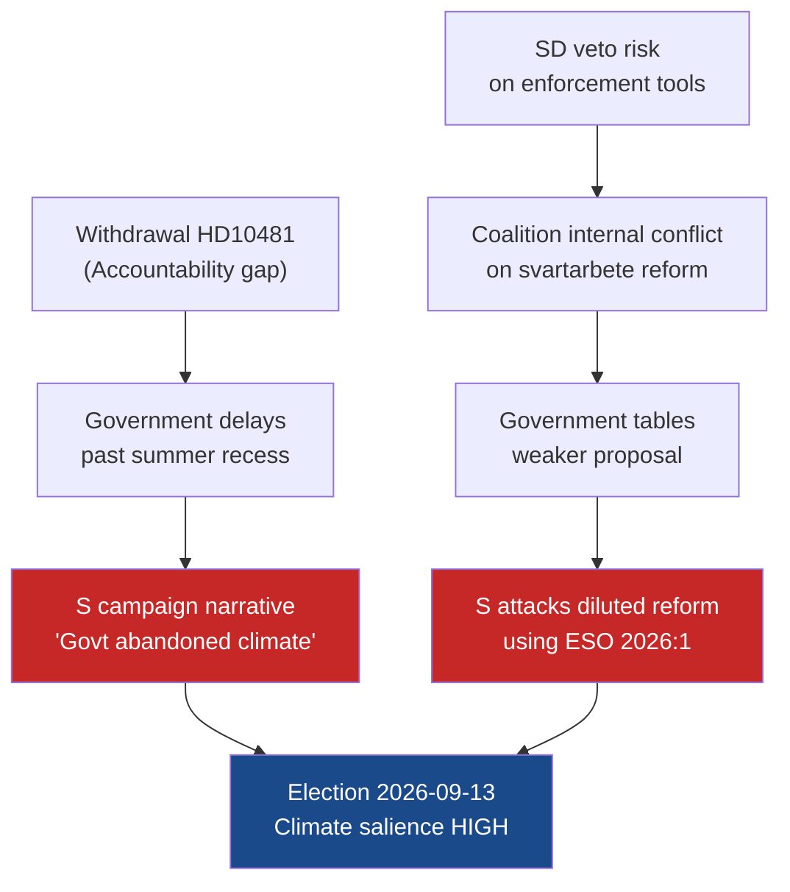

# Threat Analysis — 12 May 2026 Interpellations

**Author**: James Pether Sörling  
**Date**: 2026-05-12  

## STRIDE Threat Analysis

Applying STRIDE to the parliamentary-accountability context.

### Spoofing (Identity / Attribution)

| Threat | Likelihood | Target | Mitigation |
|--------|------------|--------|------------|
| Government claims "studies ongoing" to neutralise HD10482 | MEDIUM | ESO 2026:1 findings | Riksdag record and ESO's independent status prevent complete reframing |
| L claims active climate work to counter HD10481 withdrawal signal | MEDIUM | Public perception | Climate minister's public statements are on record; media can fact-check |

### Tampering (Data / Evidence Integrity)

| Threat | Likelihood | Target | Mitigation |
|--------|------------|--------|------------|
| ESO 2026:1 methodology questioned to deflect | LOW | ESO 2026:1 "Svarta siffror" | ESO is peer-reviewed government body; findings internationally consistent |
| Alternative statistics cited to dispute SEK 189bn figure | LOW-MEDIUM | Fiscal credibility | Multiple independent sources converge on 15-20% shadow-economy-to-GDP ratio for Sweden |

### Repudiation (Accountability Gaps)

| Threat | Likelihood | Target | Mitigation |
|--------|------------|--------|------------|
| HD10481 withdrawal eliminates ministerial debate record | HIGH | Parliamentary accountability | Withdrawal formally documented in Riksdag protokoll; record exists |
| No written ministerial response if HD10482 debate cancelled | MEDIUM | Accountability trail | Sista svarsdatum 2026-05-29 creates obligation for written response regardless |
| Government uses summer recess to defer climate action | HIGH | 2030 climate targets | S can use withdrawal as campaign signal; media framing opportunity |

### Information Disclosure

| Threat | Likelihood | Target | Mitigation |
|--------|------------|--------|------------|
| Shadow economy enforcement proposals leaked pre-publication | LOW | Proposal integrity | Pre-publication leak could trigger business behaviour changes; Finansdepartementet controls dissemination |
| Classified Skatteverket enforcement capacity data disclosed | VERY LOW | Operational security | Not applicable for this interpellation type |

### Denial of Service (Process Disruption)

| Threat | Likelihood | Target | Mitigation |
|--------|------------|--------|------------|
| Parliamentary calendar crowding displaces HD10482 debate | MEDIUM | Formal debate slot | Pre-election calendar is compressed; SD obstruction tactics possible if coalition interests threaten |
| Budget debates consume floor time, delaying climate legislation | HIGH | Climate proposition timeline | Riksdag spring calendar is already dense; environmental legislation historically de-prioritised when budget pressure is high |

### Elevation of Privilege (Agenda Control)

| Threat | Likelihood | Target | Mitigation |
|--------|------------|--------|------------|
| SD leverages budget leverage to block svartarbete enforcement tools | MEDIUM | Coalition decision-making | SD has structural veto in Tidö coalition; construction sector interest alignment documented |
| M uses pre-election announcement of proposals to claim credit | MEDIUM | S campaign strategy | Government can table proposals while accepting S framing — partial co-option |

## Compound Threat Scenarios

## Threat Priority Matrix

| Threat | STRIDE | Probability | Impact | Priority |
|--------|--------|-------------|--------|----------|
| Accountability gap from HD10481 withdrawal | Repudiation | HIGH | MEDIUM | 🔴 High |
| Climate proposition delayed past election | DoS (Process) | HIGH | HIGH | �� Critical |
| SD veto on enforcement tools | EoP (Agenda) | MEDIUM | HIGH | 🟠 Medium-High |
| Government co-option of svartarbete proposals | EoP (Agenda) | MEDIUM | MEDIUM | 🟡 Medium |
| ESO 2026:1 methodology challenge | Tampering | LOW | MEDIUM | 🟢 Low |
