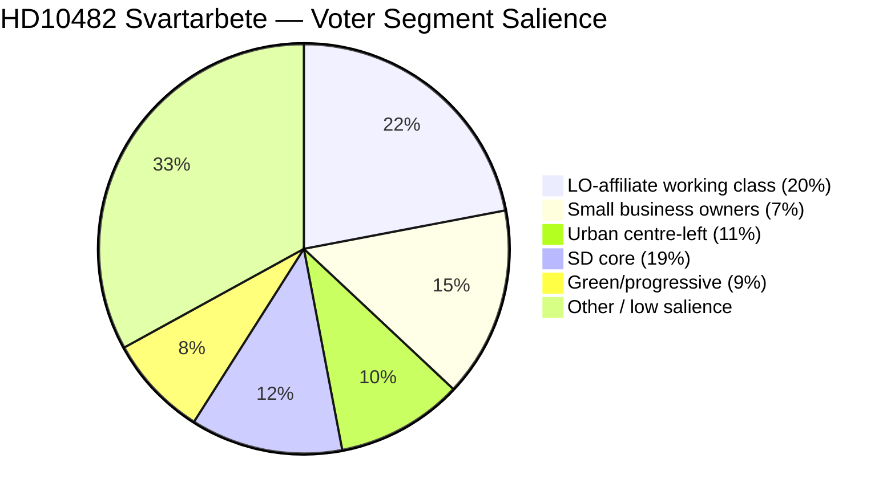
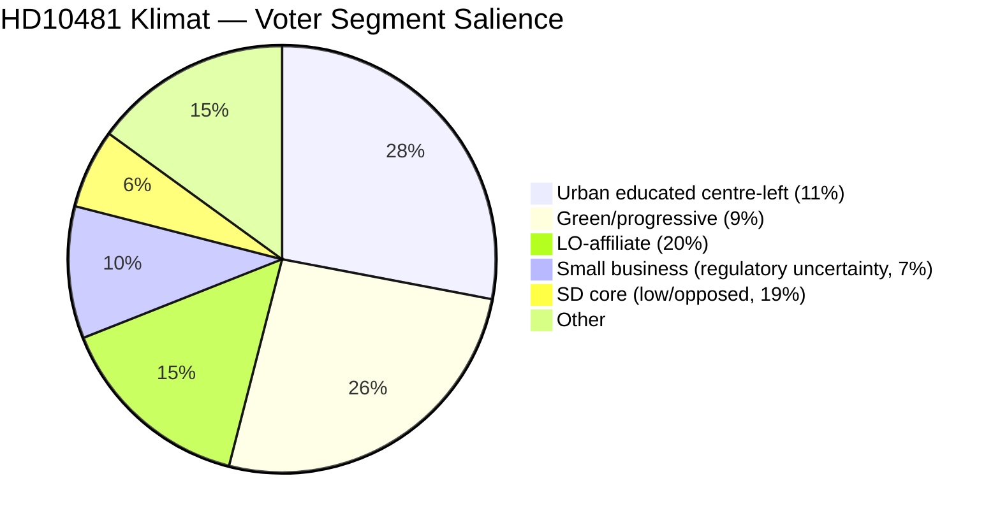

# Voter Segmentation — 12 May 2026 Interpellations

**Author**: James Pether Sörling  
**Date**: 2026-05-12  

## Primary Affected Voter Segments

### Segment 1: Working-Class Union Members (LO affiliate voters)

**Size (est.)**: ~20% of electorate  
**Party affiliation**: S/V historically, some SD  
**Issue relevance — HD10482**: Directly affected by svartarbete (lower wages, unsafe workplaces, unfair competition from shadow-economy employers). LO represents this segment's interests in enforcement advocacy.  
**Issue relevance — HD10481**: Moderate; climate transition affects energy costs and manufacturing employment  
**S strategy implication**: ESO 2026:1 + LO amplification reaches this segment directly. Government delay is a concrete economic injury story.  
**Electoral move direction**: Reinforces S/V; partial SD vulnerability among construction workers who formally compete with shadow economy

### Segment 2: Small Business Owners (Legitimate contractors/service firms)

**Size (est.)**: ~5-8% of electorate  
**Party affiliation**: M/C/L lean  
**Issue relevance — HD10482**: Highest direct impact — shadow economy operators undercut legitimate prices by 20-30% (ESO 2026:1 documented). Enforcement tools directly improve competitive position.  
**Issue relevance — HD10481**: Regulatory uncertainty for green investment  
**Electoral move direction**: Enforcement delay is a policy failure for this segment; M/SD delay creates cognitive dissonance for their natural supporters  
**Vulnerability**: M's natural voter base (Företagarna-aligned) wants enforcement; SD's construction-sector protection conflicts with this

### Segment 3: Urban Educated Centre-Left (Principally L/C/MP, mobile voters)

**Size (est.)**: ~10-12% of electorate  
**Party affiliation**: Highly mobile; key swing segment for L and C  
**Issue relevance — HD10481**: HIGHEST; climate target delay directly contradicts this segment's values. L's Britz as acting climate minister makes L ownership of the problem undeniable.  
**Issue relevance — HD10482**: Moderate; supported as governance/rule-of-law issue  
**Electoral move direction**: L climate credibility erosion could push segment to S, MP, or C. HD10481 is most damaging to L with this segment.

### Segment 4: SD Core Voters (Nationalism, security, tradition)

**Size (est.)**: ~18-20% of electorate  
**Party affiliation**: SD primary  
**Issue relevance — HD10482**: COMPLEX — gang crime / svartarbete intersect with SD's core crime-fighting narrative, but personalliggare reform threatens construction-sector employers in SD's base. Mixed signal.  
**Issue relevance — HD10481**: Climate targets perceived as economic burden; SD benefits from blocking binding legislation.  
**Electoral move direction**: No significant movement; SD owns both sides of the svartarbete tension within its coalition

### Segment 5: Green/Urban Progressive (MP, V, S left)

**Size (est.)**: ~8-10% of electorate  
**Party affiliation**: MP/V primary  
**Issue relevance — HD10481**: HIGHEST; climate inaction is the core mobilisation issue for this segment. L coalition blocking 2030 interim target is a direct attack on this segment's political agenda.  
**Issue relevance — HD10482**: Supported via worker protection / inequality frames  
**Electoral move direction**: Reinforces MP/V; may attract some S-left voters to MP on climate

## Voter Segmentation Diagram

## Cross-Issue Voter Targeting

S's coordinated strategy (see intelligence-assessment.md §KJ-3) maximises reach across:
- Segment 1 (LO workers) via HD10482
- Segment 3 (urban educated) via HD10481
- Segment 5 (progressive) via HD10481
- Segment 2 (small business) as secondary HD10482 reach

No single government response satisfies all vulnerable segments simultaneously — a svartarbete proposition satisfies Segment 2 but may not neutralise the climate attack on Segment 3.
