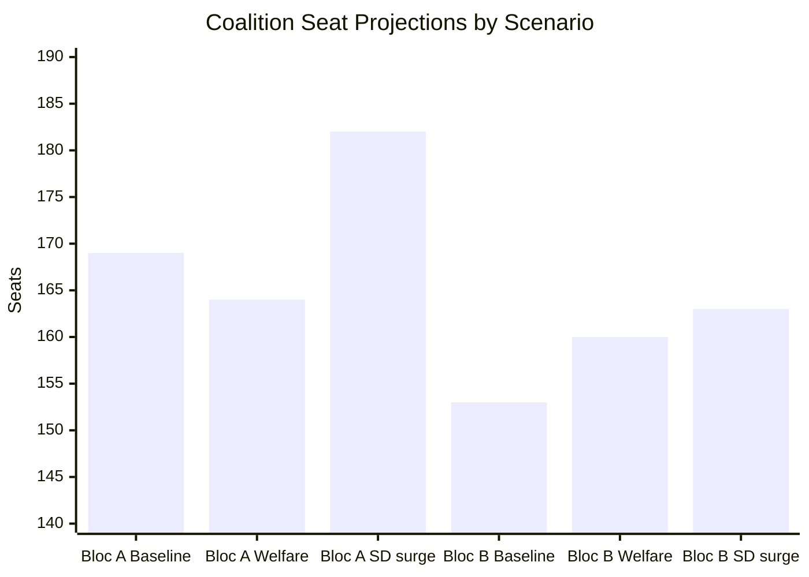

# Coalition Mathematics — Realtime Pulse 2026-05-12

**Author**: James Pether Sörling | **Date**: 2026-05-12  
**Electoral system**: Swedish proportional representation, Sainte-Laguë method, 4% threshold, 349 seats

## Current Coalition Architecture (Tidö-pakten)

**Government**: M + KD + L (3-party cabinet)  
**Support**: SD (outside government, Tidöavtal support agreement)  
**Total Tidö seats**: M(68) + KD(19) + L(16) + SD(73) = **176** (majority = 175 ✅)  
**Opposition**: S(107) + V(24) + C(24) + MP(18) = **173**

## Tidö-paktens Stability Calculus

**Margin**: 176 − 175 = **1 seat majority**  
**Vulnerability**: Single defection by any Tidö member = tied vote (requires speaker casting vote)

**Stress points identified in today's analysis**:
1. SD on KU34 (aborträtt) — PIR-CONST-ABORT unresolved — 10% risk of SD abstention
2. L on HD10486 (gender wage) — ideological opposition to 30 mdr mandate; defensible
3. KD on eldercare — potential nuance but unlikely to defect

**Structural assessment**: Tidö has survived 4 years with 1-seat margin. The coalition's durability is proven but fragile against an extraordinary constitutional trigger (KU34/SD).

## Sainte-Laguë Seat Scenarios

### Scenario A: Neutral election (baseline)

Assumption: No major swing from current polls  

| Party | Votes % | Sainte-Laguë seats |
|-------|---------|-------------------|
| SD | 21.0% | 73 |
| M | 17.5% | 61 |
| S | 31.5% | 110 |
| V | 7.5% | 26 |
| C | 6.5% | 23 |
| MP | 5.0% | 17 |
| L | 4.5% | 16 |
| KD | 5.5% | 19 |
| Nyans/Others | 1.0% | 4 (risk: below threshold) |

**Bloc A (Tidö)**: SD(73)+M(61)+KD(19)+L(16) = **169** — SHORT of 175  
**Bloc B**: S(110)+V(26)+MP(17) = **153** — SHORT  
**C(23)**: Pivot party — determines which bloc governs

### Scenario B: Welfare wave (V/S gain, M/SD neutral)

| Party | Votes % | Seats |
|-------|---------|-------|
| SD | 21.0% | 73 |
| M | 16.0% | 56 |
| S | 32.5% | 113 |
| V | 8.0% | 28 |
| C | 6.5% | 23 |
| MP | 5.5% | 19 |
| L | 4.5% | 16 |
| KD | 5.5% | 19 |
| Others | 0.5% | 2 |

**Bloc A**: SD(73)+M(56)+KD(19)+L(16) = **164** — WELL SHORT  
**Bloc B**: S(113)+V(28)+MP(19) = **160** + C(23) = **183** — MAJORITY ✅  
**Outcome**: Left bloc majority; Andersson PM

### Scenario C: SD surge (anti-immigration mobilisation)

| Party | Votes % | Seats |
|-------|---------|-------|
| SD | 24.0% | 84 |
| M | 18.0% | 63 |
| S | 29.0% | 101 |
| V | 7.0% | 24 |
| C | 6.0% | 21 |
| MP | 5.0% | 17 |
| L | 4.5% | 16 |
| KD | 5.5% | 19 |
| Others | 1.0% | 4 |

**Bloc A**: SD(84)+M(63)+KD(19)+L(16) = **182** — CLEAR MAJORITY ✅  
**Bloc B**: S(101)+V(24)+MP(17)+C(21) = **163** — SHORT

## Coalition Mathematics Summary

**Key arithmetic finding**: Without C, neither bloc reaches 175 in the baseline scenario. C (6.5% est.) is the kingmaker. C's leadership will face a binary choice: support Tidö 2.0 (less likely given C's centrist drift) or enable a S-V-MP-C coalition (more likely if housing costs are the defining issue).

**Today's analysis implication**: HD10486 (gender wage) and HD10484 (eldercare) both push C toward left-bloc alignment if they resonate as dominant issues. C's voter base overlaps significantly with Segments 3 and 5 (rule of law + housing). A left-leaning C is the key swing factor.
