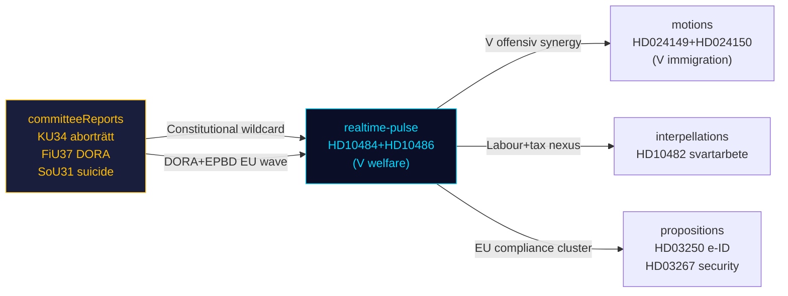

# Cross-Reference Map — Realtime Pulse 2026-05-12

**Author**: James Pether Sörling | **Date**: 2026-05-12  
**Tier-C Required**: This Tier-C aggregation artifact MUST cross-reference all sibling folders under `analysis/daily/2026-05-12/`

## Sibling Folder Index

| Subfolder | Key document(s) | Significance | Link |
|-----------|----------------|-------------|------|
| `propositions/` | HD03267 (security), HD03250 (e-ID), HD03261 (Skatteverket) | National security + digital infrastructure | `analysis/daily/2026-05-12/propositions/executive-brief.md` |
| `motions/` | HD024149, HD024150 (V immigration motions) | V opposition immigration strategy | `analysis/daily/2026-05-12/motions/synthesis-summary.md` |
| `committeeReports/` | KU34 (aborträtt), CU31 (hyra), FiU37 (DORA), JuU39 (psyk.våld), SoU31 (suicide) | Constitutional + social policy wave | `analysis/daily/2026-05-12/committeeReports/synthesis-summary.md` |
| `interpellations/` | HD10482 (svartarbete, active), HD10481 (klimat, WITHDRAWN) | Labour + climate postures | `analysis/daily/2026-05-12/interpellations/synthesis-summary.md` |
| `realtime-pulse/` | HD10484, HD10483, HD10485, HD10486, HD01CU30 | **THIS FOLDER** | — |

## Cross-Reference Analysis

### Theme 1: Vänsterpartiets koordinerade offensiv (V synergy)

**realtime-pulse**: HD10484 (eldercare, V) + HD10486 (gender wage, V)  
**motions sibling**: HD024149 + HD024150 (V immigration motions)  
**Synthesis**: V fielded ≥4 separate parliamentary actions on 11–12 May 2026. This is a coordinated pre-summer blitz designed to define V's electoral platform on welfare, labour rights, and immigration. The immigration motions (motions sibling) complete the trifecta with welfare (HD10484) and gender (HD10486) interpellations.  
**Cross-intelligence value**: V's strategy is CONFIRMED as multi-front — not ad hoc single issues.

### Theme 2: Konstitutionell dimension — KU34 och aborträtten

**committeeReports sibling**: KU34 contains both abortion rights amendment AND freedom of association protection  
**realtime-pulse**: No direct aborträtt document today, but HD10483 (samtyckeslagen, independent) touches on criminal justice reform territory that intersects with KU34's gender-justice dimension  
**Synthesis**: The committeeReports sibling is the constitutionally most significant document cluster of 2026-05-12. KU34's abortion rights provision (PIR-CONST-ABORT) has an unresolved SD position — realtime-pulse analysis watches for any SD statement.

### Theme 3: Arbetsmarknad och ekonomi — Koordinerat socialdemokratiskt tryck

**realtime-pulse**: HD10485 (S → Svantesson: prostitution tax/SOU 2025:119)  
**interpellations sibling**: HD10482 (svartarbete active — labour market tax fraud)  
**propositions sibling**: HD03261 (Skatteverket modernisering)  
**Synthesis**: Three separate parliamentary actions on 12 May touch the fiscal/labour market space: Skatteverket modernisation (prop), svartarbete interpellation, and prostitution taxation (HD10485). S is building a "Tidöregeringen skyddar skattebrott i gråzoner" counter-narrative.

### Theme 4: Digital infrastruktur och EU-mandat

**propositions sibling**: HD03250 (e-ID) + HD03267 (national security/säkerhetsskydd)  
**realtime-pulse**: HD01CU30 (EPBD energy directive — EU mandate)  
**committeeReports sibling**: FiU37 (DORA — financial sector EU regulation)  
**Synthesis**: Three EU-driven regulatory instruments are moving through Riksdag in parallel (EPBD, DORA, e-ID). Sweden is on a "EU compliance wave" — all three reduce legislative autonomy and shift costs to private sector. SD's EU-skeptic base may create friction in committee reservations.

### Theme 5: Social välfärd under valvinteråret

**realtime-pulse**: HD10484 (eldercare V), HD10486 (gender wage V)  
**committeeReports sibling**: SoU31 (suicidprevention), JuU39 (psykiskt våld)  
**Synthesis**: Welfare + social support is the dominant issue cluster on 12 May 2026. Five separate parliamentary outputs touch social service delivery quality. This is the broadest welfare-signal day since the session started.

## Tier-C Synthesis Intelligence Line

**Single intelligence line for editors**: V:s koordinerade offensiv mot Tidöregeringens välfärdsrekord — simultaneous eldercare, gender wage, immigration, and suicidprevention legislative pressure — defines the pre-summer political narrative; the constitutional KU34 aborträtt question (committeeReports sibling, SD position unresolved) remains the wildcard that could disrupt the welfare narrative dominance.

## Mermaid Cross-Reference Graph

