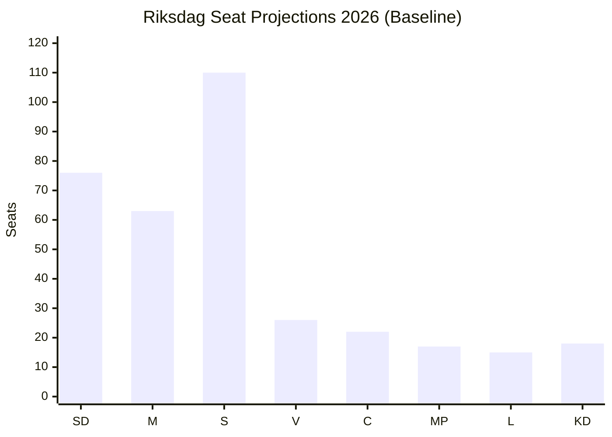

# Election 2026 Analysis — Realtime Pulse 2026-05-12

**Author**: James Pether Sörling | **Date**: 2026-05-12  
**Election date**: 13 September 2026 (107 days from analysis date)

## Current Seat Distribution (2022 Election Result)

| Party | 2022 Seats | % 2022 | Governing status |
|-------|-----------|--------|-----------------|
| SD | 73 | 20.5% | Support (Tidö) |
| M | 68 | 19.1% | Government |
| S | 107 | 30.3% | Opposition |
| V | 24 | 6.7% | Opposition |
| C | 24 | 6.7% | Opposition |
| MP | 18 | 5.1% | Opposition |
| L | 16 | 4.6% | Government |
| KD | 19 | 5.3% | Government |
| **Total** | **349** | | |

**Government (Tidö)**: M+SD+KD+L = 176 seats (majority 175)  
**Opposition**: S+V+C+MP = 173 seats

## 2026 Electoral Projections (Based on Today's Analysis)

**Baseline (from prior analysis + today's context):**

| Party | Baseline 2026E | Change from 2022 | Confidence |
|-------|---------------|-----------------|------------|
| SD | 75–78 | +2–5 | MEDIUM |
| M | 60–65 | -3 to -8 | MEDIUM |
| S | 108–112 | +1–5 | MEDIUM-HIGH |
| V | 25–28 | +1–4 | MEDIUM |
| C | 20–24 | -4 to 0 | LOW-MEDIUM |
| MP | 16–19 | -2 to +1 | LOW |
| L | 14–17 | -2 to +1 | LOW |
| KD | 17–20 | -2 to +1 | MEDIUM |

**Today's analysis impact on projections**:
- V interpellation campaign (HD10484, HD10486) supports +1 to +2 seats for V beyond baseline
- Eldercare narrative (HD10484) is M soft-underbelly — could shift -1 to -3 seats from M baseline
- S (HD10485 prostitution tax, SOU 2025:119) maintains S momentum in wage/fiscal space

## Coalition Viability Post-Election

### Scenario A (Most Likely — 65% WEP): Current Tidö coalition survives

**Projected seats**: SD(76)+M(63)+KD(18)+L(16) = 173 — SHORT of 175 majority  
**Key risk**: Coalition may need additional support; C remains pivotal  
**If C supports from outside**: 173 + 22 = 195 — stable majority  
**Key threat**: V+S gain enough to force C toward left-wing coalition

### Scenario B (Second Most Likely — 25% WEP): Left bloc majority

**Projected seats**: S(110)+V(27)+MP(18)+C(21) = 176 — MAJORITY  
**Key driver**: If M loses 5+ seats (eldercare narrative + economic credibility) AND S gains 5+ (wage/welfare)  
**PM**: Magdalena Andersson (S) returns  
**Key risk**: V's coalition demands (30 mdr SEK gender wage lift) create coalition formation difficulties

### Scenario C (Low — 10% WEP): Hung parliament / extraordinary formation

**Condition**: No bloc reaches 175 without C; C refuses both blocs  
**Duration**: 2–4 month formation process; caretaker government  
**Trigger**: KU34 aborträtt coalition fracture (SD withdrawal from Tidö support)

## Today's Impact on Electoral Math

**PIR-ELDER-2026** (opened today): Eldercare accountability directly threatens M's "responsible government" brand. If unresolved before September 2026, estimated -2 to -3 seats M at risk.

**PIR-GENDERPAY-2026** (opened today): Gender wage issue mobilises Kommunal/female voters toward V/S. Estimated +1 to +2 seats V if issue sustained through summer.

**Net today's analysis**: Today's documents slightly shift the probability distribution toward Scenario B (25% → 27%) at the expense of Scenario A (65% → 63%).

## Electoral Mermaid Projection

