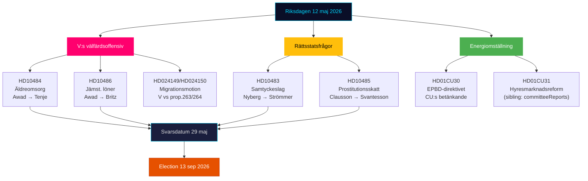

---
title: "الملخص التنفيذي — نبض البرلمان السويدي في الوقت الفعلي 2026-05-12"
date: "2026-05-12"
language: ar
subfolder: "realtime-pulse"
article_type: "realtime-pulse"
author: "James Pether Sörling"
classification: "PUBLIC"
confidence: "عالٍ [B2]"
---

# الملخص التنفيذي — نبض البرلمان السويدي في الوقت الفعلي 12 مايو 2026

**المؤلف**: James Pether Sörling | **التاريخ**: 2026-05-12 | **سير العمل**: news-realtime-monitor  
**التصنيف**: 🟢 PUBLIC | **مستوى الثقة**: عالٍ [Admiralty B2]

## الخلاصة — الخط الأساسي

يتسم الثلاثاء 12 مايو 2026 بهجوم الاستجواب الثلاثي لحزب اليسار (V) على الحكومة في مجالات رعاية كبار السن والأجور المتساوية والرعاية الاجتماعية — كتلة إشارات منسقة قبل الانتخابات تستهدف سجل رعاية التحالف Tidö. في الوقت ذاته، تتوحد ثلاثة عمليات دستورية وسياسية اجتماعية من تقارير اللجان اليومية (KU34، CU30، CU31). في المجمل، يصوّر 12 مايو معارضة تتسارع نحو انتخابات 13 سبتمبر 2026.

## نقاط الاستخبارات الحرجة

**1. الهجوم الاستجوابي الثلاثي لـ V** [أهمية عالية]
- HD10484 (Nadja Awad → Anna Tenje / M): مخالفات في رعاية المسنين الربحية — أربعة أسئلة وزارية حول الرقابة والعقوبات ومتطلبات الأرباح وتوفير الموظفين. البيانات الخلفية: تتوقع Socialstyrelsen الحاجة إلى 50,000 موظف جديد بحلول 2030؛ وثّقت SVT/SR فضائح متكررة.
- HD10486 (Nadja Awad → Johan Britz / L): الأجور المتساوية في قطاع الرفاه — "رفع أجر المرأة" لحزب V (30 مليار كرونة سويدية على 10 سنوات) كتموضع حزبي؛ خمسة أسئلة وزارية حول التمييز في الأجور البنيوي.
- WEP: لا يُتوقع صدور بيان وزاري قبل الموعد النهائي في 29 مايو يمنح V انتصاراً جوهرياً، لكن الأسئلة تخلق مادة دعائية قبل 13 سبتمبر.

**2. قانون الموافقة: مسألة سيادة القانون (HD10483)** [أهمية متوسطة]
- Katja Nyberg (مستقلة) → Gunnar Strömmer / M: ثلاثة أسئلة حول مشكلات الحماية القانونية في الاغتصاب بالإهمال التي حددها Brå.
- الإشارة التحليلية: عضو مستقل يوجه انتقادات للحماية القانونية تعكس توصيات Brå ذاتها — صمت الحكومة يخلق رواية انتخابية محتملة حول عجز M عن التعامل مع إصلاحات قانونية معقدة.

**3. المنطق الضريبي للدعارة (HD10485)** [أهمية منخفضة-متوسطة]
- Ida Ekeroth Clausson (S) → Elisabeth Svantesson / M: يربط SOU 2025:119 وتصويت التحالف Tidö ضد مبادرة اللجنة وضريبة برامج الخروج.
- الإشارة التحليلية: تبني S بُعداً محافظاً للحملة الانتخابية للناخبين الذين يجمعون بين موقف مناهض للاستغلال والمسؤولية الميزانية؛ تدعم Skatteverket في الواقع مراجعة اللوائح.

**4. توجيه الطاقة EPBD (HD01CU30)** [أهمية متوسطة]
- تقرير CU حول توجيه المباني الأوروبي المعدّل وهدف كفاءة الطاقة الجديد.
- الإشارة السياسية: يتضمن تنفيذ EPBD متطلبات ترقية إلزامية للمباني الأقدم — صراع رئيسي مع CU31 (تحرير سوق الإيجار) وطريق مسدود المناخ. قطاع العقارات والمستأجرون في مرمى النار.

## قراءة في 60 ثانية

- تشن V هجوماً ثلاثياً على الرفاه ضد M وL؛ وزيرة الشؤون الاجتماعية Tenje ووزير العمل Britz تحت ضغط مع موعد الرد في 29 مايو.
- يُعدّ استجواب الموافقة إشارة حماية قانونية للناخبين المستقلين في الشريحة الوسطى.
- يربط تقرير EPBD نقاش سوق الإيجار (CU31) بالتحول في الطاقة — توتر محتمل في التحالف M/L مقابل SD حول التكاليف.
- لا إشارات KU34 جديدة من SD اليوم؛ يبقى PIR-CONST-ABORT مفتوحاً.

## أهم محفز استشرافي

**29 مايو 2026** — آخر موعد للرد على HD10484 وHD10483 وHD10485 وHD10486. ستحدد الردود الوزارية ما إذا كانت رواية رعاية V ستحصل على رواية مضادة جوهرية أم ستبقى معززة كخطوط هجوم غير مُعترض عليها قبل الانتخابات.

## رسم الخرائط السياسية اليومية 12 مايو 2026

<!-- source-sha: e87ab6b1e9a73ae1948c4e29ccf2380d69a15d92 -->
