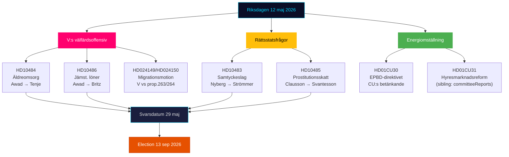

# Eksekutivresumé — Riksdagen Realtidspuls 12. maj 2026

**Forfatter**: James Pether Sörling | **Dato**: 2026-05-12 | **Arbejdsproces**: news-realtime-monitor  
**Klassifikation**: 🟢 PUBLIC | **Konfidensgrad**: HØJ [Admiralty B2]

## Konklusion — Bundlinje

Tirsdag den 12. maj 2026 præges af Venstrefløjspartiets (V) tredobbelte interpellationsoffensiv mod regeringen om ældrepleje, ligeløn og velfærd — et koordineret præ-valg signalblok rettet mod Tidø-koalitionens velfærdsresultater. Samtidig konsolideres tre forfatnings- og socialpolitiske processer fra betænkningerne (KU34, CU30, CU31). Samlet illustrerer 12. maj en opposition i acceleration mod valget den 13. september 2026.

## Kritiske efterretningspunkter

**1. V:s tredobbelte interpellationsoffensiv** [HØJ RELEVANS]
- HD10484 (Nadja Awad → Anna Tenje / M): Uregelmæssigheder i profitdrevet ældrepleje — fire ministerielle spørgsmål om tilsyn, sanktioner, krav til overskud og personaleforsyning. Baggrunddata: Socialstyrelsen forudser behov for 50.000 nyansatte frem til 2030; SVT/SR har dokumenteret gentagne skandaler.
- HD10486 (Nadja Awad → Johan Britz / L): Ligeløn i velfærdssektoren — V:s "kvindelønshøjelse" (30 mia. SEK over 10 år) som partipositionering; fem ministerielle spørgsmål om strukturel løndiskriminering.
- WEP: Ingen ministeriel erklæring forventes inden fristen den 29. maj, der giver V en væsentlig sejr, men spørgsmålene skaber kampagnemateriale frem til den 13. september.

**2. Samtykkesloven: retsstatsspørgsmål (HD10483)** [MIDDEL RELEVANS]
- Katja Nyberg (uafhængig) → Gunnar Strömmer / M: Tre spørgsmål om retssikkerhedsproblemer med uagtsom voldtægt identificeret af Brå.
- Analytisk signal: Et uafhængigt parlamentsmedlem retter retssikkerhedskritik, der afspejler Brå:s egne anbefalinger — regeringens tavshed skaber et potentielt valgnarrativ om M:s manglende evne til at håndtere komplekse retsreformer.

**3. Skattelogik for prostitution (HD10485)** [LAV-MIDDEL RELEVANS]
- Ida Ekeroth Clausson (S) → Elisabeth Svantesson / M: Forbinder SOU 2025:119, Tidø-koalitionens nedstемning af udvalgsinitiativet og beskatning af exit-programmer.
- Analytisk signal: S bygger en konservativ valgkampagnedimension rettet mod vælgere, der kombinerer en anti-udnyttelsesposition med budgetansvar; Skatteverket støtter faktisk en regeloversigt.

**4. Energidirektivet EPBD (HD01CU30)** [MIDDEL RELEVANS]
- CU:s betænkning om EU:s reviderede bygningsdirektiv og nyt mål for energieffektivitet.
- Politisk signal: Implementering af EPBD indebærer obligatoriske opgraderingskrav til ældre ejendomme — en nøglekonflikt med CU31 (liberalisering af lejemarkedet) og klimadødvandet. Ejendomssektoren og lejere er i krydsilden.

## 60-sekunders læsning

- V driver en tredobbelt velfærdsoffensiv mod M og L; Socialminister Tenje og Arbejdsmarkedsminister Britz er under pres med svarsfrist den 29. maj.
- Samtykke-interpellationen er et retssikkerhedssignal til uafhængige vælgere i midtersegmentet.
- EPBD-betænkningen forbinder lejemarkedsdebatten (CU31) med energiomstillingen — potentiel koalitionsspænding M/L vs SD om omkostninger.
- Ingen nye KU34-signaler fra SD i dag; PIR-CONST-ABORT forbliver åben.

## Vigtigste fremadrettede udløser

**29. maj 2026** — seneste svarsdato for HD10484, HD10483, HD10485, HD10486. Ministersvaren afgør, om V:s velfærdsnarrativ får et substantielt modnarrativ, eller om det efterlades styrket som uimodsagte angrebslinjer frem mod valget.

## Dagspolitisk kortlægning 12. maj 2026

<!-- source-sha: e87ab6b1e9a73ae1948c4e29ccf2380d69a15d92 -->
