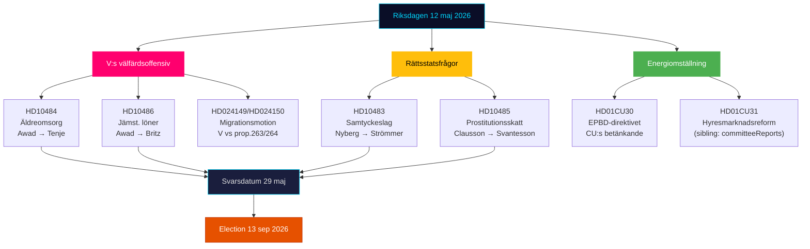

# Führungszusammenfassung — Riksdagen Echtzeit-Puls 12. Mai 2026

**Autor**: James Pether Sörling | **Datum**: 2026-05-12 | **Workflow**: news-realtime-monitor  
**Klassifizierung**: 🟢 PUBLIC | **Konfidenzgrad**: HOCH [Admiralty B2]

## Schlussfolgerung — Kernbotschaft

Der Dienstag, der 12. Mai 2026, ist geprägt von der dreifachen Interpellationsoffensive der Linkspartei (V) gegen die Regierung in den Bereichen Altenpflege, gleiche Löhne und Sozialleistungen — ein koordinierter Vorwahlsignalblock, der auf die Sozialleistungsbilanz der Tidö-Koalition abzielt. Gleichzeitig werden drei verfassungsrechtliche und sozialpolitische Prozesse aus den tagesaktuellen Ausschussberichten (KU34, CU30, CU31) konsolidiert. Insgesamt illustriert der 12. Mai eine in Beschleunigung befindliche Opposition auf dem Weg zur Wahl am 13. September 2026.

## Kritische Geheimdienstpunkte

**1. Die dreifache Interpellationsoffensive der V** [HOHE RELEVANZ]
- HD10484 (Nadja Awad → Anna Tenje / M): Missstände in der gewinnorientierten Altenpflege — vier Ministeriumsfragen zu Aufsicht, Sanktionen, Gewinnforderungen und Personalversorgung. Hintergrunddaten: Socialstyrelsen prognostiziert bis 2030 einen Bedarf von 50 000 Neuanstellungen; SVT/SR dokumentierten wiederholte Skandale.
- HD10486 (Nadja Awad → Johan Britz / L): Gleicher Lohn im Sozialbereich — V:s „Frauenlohnerhöhung" (30 Mrd. SEK über 10 Jahre) als Parteipositio­nierung; fünf Ministeriumsfragen zur strukturellen Lohndiskriminierung.
- WEP: Keine Ministeriumserklärung wird erwartet bis zur Frist 29. Mai, die der V einen wesentlichen Sieg verschaffen würde, aber die Fragen schaffen Kampagnenmaterial bis zum 13. September.

**2. Zustimmungsgesetz: Rechtsstaatsfrage (HD10483)** [MITTLERE RELEVANZ]
- Katja Nyberg (parteilos) → Gunnar Strömmer / M: Drei Fragen zu Rechtsschutzproblemen bei fahrlässiger Vergewaltigung, die von Brå identifiziert wurden.
- Analytisches Signal: Ein unabhängiges Mitglied übt Rechtsschutz­kritik, die die eigenen Empfehlungen des Brå widerspiegelt — das Schweigen der Regierung schafft ein potenzielles Wahlnarrativ über die Unfähigkeit der M, komplexe Rechtsreformen zu handhaben.

**3. Steuerlogik bei Prostitution (HD10485)** [NIEDRIG-MITTLERE RELEVANZ]
- Ida Ekeroth Clausson (S) → Elisabeth Svantesson / M: Verknüpft SOU 2025:119, die Abstimmung der Tidö-Koalition gegen die Ausschussinitiative und die Besteuerung von Ausstiegsprogrammen.
- Analytisches Signal: S baut eine konservative Wahlkampagnedimension für Wähler auf, die eine Anti-Ausbeutungsposition mit Haushaltsverpflichtung verbinden; Skatteverket unterstützt tatsächlich eine Regelüberprüfung.

**4. Energierichtlinie EPBD (HD01CU30)** [MITTLERE RELEVANZ]
- Gutachten des CU über die überarbeitete EU-Gebäuderichtlinie und das neue Energieeffizienzziel.
- Politisches Signal: Die Umsetzung der EPBD beinhaltet obligatorische Aufrüstungsanforderungen für ältere Immobilien — ein Schlüsselkonflikt mit CU31 (Deregulierung des Mietmarktes) und der Klimasackgasse. Die Immobilienbranche und Mieter befinden sich im Kreuzfeuer.

## 60-Sekunden-Lektüre

- V treibt eine dreifache Sozialoffensive gegen M und L; Sozialministerin Tenje und Arbeitsmarktminister Britz stehen mit dem Antwortdatum 29. Mai unter Druck.
- Die Zustimmungsinterpellation ist ein Rechtsschutz-Signal an unabhängige Wähler im mittleren Segment.
- Das EPBD-Gutachten verbindet die Mietmarktdebatte (CU31) mit dem Energiewandel — potenzielle Koalitionsspannung M/L vs SD hinsichtlich der Kosten.
- Keine neuen KU34-Signale von SD heute; PIR-CONST-ABORT bleibt offen.

## Wichtigster vorausschauender Auslöser

**29. Mai 2026** — letztes Antwortdatum für HD10484, HD10483, HD10485, HD10486. Die Ministerantworten entscheiden, ob V:s Sozialnarrativ eine wesentliche Gegenerzählung erhält oder als unangefochtene Angriffslinien bis zur Wahl gestärkt bleibt.

## Tagespolitische Kartierung 12. Mai 2026

<!-- source-sha: e87ab6b1e9a73ae1948c4e29ccf2380d69a15d92 -->
