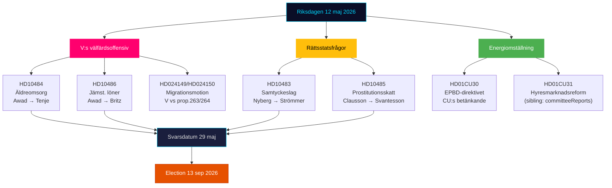

# Resumen ejecutivo — Riksdagen Pulso en tiempo real 12 de mayo de 2026

**Autor**: James Pether Sörling | **Fecha**: 2026-05-12 | **Flujo de trabajo**: news-realtime-monitor  
**Clasificación**: 🟢 PUBLIC | **Nivel de confianza**: ALTO [Admiralty B2]

## Conclusión — Línea de fondo

El martes 12 de mayo de 2026 está marcado por la triple ofensiva de interpelaciones del Partido de Izquierda (V) contra el gobierno en materia de atención a personas mayores, igualdad salarial y bienestar social — un bloque coordinado de señales preelectorales dirigido al historial de bienestar de la coalición Tidö. Simultáneamente se consolidan tres procesos constitucionales y de política social de los informes de comisión del día (KU34, CU30, CU31). En conjunto, el 12 de mayo ilustra una oposición en aceleración hacia las elecciones del 13 de septiembre de 2026.

## Puntos de inteligencia críticos

**1. La triple ofensiva de interpelaciones de V** [ALTA RELEVANCIA]
- HD10484 (Nadja Awad → Anna Tenje / M): Irregularidades en los cuidados a personas mayores con fines de lucro — cuatro preguntas ministeriales sobre supervisión, sanciones, requisitos de beneficios y provisión de personal. Datos de fondo: Socialstyrelsen prevé la necesidad de 50 000 nuevas contrataciones para 2030; SVT/SR han documentado escándalos repetidos.
- HD10486 (Nadja Awad → Johan Britz / L): Igualdad salarial en el sector social — el "aumento salarial para mujeres" de V (30.000 millones SEK durante 10 años) como posicionamiento partidario; cinco preguntas ministeriales sobre discriminación salarial estructural.
- WEP: No se espera ninguna declaración ministerial antes del plazo del 29 de mayo que otorgue a V una victoria sustancial, pero las preguntas crean material de campaña antes del 13 de septiembre.

**2. Ley de consentimiento: cuestión del Estado de derecho (HD10483)** [RELEVANCIA MEDIA]
- Katja Nyberg (independiente) → Gunnar Strömmer / M: Tres preguntas sobre problemas de garantías judiciales con la violación por negligencia identificados por Brå.
- Señal analítica: Un miembro independiente formula críticas sobre las garantías judiciales que reflejan las propias recomendaciones del Brå — el silencio del gobierno crea un potencial narrativo electoral sobre la incapacidad de M para manejar reformas legales complejas.

**3. Lógica fiscal para la prostitución (HD10485)** [RELEVANCIA BAJA-MEDIA]
- Ida Ekeroth Clausson (S) → Elisabeth Svantesson / M: Vincula SOU 2025:119, el voto de la coalición Tidö contra la iniciativa de comisión y la tributación de programas de salida.
- Señal analítica: S construye una dimensión conservadora de campaña electoral para votantes que combinan una posición antiexplotación con responsabilidad presupuestaria; Skatteverket apoya efectivamente una revisión normativa.

**4. Directiva energética EPBD (HD01CU30)** [RELEVANCIA MEDIA]
- Informe del CU sobre la directiva europea revisada de edificios y el nuevo objetivo de eficiencia energética.
- Señal política: La implementación de la EPBD implica requisitos obligatorios de actualización para propiedades antiguas — un conflicto clave con CU31 (desregulación del mercado de alquiler) y el bloqueo climático. El sector inmobiliario y los inquilinos se encuentran en el punto de mira.

## Lectura en 60 segundos

- V impulsa una triple ofensiva de bienestar contra M y L; la Ministra de Asuntos Sociales Tenje y el Ministro de Trabajo Britz están bajo presión con la fecha límite de respuesta del 29 de mayo.
- La interpelación sobre el consentimiento es una señal de garantías judiciales dirigida a votantes independientes en el segmento central.
- El informe EPBD conecta el debate sobre el mercado de alquiler (CU31) con la transición energética — potencial tensión de coalición M/L vs SD sobre los costos.
- No hay nuevas señales KU34 de SD hoy; PIR-CONST-ABORT permanece abierto.

## Desencadenante prospectivo principal

**29 de mayo de 2026** — última fecha de respuesta para HD10484, HD10483, HD10485, HD10486. Las respuestas ministeriales determinarán si el narrativo de bienestar de V obtiene una contrarrespuesta sustancial o permanece reforzado como líneas de ataque sin respuesta antes de las elecciones.

## Cartografía política del 12 de mayo de 2026

<!-- source-sha: e87ab6b1e9a73ae1948c4e29ccf2380d69a15d92 -->
