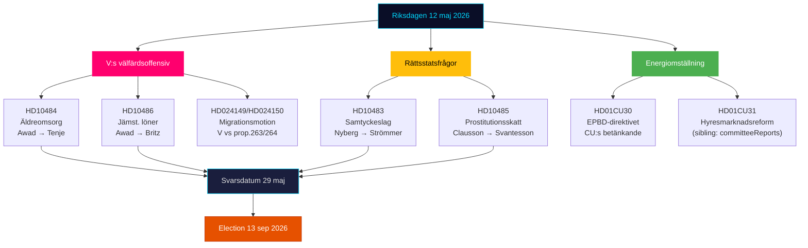

# Johdon yhteenveto — Riksdagen Reaaliaikapulssi 12. toukokuuta 2026

**Tekijä**: James Pether Sörling | **Päivämäärä**: 2026-05-12 | **Työnkulku**: news-realtime-monitor  
**Luokitus**: 🟢 PUBLIC | **Luottamustaso**: KORKEA [Admiralty B2]

## Johtopäätös — Ydinviesti

Tiistaina 12. toukokuuta 2026 leimaa Vasemmistopuolueen (V) kolminkertainen interpellaatiohyökkäys hallitusta vastaan vanhustenhoidosta, tasa-arvoisesta palkkauksesta ja hyvinvoinnista — koordinoitu vaalienneistä signaaliblokki, joka on suunnattu Tidö-koalition hyvinvointirekisteriä vastaan. Samanaikaisesti vakiinnutetaan kolme perustuslaillista ja sosiopoliittista prosessia päivän mietinnöistä (KU34, CU30, CU31). Yhteensä 12. toukokuuta kuvaa oppositiota, joka kiihtyy kohti vaalia 13. syyskuuta 2026.

## Kriittiset tiedustelupisteet

**1. V:n kolminkertainen interpellaatiohyökkäys** [KORKEA MERKITYS]
- HD10484 (Nadja Awad → Anna Tenje / M): Epäkohdat voittoa tavoittelevassa vanhustenhoidossa — neljä ministeriön kysymystä valvonnasta, seuraamuksista, voittovaatimuksista ja henkilöstön saatavuudesta. Taustatiedot: Socialstyrelsen ennakoi 50 000 uuden työntekijän tarvitsevan vuoteen 2030 mennessä; SVT/SR on dokumentoinut toistuvat skandaalit.
- HD10486 (Nadja Awad → Johan Britz / L): Tasa-arvoinen palkka hyvinvointisektorilla — V:n "naisten palkankorotus" (30 miljardia SEK / 10 vuotta) puolueasemoitumisena; viisi ministeriön kysymystä rakenteellisesta palkkasyrjinnästä.
- WEP: Mikään ministeriön ilmoitus ei odoteta 29. toukokuuta mennessä, joka antaisi V:lle merkittävän voiton, mutta kysymykset luovat kampanjamateriaalia ennen 13. syyskuuta.

**2. Suostumukselaki: oikeusvaltiokysymys (HD10483)** [KOHTALAINEN MERKITYS]
- Katja Nyberg (sitoutumaton) → Gunnar Strömmer / M: Kolme kysymystä tuottamukselliseen raiskaukseen liittyvistä oikeusturvahaasteista, jotka Brå tunnisti.
- Analyyttinen signaali: Sitoutumaton jäsen esittää oikeusturvakritiikin, joka heijastaa Brå:n omia suosituksia — hallituksen hiljaisuus luo mahdollisen vaalikerronnan M:n kyvyttömyydestä käsitellä monimutkaisia oikeusreformeja.

**3. Prostituution verologiikka (HD10485)** [MATALA-KOHTALAINEN MERKITYS]
- Ida Ekeroth Clausson (S) → Elisabeth Svantesson / M: Yhdistää SOU 2025:119:n, Tidö-koalition äänestyksen valiokunta-aloitteen hylkäämiseksi ja exit-ohjelmien verotuksen.
- Analyyttinen signaali: S rakentaa konservatiivista vaaliulottuvuutta äänestäjille, jotka yhdistävät hyväksikäyttöä vastustavan kannan budjettivastuu; Skatteverket tukee tosiasiassa sääntöjen tarkistamista.

**4. Energiadirektiivi EPBD (HD01CU30)** [KOHTALAINEN MERKITYS]
- CU:n mietintö EU:n uudistetuista rakennusdirektiivistä ja uudesta energiatehokkuustavoitteesta.
- Poliittinen signaali: EPBD:n toteuttaminen merkitsee vanhojen kiinteistöjen pakollisia parannusvaatimuksia — avainristiriita CU31:n (vuokramarkkinoiden deregulaatio) ja ilmastopattitilanteen kanssa. Kiinteistöala ja vuokralaiset ovat ristitulen kohteena.

## 60 sekunnin luenta

- V ajaa kolminkertaista hyvinvointihyökkäystä M:tä ja L:ää vastaan; Sosiaaliministeri Tenje ja Työmarkkina­ministeri Britz ovat paineessa vastauspäivämäärällä 29. toukokuuta.
- Suostumusinterpellaatio on oikeusturvasignaali riippumattomille äänestäjille keskilohkossa.
- EPBD-mietintö yhdistää vuokramarkkinakeskustelun (CU31) energiamurrokseen — mahdollinen koalitionjännitys M/L vs SD kustannuksista.
- Uusia KU34-signaaleja SD:ltä ei tänään; PIR-CONST-ABORT pysyy avoimena.

## Tärkein tulevaisuuden laukaisin

**29. toukokuuta 2026** — viimeinen vastauspäivä HD10484:lle, HD10483:lle, HD10485:lle ja HD10486:lle. Ministeri­vastaukset ratkaisevat, saako V:n hyvinvointikertomus merkittävän vastakerronnan vai jätetäänkö ne vahvistumaan vastustamattomina hyökkäyslinjoina ennen vaalia.

## Päivänpoliittinen kartoitus 12. toukokuuta 2026

<!-- source-sha: e87ab6b1e9a73ae1948c4e29ccf2380d69a15d92 -->
