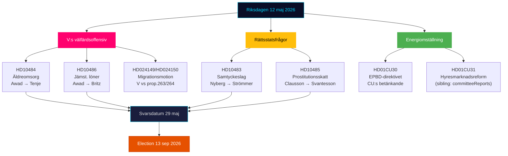

# Note de synthèse — Riksdagen Pouls en temps réel 12 mai 2026

**Auteur** : James Pether Sörling | **Date** : 2026-05-12 | **Flux de travail** : news-realtime-monitor  
**Classification** : 🟢 PUBLIC | **Niveau de confiance** : ÉLEVÉ [Admiralty B2]

## Conclusion — Ligne de fond

Le mardi 12 mai 2026 est marqué par la triple offensive d'interpellations du Parti de gauche (V) contre le gouvernement sur les thèmes des soins aux personnes âgées, de l'égalité salariale et du bien-être social — un bloc de signaux préélectoraux coordonné visant le bilan social de la coalition Tidö. Simultanément, trois processus constitutionnels et de politique sociale issus des rapports de commission du jour (KU34, CU30, CU31) se consolident. Dans l'ensemble, le 12 mai illustre une opposition en accélération vers les élections du 13 septembre 2026.

## Points de renseignement critiques

**1. La triple offensive d'interpellations de V** [HAUTE PERTINENCE]
- HD10484 (Nadja Awad → Anna Tenje / M) : Dysfonctionnements dans les soins aux personnes âgées à but lucratif — quatre questions ministérielles sur la surveillance, les sanctions, les exigences de profit et l'approvisionnement en personnel. Données de fond : Socialstyrelsen prévoit un besoin de 50 000 nouvelles embauches d'ici 2030 ; SVT/SR ont documenté des scandales répétés.
- HD10486 (Nadja Awad → Johan Britz / L) : Égalité salariale dans le secteur social — la « revalorisation salariale des femmes » de V (30 milliards SEK sur 10 ans) comme positionnement partisan ; cinq questions ministérielles sur la discrimination salariale structurelle.
- WEP : Aucune déclaration ministérielle n'est attendue avant l'échéance du 29 mai qui donnerait à V une victoire substantielle, mais les questions créent du matériel de campagne avant le 13 septembre.

**2. Loi sur le consentement : question d'État de droit (HD10483)** [PERTINENCE MOYENNE]
- Katja Nyberg (sans parti) → Gunnar Strömmer / M : Trois questions sur les problèmes de garanties judiciaires liés au viol par négligence identifiés par le Brå.
- Signal analytique : Un membre indépendant formule des critiques sur les garanties judiciaires qui reflètent les propres recommandations du Brå — le silence du gouvernement crée un potentiel narratif électoral sur l'incapacité de M à gérer des réformes judiciaires complexes.

**3. Logique fiscale pour la prostitution (HD10485)** [PERTINENCE FAIBLE-MOYENNE]
- Ida Ekeroth Clausson (S) → Elisabeth Svantesson / M : Relie SOU 2025:119, le vote de la coalition Tidö contre l'initiative de commission et la fiscalité des programmes de sortie.
- Signal analytique : S construit une dimension de campagne électorale conservatrice pour les électeurs combinant une position anti-exploitation avec la responsabilité budgétaire ; Skatteverket soutient effectivement une révision réglementaire.

**4. Directive énergie EPBD (HD01CU30)** [PERTINENCE MOYENNE]
- Rapport du CU sur la directive européenne révisée sur les bâtiments et le nouvel objectif d'efficacité énergétique.
- Signal politique : La mise en œuvre de l'EPBD implique des exigences obligatoires de mise à niveau pour les propriétés anciennes — un conflit clé avec CU31 (déréglementation du marché locatif) et le blocage climatique. L'industrie immobilière et les locataires se trouvent dans la ligne de mire.

## Lecture en 60 secondes

- V mène une triple offensive sociale contre M et L ; la Ministre des Affaires sociales Tenje et le Ministre du Travail Britz sont sous pression avec la date limite de réponse du 29 mai.
- L'interpellation sur le consentement est un signal de garanties judiciaires adressé aux électeurs indépendants du segment central.
- Le rapport EPBD relie le débat sur le marché locatif (CU31) à la transition énergétique — potentielle tension de coalition M/L vs SD sur les coûts.
- Aucun nouveau signal KU34 de SD aujourd'hui ; PIR-CONST-ABORT reste ouvert.

## Déclencheur prospectif principal

**29 mai 2026** — dernière date de réponse pour HD10484, HD10483, HD10485, HD10486. Les réponses ministérielles détermineront si le narratif social de V obtient une contre-narration substantielle ou reste renforcé comme des lignes d'attaque incontestées avant les élections.

## Cartographie politique du 12 mai 2026

<!-- source-sha: e87ab6b1e9a73ae1948c4e29ccf2380d69a15d92 -->
