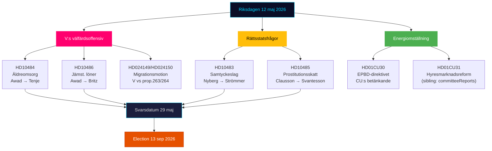

---
title: "תקציר מנהלים — דופק הריקסדאגן בזמן אמת 2026-05-12"
date: "2026-05-12"
language: he
subfolder: "realtime-pulse"
article_type: "realtime-pulse"
author: "James Pether Sörling"
classification: "PUBLIC"
confidence: "גבוה [B2]"
---

# תקציר מנהלים — דופק הריקסדאגן בזמן אמת 12 במאי 2026

**מחבר**: James Pether Sörling | **תאריך**: 2026-05-12 | **תהליך עבודה**: news-realtime-monitor  
**סיווג**: 🟢 PUBLIC | **רמת ביטחון**: גבוה [Admiralty B2]

## מסקנה — השורה התחתונה

יום שלישי, 12 במאי 2026, מאופיין בהתקפת השאלות המשולשת של מפלגת השמאל (V) כלפי הממשלה בנושאי טיפול בקשישים, שוויון שכר ורווחה — בלוק אותות מתואם לפני הבחירות המכוון כנגד שיא הרווחה של קואליציית טידו. במקביל מתאחדות שלוש תהליכים חוקתיים ומדיניים-חברתיים מדוחות הוועדות של היום (KU34, CU30, CU31). בסך הכל, 12 במאי ממחיש אופוזיציה המאיצה לקראת הבחירות ב-13 בספטמבר 2026.

## נקודות מודיעין קריטיות

**1. התקפת השאלות המשולשת של V** [חשיבות גבוהה]
- HD10484 (Nadja Awad → Anna Tenje / M): ליקויים בטיפול ברווחי קשישים — ארבע שאלות שרים על פיקוח, סנקציות, דרישות רווח ואספקת כוח אדם. נתוני רקע: Socialstyrelsen מנבאת צורך ב-50,000 עובדים חדשים עד 2030; SVT/SR תיעדו פרשיות חוזרות ונשנות.
- HD10486 (Nadja Awad → Johan Britz / L): שכר שווה במגזר הרווחה — "העלאת שכר נשים" של V (30 מיליארד כתר שוודי ל-10 שנים) כמיצוב מפלגתי; חמש שאלות שרים על אפליית שכר מבנית.
- WEP: אין צפי להצהרת שר לפני המועד האחרון של 29 במאי שתעניק ל-V ניצחון משמעותי, אך השאלות יוצרות חומרי קמפיין לפני 13 בספטמבר.

**2. חוק ההסכמה: שאלת שלטון החוק (HD10483)** [חשיבות בינונית]
- Katja Nyberg (עצמאית) → Gunnar Strömmer / M: שלוש שאלות על בעיות הגנה משפטית באונס ברשלנות שזוהו על ידי Brå.
- אות אנליטי: חברה עצמאית מעלה ביקורת על הגנה משפטית המשקפת את המלצות Brå עצמה — שתיקת הממשלה יוצרת נרטיב בחירות פוטנציאלי על חוסר יכולת M לטפל ברפורמות משפטיות מורכבות.

**3. לוגיקת מיסוי הזנות (HD10485)** [חשיבות נמוכה-בינונית]
- Ida Ekeroth Clausson (S) → Elisabeth Svantesson / M: מקשר SOU 2025:119, הצבעת קואליציית טידו נגד יוזמת הוועדה ומיסוי תוכניות יציאה.
- אות אנליטי: S בונה ממד קמפיין בחירות שמרני לבוחרים המשלבים עמדה נגד ניצול עם אחריות תקציבית; Skatteverket תומכת בפועל בסקירת תקנות.

**4. הנחיית האנרגיה EPBD (HD01CU30)** [חשיבות בינונית]
- דוח CU על הנחיית הבניינים האירופית המעודכנת ויעד יעילות האנרגיה החדש.
- אות פוליטי: יישום EPBD כולל דרישות שדרוג חובה לנכסים ישנים — קונפליקט מפתח עם CU31 (ביטול רגולציה בשוק השכירות) ותקיעות האקלים. ענף הנדל"ן והשוכרים נמצאים באש צולבת.

## קריאה ב-60 שניות

- V מוביל התקפת רווחה משולשת נגד M ו-L; שרת הרווחה Tenje ושר העבודה Britz נמצאים תחת לחץ עם מועד התגובה ב-29 במאי.
- שאלת ההסכמה היא אות הגנה משפטית לבוחרים עצמאיים בקטע האמצעי.
- דוח EPBD מקשר את הדיון בשוק השכירות (CU31) עם מעבר האנרגיה — מתח קואליציוני פוטנציאלי M/L מול SD על עלויות.
- אין אותות KU34 חדשים מ-SD היום; PIR-CONST-ABORT נשאר פתוח.

## הגורם המניע החשוב ביותר לקדימה

**29 במאי 2026** — המועד האחרון לתגובה עבור HD10484, HD10483, HD10485, HD10486. תגובות השרים יקבעו האם נרטיב הרווחה של V יקבל נרטיב-נגד מהותי או יישאר מחוזק כקווי תקיפה ללא מענה לפני הבחירות.

## מיפוי פוליטי יומי 12 במאי 2026

<!-- source-sha: e87ab6b1e9a73ae1948c4e29ccf2380d69a15d92 -->
