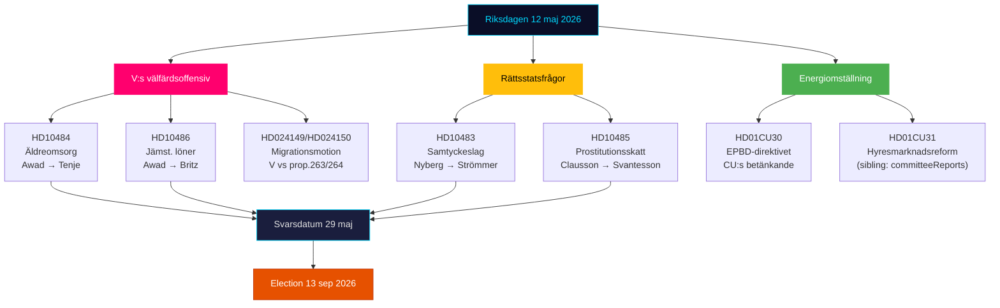

# エグゼクティブ・ブリーフィング — リクスダーゲン リアルタイム・パルス 2026年5月12日

**著者**: James Pether Sörling | **日付**: 2026-05-12 | **ワークフロー**: news-realtime-monitor  
**分類**: 🟢 PUBLIC | **信頼度**: 高 [Admiralty B2]

## 結論 — 要点

2026年5月12日火曜日は、左翼党（V）の高齢者ケア、同一賃金、福祉に関する政府への三重の質問攻勢が特徴となっている — ティドー連立政権の福祉実績に向けた協調的な選挙前シグナルブロック。同時に、その日の委員会報告（KU34、CU30、CU31）からの三つの憲法的および社会政策的プロセスが統合されている。総じて、5月12日は2026年9月13日の選挙に向けて加速する野党を描いている。

## 重要情報ポイント

**1. Vの三重質問攻勢** [高重要度]
- HD10484 (Nadja Awad → Anna Tenje / M): 営利目的の高齢者ケアにおける不正行為 — 監督、制裁、利益要件、人員確保に関する4つの閣僚質問。背景データ：Socialstyrelsenは2030年までに50,000人の新規採用が必要と予測；SVT/SRが繰り返されるスキャンダルを記録。
- HD10486 (Nadja Awad → Johan Britz / L): 福祉部門における同一賃金 — Vの「女性賃金引上げ」（10年間で300億SEK）を党の立場として；構造的な賃金差別に関する5つの閣僚質問。
- WEP: Vに実質的な勝利をもたらす閣僚声明は5月29日の期限までに期待されていないが、質問は9月13日に向けた選挙運動材料を作る。

**2. 同意法：法の支配の問題 (HD10483)** [中程度重要度]
- Katja Nyberg（無所属）→ Gunnar Strömmer / M: Bråが特定した過失による性的暴行に関する司法上の問題についての3つの質問。
- 分析シグナル：独立した議員がBrå自身の勧告を反映した法的保護批判を行っている — 政府の沈黙は、Mが複雑な法改革を扱えないという潜在的な選挙ナラティブを生み出している。

**3. 売春に対する税務論理 (HD10485)** [低〜中程度重要度]
- Ida Ekeroth Clausson (S) → Elisabeth Svantesson / M: SOU 2025:119、委員会イニシアティブに対するティドー連立の投票、および離脱プログラムの課税を結びつける。
- 分析シグナル：Sは反搾取の立場と財政責任を組み合わせる有権者向けの保守的な選挙運動の次元を構築している；Skatteverketは実際に規制見直しを支持している。

**4. エネルギー指令EPBD (HD01CU30)** [中程度重要度]
- EUの改訂建物指令と新しいエネルギー効率目標に関するCUの委員会報告。
- 政治シグナル：EPBDの実施は古い物件に対する義務的なアップグレード要件を含む — CU31（賃貸市場規制緩和）および気候デッドロックとの主要な対立。不動産業界と賃借人は板挟みにある。

## 60秒要旨

- VはMとLに対して三重の福祉攻勢を展開；社会大臣テンジェと労働市場大臣ブリッツは5月29日の回答期限を前に圧力下にある。
- 同意の質問は中間セグメントの独立した有権者への法的保護シグナルである。
- EPBDの委員会報告は賃貸市場議論（CU31）とエネルギー転換を結びつける — コスト面でM/L対SDの連立緊張の可能性。
- 今日SDからの新しいKU34シグナルなし；PIR-CONST-ABORTは未解決のまま。

## 最重要前向きトリガー

**2026年5月29日** — HD10484、HD10483、HD10485、HD10486の最終回答日。閣僚の回答は、Vの福祉ナラティブが実質的な反論を得るか、選挙前の反論されていない攻撃ラインとして強化されたままになるかを決定する。

## 2026年5月12日 政治的マッピング

<!-- source-sha: e87ab6b1e9a73ae1948c4e29ccf2380d69a15d92 -->
