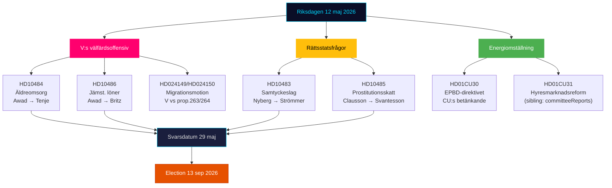

# 요약 보고서 — 릭스다겐 실시간 맥박 2026년 5월 12일

**저자**: James Pether Sörling | **날짜**: 2026-05-12 | **워크플로**: news-realtime-monitor  
**분류**: 🟢 PUBLIC | **신뢰도**: 높음 [Admiralty B2]

## 결론 — 핵심 내용

2026년 5월 12일 화요일은 좌파당(V)이 고령자 돌봄, 동등한 임금, 복지에 관해 정부에 제기한 세 건의 대정부 질문 공세가 특징이다 — 티도 연립 정부의 복지 실적을 겨냥한 조율된 선거 전 신호 블록. 동시에 당일의 위원회 보고서(KU34, CU30, CU31)에서 세 가지 헌법적 및 사회정책적 과정이 통합되고 있다. 전반적으로 5월 12일은 2026년 9월 13일 선거를 향해 가속화하는 야당을 보여준다.

## 핵심 정보 사항

**1. V의 세 건의 대정부 질문 공세** [높은 중요도]
- HD10484 (Nadja Awad → Anna Tenje / M): 영리목적 고령자 돌봄에서의 부정 — 감독, 제재, 이익 요건 및 인력 공급에 관한 4가지 장관 질문. 배경 데이터: Socialstyrelsen은 2030년까지 50,000명의 신규 채용이 필요하다고 예측; SVT/SR이 반복된 스캔들을 기록.
- HD10486 (Nadja Awad → Johan Britz / L): 복지 부문 동등 임금 — V의 "여성 임금 인상"(10년간 300억 SEK)을 당 입장으로; 구조적 임금 차별에 관한 5가지 장관 질문.
- WEP: V에게 실질적인 승리를 가져다 줄 장관 선언은 5월 29일 기한까지 기대되지 않지만, 질문들은 9월 13일 이전에 선거 운동 자료를 만들어낸다.

**2. 동의법: 법치국가 문제 (HD10483)** [중간 중요도]
- Katja Nyberg (무소속) → Gunnar Strömmer / M: Brå가 식별한 과실에 의한 성범죄에 관한 사법적 보장 문제에 대한 3가지 질문.
- 분석 신호: 독립 의원이 Brå 자체 권고사항을 반영하는 사법적 보장 비판을 제기하고 있다 — 정부의 침묵은 M이 복잡한 법률 개혁을 처리할 능력이 없다는 잠재적인 선거 서사를 만들어 낸다.

**3. 성매매에 대한 세금 논리 (HD10485)** [낮음-중간 중요도]
- Ida Ekeroth Clausson (S) → Elisabeth Svantesson / M: SOU 2025:119, 위원회 주도권에 반대하는 티도 연립의 투표, 그리고 탈출 프로그램 과세를 연결한다.
- 분석 신호: S는 반착취 입장과 예산 책임을 결합하는 유권자를 위한 보수적인 선거 캠페인 차원을 구축하고 있다; Skatteverket은 실제로 규제 검토를 지지한다.

**4. 에너지 지침 EPBD (HD01CU30)** [중간 중요도]
- EU의 개정된 건물 지침 및 새로운 에너지 효율 목표에 관한 CU의 위원회 보고서.
- 정치적 신호: EPBD 시행은 오래된 부동산에 대한 의무적인 업그레이드 요건을 포함한다 — CU31(임대 시장 규제 완화) 및 기후 교착 상태와의 핵심 갈등. 부동산 업계와 임차인들은 교차선에 놓여 있다.

## 60초 요약

- V는 M과 L에 대한 세 겹의 복지 공세를 펼치고 있다; 사회부 장관 텐예와 노동 장관 브리츠는 5월 29일 답변 기한을 앞두고 압박을 받고 있다.
- 동의 질문은 중간 세그먼트의 독립적인 유권자들을 향한 사법적 보장 신호이다.
- EPBD 위원회 보고서는 임대 시장 논쟁(CU31)을 에너지 전환과 연결한다 — 비용에 대한 M/L 대 SD의 잠재적 연립 긴장.
- 오늘 SD로부터 새로운 KU34 신호 없음; PIR-CONST-ABORT는 미해결 상태.

## 가장 중요한 미래 촉발 요인

**2026년 5월 29일** — HD10484, HD10483, HD10485, HD10486의 최종 답변 날짜. 장관 답변은 V의 복지 서사가 실질적인 반박을 받을지 아니면 선거 전 반박되지 않은 공격 라인으로 강화된 채 남을지를 결정한다.

## 2026년 5월 12일 정치 지형도

<!-- source-sha: e87ab6b1e9a73ae1948c4e29ccf2380d69a15d92 -->
