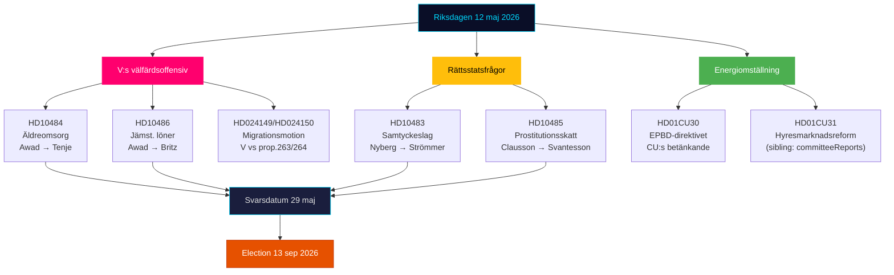

# Uitvoerende samenvatting — Riksdagen Realtime Pols 12 mei 2026

**Auteur**: James Pether Sörling | **Datum**: 2026-05-12 | **Werkproces**: news-realtime-monitor  
**Classificatie**: 🟢 PUBLIC | **Betrouwbaarheidsniveau**: HOOG [Admiralty B2]

## Conclusie — Kernboodschap

Dinsdag 12 mei 2026 wordt gekenmerkt door de drievoudige interpellatie-offensief van de Linkse Partij (V) tegen de regering over ouderenzorg, gelijke beloning en welzijn — een gecoördineerd pre-verkiezingssignaalblok gericht op het welzijnsdossier van de Tidö-coalitie. Tegelijkertijd worden drie constitutionele en sociaalbeleidsprocesessen geconsolideerd uit de dagelijkse commissierapporten (KU34, CU30, CU31). Samen illustreert 12 mei een oppositie die versnelt richting de verkiezingen van 13 september 2026.

## Kritieke inlichtingenpunten

**1. De drievoudige interpellatieoffensief van V** [HOGE RELEVANTIE]
- HD10484 (Nadja Awad → Anna Tenje / M): Wantoestanden in winstgerichte ouderenzorg — vier ministeriële vragen over toezicht, sancties, winstvereisten en personeelsvoorziening. Achtergrondgegevens: Socialstyrelsen voorspelt een behoefte van 50.000 nieuwe aanstellingen voor 2030; SVT/SR hebben herhaalde schandalen gedocumenteerd.
- HD10486 (Nadja Awad → Johan Britz / L): Gelijke beloning in de welzijnssector — V:s "vrouwenloonverhoging" (30 miljard SEK over 10 jaar) als partijapositionering; vijf ministeriële vragen over structurele loondiscriminatie.
- WEP: Er wordt geen ministeriële verklaring verwacht vóór de deadline van 29 mei die V een wezenlijke overwinning oplevert, maar de vragen creëren campagnemateriaal voor 13 september.

**2. Toestemmingswet: rechtsstaatsvraag (HD10483)** [GEMIDDELDE RELEVANTIE]
- Katja Nyberg (partijloos) → Gunnar Strömmer / M: Drie vragen over rechtsbeschermingsproblemen bij nalatige verkrachting geïdentificeerd door Brå.
- Analytisch signaal: Een onafhankelijk lid stelt rechtsbeschermingskritiek aan de orde die de eigen aanbevelingen van Brå weerspiegelt — het zwijgen van de regering creëert een potentieel verkiezingsnarratief over de onmacht van M om complexe juridische hervormingen te hanteren.

**3. Fiscale logica voor prostitutie (HD10485)** [LAAG-GEMIDDELDE RELEVANTIE]
- Ida Ekeroth Clausson (S) → Elisabeth Svantesson / M: Verbindt SOU 2025:119, de stemming van de Tidö-coalitie tegen het commissie-initiatief en de belasting van exitprogramma's.
- Analytisch signaal: S bouwt een conservatieve verkiezingsdimensie op voor kiezers die een anti-uitbuitingspositie combineren met budgettaire verantwoordelijkheid; Skatteverket steunt feitelijk een regelherziening.

**4. Energierichtlijn EPBD (HD01CU30)** [GEMIDDELDE RELEVANTIE]
- CU-rapport over de herziene EU-gebouwenrichtlijn en het nieuwe energieprestatie-doel.
- Politiek signaal: Implementatie van EPBD houdt verplichte upgradevereisten in voor oudere eigendommen — een sleutelconflict met CU31 (deregulering huurmarkt) en de klimaatimpasse. De vastgoedsector en huurders bevinden zich in het kruisvuur.

## Lezing in 60 seconden

- V drijft een drievoudige welzijnsoffensief tegen M en L; Minister van Sociale Zaken Tenje en Minister van Arbeid Britz staan onder druk met de antwoorddatum van 29 mei.
- De toestemmingsinterpellatie is een rechtsbeschermingssignaal aan onafhankelijke kiezers in het middensegment.
- Het EPBD-rapport verbindt het huurmarktdebat (CU31) met de energietransitie — potentiële coalitiesspanning M/L vs SD over kosten.
- Geen nieuwe KU34-signalen van SD vandaag; PIR-CONST-ABORT blijft open.

## Belangrijkste toekomstgerichte trigger

**29 mei 2026** — laatste antwoorddatum voor HD10484, HD10483, HD10485, HD10486. De ministeriële antwoorden bepalen of V:s welzijnsnarratief een wezenlijk tegennarratief krijgt of versterkt blijft als onbetwiste aanvalslinjes voor de verkiezingen.

## Dagpolitieke cartografie 12 mei 2026

<!-- source-sha: e87ab6b1e9a73ae1948c4e29ccf2380d69a15d92 -->
