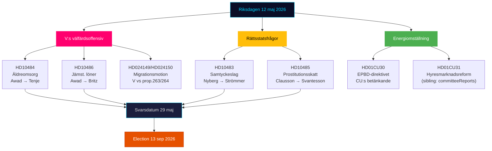

# Ledersammendrag — Riksdagen Sanntidspuls 12. mai 2026

**Forfatter**: James Pether Sörling | **Dato**: 2026-05-12 | **Arbeidsflyt**: news-realtime-monitor  
**Klassifisering**: 🟢 PUBLIC | **Konfidensnivå**: HØY [Admiralty B2]

## Konklusjon — Bunnlinje

Tirsdag 12. mai 2026 preges av Venstrepastiets (V) tredobbelte interpellasjonsoffensiv mot regjeringen om eldreomsorg, likelønn og velferd — et koordinert førvalgssignalblokk rettet mot Tidø-koalisjonens velferdsfasit. Simultant konsolideres tre konstitusjonelle og sosialpolitiske prosesser fra betenkningene (KU34, CU30, CU31). Samlet illustrerer 12. mai en opposisjon i akselerasjon mot valget 13. september 2026.

## Kritiske etterretningspunkter

**1. V:s tredobbelte interpellasjonsoffensiv** [HØY RELEVANS]
- HD10484 (Nadja Awad → Anna Tenje / M): Misforhold i profittdrevet eldreomsorg — fire ministerspørsmål om tilsyn, sanksjoner, overskuddskrav og personellforsyning. Bakgrunnsdata: Socialstyrelsen anslår 50 000 nyansatte er nødvendig innen 2030; SVT/SR har dokumentert gjentatte skandaler.
- HD10486 (Nadja Awad → Johan Britz / L): Likelønn i velferdssektoren — V:s "kvinnelønnsløft" (30 mrd. SEK over 10 år) som partiposisjonering; fem ministerspørsmål om strukturell lønndiskriminering.
- WEP: Ingen ministererklæring forventes innen fristen 29. mai som gir V en substansiell seier, men spørsmålene skaper kampanjemateriale frem mot 13. september.

**2. Samtykkesloven: rettsstatssspørsmål (HD10483)** [MIDDELS RELEVANS]
- Katja Nyberg (uavhengig) → Gunnar Strömmer / M: Tre spørsmål om rettssikkerhetsproblemer med uaktsom voldtekt identifisert av Brå.
- Analytisk signal: Et uavhengig stortingsmedlem retter rettssikkerhetskritikk som speiler Brå:s egne anbefalinger — regjeringens taushet skaper et potensielt valgnarrativ om M:s manglende evne til å håndtere komplekse rettsreformer.

**3. Skattelogikk for prostitusjon (HD10485)** [LAV-MIDDELS RELEVANS]
- Ida Ekeroth Clausson (S) → Elisabeth Svantesson / M: Kobler SOU 2025:119, Tidø-koalisjonens nedstemming av utvalgsinitiativet og exitprogrambeskaning.
- Analytisk signal: S bygger en konservativ valgkampanjedimensjon rettet mot velgere som kombinerer anti-utnyttingsposisjon med budsjettansvar; Skatteverket støtter faktisk en regelgjennomgang.

**4. Energidirektivet EPBD (HD01CU30)** [MIDDELS RELEVANS]
- CU:s betenkning om EUs reviderte bygningsdirektiv og nytt energieffektivitetsmål.
- Politisk signal: Implementering av EPBD innebærer obligatoriske oppgraderingskrav for eldre eiendommer — en nøkkelkonflikt med CU31 (liberalisering av leiemarkedet) og klimadødvannet. Eiendomsbransjen og leietakere befinner seg i kryssilden.

## 60-sekunders lesing

- V driver en tredobbelt velferdsoffensiv mot M og L; Sosialminister Tenje og Arbeidsmarkedsminister Britz er under press med svarsfrist 29. mai.
- Samtykke-interpellasjonen er et rettssikkerhetssignal til uavhengige velgere i midtsegmentet.
- EPBD-betenkingen binder leiemarkedsdebatten (CU31) sammen med energiomstillingen — potensiell koalitionsspanning M/L vs SD om kostnader.
- Ingen nye KU34-signaler fra SD i dag; PIR-CONST-ABORT forblir åpen.

## Viktigste fremtidige utløser

**29. mai 2026** — siste svarsfrist for HD10484, HD10483, HD10485, HD10486. Ministersvarene avgjør om V:s velferdsnarrativ får et substansielt motnarrativ eller forblir uimotsagte angrepslinjer frem mot valget.

## Dagspolitisk kartlegging 12. mai 2026

<!-- source-sha: e87ab6b1e9a73ae1948c4e29ccf2380d69a15d92 -->
