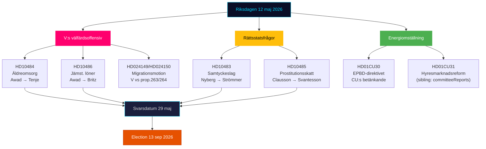

# Exekutiv sammanfattning — Riksdagen Realtidspuls 12 maj 2026

**Författare**: James Pether Sörling | **Datum**: 2026-05-12 | **Arbetsflöde**: news-realtime-monitor  
**Klassificering**: 🟢 PUBLIC | **Konfidensgrad**: HÖG [Admiralty B2]

## Slutsats — Viktigaste budskapet

Tisdagen den 12 maj 2026 präglas av Vänsterpartiets tredubbla interpellationsoffensiv mot regeringen inom äldreomsorg, jämställda löner och välfärd — ett koordinerat pre-valsignalblock riktat mot Tidökoalitionens välfärdsrekord. Simultant konsolideras tre konstitutionella och socialpolitiska processer från dagskiftande betänkanden (KU34, CU30, CU31). Sammantaget illustrerar 12 maj en opposition i acceleration mot valet 13 september 2026.

## Kritiska underrättelsepunkter

**1. V:s tredubbla interpellationsoffensiv** [HÖG RELEVANS]
- HD10484 (Nadja Awad → Anna Tenje / M): Missförhållanden i vinstdriven äldreomsorg — fyra ministerfrågor om tillsyn, sanktioner, vinstkrav, personalförsörjning. Bakgrundsdata: Socialstyrelsen prognostiserar 50 000 nyanställningar behövs till 2030; SVT/SR dokumenterat upprepade skandaler.
- HD10486 (Nadja Awad → Johan Britz / L): Jämställda löner i välfärden — V:s "kvinnolönelyft" (30 mdr SEK/10 år) som partipositionering; fem ministerfrågor om strukturell lönediskriminering.
- WEP: Inget ministerbesked förväntas inom deadlinen 29 maj som ger V substantiell seger, men frågorna skapar kampanjmaterial inför 13 september.

**2. Samtyckeslagen: rättsstatsfråga (HD10483)** [MEDEL RELEVANS]
- Katja Nyberg (partilös) → Gunnar Strömmer / M: Tre frågor om rättssäkerhetsproblem med oaktsam våldtäkt identifierade av Brå.
- Analytisk signal: En oberoende ledamot riktar rättssäkerhetskritik som speglar BRÅ:s egna rekommendationer — regeringens tystnad skapar ett potentiellt valnarrativ om M:s oförmåga att hantera komplexa rättsordningsreformer.

**3. Skattelogik för prostitution (HD10485)** [LÅG-MEDEL RELEVANS]
- Ida Ekeroth Clausson (S) → Elisabeth Svantesson / M: Kopplar SOU 2025:119, Tidökoalitionens röstning ned utskottsinitiativ, och exitprograms-beskattning.
- Analytisk signal: S bygger en konservativ valrörelse-dimension riktad mot väljare som kombinerar anti-exploateringsposition med budgetansvar; Skatteverket stöder faktiskt en regelöversyn.

**4. Energidirektivet EPBD (HD01CU30)** [MEDEL RELEVANS]
- CU:s betänkande om EU:s omarbetade byggnadersdirektiv och nytt energieffektivitetsmål.
- Politisk signal: Implementeringen av EPBD innebär obligatoriska uppgraderingskrav på äldre fastigheter — en nyckelkonflikt med CU31 (hyresmarknadsderegulering) och klimatdedlocket. Fastighetsbranschen och hyresgäster befinner sig i korseld.

## 60-sekundersläsning

- V driver en tredubbla välfärdsoffensiv mot M och L; Socialminister Tenje och Arbetsmarknadsminister Britz är under press med svarsdatum 29 maj.
- Samtyckes-interpellationen är en rättssäkerhetssignal till oberoende väljare i mittensegmentet.
- EPBD-betänkandet binder ihop hyresdebatt (CU31) med energiomställning — potentiell koalitionsspänning M/L vs SD om kostnader.
- Inga nya KU34-signaler från SD idag; PIR-CONST-ABORT förblir öppen.

## Viktigaste framåtblickande trigger

**29 maj 2026** — sista svarsdatum för HD10484, HD10483, HD10485, HD10486. Ministersvaren avgör om V:s välfärdsnarrativ får substantiell motberättelse eller lämnas stärka som oinfrågasatta attacklinjer inför valet.

## Dagspolitisk kartläggning 12 maj 2026

<!-- source-sha: e87ab6b1e9a73ae1948c4e29ccf2380d69a15d92 -->
