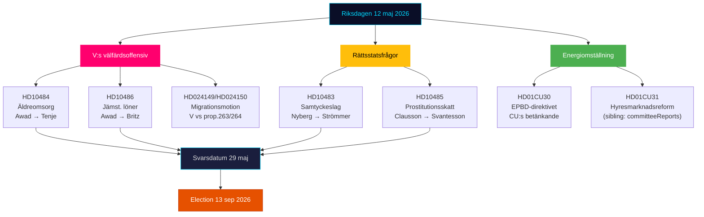

# 执行摘要 — 瑞典议会实时脉搏 2026年5月12日

**作者**：James Pether Sörling | **日期**：2026-05-12 | **工作流**：news-realtime-monitor  
**分类**：🟢 PUBLIC | **置信度**：高 [Admiralty B2]

## 结论 — 核心要点

2026年5月12日星期二的特点是左翼党（V）就老年人护理、同等工资和福利向政府发起三重质询攻势——这是一个协调一致的选前信号阻断，针对蒂德联合政府的福利记录。同时，来自当天委员会报告（KU34、CU30、CU31）的三个宪法和社会政策程序正在整合。总体而言，5月12日展示了一个正在加速迈向2026年9月13日选举的反对党。

## 关键情报要点

**1. V党的三重质询攻势** [高重要性]
- HD10484（Nadja Awad → Anna Tenje / M）：以营利为目的的老年人护理中的违规行为——关于监督、制裁、利润要求和人员供应的四个部长问题。背景数据：Socialstyrelsen预测2030年前需要新增50,000名员工；SVT/SR记录了反复发生的丑闻。
- HD10486（Nadja Awad → Johan Britz / L）：福利部门的同等工资——V党将"女性加薪"（10年内300亿瑞典克朗）作为党的定位；关于结构性工资歧视的五个部长问题。
- WEP：预计在5月29日截止日期前不会有部长声明给予V实质性胜利，但这些问题为9月13日之前创造了竞选材料。

**2. 同意法：法治国家问题 (HD10483)** [中等重要性]
- Katja Nyberg（无党派）→ Gunnar Strömmer / M：关于Brå识别的过失性强奸司法保障问题的三个问题。
- 分析信号：一名独立议员提出了反映Brå自身建议的司法保障批评——政府的沉默创造了一个关于M无法处理复杂法律改革的潜在选举叙事。

**3. 卖淫税务逻辑 (HD10485)** [低至中等重要性]
- Ida Ekeroth Clausson（S）→ Elisabeth Svantesson / M：将SOU 2025:119、蒂德联合政府对委员会倡议的投票以及退出项目征税联系起来。
- 分析信号：S正在为将反剥削立场与财政责任相结合的选民构建保守的选举运动维度；Skatteverket实际上支持规则审查。

**4. 能源指令EPBD (HD01CU30)** [中等重要性]
- CU关于欧盟修订建筑指令和新能源效率目标的委员会报告。
- 政治信号：EPBD的实施包含对旧建筑的强制升级要求——与CU31（租房市场放松管制）和气候僵局的关键冲突。房地产业和租户处于交叉火力中。

## 60秒摘要

- V对M和L发动三重福利攻势；社会大臣Tenje和劳动大臣Britz在5月29日回复截止日期前承受压力。
- 同意质询是向中间选民群体中的独立选民发出的司法保障信号。
- EPBD委员会报告将租房市场辩论（CU31）与能源转型联系起来——M/L对SD在成本上的潜在联盟紧张。
- 今日SD没有新的KU34信号；PIR-CONST-ABORT保持开放。

## 最重要的前瞻触发因素

**2026年5月29日** — HD10484、HD10483、HD10485、HD10486的最终回复日期。部长回复将决定V的福利叙事是否得到实质性的反驳，还是在选举前作为未受反驳的攻击线得到强化。

## 2026年5月12日政治格局

<!-- source-sha: e87ab6b1e9a73ae1948c4e29ccf2380d69a15d92 -->
