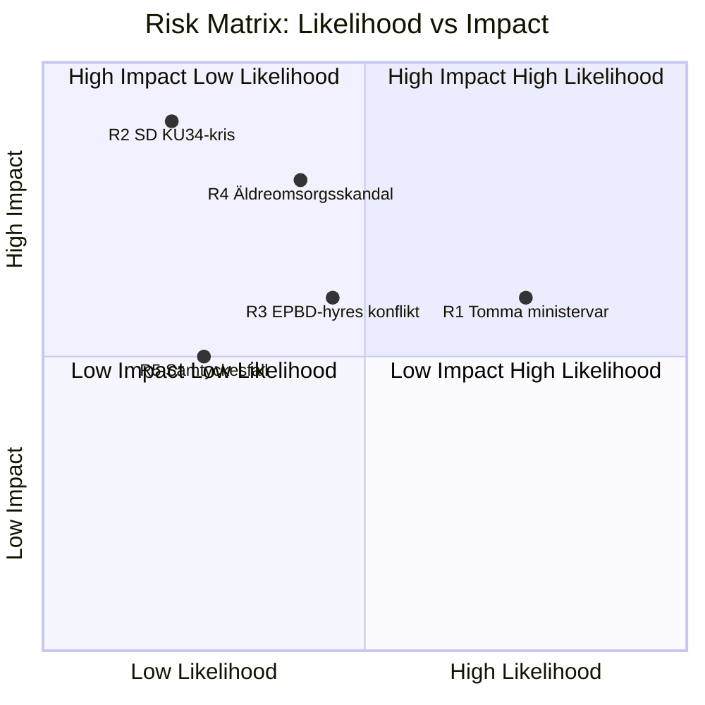

# Risk Assessment — Realtime Pulse 2026-05-12

**Author**: James Pether Sörling | **Date**: 2026-05-12

## 5-Dimension Risk Register

| # | Risk | Dimension | Likelihood (L) | Impact (I) | L×I | Cascade |
|---|------|-----------|---------------|------------|-----|---------|
| R1 | Ministersvaren 29 maj erbjuder inga substantiella åtgärder → V:s narrativ befästs | Political | HIGH (0.75) | MEDIUM (0.6) | 0.45 | → Election result +1–2% V |
| R2 | SD avviker på KU34 aborträtten → koalitionskris | Constitutional | LOW-MED (0.2) | HIGH (0.9) | 0.18 | → Potentiell valrörelsekonvulsion |
| R3 | EPBD:s fastighetsrenoverings krav överväldigar hyresgäster i kombination med CU31 hyresreform | Social-Economic | MEDIUM (0.45) | MEDIUM (0.6) | 0.27 | → Boendekostnadskris; S kampanjmaterial |
| R4 | Äldreomsorgsscandaler eskalerar (ny SR/SVT-granskning) under valrörelsen | Reputational | MEDIUM (0.4) | HIGH (0.8) | 0.32 | → Tenje personlig ryktesskada; M valdagsminskning |
| R5 | Samtyckeslagens oaktsam-våldtäkt-fall med uppmärksamhet → rättsosäkerhetsnarratv dominerar | Legal-Political | LOW (0.25) | MEDIUM (0.5) | 0.13 | → M/SD rättsstatskritik från oberoende väljare |

## Risk Matrix Mermaid

## Cascading Risk Chains

**Chain A** (R1 → R4 synergy): Om ministern Tenje svarar tomt på HD10484 (svarsdatum 29 maj) OCH det uppstår en ny äldreomsorgs-skandal i maj-juni 2026, förstärks narrativet exponentiellt — medieeffekt multiplicerat, snarare än adderat.

**Chain B** (R2 → Election): SD:s avvikelse på KU34 är ett low-probability/high-impact scenario. Om det inträffar aktiveras ett extraordinary electoral outcome-scenario: valrörelsen domineras av abort/grundlagsfrågan istället för migration/ekonomi.

**Chain C** (R3 feedback): EPBD + CU31 kostnadspush → hyreshöjningar → S "Tidöregeringen höjer dina boendekostnader" kampanjlinje → LO/kommunalarbetarnas fackliga mobilisering (synergy med R1 via HD10486 lönefråga).

## Posterior Probability Estimates (Bayesian Context)

**Prior from sibling analyses**: Propositions-analysen uppskattar 85% WEP för KU34-passage med koalition. Uppdatering med 0 nya SD-signaler den 12 maj → posterior oförändrad 85% men konfidensintervall vidgas (mer tid utan signal = mer osäkerhet om SD:s process).

**IMF Economic Context** (WEO Apr-2026, vintage age: 1 månad):
- Sverige BNP-tillväxt 2026E: +1.8% (stabil, ej recessionsrisk)
- Koalitionens ekonomiska rekord är stabilt — R1–R4 är politiska, inte ekonomiska risker
- Ingen makroekonomisk risk identifierad från dagens dokument
