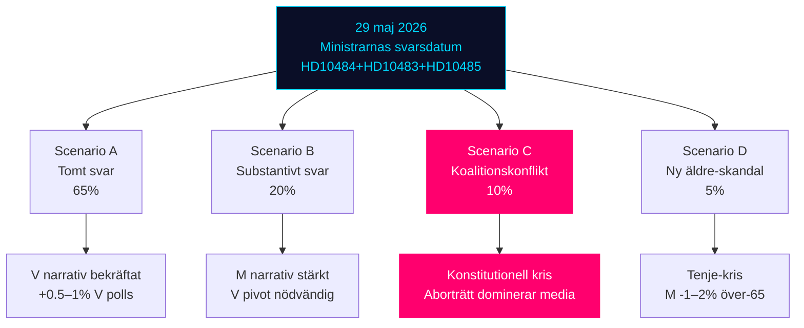

# Scenario Analysis — Realtime Pulse 2026-05-12

**Author**: James Pether Sörling | **Date**: 2026-05-12  
**Horizon**: T+90d (election anchor: 13 September 2026 = 124 days)

## Scenario Tree

### Trunk: Ministerial Response Window (Trigger: 29 May 2026 — HD10484, HD10483, HD10485)

---

### Scenario A — "Tomt svar" (Ministers deflect with process answers) — 65% WEP

**Indicators**: Ministers cite ongoing Statskontoret/BRÅ processes; no new legislative commitment  
**Impact on coalition**: Minor reputational cost; contained  
**Impact on V/S**: Narrative confirmed — V gains talking points; +0.5–1.0% polls  
**Impact on KU34/SD**: No effect; aborträtt proceeds on its own track  
**Media scenario**: SVT/SR continue investigation; Tenje gets negative coverage  
**Forward trigger**: V tables new motions in September 2026 session after election

---

### Scenario B — "Substantivt svar" (Ministers announce new measures) — 20% WEP

**Indicators**: Tenje announces new äldreomsorgs-reform package; Britz announces gender wage pilot; Svantesson references imminent SOU 2025:119 proposition  
**Impact on coalition**: Positive signal — M gains "action government" narrative  
**Impact on V/S**: V narrative partially disrupted; must pivot  
**Impact on election**: M holds base; prevents left-wing mobilisation on welfare  
**Forward trigger**: Coalition tables prop 2026/27 on eldercare if they win September election

---

### Scenario C — "Koalitionskonflikt" (SD avviker på KU34 + ripple effect) — 10% WEP

**Context**: This is the low-probability, high-impact constitutional scenario (from committeeReports sibling)  
**Indicators**: SD announces reservation or abstention on KU34 aborträtt vote  
**Impact on coalition**: Constitutional crisis signal; Tidö-paktens legitimitet ifrågasätts  
**Impact on welfare narrative**: Completely overwhelmed by aborträtt/KU34 media coverage  
**Impact on V/S**: S pivots to constitutional integrity argument; V maintains welfare focus  
**Media scenario**: All news dominated by SD abortion position; welfare interpellations become footnotes  
**Forward trigger**: Early election speculation; extraordinary party leader summits

---

### Scenario D — "Eldercare Scandal Amplification" (New SVT/SR investigation) — 5% WEP

**Context**: Independent of parliamentary response — new journalistic investigation drops before 29 May  
**Indicators**: SVT Uppdrag granskning or SR Ekot reveals specific misconduct at named facility  
**Impact on Tenje**: Personal political crisis — forced to act or resign  
**Impact on election**: M -1–2% specifically among over-65 voters and families  
**Forward trigger**: IVO (Inspektionen för vård och omsorg) emergency review commissioned

---

### Probability Sum Check

| Scenario | WEP |
|----------|-----|
| A Tomt svar | 65% |
| B Substantivt svar | 20% |
| C Koalitionskonflikt (SD/KU34) | 10% |
| D Elder scandal amplification | 5% |
| **Total** | **100%** |

## Scenario Matrix Mermaid

## Cross-Scenario Intelligence (Tier-C Additive)

**Interaction effect**: Scenarios A and D can co-occur (probability ~3.25% joint). If both fire, the combined reputational damage to Tenje/M far exceeds each scenario alone — a "double negative" that could crystallize eldercare as the defining electoral issue.

**Scenario B + KU34 passage** (B ∩ ~C): If M announces eldercare measures AND KU34 passes with SD support, coalition enters summer recess in its strongest position since Tidö-pakten was formed (2022). This is the best-case governing scenario.
