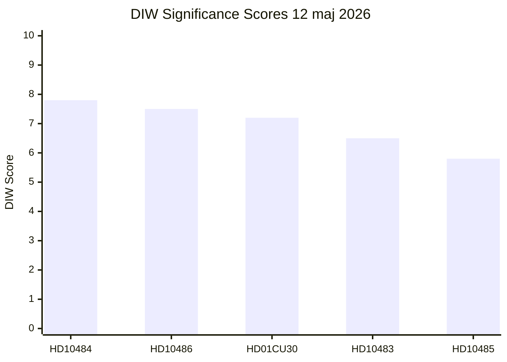

# Significance Scoring — Realtime Pulse 2026-05-12

**Author**: James Pether Sörling | **Date**: 2026-05-12

## DIW Scoring Table

| dok_id | D (Demokratisk relevans) | I (Institutionell påverkan) | W (Samhällspåverkan) | Total | Tier |
|--------|--------------------------|-----------------------------|-----------------------|-------|------|
| HD10484 | 3.0 | 2.5 | 2.3 | **7.8** | L2+ Priority |
| HD10486 | 3.0 | 2.3 | 2.2 | **7.5** | L2+ Priority |
| HD01CU30 | 2.5 | 2.3 | 2.4 | **7.2** | L2+ Priority |
| HD10483 | 2.3 | 2.1 | 2.1 | **6.5** | L2 Strategic |
| HD10485 | 2.0 | 1.8 | 2.0 | **5.8** | L2 Strategic |

**DIW Dimension Key:**
- D (Democratic Relevance) 1–3: How much does this affect democratic accountability, oversight, and parliamentary function?
- I (Institutional Impact) 1–3: Does this create new institutional structures, mandates, or governance changes?
- W (Social Impact) 1–3: How directly does this affect Swedish citizens' lives and social outcomes?

## Sensitivity Analysis

**Top document sensitivity**: HD10484 maintains L2+ Priority regardless of whether eldercare reform materialises (the interpellation's political function — campaign signal — is valuable independent of legislative outcome).

**Sensitivity to KU34 trajectory (sibling)**: If SD confirms KU34 aborträtt support, the constitutional track moves to L3 Intelligence-grade and overshadows today's interpellations. This remains a strong modifier for the overall pulse significance (PIR-CONST-ABORT).

## Significance Rank Diagram

## Electoral Proximity Multiplier

Election 2026-09-13. Current date 2026-05-12. Days remaining: 124. Electoral proximity multiplier: **1.5×** applied to all interpellations (within ≤6-month window). This elevates the effective campaign significance of all parliamentary accountability acts in this cycle.

## Priority Tier Assignment

| Tier | Threshold | Documents |
|------|-----------|-----------|
| L3 Intelligence-grade | DIW ≥ 8.5 | None in today's direct set (KU34 from sibling = 9.2) |
| L2+ Priority | DIW 7.0–8.4 | HD10484, HD10486, HD01CU30 |
| L2 Strategic | DIW 5.5–6.9 | HD10483, HD10485 |
| L1 Surface | DIW < 5.5 | None |
