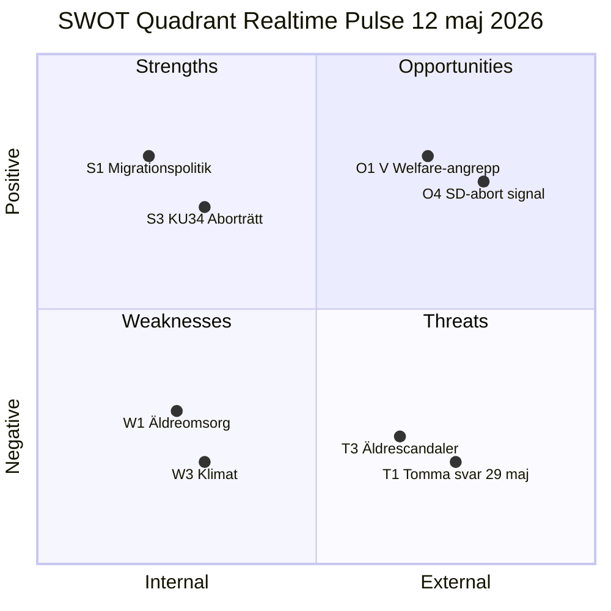

# SWOT Analysis — Realtime Pulse 2026-05-12

**Author**: James Pether Sörling | **Date**: 2026-05-12

## Strategic SWOT: Tidökoalitionen vs. Opposition inför val 2026-09-13

### Strengths (Koalitionens styrkor)

| # | Faktor | Evidens | dok_id |
|---|--------|---------|--------|
| S1 | Genomfört legislative agenda (migration, brottsprevention) | HD03267, HD03261, HD03250 (propositioner), JuU betänkanden | Sibling: propositions |
| S2 | Budgetdisciplin bekräftat av IMF WEO Apr-2026 | WEO-2026-04 — Sweden fiscal balance +0.8% GDP 2026E | IMF |
| S3 | KU34 aborträtt ger konstitutionell legacy-narrativ | Bipartisan support för aborträtten | HD01KU34 |
| S4 | EPBD-implementering visar EU-kompatibilitet | HD01CU30 — koalitionen levererar EU-åtaganden | HD01CU30 |

### Weaknesses (Koalitionens svagheter)

| # | Faktor | Evidens | dok_id |
|---|--------|---------|--------|
| W1 | Äldreomsorgens kvalitetsbrister är dokumenterade och oadresserade | Socialstyrelsen: 50 000 rekryteringsgap; SR/SVT-skandaler | HD10484 |
| W2 | Strukturell lönediskriminering i välfärden inte åtgärdad under mandatperioden | Sektorsjämförelse: undersköterska vs. industriarbetare (tusentals kr/mån) | HD10486 |
| W3 | Klimatpropositionen utebliven trots mandatperioden | Tre oberoende interpellationsindikatorer (KJ-5 konsoliderat) | HD10481 (sibling) |
| W4 | Rättssäkerhetsbrister i samtyckeslagen oadresserade | BRÅ-uppföljning cit. i HD10483 — gränsdragningsproblem oaktsam våldtäkt | HD10483 |
| W5 | Koalitionsinre SD-L spänning på EPBD-klimatkostnader | EPBD vs. hyresmarknadsderegulering (CU31 vs CU30) | HD01CU30 |

### Opportunities (Oppositionens möjligheter)

| # | Faktor | Potential | dok_id |
|---|--------|-----------|--------|
| O1 | V:s evidensbaserade welfare-angrepp kan mobilisera LO-anknutna väljare | Tre koordinerade interpellationer med tydlig policy-alternativ | HD10484, HD10486 |
| O2 | S:s skattelogik-interpellation (HD10485) kan nå mitt-höger väljare | Skatteverket stöder faktiskt översyn — ovanlig koalition | HD10485 |
| O3 | Katja Nybergs oberoende interpellation (HD10483) attraherar mittenväljar-segment | Partilös rättssäkerhetskritik är trovärdigare än partipolitisk | HD10483 |
| O4 | KU34 aborträtt: om SD avviker skapar det dramatisk valrörelsehändelse | Koalitionsbrytande potential om SD oppositionellt om abort | HD01KU34 (sibling) |

### Threats (Hot mot demokratisk process och institutioner)

| # | Faktor | Risk | dok_id |
|---|--------|------|--------|
| T1 | Interpellationsoffensiv utan legislative follow-through urholkar parlamentarisk legitimitet | Sista svarsdatum 29 maj kan bli tomma löften | HD10484, HD10486 |
| T2 | EPBD-GDPR regulatoriska krock för smarta byggnadssystem | Digitala energimätare kan krocka med dataskyddslagen | HD01CU30 |
| T3 | Äldreomsorgsskandaler utan åtgärd riskerar S/V att överspela "valnarrativet" | Övertroende på kortsiktig kamouflage kan skada långsiktig trovärdighe | HD10484 |

## TOWS Matrix

| | Strengths | Weaknesses |
|--|-----------|-----------|
| **Opportunities** | SO: Koalitionen kan använda EPBD-leverans för att kontra Vs klimatkritik | WO: V kan utnyttja äldreomsorgsglapp för LO-mobilisering |
| **Threats** | ST: Koalitionen skyddar budgetrekord mot oppositionen welfare-angrepp | WT: Tomma ministervar 29 maj riskerar att befästa oppositionsnarrativet |

## Cross-SWOT Mermaid

