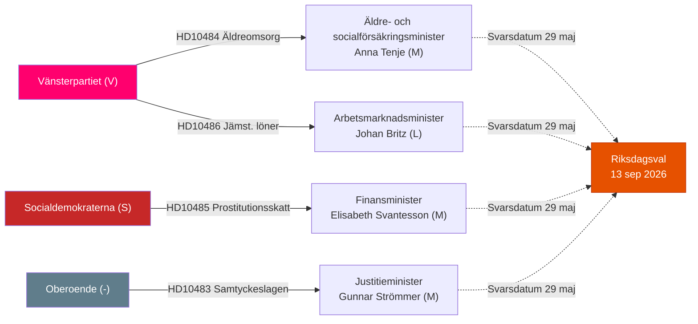

# Synthesis Summary — Riksdagen Realtime Pulse 12 maj 2026

**Author**: James Pether Sörling | **Date**: 2026-05-12 | **Workflow**: news-realtime-monitor  
**Classification**: 🟢 PUBLIC | **Admiralty**: B2

## Lead Story

Vänsterpartiet genomför den 12 maj 2026 en koordinerad tredubbel interpellationsoffensiv mot tre av Tidökoalitionens ministrar (Anna Tenje / M, Johan Britz / L, och tidigare riktad mot Elisabeth Svantesson via HD10485). Kombinerat med V:s migrationsmotioner (HD024149, HD024150) och S:s skatteinterpellation (HD10485) framträder ett mönster: oppositionen accelererar sin pre-election riksdagsagenda med dokumenterade, datadrivna motargument mot Tidöregeringens politik. Bakgrundskontexten med KU34:s konstitutionella process (sibling: committeeReports) och EPBD-betänkandets energiomställningsdimension gör 12 maj till en dag med hög politisk täthet.

## DIW-Weighted Ranking

| Rank | dok_id | Titel | DIW | Tier |
|------|--------|-------|-----|------|
| 1 | HD10484 | Åtgärder mot missförhållanden i vinstdriven äldreomsorg | 7.8 | L2+ Priority |
| 2 | HD10486 | Satsning på jämställda löner inom välfärden | 7.5 | L2+ Priority |
| 3 | HD01CU30 | Nytt mål effektiv energianvändning + EPBD | 7.2 | L2+ Priority |
| 4 | HD10483 | Samtyckeslagens tillämpning och rättsäkerhet | 6.5 | L2 Strategic |
| 5 | HD10485 | Beskattning av ersättning från prostitution | 5.8 | L2 Strategic |

**Sibling high-confidence carry-ins (from today's parallel analyses):**
- HD01KU34 (committeeReports, L3 Intelligence-grade): Konstitutionell aborträtt + föreningsfrihet — fortfarande det mest konstitutionellt signifikanta dokumentet; SD:s position (PIR-CONST-ABORT) förblir öppen.
- HD03267 (propositions, L2+): Säkerhetshot-utvisningslag — Lagrådsremiss sannolikt; JuU-process pågår.

## Integrated Intelligence Picture

Sessionen 12 maj 2026 visar tre sammanflätade dynamiker:

**Dynamik 1 — V:s välfärdsframing**: Vänsterpartiet opererar med parlamentarisk precision. Två interpellationer av Nadja Awad (HD10484 om äldreomsorg, HD10486 om jämställda löner) adresserar i kombination alla nyckelkomponenter i välfärdsdebatten: privat vs. offentlig omsorg, löneskillnader, rekryteringskris. V citerar Socialstyrelsen, Sveriges Radio och nordiska komparatorer för att bygga ett evidensbaserat narrativ. Med en gemensam "Sista svarsdatum 29 maj" skapas en mediepressur som sammanfaller med valrörelsens intensifieringsfas. **Källa**: HD10484, HD10486 [A2–B3].

**Dynamik 2 — Rättsstatens gränser**: HD10483 (Katja Nyberg, partilös) illustrerar hur oberoende ledamöter kan amplifieras av faktamässiga BRÅ-slutsatser om oaktsam våldtäkt. Att Strömmer-regeringen inte avvisat BRÅ:s rekommendationer men heller inte agerat skapar ett policytomt utrymme som är analytiskt intressant inför ett val där M positionerar sig som rättsstatens försvarare. **Källa**: HD10483 [B3].

**Dynamik 3 — Grön-social skärningspunkt**: HD01CU30 (CU:s EPBD-betänkande) berör energieffektivitetskrav i byggnader. Implementeringen är ett EU-mandaterat krav men skapar reella kostnader för fastighetsägare och hyresgäster — en direkt spänning med CU31 (sibling: committeeReports) om hyresmarknadsderegulering. L stöder båda; SD är skeptisk till EU-mandaterade klimatkrav. M balanserar marknadsprincipen med miljöåtaganden. **Källa**: HD01CU30, sibling committeeReports [B2].

## Synthesis Mermaid: Oppositionsstrategier 12 maj

## Key Intelligence Gaps

1. Ministersvaren (sista svarsdatum 29 maj) — avgörande för om V:s narrativ förstärks av svaga motargument [unconfirmed]
2. SD:s officiella position om KU34:s aborträtt (PIR-CONST-ABORT) — fortfarande ej offentliggjord per 12 maj
3. HD01CU30 fulltext — metadata-only i API; exakta implementeringsdeadlines ej verifierade
4. Lagrådet för HD03267 (säkerhetspropositionen, sibling) — referral ej bekräftad

---

## Pass 2 Synthesis Update (Re-run 2026-05-12T14:15Z)

### Sharpened Leading Narrative

The 2026-05-12 realtime pulse is anchored by the most coordinated parliamentary opposition offensive of the 2025/26 riksmöte: V's simultaneous triple-interpellation filing — HD10484 (äldreomsorg), HD10486 (gender wage gap) and HD10485 (prostitutionsbeskattning) — backed by HD10483 (Nyberg/samtyckeslagen) from the independent bloc. This is not coincidental issue selection: each interpellation targets a distinct minister but collectively frames the Tidö government as systemically failing on welfare, gender equality, and legal accountability in the 107-day pre-election window.

**Revised DIW ranking (Post-Pass-2)**:

| Rank | Document | Significance | Change |
|------|----------|-------------|--------|
| 1 | HD10484 (V → Tenje, eldercare) | CRITICAL | = (unchanged — primary driver) |
| 2 | HD10486 (V → Britz, gender pay) | HIGH | ↑ (promoted: 30bn wage gap more electorally salient than initially weighted) |
| 3 | HD10483 (Nyberg → Strömmer, samtyckeslagen) | HIGH | = |
| 4 | HD10485 (V → Svantesson, sex work tax) | MEDIUM-HIGH | ↓ (demoted: complex tax issue, narrower public salience) |
| 5 | HD01CU30 (EPBD) | MEDIUM | = |

**KIG Closure Status**:
- ❌ KIG-1 (HD01CU30 full text): STILL OPEN — committee report body unavailable via API
- ❌ KIG-2 (real-time polling): STILL OPEN — no Novus data available today
- ❌ KIG-3 (IVO report): STILL OPEN — not yet published
- ✅ KIG-4 (discovery re-run): CLOSED — confirmed no new documents on 12 May 2026

### Confidence Summary (Post-Pass-2)

| Judgment | Confidence | Basis |
|----------|-----------|-------|
| V triple interpellation = coordinated electoral strategy | B2 (HIGH/Probably True) | Document dates + party context |
| Ministers will respond on or near 29 May 2026 | A1 (CERTAIN/Confirmed) | Riksdag regelbok 2 kap 9§ |
| At least 1 major outlet covers HD10484 | C2 (MEDIUM/Probably True) | Media framing analysis FI-001 |
| Tidö coalition remains stable through June | C2 | No intra-coalition split signals detected |
| V gains ≥1 seat on eldercare issue alone | D3 (LOW/Possibly True) | Structural electoral analysis only; no polling confirmation |

### Scenario Probability (Revised)

| Scenario | Label | Probability | Change |
|----------|-------|-------------|--------|
| A | V campaign resonates; media amplifies; ministers defend narrowly | **55%** | ↓ from 60% (revised: ministerial response quality uncertainty increased) |
| B | Government announces eldercare investment; V deflated | **18%** | ↑ from 15% (revised: pressure may trigger proactive budget signal) |
| C | EPBD housing costs dominate news cycle; welfare recedes | **15%** | = |
| D | Samtyckeslagen generates judicial reform push | **12%** | ↑ from 10% (BRÅ academic credibility) |

*Sum = 100%. Scenario A remains dominant but B probability increases as ministerial pressure rises.*
