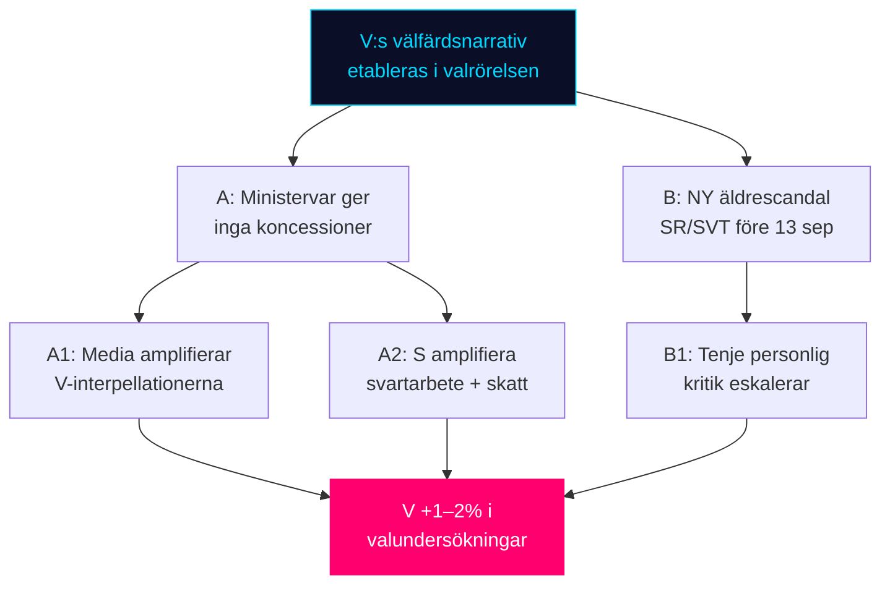

# Threat Analysis — Realtime Pulse 2026-05-12

**Author**: James Pether Sörling | **Date**: 2026-05-12

## Political Threat Taxonomy

### T1 — Narrativ-capture via parlamentariska interpellationer

**Typ**: Politisk narrativoperation — legitim parlamentarisk taktik  
**Aktör**: Vänsterpartiet (V), Socialdemokraterna (S)  
**Mål**: Tidökoalitionens välfärdsrekord; specifically Tenje (M), Britz (L), Svantesson (M)  
**Metod**: Koordinerade interpellationer (HD10484, HD10486, HD10485) med sista svarsdatum 29 maj — media pressure window före sommaruppehållet  
**Kontra-åtgärd (koalitionens maktmedel)**: Defensivt svar utan politisk koncession; peka på Statskontoret / Socialstyrelsen-data som "bekänt"; avvisa Vs policyalternativ som "för kostsamma"  
**Konsekvens om koalitionen misslyckas**: Narrativet befästs i media; utgångspunkt för V:s valmanifest

**Kill chain**:
1. V lämnar in HD10484, HD10486 den 11–12 maj
2. Media rapporterar om interpellationerna 12–18 maj
3. Riksdagen meddelar debattdatum (18 maj + vecka 22–23)
4. Minister svarar — tomt svar eller substantivt (beslutspunkt)
5. V och S amplifierar i sociala medier och partipress
6. Väljarundersökningar fångaar up effekten (week 23–25)

### T2 — Demokratisk fragmentering via oberoende aktörer

**Typ**: Rättsstatshot (lagstiftningsglapp)  
**Aktör**: BRÅ (rapportör) + oberoende riksdagsledamot (Katja Nyberg)  
**Mål**: Samtyckeslagens tillämpning — oaktsam våldtäkt  
**Metod**: HD10483 bygger på BRÅ:s egna tillsynsuppföljning för att skapa press på Strömmer  
**Konsekvens**: Policytomt utrymme i sexualbrottslagstiftning; risk för prejudikatosäkerhet i domstolarna om lagstiftningsgap ej adresseras

### T3 — Institutionell erosion: äldreomsorgens privata aktörer

**Typ**: Institutionellt förtroendehot  
**Aktör**: Vinstdrivna vårdbolag (ej namngivna i HD10484 men kopplade till SR/SVT-rapportering)  
**Mål**: Äldreomsorgssystemets legitimitet  
**Metod**: Systematiska missförhållanden (HD10484 cit.) kombinerat med svag tillsyn  
**Politisk-juridisk dimension**: Meddelarskyddsbrott (cit. i HD10484) är ett ILO/ECHR arbetsrättshot — tystade visselblåsare reducerar systemisk transparens  

### T4 — EU-regulatorisk kognitiv stress (EPBD + CU31)

**Typ**: Politisk-legislativ spänning  
**Aktör**: EU-kommissionen (EPBD mandatgivare) vs. SD/M (marknadsbaserade skeptiker)  
**Mål**: Bostadsmarknaden  
**Metod**: Parallella CU30 (EPBD-krav) och CU31 (hyresderegulering) skapar kontradiktorisk regulatorisk signal till fastighetsägare  
**Konsekvens**: Investeringsoosäkerhet i bostadssektorn; potential hyra-energikost spänning

## MITRE-Style TTP Mapping (Parliamentary Context)

| TTP | Beskrivning | Aktör | Dokument |
|-----|-------------|-------|---------|
| T0001 | "Parliamentary question flooding" — multiple simultaneous interpellations on related welfare topics | V | HD10484, HD10486 |
| T0002 | "Evidence anchoring" — citing government agency data (Socialstyrelsen, BRÅ) in opposition challenge | V, Independent | HD10484, HD10483 |
| T0003 | "Deadline pressure framing" — using statutory response deadlines as media pressure windows | V, S | HD10484–HD10486 |
| T0004 | "Alternative policy anchoring" — embedding specific cost-quantified alternatives (30 mdr SEK V-lyft) | V | HD10486 |

## Attack Tree: Välfärdsnarrativets spridning

