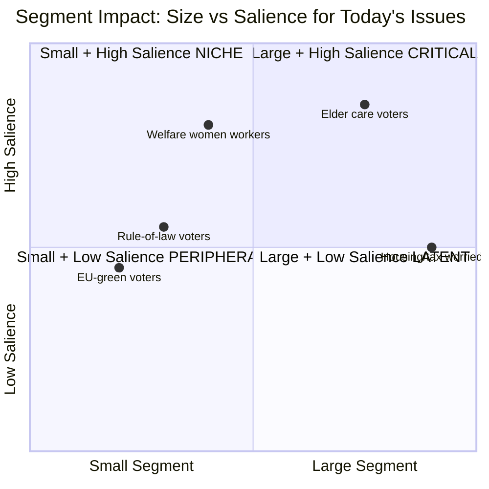

# Voter Segmentation — Realtime Pulse 2026-05-12

**Author**: James Pether Sörling | **Date**: 2026-05-12

## Demographic Segments Affected by Today's Documents

### Segment 1: Äldreomsorgsberörda (HD10484)

**Definition**: Adults with a close relative in elder care, or aged 65+ themselves  
**Estimated size**: 1.5–2 million adults (ca. 20–25% of electorate)  
**Party alignment (2022)**: Mixed — M 22%, SD 18%, S 30%, KD 12%  
**Issue salience**: VERY HIGH — direct personal connection  
**Response to today's news**: Will follow HD10484 closely; Tenje's response will be scrutinised  
**V/S electoral opportunity**: Moderate — these voters are cross-partisan but responsive to "systemet sviker oss" framing  
**Turnout effect**: HIGH (older voters have highest turnout; +2% mobilisation potential if eldercare is salient)

### Segment 2: Välfärdssektor-anställda kvinnor (HD10486)

**Definition**: Women employed in healthcare, eldercare, social services  
**Estimated size**: 700,000–800,000 workers (mostly Kommunal members)  
**Party alignment (2022)**: S 45%, V 12%, M 10%, C 7%  
**Issue salience**: VERY HIGH — directly affects wages  
**Response to today's news**: HD10486's 30 mdr SEK framing resonates — they know the wage gap personally  
**V/S electoral opportunity**: HIGH — this is V's core constituency  
**Turnout effect**: MEDIUM-HIGH (labour-organised, high turnout; potential +1% V)

### Segment 3: Rättsstatsfokuserade väljare (HD10483)

**Definition**: Voters who prioritise rule of law, legal certainty, judicial quality  
**Estimated size**: 800,000–1 million adults  
**Party alignment (2022)**: M 28%, L 18%, C 12%, S 15%  
**Issue salience**: MEDIUM — cares about samtyckeslagens tillämpning as systemic concern  
**Response to today's news**: HD10483 from an independent MP has cross-partisan credibility  
**L/M challenge**: Both government parties own Strömmer's response — must demonstrate legal credibility  
**Turnout effect**: LOW (engaged voters, but not usually single-issue)

### Segment 4: EU-positiva gröna väljare (HD01CU30)

**Definition**: Pro-EU, environmentally concerned voters  
**Estimated size**: 400,000–500,000 (MP core + green C/L leaners)  
**Party alignment (2022)**: MP 55%, C 15%, L 10%, V 10%  
**Issue salience**: MEDIUM — EPBD is positive EU compliance news for this segment  
**Response to today's news**: CU30 adoption is a positive signal — Sweden on track with EU Green Deal  
**MP opportunity**: SMALL — issue is technical; not emotionally resonant enough to mobilise waverers  
**Turnout effect**: LOW

### Segment 5: Skattebetalare och boendekostnads-oroade (HD10485 + HD01CU30)

**Definition**: Middle-income voters concerned about housing costs and tax equity  
**Estimated size**: 2–3 million adults (broad middle class)  
**Party alignment (2022)**: M 25%, C 15%, S 22%, SD 15%  
**Issue salience**: HIGH for housing costs; MEDIUM for prostitution tax policy  
**Response to today's news**: HD10485 is a niche issue for this segment; EPBD cost implications matter more  
**S opportunity**: MODERATE — SOU 2025:119 process creates expectation of future tax clarity  
**SD opportunity**: MODERATE — EPBD "EU cost mandate" framing could mobilise anti-EU-regulation sentiment

## Cross-Segment Electoral Map

## Segment-Weighted Electoral Impact Summary

**Today's highest-priority segments** (>50% issue salience + >500k voters):
1. Äldreomsorgsberörda (1.5–2M, VERY HIGH) — HD10484 direct hit
2. Välfärdssektor-anställda kvinnor (700k, VERY HIGH) — HD10486 direct hit
3. Housing/tax worried (2–3M, HIGH for housing) — indirect via EPBD+CU31 cost pressure

**Combined mobilisation potential**: If eldercare + gender wage + housing costs all stay salient through September 2026, V+S bloc could gain 3–5 seats from current baseline. This is the "welfare wave" electoral scenario underpinning Scenario B in scenario-analysis.md.
