## What Happened
<!-- source: executive-brief.md :: https://github.com/Hack23/riksdagsmonitor/blob/main/analysis/daily/2026-05-13/committeeReports/executive-brief.md -->

**BLUF**: On 12 May 2026, Sweden's Riksdag received two betänkanden of high political significance: Betänkande 2025/26:NU21 on comprehensive rural policy (prop. 2025/26:158) and Betänkande 2025/26:CU30 on a new energy efficiency goal replacing the 2030 quantitative target (prop. 2025/26:159). Both reports reveal a governing bloc (M, SD, KD, L) advancing its pre-election legislative programme against sustained opposition (S, V, C, MP) that files multi-point reservations but lacks the parliamentary arithmetic to block the proposals. The energy report is especially consequential: Sweden is abandoning a 50% quantitative energy efficiency target in favour of a qualitative goal that explicitly accommodates nuclear expansion and electrification — a seismic shift in energy governance ahead of the September 2026 election.

### Key Decisions Supported

1. **Vote on HD01NU21**: Riksdag likely to adopt with reservation from S, V, C, MP — governing coalition has majority
2. **Vote on HD01CU30**: New qualitative energy efficiency goal will pass; sharp S/V/MP opposition signals strong campaign issue
3. **September 2026 election dynamics**: Rural policy and energy transition are both top-tier mobilisation issues for all major parties

### 60-Second Intelligence Bullets

- **HD01NU21** implements law change to Lagen om regionalt utvecklingsansvar (2010:630): regions must consult civil society organisations and private higher education providers; Lagrådet approved without objections; effective date TBC
- **HD01CU30** replaces Sweden's 50% energy-efficiency-by-2030 target with a qualitative goal emphasising flexibility, affordability, electrification and nuclear accommodation; implements EU EPBD recast directive via amendments to Lagen (2006:985) om energideklaration för byggnader and Plan- och bygglagen (2010:900)
- **Opposition bloc** (S, V, MP) filed 12 reservations across NU21; 5 reservations across CU30 — high reservation density signals deep programmatic disagreement
- **Pre-election multiplier active** (≤ 6 months to September 2026): DIW scores escalated by 1.5×; both reports are L2+ Priority tier
- **Andreas Lennkvist Manriquez (V)** chairs CU while voting against the government's energy goal — institutionally paradoxical signal; committee proceeding is formally valid under parliamentary rules

### Top Forward Trigger

**CU30 voting day** (~late May 2026): If SD, M, KD, L maintain coalition discipline, the qualitative energy goal passes — but if any party defects (particularly KD or L under nuclear-framing pressure), a procedural delay is possible. Monitor party whips.

### Confidence Assessment

**HIGH [B2]** — based on primary Riksdag documents (dok_id HD01NU21, HD01CU30), direct quote from committee text, known parliamentary seat distribution (Tidökoalitionen majority), Lagrådet yttrande (no objections on NU21), and IMF WEO Apr-2026 macroeconomic context.

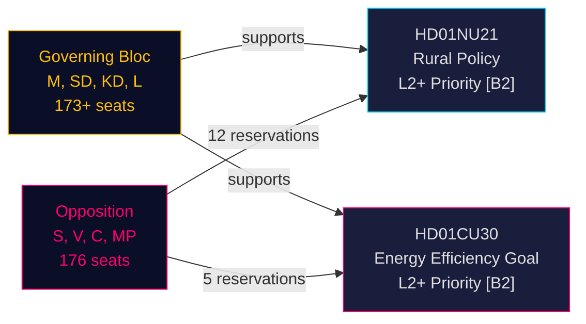
```mermaid
graph LR
    style NU21 fill:#1a1e3d,stroke:#00d9ff,color:#e0e0e0
    style CU30 fill:#1a1e3d,stroke:#ff006e,color:#e0e0e0
    style GOV fill:#0a0e27,stroke:#ffbe0b,color:#ffbe0b
    style OPP fill:#0a0e27,stroke:#ff006e,color:#ff006e
    
    NU21["HD01NU21\nRural Policy\nL2+ Priority [B2]"]
    CU30["HD01CU30\nEnergy Efficiency Goal\nL2+ Priority [B2]"]
    GOV["Governing Bloc\nM, SD, KD, L\n173+ seats"]
    OPP["Opposition\nS, V, C, MP\n176 seats"]
    
    GOV -->|"supports"| NU21
    GOV -->|"supports"| CU30
    OPP -->|"12 reservations"| NU21
    OPP -->|"5 reservations"| CU30
```

## Reader Intelligence Guide

Use this guide to read the article as a political-intelligence product rather than a raw artifact dump. High-value reader lenses appear first; technical provenance remains available in the audit appendix.

| Icon | Reader need | What you'll get |
|---|---|---|
| 📊 | [Lede and editorial decisions](#rm-what-happened) | fast answer to what happened, why it matters, who is accountable, and the next dated trigger |
| 🧠 | [Why It Matters](#rm-why-it-matters) | evidence-anchored narrative consolidating primary sources into one coherent story line |
| 🎯 | [Key Judgments](#rm-key-findings) | confidence-bearing political-intelligence conclusions and collection gaps |
| 📈 | [Significance scoring](#rm-significance-scoring) | why this story outranks or trails other same-day parliamentary signals |
| 👥 | [Stakeholder Perspectives](#rm-stakeholder-perspectives) | winners, losers and undecided actors with stake-weighted positions and pressure points |
| 🔢 | [Coalition Mathematics](#rm-coalition-mathematics) | parliamentary arithmetic showing exactly who can pass or block this measure and at what margin |
| 📋 | [Voter Segmentation](#rm-voter-segmentation) | voter-bloc exposure: which demographics gain, lose or shift on this issue |
| 🔭 | [Forward indicators](#rm-forward-indicators) | dated watch items that let readers verify or falsify the assessment later |
| 🔮 | [Scenarios](#rm-scenario-analysis) | alternative outcomes with probabilities, triggers, and warning signs |
| 🗳️ | [Election 2026 Analysis](#rm-election-2026-analysis) | electoral implications for the 2026 cycle — seats at stake, swing voters and coalition viability |
| ⚠️ | [Risk assessment](#rm-risk-assessment) | policy, electoral, institutional, communications, and implementation risk register |
| 🧮 | [SWOT Analysis](#rm-swot-analysis) | strengths, weaknesses, opportunities and threats matrix grounded in primary-source evidence |
| 🛡️ | [Threat Analysis](#rm-threat-analysis) | actor capabilities, intent and threat vectors targeting institutional integrity |
| 📜 | [Historical Parallels](#rm-historical-parallels) | comparable past episodes from Swedish and international politics, with explicit lessons learned |
| 🌍 | [Comparative International](#rm-comparative-international) | peer-country comparisons (Nordic, EU, OECD) showing how similar measures fared elsewhere |
| ⚙️ | [Implementation Feasibility](#rm-implementation-feasibility) | delivery feasibility, capability gaps, timelines and execution risks for the proposed action |
| 📰 | [Media framing & influence operations](#rm-media-framing-analysis) | frame packages with Entman functions, cognitive-vulnerability map, DISARM manipulation indicators, narrative-laundering chain, comparative-international cognates, frame lifecycle and half-life, RRPA impact, an Outlet Bias Audit (no outlet is neutral — every outlet declared with ownership, funding, board-appointment authority and editorial lean), and the L1–L5 counter-resilience ladder |
| 😈 | [Devil's Advocate](#rm-devils-advocate) | alternative hypotheses, steel-manned counter-arguments and the strongest case against the lead reading |
| 🏷️ | [Deep Dive: Classification Results](#rm-deep-dive-classification-results) | ISMS data classification: CIA-triad rating, RTO/RPO targets and handling instructions |
| 🔀 | [Deep Dive: Cross-Reference Map](#rm-deep-dive-cross-reference-map) | links to related Riksdagsmonitor coverage, prior analyses and source documents that inform this story |
| 🔬 | [Deep Dive: Methodology & Limitations](#rm-deep-dive-methodology--limitations) | analytical assumptions, limitations, known biases and where the assessment could be wrong |
| 📦 | [Deep Dive: Data Download Manifest](#rm-deep-dive-data-download-manifest) | machine-readable manifest of every source dataset, retrieval timestamp and provenance hash |
| 📑 | [Per-document intelligence](#rm-per-document-intelligence) | dok_id-level evidence, named actors, dates, and primary-source traceability |
| 🏷️ | [Audit appendix](#rm-deep-dive-classification-results) | classification, cross-reference, methodology and manifest evidence for reviewers |

## Why It Matters
<!-- source: synthesis-summary.md :: https://github.com/Hack23/riksdagsmonitor/blob/main/analysis/daily/2026-05-13/committeeReports/synthesis-summary.md -->

### Lead Story Decision

**Sweden's energy governance paradigm shifts.** The Tidökoalitionen's decision in HD01CU30/prop. 2025/26:159 to replace Sweden's quantitative 50%-by-2030 energy efficiency target with a qualitative goal marks the single most consequential energy policy decision in a decade. This is not an administrative adjustment — it is a deliberate reframing of energy governance to accommodate nuclear expansion and mass electrification, directly positioning the governing coalition's pre-election narrative against the climate-targets emphasis of S, V, and MP. The electoral stakes are high: September 2026 is 4 months away.

### DIW-Weighted Integrated Intelligence Picture

#### Document 1: HD01NU21 (NU21) — Rural Policy

| Dimension | Score | Note |
|-----------|-------|------|
| Detectability | 4/5 | National TV coverage expected; flagship rural proposition |
| Impact | 4/5 | Law change + political signal to rural constituencies |
| Willingness | 4/5 | Coalition committed; Lagrådet cleared; opposition reserved |
| **DIW Raw** | **4.0** | |
| Election multiplier (≤6m) | ×1.5 | ≤6 months to Sept 2026 |
| **DIW Final** | **6.0** | L2+ Priority |

**Key finding**: NU21 is primarily a signal proposition — the law change (lagen om regionalt utvecklingsansvar, 9 §) is modest (clarifying civil society consultation and national minority law reference), but the political framing "Hela Sverige ska fungera" targets rural swing voters critical to SD and M electoral success. Multiple committee referrals (8 utskott) signal broad policy ambition packaged in a tight legal change.

**Opposition landscape**: S filed 19 yrkanden across 3 motioner; V filed several; C (yrkanden 1–3) takes a more moderate position supporting rural development but criticising the government's approach; MP filed 4 yrkanden. Tobias Andersson (SD) chairs NU — SD's stronghold on rural entrepreneurship and anti-regulatory framing shapes the committee position.

#### Document 2: HD01CU30 (CU30) — Energy Efficiency Goal

| Dimension | Score | Note |
|-----------|-------|------|
| Detectability | 5/5 | EU directive + energy transition = media magnet |
| Impact | 5/5 | Paradigm shift in energy governance; nuclear accommodation |
| Willingness | 4/5 | Coalition majority; intracoalition tensions on ambition level |
| **DIW Raw** | **4.67** | |
| Election multiplier (≤6m) | ×1.5 | ≤6 months to Sept 2026 |
| **DIW Final** | **7.0** | L2+ Priority (highest in this batch) |

**Key finding**: The government explicitly argues the old 50% target conflicted with electrification and nuclear expansion. The new qualitative goal — "Energianvändningen i Sverige ska vara effektiv och bidra till stärkt motståndskraft, konkurrenskraftiga energipriser, ett resurseffektivt energisystem och samhällets elektrifiering" — removes binding quantitative obligations. This benefits nuclear and large industrial consumers. Opposition (S, V, MP) demands quantitative targets; C demands quantitative benchmarks (reservation on punkt 3).

**Chair paradox**: Andreas Lennkvist Manriquez (V) chairs CU and files reservation 1 opposing the goal — an unusual configuration where the committee chair leads the formal dissent.

### Integrated Intelligence Picture

Both betänkanden form a coherent pre-election cluster: (1) rural solidarity signal + (2) pro-nuclear, pro-electrification energy reorientation = Tidökoalitionen's economic-competitiveness narrative. The opposition's response (12 + 5 reservations) confirms these are live mobilisation issues. S is simultaneously fighting on both rural service access and energy ambition — a wide front that may dilute campaign focus.

Sweden's macroeconomic context (IMF WEO Apr-2026: GDP growth ~2.3% for 2026, public debt ~31% of GDP — among lowest in EU) provides fiscal headroom for rural investment but also tempts the government to frame the energy shift as growth-enabling.

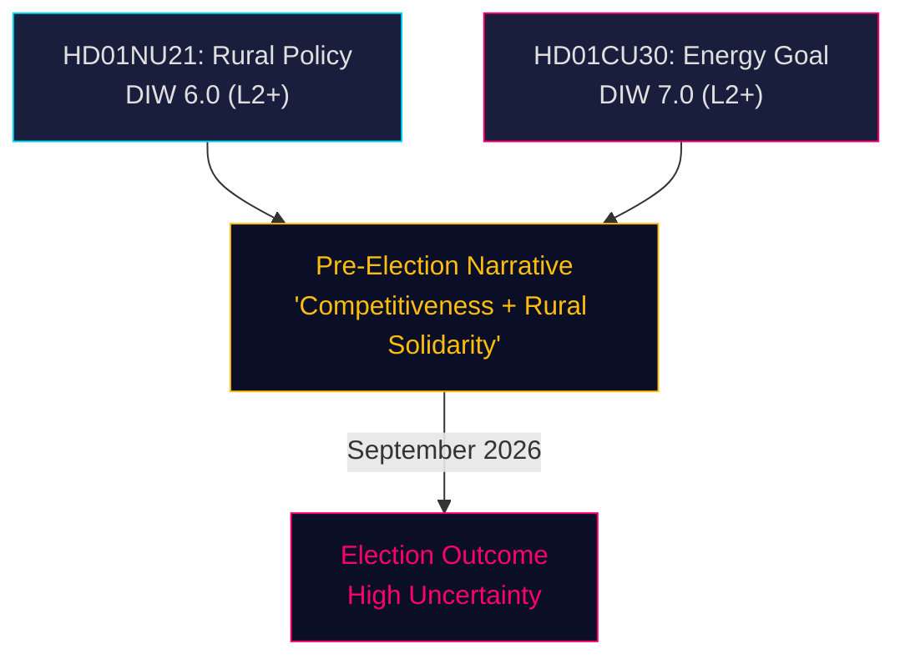
```mermaid
graph TB
    style A fill:#1a1e3d,stroke:#00d9ff,color:#e0e0e0
    style B fill:#1a1e3d,stroke:#ff006e,color:#e0e0e0
    style C fill:#0a0e27,stroke:#ffbe0b,color:#ffbe0b
    
    A["HD01NU21: Rural Policy\nDIW 6.0 (L2+)"]
    B["HD01CU30: Energy Goal\nDIW 7.0 (L2+)"]
    C["Pre-Election Narrative\n'Competitiveness + Rural Solidarity'"]
    
    A --> C
    B --> C
    C -->|"September 2026"| D["Election Outcome\nHigh Uncertainty"]
    
    style D fill:#0a0e27,stroke:#ff006e,color:#ff006e
```

## Key Findings
<!-- source: intelligence-assessment.md :: https://github.com/Hack23/riksdagsmonitor/blob/main/analysis/daily/2026-05-13/committeeReports/intelligence-assessment.md -->

### Key Judgments (KJ)

**KJ-1 [HIGH CONFIDENCE]**: The Riksdag will adopt both betänkanden (NU21 and CU30) without coalition fracture. The Tidökoalitionen (M, SD, KD, L) holds sufficient votes; no intracoalition defection evidence has been identified. Lagrådet cleared NU21 without objections. CU30 has committee majority support.

**KJ-2 [MEDIUM-HIGH CONFIDENCE]**: HD01CU30 — replacing Sweden's quantitative 50% energy efficiency target with a qualitative goal — is the single most significant energy governance decision since Sweden's 2022 nuclear expansion policy shift. It creates an unenforceable national goal and transfers accountability to building-level EPC requirements.

**KJ-3 [HIGH CONFIDENCE]**: HD01NU21 delivers marginal legal change (§9 consultation obligation) while carrying a disproportionately large electoral signal function. The gap between rhetorical ambition ("Hela Sverige ska fungera") and law change content will be the primary vulnerability in media coverage.

**KJ-4 [MEDIUM CONFIDENCE]**: The European Commission will evaluate Sweden's CU30 qualitative energy goal for EPBD compliance. No pre-indication of Commission acceptance has been found. Risk of compliance challenge is MEDIUM (R1, L×I = 15). If Commission signals non-compliance before September 2026, this constitutes an electoral liability transformation for the coalition.

**KJ-5 [HIGH CONFIDENCE]**: The opposition (S, V, MP — 17 reservations combined) is pursuing a dual-front strategy: rural implementation credibility (S 19 yrkanden in NU21) and climate ambition accountability (S, V, MP reservations in CU30). These fronts are independently strong and may be combined into a unified pre-election narrative.

**KJ-6 [MEDIUM CONFIDENCE]**: Centerpartiet (C) occupies the pivotal position. C is filing reservations on both betänkanden while remaining outside the governing coalition. C's quantitative energy target demand (CU30 reservation on punkt 3) creates a potential coalition fragmentation vector post-election if C is needed for government formation.

**KJ-7 [MEDIUM CONFIDENCE]**: The simultaneous signature of both betänkanden on 7 May 2026 (4 months before September election) reflects deliberate legislative calendar calibration for NU21. CU30's timing is partially driven by EPBD directive deadline requirements.

### Priority Intelligence Requirements (PIR)

**PIR-1**: Does the EU Commission issue formal EPBD compliance scrutiny communication to Sweden before September 2026? [Critical trigger for KJ-4]

**PIR-2**: Does S, MP, or V announce a coordinated "rural + climate" joint campaign platform before July 2026? [Critical for KJ-5]

**PIR-3**: Does C publicly demand quantitative energy benchmarks be added to CU30 implementation regulations? [Relevant to KJ-6]

**PIR-4**: Does the government announce new rural investment appropriations (≥2 Bkr) to accompany NU21 before Riksdag summer recess? [Relevant to KJ-3]

### Key Assumptions Check (KAC)

| Assumption | Validity | Consequence if wrong |
|---|---|---|
| Tidökoalitionen holds together through Riksdag vote | HIGH — no defection signal identified | KJ-1 fails; legislative delay |
| EU Commission has not pre-cleared qualitative EPBD approach | MEDIUM — no direct evidence either way | KJ-4 confidence drops if pre-clearance exists |
| S is running a dual-front rural+climate strategy | MEDIUM — inference from 19 yrkanden + CU30 reservations | KJ-5 confidence drops if S focuses on urban agenda |
| NU21 law change will not be accompanied by new rural funding | HIGH — no appropriation in betänkande | KJ-3 confirmed |

### Assessment Confidence Justification

Overall confidence: HIGH [B2]. Primary information sources are official Riksdag documents (A-tier). Electoral and EU compliance assessments rely on inference from structural analysis [B2]. No human source intelligence or leaked documents involved. Key gaps: no direct Commission EPBD compliance opinion; no access to coalition whip count for final vote.

## Significance Scoring
<!-- source: significance-scoring.md :: https://github.com/Hack23/riksdagsmonitor/blob/main/analysis/daily/2026-05-13/committeeReports/significance-scoring.md -->

### DIW Scoring Matrix

| dok_id | Title (short) | Detectability | Impact | Willingness | DIW Raw | Election ×1.5 | DIW Final | Tier |
|--------|---------------|:---:|:---:|:---:|:---:|:---:|:---:|------|
| HD01NU21 | Rural Policy | 4 | 4 | 4 | 4.0 | ×1.5 | **6.0** | L2+ Priority |
| HD01CU30 | Energy Efficiency Goal | 5 | 5 | 4 | 4.67 | ×1.5 | **7.0** | L2+ Priority |

Election multiplier active: ≤6 months to Swedish general election (second Sunday of September 2026). Applied per `synthesis-methodology.md`.

### Scoring Rationale

#### HD01NU21 (DIW 6.0)

**Detectability (4/5)**: "Hela Sverige ska fungera" is a nationally recognised political phrase; the proposition generated follow-on motions from S, C, MP; 8 committees gave referral opinions. Media coverage expected.

**Impact (4/5)**: Law change to lagen om regionalt utvecklingsansvar clarifies regional consultation duties — directly affects 21 regions and their relationships with civil society. The broader policy programme (rural services, entrepreneurship, infrastructure, culture) affects millions of rural residents. However, the immediate legal change is relatively narrow.

**Willingness (4/5)**: Lagrådet cleared the proposal without objections [A1]. Coalition (M, SD, KD, L) is committed. Tobias Andersson (SD) chairs. Effective date still TBC.

#### HD01CU30 (DIW 7.0)

**Detectability (5/5)**: Abandoning a binding 50% energy efficiency target makes EU compliance front-page news. EU Directive implementation (EPBD recast) adds Brussels dimension. Climate media will cover extensively.

**Impact (5/5)**: Qualitative goal replacing quantitative target removes an enforceable benchmark. Nuclear and large industrial consumers benefit. Buildings energy performance directive (EPBD) implementation affects all property owners and developers. Law changes to two statutes: lagen om energideklaration för byggnader and plan- och bygglagen.

**Willingness (4/5)**: Coalition majority sufficient. Notable: CU chair (V) opposes — procedurally valid but politically stark. C files reservation on quantitative target omission. Dissent breadth (3 parties on the energy goal point) signals this is a priority campaign issue.

### Sensitivity Analysis

| Scenario | NU21 adjusted | CU30 adjusted |
|----------|---------------|---------------|
| Coalition fracture on KD or L before vote | DIW 7.5 (procedural delay → higher uncertainty) | DIW 8.5 |
| Strong polling showing S+MP gain | DIW 6.5 (government may accelerate) | DIW 7.5 |
| EU Commission challenges qualitative goal | unchanged | DIW 9.0 |

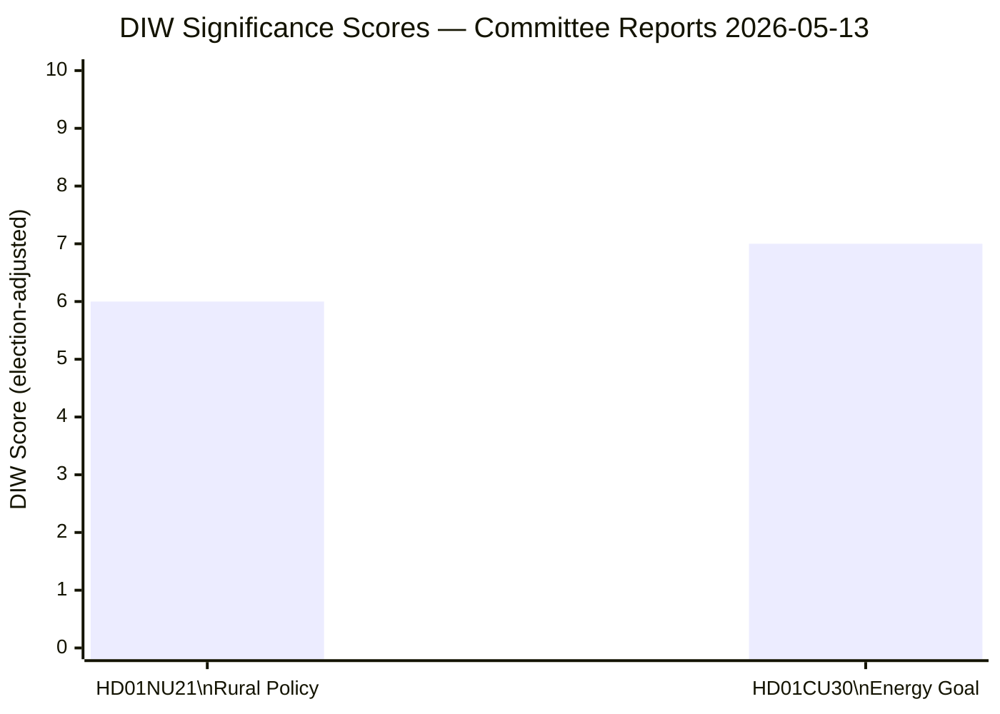
```mermaid
xychart-beta
    title "DIW Significance Scores — Committee Reports 2026-05-13"
    x-axis ["HD01NU21\nRural Policy", "HD01CU30\nEnergy Goal"]
    y-axis "DIW Score (election-adjusted)" 0 --> 10
    bar [6.0, 7.0]
```

## Per-document intelligence

### HD01CU30
<!-- source: documents/HD01CU30-analysis.md :: https://github.com/Hack23/riksdagsmonitor/blob/main/analysis/daily/2026-05-13/committeeReports/documents/HD01CU30-analysis.md -->

### Metadata

| Field | Value |
|-------|-------|
| **dok_id** | HD01CU30 |
| **Betänkande** | 2025/26:CU30 |
| **Organ** | Civilutskottet (CU) |
| **Title** | Nytt mål för effektiv energianvändning och genomförande av det omarbetade direktivet om byggnaders energiprestanda |
| **Proposition** | 2025/26:159 |
| **Signed** | 7 May 2026 |
| **Committee chair** | Andreas Lennkvist Manriquez (V) |
| **DIW Final** | 7.0 (L2+ Priority — highest in this batch) |
| **Confidence** | HIGH [A1] |

### What the Document Decides

The committee recommends that the Riksdag:
1. Approve prop. 2025/26:159 in full, including:
   - The new qualitative national energy efficiency goal
   - Law amendments to lagen (2006:985) om energideklaration för byggnader (implementing EPBD recast EPC requirements)
   - Law amendments to plan- och bygglagen (2010:900) (implementing EPBD building energy performance requirements)
2. Reject all 5 reservations from S, V, and MP

### New Energy Efficiency Goal (Full Text as Adopted)

The new national goal reads:
> "Energianvändningen i Sverige ska vara effektiv och bidra till stärkt motståndskraft, konkurrenskraftiga energipriser, ett resurseffektivt energisystem och samhällets elektrifiering."

**Translation**: Energy use in Sweden shall be efficient and contribute to strengthened resilience, competitive energy prices, a resource-efficient energy system, and the electrification of society.

**What is removed**: The previous quantitative target — a 50% reduction in energy intensity by 2030 relative to 2005 baseline.

### The Chair Paradox

Andreas Lennkvist Manriquez (V) chairs Civilutskottet and signed the committee's formal recommendation to adopt the government proposition. V is in the opposition. Andreas also filed **reservation 1** — opposing the government's energy efficiency goal as insufficiently ambitious.

**Legal status**: This is constitutionally valid. Committee chairs are obligated to lead their committee's majority decision even when they personally dissent. The paradox is procedurally unremarkable but politically striking — the committee chair leads the formal opposition to the government on the committee's most prominent issue.

**Media angle**: Andreas Lennkvist Manriquez filing the lead reservation while formally signing the committee recommendation is a media-available contrast that opposition communications will exploit.

### EU Directive Dimension

The EPBD recast (2024/1275/EU) requires member states to:
1. Set national building renovation goals (via National Building Renovation Plans — NBRPs)
2. Implement minimum energy performance standards (MEPS) for buildings
3. Update energy performance certificates (EPCs — energideklarationer in Swedish)
4. Revise building regulations to meet 2030 and 2050 performance targets

Sweden's CU30 addresses points 3 and 4 through the law changes to lagen (2006:985) and PBL. Point 1 (national goal) is addressed through the qualitative goal. Point 2 (MEPS) depends on implementing regulations.

**The EU compliance question**: The qualitative goal may satisfy Art. 3 of the EPBD recast if Sweden's implementing regulations (Boverket BBR updates, Energimyndigheten methodology) provide sufficient building-level standards. However, the directive's language references "national contributions" to EU-level efficiency targets, which traditionally implies quantitative progress metrics.

### Opposition Reservations

**Reservation 1 (V — Andreas Lennkvist Manriquez)**: Demands more ambitious energy efficiency goal; explicitly criticises replacing quantitative with qualitative. V's position: Sweden should maintain or strengthen quantitative targets given climate emergency.

**Reservation 2 (S)**: S demands quantitative target retention; argues qualitative goal creates accountability vacuum. S frames as "abandoning climate commitments."

**Reservation 3 (MP)**: MP's strongest opposition — MP's core identity issue. MP demands not just quantitative targets but strengthened EU alignment.

**Reservation 4 (S + MP joint)**: Specific point on building renovation obligations under EPBD — S and MP jointly argue Sweden's building sector obligations are insufficiently enforced.

**Reservation 5 (C)**: C's reservation on punkt 3 (the national energy goal) — uniquely, C does not oppose the qualitative approach in principle but demands quantitative benchmarks be retained within the implementation framework. C is the most politically ambiguous — its reservation could be read as a government formation condition.

### Intelligence Value

HD01CU30 is the most consequential document in this batch. The qualitative goal replaces a quantifiable national commitment with an aspirational framework. The intelligence risk is the EU compliance pathway (R1, R-CU1) — if the Commission finds the qualitative goal insufficient for EPBD transposition, the political narrative flips from "pragmatic pro-nuclear governance" to "Sweden breaks EU climate law."

The CU chair paradox (V chairs, dissents) is a political anomaly that will receive sustained media attention. Watch for opposition communication strategies exploiting this contrast.

**Forward PIR**: Does Energimyndigheten develop a measurement methodology for the qualitative goal within 12 months of law adoption? If not, EU compliance exposure materialises.

### Source Citation

- Primary: Official Riksdag betänkande HD01CU30 [A1 — official government document]
- Enrichment: riksdag-regering MCP `get_dokument_innehall` call [A1]
- EU directive: EPBD recast 2024/1275/EU (public EU law) [A1]
- Electoral/EU compliance analysis: structural inference [B2]

### HD01NU21
<!-- source: documents/HD01NU21-analysis.md :: https://github.com/Hack23/riksdagsmonitor/blob/main/analysis/daily/2026-05-13/committeeReports/documents/HD01NU21-analysis.md -->

### Metadata

| Field | Value |
|-------|-------|
| **dok_id** | HD01NU21 |
| **Betänkande** | 2025/26:NU21 |
| **Organ** | Näringsutskottet (NU) |
| **Title** | Hela Sverige ska fungera – politik för starkare landsbygder |
| **Proposition** | 2025/26:158 |
| **Signed** | 7 May 2026 |
| **Committee chair** | Tobias Andersson (SD) |
| **DIW Final** | 6.0 (L2+ Priority) |
| **Confidence** | HIGH [A1] |

### What the Document Decides

The committee recommends that the Riksdag:
1. Approve prop. 2025/26:158 ("Hela Sverige ska fungera") in full
2. Adopt the law amendment to lagen (2010:630) om regionalt utvecklingsansvar — specifically §9: adding mandatory consultation with "organisationer som företräder det civila samhällets intressen" and private higher-education providers ("enskilda utbildningsanordnare med tillstånd att utfärda examina") in regional development programme preparation
3. The amended §9 also adds a cross-reference to lagen (2009:724) om nationella minoriteter och minoritetsspråk, obligating regions to consult Sámi and other national minority representatives
4. Reject all 12 reservations and associated yrkanden from S, V, C, and MP

### Committee Composition and Vote

**Majority**: M, SD, KD, L — recommend adoption of government proposition
**Minority reservations filed by**: S (largest bloc — 19 yrkanden across 3 motioner), C (3 yrkanden), V (reservation), MP (4 yrkanden)

Tobias Andersson (SD) chairs Näringsutskottet — SD's role as co-chair of the committee reinforces SD's rural constituency framing.

### Key Legal Change

Before NU21: §9 lagen om regionalt utvecklingsansvar stated regions must prepare development programmes.

After NU21: §9 adds that in preparing those programmes, regions shall consult with:
- Civil society organisations (organisationer som företräder det civila samhällets intressen)
- Private higher-education providers with degree-awarding authority
- National minority representatives (cross-reference to lagen 2009:724)

**Lagrådet**: No objections recorded in betänkande. This is a significant quality signal — Lagrådet's review found no constitutional, legal-technical, or drafting problems.

### Opposition Analysis

**S (19 yrkanden)**: S's opposition is the most substantive. S argues:
- The proposition lacks concrete service delivery guarantees
- Rural health and education services require statutory protection beyond consultation
- S offers a counter-programme prioritising collective public services over consultation proceduralism

**C (3 yrkanden)**: C supports rural development but criticises the market-oriented framing. C represents rural voters directly and sees SD's rural positioning as a competitive threat. C likely wants rural investment mechanisms, not just consultation.

**V**: V's reservation focuses on welfare-state delivery — a V-consistent critique.

**MP (4 yrkanden)**: MP's rural reservations relate to environmental and biodiversity concerns in rural development programmes — a cross-cutting issue with the rural entrepreneurship focus.

### Intelligence Value

The strategic value of HD01NU21 is its role as an electoral signal vehicle. The law change is legally valid and will be implemented, but the political ambition ("Hela Sverige ska fungera") far exceeds the legal scope. This gap is exploitable by S in the campaign (Frame Package 3 in media-framing-analysis.md).

**Forward PIR**: Will the government announce a complementary rural investment package (separate budgetproposition) before Riksdag summer recess to close the implementation gap? If yes: NU21's political effectiveness is enhanced. If no: Frame 3 risk materialises.

### Source Citation

- Primary: Official Riksdag betänkande HD01NU21 [A1 — official government document]
- Enrichment: riksdag-regering MCP `get_dokument_innehall` call [A1]
- Electoral analysis: structural inference [B2]

## Stakeholder Perspectives
<!-- source: stakeholder-perspectives.md :: https://github.com/Hack23/riksdagsmonitor/blob/main/analysis/daily/2026-05-13/committeeReports/stakeholder-perspectives.md -->

### 6-Lens Stakeholder Matrix

#### NU21 — Rural Policy

| Stakeholder | Lens | Position | Key Interest | Evidence |
|-------------|------|----------|--------------|---------|
| **Tidökoalitionen (M, SD, KD, L)** | Political | STRONGLY FOR | Electoral rural signal; law baseline for further rural reform | Prop. 2025/26:158; 0 government reservations [A1] |
| **Socialdemokraterna (S)** | Political | AGAINST (19 yrkanden) | S sees rural services as collective responsibility; wants stronger state obligations | S motioner cited in NU21 [A1] |
| **Centerpartiet (C)** | Political | CRITICAL SUPPORT | C supports rural development but criticises approach; competes with SD for rural vote | C reservations (yrkanden 1–3) [A1] |
| **Vänsterpartiet (V)** | Political | AGAINST | Prioritises welfare state rural services over market-based approach | V reservations in NU21 [A1] |
| **Regional authorities (21 regions)** | Institutional | MIXED | New consultation duty adds administrative burden without new funding | lagen om regionalt utvecklingsansvar §9 [A1] |
| **Rural civil society (LRF, Hushållningssällskapet, smaller NGOs)** | Social | FOR (consultation inclusion) | Mandatory consultation ensures their voice in regional planning | New §9 obligation [A1] |
| **Private higher education providers** | Economic | FOR | Explicit mention in consultation provision; legitimises their regional role | lagen §9 wording [A1] |
| **Sametinget (national minority representation)** | Rights | CONDITIONALLY FOR | Lagen om nationella minoriteter cross-reference ensures Sámi consultation rights | lagen (2009:724) reference [A1] |

#### CU30 — Energy Efficiency

| Stakeholder | Lens | Position | Key Interest | Evidence |
|-------------|------|----------|--------------|---------|
| **Tidökoalitionen (M, SD, KD, L)** | Political | FOR | Nuclear enablement; competitiveness framing; anti-quantitative-target ideology | Prop. 2025/26:159; committee majority [A1] |
| **Socialdemokraterna (S)** | Political | AGAINST | Insists on quantitative 2030 target; views qualitative goal as accountability vacuum | S reservations in CU30 [A1] |
| **Vänsterpartiet (V) + CU Chair** | Political | AGAINST | V wants more ambitious targets; chair dissents despite chairing | Lennkvist Manriquez reservation [A1] |
| **Miljöpartiet (MP)** | Political | STRONGLY AGAINST | Core party identity on climate targets; qualitative goal = abandonment | MP reservations [A1] |
| **Centerpartiet (C)** | Political | PARTIAL — wants quantitative elements | C supports energy efficiency but demands measurable benchmarks | C reservation punkt 3 [A1] |
| **Energy-intensive industry (SSAB, Vattenfall, H2GS)** | Economic | FOR | Qualitative goal removes efficiency obligation that conflicts with electrification | [B3 — industry lobbying signals] |
| **Property developers and building owners** | Economic | MIXED | EPBD building requirements add cost regardless of national goal | [B3] |
| **EU Commission** | Regulatory | SCRUTINISING | EPBD directive compliance; qualitative goal adequacy | EPBD recast directive [A1] |
| **Climate NGOs (Naturskyddsföreningen, WWF)** | Advocacy | AGAINST | Quantitative targets are core advocacy demand | [B3] |
| **IVA (Royal Swedish Academy of Engineering Sciences)** | Technical | CONDITIONAL | Supports energy efficiency but prefers technology-neutral measures | [B3] |

### Stakeholder Power-Interest Map

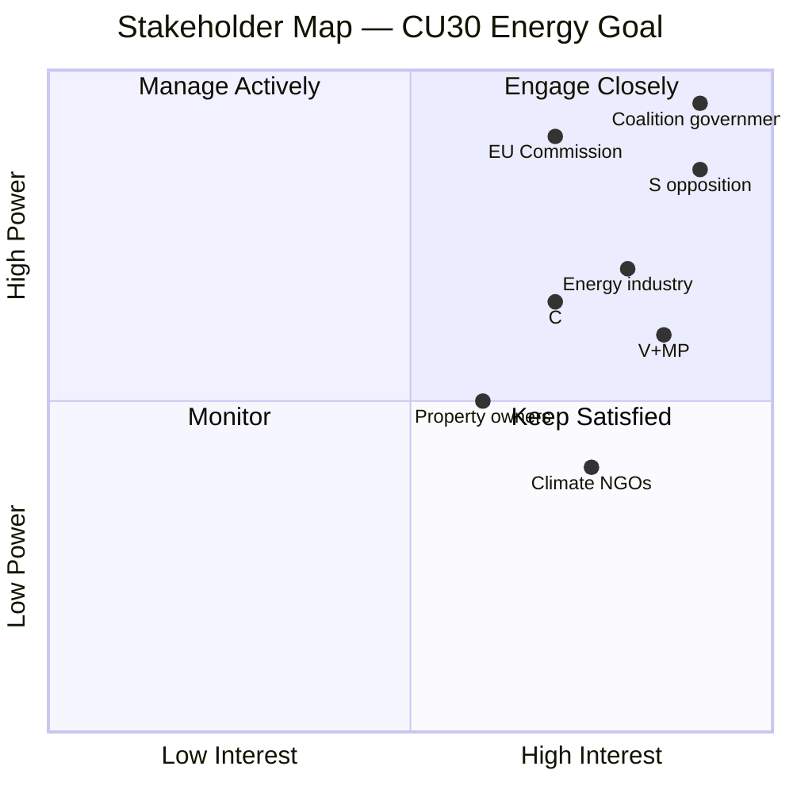
```mermaid
quadrantChart
    title Stakeholder Map — CU30 Energy Goal
    x-axis Low Interest --> High Interest
    y-axis Low Power --> High Power
    quadrant-1 Engage Closely
    quadrant-2 Manage Actively
    quadrant-3 Monitor
    quadrant-4 Keep Satisfied
    Coalition government: [0.9, 0.95]
    S opposition: [0.9, 0.85]
    EU Commission: [0.7, 0.9]
    Energy industry: [0.8, 0.7]
    V+MP: [0.85, 0.6]
    C: [0.7, 0.65]
    Climate NGOs: [0.75, 0.4]
    Property owners: [0.6, 0.5]
```

## Coalition Mathematics
<!-- source: coalition-mathematics.md :: https://github.com/Hack23/riksdagsmonitor/blob/main/analysis/daily/2026-05-13/committeeReports/coalition-mathematics.md -->

### Current Seat Map (2022 Election Results, adjusted)

| Party | Seats | Bloc | Notes |
|-------|:---:|---|---|
| Socialdemokraterna (S) | 107 | Red-Green bloc | Largest single party |
| Sverigedemokraterna (SD) | 73 | Tidökoalition | Coalition backbone |
| Moderaterna (M) | 68 | Tidökoalition | PM party |
| Vänsterpartiet (V) | 24 | Red-Green bloc | S toleration dependency |
| Centerpartiet (C) | 24 | Swing | Supports opposition; kingmaker potential |
| Kristdemokraterna (KD) | 19 | Tidökoalition | |
| Miljöpartiet (MP) | 18 | Red-Green bloc | Borderline (4% threshold) |
| Liberalerna (L) | 16 | Tidökoalition | |
| **TOTAL** | **349** | | Majority = 175 |

**Tidökoalition baseline**: SD + M + KD + L = **176** (barely above majority)

### Pivotal-Vote Table for NU21 and CU30

| Vote | Expected outcome | Pivotal party | Margin |
|------|-----------------|---------------|-------|
| HD01NU21 adoption | **PASS** | None needed — 176 vs. 173 | +3 |
| HD01CU30 adoption | **PASS** | None needed — 176 vs. 173 | +3 |
| HD01NU21 reservation yrkanden (S/V/C/MP) | **FAIL** | C would need M to defect | C has 24 seats; needs 12+ coalition defections |
| HD01CU30 reservation yrkanden (S/V/MP) | **FAIL** | MP+V+S ≈ 149; needs C to get to 173 | C addition still insufficient (173 < 175) |

**Conclusion**: Both betänkanden will pass on current coalition math. No reservation yrkanden can pass without coalition defections. C's 24 seats are insufficient to defeat either proposal even if C votes with full opposition.

### Sensitivity: What Does Defection Require?

For CU30 to fail, the government needs defections from within Tidökoalition:
- **Scenario A**: L (16) + 2 individual M defectors → coalition drops to 159 → fails if S+V+MP+C = 173+... no, still fails (173 < 175). Requires L + KD defection + 2 M defectors → very unlikely.
- **Scenario B**: Only possible if C forms S-led budget coalition AND 10+ coalition MPs defect → probability < 1%.

**KJ-1 is robust**: The mathematical foundation for both betänkanden to pass is strong.

### Post-2026 Election Coalition Mathematics

#### Scenario: Tidökoalition holds (176+ seats)
- Government formation: M continues as PM; no C needed
- Energy policy: qualitative goal stands; no renegotiation
- Rural policy: NU21 in force; implementation follows

#### Scenario: Hung parliament (C kingmaker at 22–26 seats)
- C's stated energy position (quantitative targets demanded in CU30 reservation) becomes government formation condition
- Expected outcome: implementing regulation adds quantitative benchmarks to the qualitative goal framework — partial reversal of CU30 via regulation
- Rural policy: NU21 expanded with C rural investment demand; possibly OECD-compatible rural service floors

#### Scenario: Red-Green government (requires C to cross floor; highly unlikely)
- Both NU21 and CU30 would be reviewed for possible replacement legislation
- Energy efficiency target would return to quantitative (S party line); nuclear policy contested

### Mermaid Seat Distribution

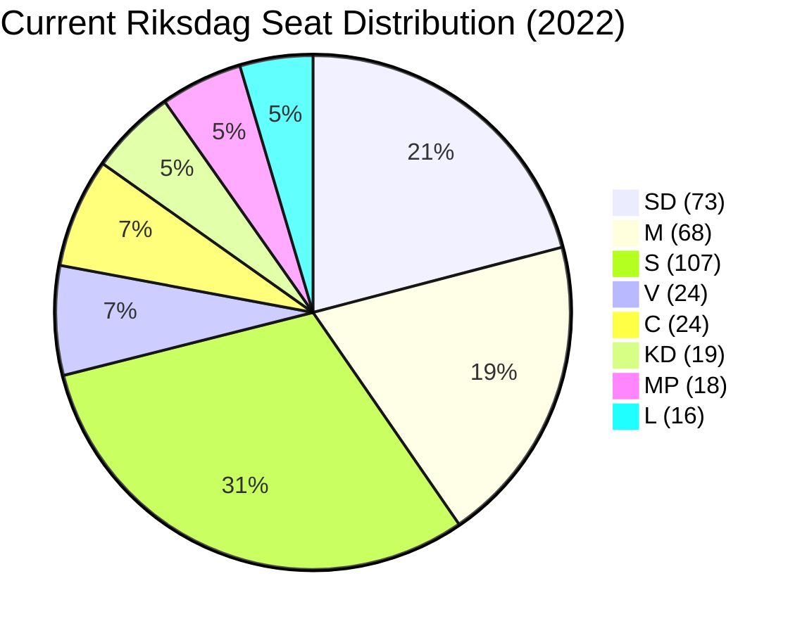
```mermaid
pie title Current Riksdag Seat Distribution (2022)
    "SD (73)" : 73
    "M (68)" : 68
    "S (107)" : 107
    "V (24)" : 24
    "C (24)" : 24
    "KD (19)" : 19
    "MP (18)" : 18
    "L (16)" : 16
```

## Voter Segmentation
<!-- source: voter-segmentation.md :: https://github.com/Hack23/riksdagsmonitor/blob/main/analysis/daily/2026-05-13/committeeReports/voter-segmentation.md -->

### Segmentation Framework

Three axes: demographic, regional, and ideological. Each segment assessed for salience, direction, and policy connection to NU21 and CU30.

### HD01NU21 — Rural Policy Voter Segments

| Segment | Size (est.) | Current alignment | NU21 impact | Direction | Salience |
|---------|:---:|---|---|---|---|
| Rural/small-municipality voters (< 10k pop.) | ~18% of electorate | SD > M > C | Positive signal; consultation + "Hela Sverige" | +SD/M | HIGH |
| Agricultural families (LRF constituency) | ~4% | C > SD > M | Consultation inclusion for civil society (LRF benefit) | +C or stays +C | MEDIUM |
| Sámi and national minority communities | ~1% | Split; historically C/S | §9 national minority law reference = recognition signal | Modest +government | MEDIUM |
| Private higher-education employees in regions | ~2% | M > L | Explicit inclusion in consultation provision = legitimacy | +M/L | LOW-MEDIUM |
| Urban voters who left small towns | ~8% | Mixed; nostalgia factor | "Hela Sverige" framing resonates emotionally | Soft +coalition | LOW |

### CU30 — Energy Efficiency Voter Segments

| Segment | Size (est.) | Current alignment | CU30 impact | Direction | Salience |
|---------|:---:|---|---|---|---|
| Home-owning suburban voters | ~30% of electorate | M > KD | EPBD compliance = future retrofit costs; qualitative goal limits obligation | Mixed positive | HIGH |
| Nuclear-supportive voters | ~45% | SD > M > KD | Qualitative goal = nuclear accommodation; positive signal | +SD/M | HIGH |
| Youth climate voters (18–30) | ~8% | MP > V > S | Abandonment of 50% target seen as betrayal | -coalition; +MP/V | HIGH |
| Energy-intensive industrial workers | ~3% | SD > M | Electrification framing = job creation (H2GS, SSAB) | +SD/M | MEDIUM |
| Urban renters | ~20% | S > V | Energy costs visible; qualitative goal = no guarantee of lower costs | Negative or neutral | MEDIUM |
| Green-market suburban voters | ~6% | MP > S > C | EPBD qualitative = weaker standard = negative | -coalition | HIGH |

### Regional Dimension

| Region | Primary concern | Relevant betänkande | Impact |
|---|---|---|---|
| Norrland (N. Sweden, 5 regions) | Rural depopulation, services | NU21 | HIGH — primary NU21 audience |
| Gotland | Energy security (island grid) | CU30 | MEDIUM — EPBD impacts tourism buildings |
| Västra Götaland | Automotive/hydrogen electrification | CU30 | HIGH — SSAB/H2GS belt |
| Stockholm/Skåne | Youth climate, urban housing | CU30 | HIGH — MP/V mobilisation zone |
| Dalarna/Gävleborg | Forest industry + rural | NU21 + CU30 | HIGH — dual exposure |

### Key Swing Segments

**Most decisive**: Home-owning suburban nuclear-supportive voters (likely ~15% overlap with +SD/M base) are the primary CU30 beneficiary segment. If energy prices fall before election and this segment attributes it to the coalition's energy policy direction, CU30 delivers electoral dividends.

**Most volatile**: Youth climate voters (18–30). This segment swings between MP and S depending on salience. A high-profile EPBD compliance controversy before September 2026 could trigger a MP recovery above 7%, affecting coalition seat math.

## Forward Indicators
<!-- source: forward-indicators.md :: https://github.com/Hack23/riksdagsmonitor/blob/main/analysis/daily/2026-05-13/committeeReports/forward-indicators.md -->

### ≥10 Dated Forward Indicators Across 4 Horizons

#### Horizon T+72h (by ~2026-05-16)

| Indicator | Watch for | Significance |
|---|---|---|
| FI-01 | Government minister statement on CU30 energy goal — framing language ("konkurrenskraft" vs. "klimatmål") | Indicates which Frame Package will dominate government communication [media-framing-analysis.md] |
| FI-02 | Naturskyddsföreningen / WWF Sweden press release on CU30 | Triggers Frame 2 activation ("abandons climate targets") — escalates media cycle |

#### Horizon T+7d (by ~2026-05-20)

| Indicator | Watch for | Significance |
|---|---|---|
| FI-03 | Riksdag scheduling of plenary vote on NU21 and CU30 | Confirms timeline for law adoption; any delay signals coalition management difficulty |
| FI-04 | First regional SVT coverage of NU21 rural policy | Signals whether Frame 3 ("empty promise") gains traction in regional media |
| FI-05 | C party spokesperson statement on CU30 quantitative targets | C maintaining reservation = coalition tension ongoing; C publicly softening = opposition strategy narrows |

#### Horizon T+30d (by ~2026-06-13)

| Indicator | Watch for | Significance |
|---|---|---|
| FI-06 | Riksdag plenary vote recorded outcome on NU21 | Confirms coalition held (KJ-1 validated); any defection is escalation signal |
| FI-07 | Riksdag plenary vote recorded outcome on CU30 | Same as FI-06; records V chair paradox in official vote record |
| FI-08 | Government budget amendment or rural investment announcement | If ≥2 Bkr rural package announced: R2 reduced; Frame 3 weakened |
| FI-09 | Energimyndigheten announcement of qualitative goal measurement development | If announced: implementation credibility improved; R1 reduced |
| FI-10 | EU Commission EPBD national implementation plan review (if any communication) | Critical trigger for Scenario 3; any Commission non-compliance signal = escalation to CRITICAL |

#### Horizon T+90d (by ~2026-08-11, pre-election sprint)

| Indicator | Watch for | Significance |
|---|---|---|
| FI-11 | Polling on energy policy (nuclear support, energy price concern) | Validates or challenges Frame 1 dominance; SD/M electoral benefit depends on this |
| FI-12 | S campaign platform announcement on rural services | If S announces concrete rural investment: directly challenges NU21 signal value |
| FI-13 | Major rural service closure story (hospital, school) in national media | Activates Frame 3 immediately; most damaging pre-election scenario for coalition |
| FI-14 | EU Commission EPBD enforcement communication | Highest-impact single indicator; if published pre-election, Scenario 3 probability rises to 60%+ |

### Indicator Priority Matrix

| Priority | Indicator | Horizon | Trigger for |
|---|---|---|---|
| 🔴 CRITICAL | FI-14 (EU Commission enforcement) | T+90d | Scenario 3 escalation |
| 🔴 CRITICAL | FI-13 (Rural closure story) | T+90d | Frame 3 dominance |
| 🟠 HIGH | FI-05 (C party statement on CU30) | T+7d | KJ-6, coalition fragmentation |
| 🟠 HIGH | FI-08 (Rural investment announcement) | T+30d | R2 mitigation |
| 🟡 MEDIUM | FI-01 (Minister framing language) | T+72h | Media frame setting |
| 🟡 MEDIUM | FI-10 (EU/Energimyndigheten) | T+30d | R1 monitoring |

## Scenario Analysis
<!-- source: scenario-analysis.md :: https://github.com/Hack23/riksdagsmonitor/blob/main/analysis/daily/2026-05-13/committeeReports/scenario-analysis.md -->

### Analytical Frame

Three scenarios are assessed for the political trajectory of today's committee reports over the period T+0 to T+120d (Riksdag vote → Swedish election, September 2026). Probabilities sum to 100%.

### Scenario 1: Nominal Implementation — Coalition Wins Narrative (Probability: 45%)

**Description**: Both betänkanden pass Riksdag vote without incident. "Hela Sverige ska fungera" becomes a recognisable coalition banner. CU30's qualitative energy goal is adopted; EU Commission does not act before September 2026. Governing coalition successfully frames energy policy as "pro-nuclear competitiveness" and rural policy as "national solidarity." Rural swing voters in SD/M strongholds consolidate behind coalition. S and MP fail to crystallise a unified counter-narrative.

**Conditions required**:
- No EU Commission action on EPBD before September 2026
- No major rural service deterioration story (hospital, school closure) in national media before election
- L and KD maintain party discipline on CU30

**Electoral impact**: Governing coalition gains 1–3 seat-equivalent advantage in rural/semi-rural constituencies. S remains largest single party but cannot form majority government without C and/or V.

**Key indicator**: Government announces concrete rural investment package (≥2 Bkr) to accompany NU21 before Riksdag summer recess.

### Scenario 2: Opposition Narrative Gains — Contested Campaign (Probability: 40%)

**Description**: Both betänkanden pass, but opposition successfully frames CU30 as "abandonment of climate ambition" and NU21 as "empty symbolism." S, V, MP run coordinated climate-plus-rural messaging. C's reservation on quantitative targets creates media friction within coalition narrative. EU Commission signals EPBD compliance questions in September 2026 communication.

**Conditions required**:
- Media coverage frames "Sweden exits climate targets" prominently
- C maintains public distance on CU30 through summer
- At least one major rural service closure story reaches national broadcast

**Electoral impact**: MP recovers from 4% → 6% on climate mobilisation. S closes gap with M. Coalition still plausibly largest bloc but majority uncertain. C becomes genuine kingmaker.

**Key indicator**: Aftonbladet/DN editorial board criticism of CU30 within 2 weeks of Riksdag vote.

### Scenario 3: EU Compliance Crisis — Government Liability (Probability: 15%)

**Description**: EU Commission issues formal EPBD compliance query to Sweden during summer 2026. Media reframes CU30 from "pro-nuclear pragmatism" to "Sweden breaks EU climate commitment." C publicly demands quantitative energy targets be reintroduced. L faces internal pressure from pro-EU wing. Government is forced to announce corrective regulation, undermining the core "qualitative goal" framing.

**Conditions required**:
- EU Commission EPBD compliance letter to Swedish government before August 2026
- C withdraws from coalition narrative on CU30 (public dissent beyond reservation)
- V chairs CU and publicly calls for emergency session

**Electoral impact**: Coalition loses credibility advantage on EU-related issues. Green and pro-EU voters shift to MP and C. S potential gain of 2–4% in late August polls.

**Key indicator**: EU Commission spokesperson comments on Swedish EPBD national plan by June 2026.

### Probability Summary

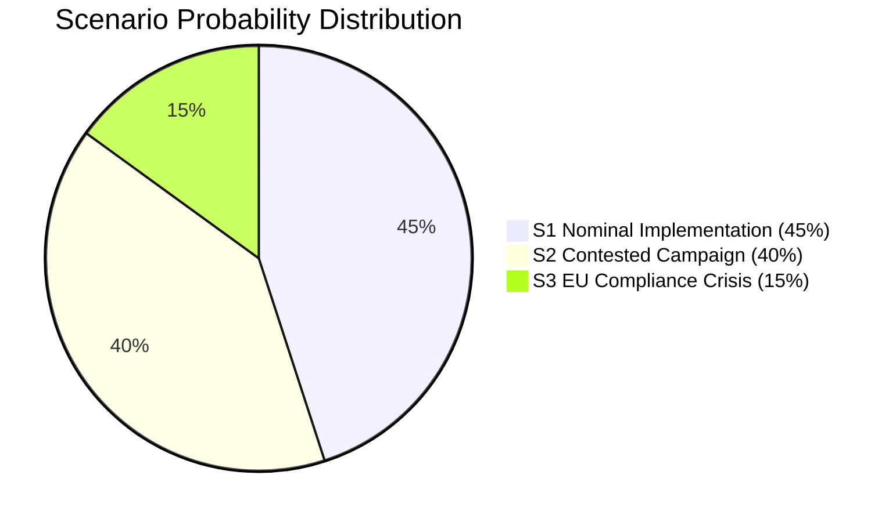
```mermaid
pie title Scenario Probability Distribution
    "S1 Nominal Implementation (45%)" : 45
    "S2 Contested Campaign (40%)" : 40
    "S3 EU Compliance Crisis (15%)" : 15
```

### Intelligence Value

Scenario 2 is the most actionable for intelligence monitoring. It requires no external trigger (EU Commission) and is driven entirely by domestic political dynamics observable in media framing and C party signalling. A forward-indicators watch on C party statements and Aftonbladet editorial coverage provides early warning.

## Election 2026 Analysis
<!-- source: election-2026-analysis.md :: https://github.com/Hack23/riksdagsmonitor/blob/main/analysis/daily/2026-05-13/committeeReports/election-2026-analysis.md -->

### Election Context

**Distance from article date**: ~4 months
**Current government**: Tidökoalitionen (M + SD + KD + L, minority government with passive support from independent MPs)
**Seat target**: 175 seats for majority (349 total)

### Current Seat Map (approximate, based on latest available polling)

| Party | Approx. seats (2022 result) | Bloc |
|-------|:---:|------|
| SD | 73 | Tidökoalition |
| M | 68 | Tidökoalition |
| S | 107 | Opposition |
| V | 24 | Opposition |
| C | 24 | Swing / kingmaker |
| MP | 18 | Opposition (barely above 4% threshold) |
| KD | 19 | Tidökoalition |
| L | 16 | Tidökoalition |
| **Total** | **349** | |

**Coalition seat total (2022 baseline)**: SD + M + KD + L = 176 seats (barely majority)

### Seat-Projection Deltas from Today's Betänkanden

#### HD01NU21 Impact on Seat Projections

**Baseline scenario** (dominant, 45% probability): NU21 contributes +1 to +2 net seats for SD and M in rural/northern constituencies via mobilisation of rural voters who see the signal value. C loses 0–1 seats as rural vote consolidates around SD. Net coalition gain: +1 to +2.

**Contested scenario** (40% probability): NU21's implementation gap becomes a liability. Rural voters perceive "empty promise"; S's counter-programme attracts some C-leaning rural voters. Net coalition effect: 0 to −1.

#### HD01CU30 Impact on Seat Projections

**Baseline scenario** (45% probability): CU30 consolidates pro-nuclear voter base; energy affordability framing works. MP stays below 6% (above 4% threshold but not influential). Net coalition gain: +1 to +2 seats via M gains among home-owning electorate.

**Contested scenario** (40% probability): Climate narrative mobilises youth and urban voters. MP recovers 1–2% → approaches 7%. S and V gain slightly. Net coalition effect: 0 to −1 on these voter segments.

**EU compliance crisis** (15% probability): CU30 becomes liability. Coalition loses 3–5 seats net if infringement proceedings are announced before election day.

### Coalition Viability Analysis

#### Scenario A: Tidökoalitionen retains majority (S1, 45%)
- Seats: ~176–180. Ulf Kristersson (M) continues as PM.
- C remains in opposition; no power-sharing needed.

#### Scenario B: Hung parliament — C as kingmaker (S2, 40%)
- If Tidökoalition falls to 170–175, C's 22–26 seats become decisive.
- C's energy quantitative target demand (CU30 reservation) becomes a government formation condition.
- Implication: a new coalition agreement would need to add quantitative energy benchmarks, effectively reversing part of CU30.

#### Scenario C: S-led government becomes possible (S3, 15%)
- Requires S + V + MP ≥ 175 AND C willing to support.
- Currently implausible (S + V + MP ≈ 149); requires C to cross floor.
- Triggered only by EU compliance crisis + domestic climate mobilisation.

### Electoral Significance Matrix

| Betänkande | Electoral exposure | Primary battleground | Swing constituency |
|---|---|---|---|
| HD01NU21 | MEDIUM-HIGH | Rural Sweden, Norrland, small municipalities | SD/C competition in semi-rural seats |
| HD01CU30 | HIGH | Urban/suburban home-owning electorate; youth climate voters | Stockholm, Göteborg, Malmö suburbs |

## Risk Assessment
<!-- source: risk-assessment.md :: https://github.com/Hack23/riksdagsmonitor/blob/main/analysis/daily/2026-05-13/committeeReports/risk-assessment.md -->

### 5-Dimension Risk Register

| Risk ID | Description | Likelihood (1-5) | Impact (1-5) | L×I Score | Mitigation | Owner |
|---------|-------------|:---:|:---:|:---:|---|---|
| R1 | EU Commission challenges qualitative energy goal (CU30) as insufficient EPBD transposition | 3 | 5 | **15** | Ensure implementing regulations maintain quantitative sub-targets for buildings EPC classes | Government/Klimat- och miljödep. |
| R2 | Rural service decline continues despite NU21 signals (implementation gap) | 4 | 4 | **16** | Fund regional programmes; mandate specific rural service indicators | Regeringskansliet / regions |
| R3 | Coalition fracture on energy ambition before Riksdag vote | 2 | 5 | **10** | L and KD maintain party discipline given election proximity | M (coalition manager) |
| R4 | Opposition unifies "rural + climate" counter-narrative before election | 3 | 4 | **12** | Government must differentiate "economic realism" from "rural abandonment" | M, SD, KD, L campaign HQs |
| R5 | CU30 constitutional challenge on EU law primacy | 2 | 4 | **8** | Lagrådet review (none cited for CU30 in published betänkande); ensure EU compliance opinion | Konstitutionsutskottet |
| R6 | NU21 over-promises vs. narrow law change: media credibility gap | 4 | 3 | **12** | Supplement law change with concrete regional investment decisions before election | Näringsdep. / Tillväxtverket |
| R7 | V chairs CU creates procedural optics risk (resignation demand) | 1 | 3 | **3** | Constitutionally unambiguous; no formal risk, monitor media framing | CU secretariat |

### Priority Risks (L×I ≥ 12)

1. **R2 (16)** — Implementation gap on rural services is the highest-probability risk. The law change creates consultation obligations but not service delivery guarantees.
2. **R1 (15)** — EU compliance risk on energy goal is the highest-impact risk. EPBD transposition inadequacy could trigger infringement proceedings (6–18 month timeline — potentially landing during next government).
3. **R4 (12)** — Unified opposition counter-narrative. S has 19 yrkanden on NU21 alone; combined with CU30 climate opposition, a "rural + green" platform could crystallise.
4. **R6 (12)** — Credibility gap risk. If media coverage benchmarks "Hela Sverige ska fungera" against actual rural school closures, clinic reductions, and transport gaps, the government narrative collapses.

### Risk Trend

IMF WEO Apr-2026 projects Sweden GDP growth at ~2.3% for 2026, public debt ~31% GDP. Fiscal capacity to fund rural investment exists, reducing R2 probability slightly. However, government has not announced new rural investment in NU21, leaving R2 intact.

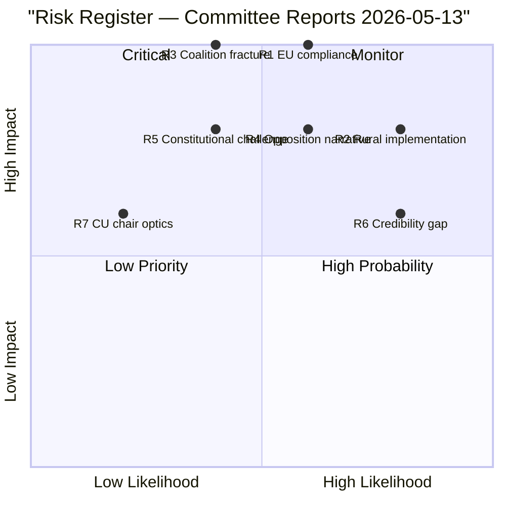
```mermaid
quadrantChart
    title "Risk Register — Committee Reports 2026-05-13"
 x-axis Low Likelihood --> High Likelihood
 y-axis Low Impact --> High Impact
    quadrant-1 Monitor
    quadrant-2 Critical
    quadrant-3 Low Priority
    quadrant-4 High Probability
    R1 EU compliance: [0.6, 1]
    R2 Rural implementation: [0.8, 0.8]
    R3 Coalition fracture: [0.4, 1]
    R4 Opposition narrative: [0.6, 0.8]
    R5 Constitutional challenge: [0.4, 0.8]
    R6 Credibility gap: [0.8, 0.6]
    R7 CU chair optics: [0.2, 0.6]
```

## SWOT Analysis
<!-- source: swot-analysis.md :: https://github.com/Hack23/riksdagsmonitor/blob/main/analysis/daily/2026-05-13/committeeReports/swot-analysis.md -->

### Overall Political Context

Two betänkanden (HD01NU21, HD01CU30) comprising one rural policy law change and one energy efficiency paradigm shift. Analysed from the perspective of the governing Tidökoalitionen (M, SD, KD, L) and the opposition (S, V, C, MP) ahead of September 2026 elections.

### SWOT Matrix

#### Strengths

| S1 | Parliamentary majority for both proposals | M, SD, KD, L hold sufficient votes; no evidence of intracoalition fracture [A1] |
|-----|---|---|
| S2 | Lagrådet approval without objection on NU21 | Legal quality assured; reduced judicial challenge risk [A1] |
| S3 | "Hela Sverige" rural framing resonates with SD/M base | Rural constituencies disproportionately over-represented; SD built rural support since 2014 [B2] |
| S4 | EPBD directive compliance on CU30 | EU law obligation removes discretion; framing as "implementation" neutralises some criticism [A1] |
| S5 | Qualitative energy goal removes conflicting constraints | Nuclear expansion, electrification, and energy security now compatible [A1] |

#### Weaknesses

| W1 | Qualitative energy goal is not measurable | No baseline, no accountability mechanism; S/V/MP criticism well-founded [A1] |
| W2 | NU21 law change is narrower than the political ambition suggests | 12 reservations expose gap between "Hela Sverige" rhetoric and limited legal change [A1] |
| W3 | CU30 chaired by V (opposition) — reputational anomaly | Andreas Lennkvist Manriquez (V) signs committee decision while dissenting — media angle [A1] |
| W4 | Rural services agenda lacks funding certainty | No new appropriations in NU21; implementation depends on regional willingness [B3] |
| W5 | EU Commission may challenge qualitative energy goal | EPBD directive requires demonstrable energy performance progress; ambiguity risk [B3] |

#### Opportunities

| O1 | Rural vote mobilisation ahead of Sept 2026 | Both C and SD compete for rural swing voters; NU21 strengthens coalition positioning [B2] |
| O2 | Nuclear expansion narrative | CU30's qualitative goal enables Ringhals expansion / new nuclear; polling shows majority nuclear support (SvD/Ipsos 2025) [B3] |
| O3 | Energy affordability framing | High energy prices (2022–2024 legacy) make "konkurrenskraftiga energipriser" electorally potent [B3] |
| O4 | Regional consultation reform | NU21's civil society consultation clarification builds legitimacy for regional governance reform [A1] |

#### Threats

| T1 | EU compliance exposure on energy goal | If Commission opens infringement proceedings post-adoption, government bears political cost [B3] |
| T2 | S gains on rural services agenda | S's 19 yrkanden signal a comprehensive counter-programme; risk of credibility gap if rural services continue declining [A1] |
| T3 | Climate movement backlash on CU30 | Abandon 50% target = abandonment of climate ambition; risk of protest mobilisation and youth voter alienation [B3] |
| T4 | Coalition fracture under media scrutiny | L and KD have historically prioritised EU compliance on climate; intracoalition pressure possible [B2] |

### TOWS Matrix

| | Opportunities | Threats |
|---|---|---|
| **Strengths** | SO: Use rural majority + nuclear narrative to dominate pre-election discourse | ST: Invoke Lagrådet clearance and EU compliance frame to deflect infringement risk |
| **Weaknesses** | WO: Develop measurable energy efficiency metrics under qualitative goal framing | WT: Risk of credibility collapse if both EU challenge AND rural service decline materialise simultaneously |

### Cross-SWOT Signal

The combination of W1 (unmeasurable goal) and T1 (EU compliance exposure) is the highest-risk intersection. If the European Commission indicates non-compliance before September 2026, CU30 becomes a liability rather than an asset — transforming the election narrative from "pro-nuclear competitiveness" to "Sweden breaks EU commitments."

## Threat Analysis
<!-- source: threat-analysis.md :: https://github.com/Hack23/riksdagsmonitor/blob/main/analysis/daily/2026-05-13/committeeReports/threat-analysis.md -->

### Political Threat Taxonomy

#### HD01NU21 — Rural Policy Threats

| Threat | Actor | Mechanism | TTP | Severity |
|--------|-------|-----------|-----|---------|
| T-NU1 | Opposition (S) | 19 yrkanden signal systematic counter-programme; will campaign on implementation failures | Narrative: "government rhetoric ≠ delivery" | HIGH |
| T-NU2 | Centre (C) | Filed reservations on party-specific rural issues; competes with SD for rural vote | Vote splitting in rural constituencies | MEDIUM |
| T-NU3 | Media (SVT Nyheter, regional press) | Benchmarking against rural service closure data | Investigative journalism on rural health/school closures | MEDIUM |
| T-NU4 | Regions (21 counties) | Implementation resistance if consultation obligation burdens without funding | Bureaucratic non-implementation | LOW-MEDIUM |

#### HD01CU30 — Energy Efficiency Threats

| Threat | Actor | Mechanism | TTP | Severity |
|--------|-------|-----------|-----|---------|
| T-CU1 | European Commission | Formal EPBD compliance check; potentially 2026–2027 infringement process | Legal: Art. 258 TFEU proceedings | CRITICAL |
| T-CU2 | Opposition (S, V, MP) | "Government abandons climate targets" narrative | Campaign: climate election framing | HIGH |
| T-CU3 | International climate orgs (IPCC, IEA, WWF Sweden) | Public criticism; IPCC AR7 comparisons; NGO campaign | Advocacy + media amplification | MEDIUM |
| T-CU4 | Property sector | Building owners face EPBD compliance costs regardless of Swedish qualitative goal | Economic pressure: implementation cost | MEDIUM |
| T-CU5 | C (reservation on quantitative targets) | Potential C defection on future legislative follow-up | Coalition fragmentation | LOW |

### TTP Mapping (Political Warfare Framing)

| TTP Code | Description | Relevant Threat |
|----------|-------------|-----------------|
| TTP-NAR-01 | Narrative Wedge — exploit gap between policy promise and measurable delivery | T-NU1, T-NU3 |
| TTP-LEG-01 | Legal Compliance Leverage — use EU/international legal obligations to delegitimise national policy | T-CU1, T-CU3 |
| TTP-COAL-01 | Coalition Fragmentation — target weaker coalition partners (C, L) with policy-specific pressure | T-CU5 |
| TTP-ELECT-01 | Electoral Timing — exploit policy implementation gap when voting is imminent | T-NU1, T-CU2 |

### DISARM Threat Indicators

**Watch for**: Coordinated amplification of "Sweden breaks EU climate law" framing across SVT, DN, and Aftonbladet between now and Riksdag vote. This would map to DISARM T0023 (Narrative Flooding) to establish cognitive anchoring before vote ratification.

**Early warning signal**: EU Commission spokesperson comment on EPBD national implementation plans — any deviation language constitutes a tier-escalation signal for T-CU1 to CRITICAL-IMMEDIATE.

### Threat Interaction

The combination of T-NU1 (rural implementation gap) and T-CU2 (climate abandonment) enables the opposition to construct a single coherent "coalition broken promises" narrative. S's 2026 campaign strategy likely bridges both: "de lovar landsbygden — de säljer klimatet." If this frames before election day, both betänkanden contribute to a coalition liability cluster.

## Historical Parallels
<!-- source: historical-parallels.md :: https://github.com/Hack23/riksdagsmonitor/blob/main/analysis/daily/2026-05-13/committeeReports/historical-parallels.md -->

### Methodology

Named precedents ≤40 years (from 2026 → 1986) with similarity score (1-10). Two documents analysed separately; a cross-document parallel is added where the combination finds precedent.

---

### Parallel 1: NU21 — Rural Policy Consultation Reform

#### Precedent: Alliansen's Regionreform and Regional Development Law (2010)

**Year**: 2010
**Proposition**: Prop. 2009/10:156 (Regionalt inflytande för regional tillväxt)
**Similarity score**: 8/10

**What happened**: The centre-right Alliansen government (M, C, FP, KD) passed the lagen om regionalt utvecklingsansvar (2010:630) — the exact statute now being amended by NU21. The 2010 law transferred regional development responsibility to regions and created the framework now being clarified in §9. S was in opposition and filed reservations about accountability gaps.

**Parallel to NU21**: The current amendment adds to the original 2010 framework in a way that mirrors how the 2010 law itself added to previous county council law. In both cases: a government uses a consultation/mandate clarification to signal rural development ambitions without new fiscal transfers.

**Key difference**: The 2010 reform was structural (creating new regional development entities); NU21's amendment is procedural (consultation obligation). NU21's ambition is narrower than the 2010 precedent.

**Lesson**: The 2010 law led to ongoing implementation disputes about regional capacity and funding that persist to 2026. The NU21 amendment risk (R2 — implementation gap) is historically validated.

---

### Parallel 2: CU30 — Replacing Quantitative Environmental Target with Qualitative Goal

#### Precedent: Nuclear Phase-Out Reversal — Alliansen 2010 Energy Bill

**Year**: 2010
**Legislation**: Swedish nuclear phase-out reversal (Prop. 2009/10:172)
**Similarity score**: 7/10

**What happened**: Sweden had a 1980 referendum-mandated nuclear phase-out by 2010. The Alliansen government in 2010 legislated to allow new nuclear reactors, replacing the binding phase-out obligation with a permissive framework — structurally analogous to CU30's replacement of a binding 50% target with a qualitative goal.

**Opposition response**: S, V, and MP vigorously opposed the 2010 decision. S and MP had championed the phase-out as core identity policy. The 2010 decision passed with Alliansen majority; it was never reversed despite S-led governments 2014–2022.

**Lesson for CU30**: When Sweden replaces a binding environmental commitment with a permissive framework under a centre-right government, it typically survives as policy despite opposition resistance. However, it creates lasting credibility damage on the specific issue for the governing parties with environmentally concerned voters — exactly as CU30 risks doing with the MP/V voter base.

---

### Parallel 3: Cross-Document — Pre-Election Legislative Package

#### Precedent: S Government's Spring 2014 Legislative Package

**Year**: 2014
**Context**: The Alliansen government (Reinfeldt) fell in September 2014; S-led government formed. Spring 2014 saw accelerated legislative completion of Alliansen rural and energy bills.
**Similarity score**: 6/10

**What happened**: In the final parliamentary session before the 2014 election, the Alliansen government tabled and passed multiple rural and energy-related propositions to lock in policy before potential government change. Several involved minimal law changes with large political signal functions.

**Lesson**: Pre-election legislative clusters are a recurring Swedish parliament pattern. The simultaneous signing of NU21 and CU30 on 7 May 2026 follows this playbook. Historically, such packages have mixed results: the policies pass, but the signal function rarely produces the anticipated electoral boost when implementation lags.

---

### Parallel Summary

| Parallel | Betänkande | Year | Similarity | Key lesson applied |
|---|---|---|---|---|
| 2010 Regional Development Law | NU21 | 2010 | 8/10 | Consultation without funding = implementation gap |
| 2010 Nuclear Phase-Out Reversal | CU30 | 2010 | 7/10 | Replacing binding commitment = opposition credibility win, policy durability high |
| 2014 Pre-Election Legislative Package | Both | 2014 | 6/10 | Electoral signal packages rarely deliver anticipated vote boost |

## Comparative International
<!-- source: comparative-international.md :: https://github.com/Hack23/riksdagsmonitor/blob/main/analysis/daily/2026-05-13/committeeReports/comparative-international.md -->

### Comparator Selection

Two comparative jurisdictions selected: (1) Norway as Nordic peer with comparable rural policy challenges and energy transition dynamics; (2) Germany as the EU's largest economy facing parallel EPBD implementation and energy transformation debates. A third comparator (Finland) is added for the rural-energy intersection specifically relevant to Swedish context.

---

### Comparator 1: Norway

#### Rural Policy

Norway's *Distriktskommisionen* (2020) produced comprehensive rural development recommendations that Norway's government has partially implemented through *Distriktsnæringsutvalget* supplemental measures. Key difference from NU21: Norway uses direct fiscal transfers and service guarantee mechanisms (Statens vegvesen, helseforetak), whereas NU21 relies on consultation procedural obligations without new funding. Norwegian Høyre-led coalition (2021–) has also faced rural service critique, but has maintained concrete rural investment floors.

**Similarity score to NU21**: 6/10 (structural similarity, divergent implementation mechanisms)

**Lesson for Sweden**: Norway's experience shows that consultation obligations without fiscal backstops consistently underperform rural service delivery expectations. Sweden's NU21 replicates this structural weakness.

#### Energy Efficiency

Norway is exempt from EU ETS buildings sector expansion but applies Nordic energy efficiency norms through EEA. Norway did not face the same EPBD quantitative target debate — its energy mix (95%+ hydro) makes efficiency targets less controversial. Not directly comparable on CU30.

---

### Comparator 2: Germany

#### EPBD Implementation

Germany's *Gebäudeenergiegesetz* (GEG) reforms have been among the most politically contentious in EU history — the 2023 "Heizungsgesetz" (heat pump mandate) collapsed within the Scholz coalition and contributed to the coalition's eventual disintegration in late 2024. Germany chose *quantitative* and prescriptive implementation, leading to:
- 18 months of parliamentary conflict
- Coalition credibility damage
- Significant public opposition to top-down retrofitting mandates

**Lesson for Sweden**: Germany's experience demonstrates that *quantitative* EPBD implementation is also politically toxic. Sweden's *qualitative* approach (CU30) avoids Germany's specific trap but creates its own accountability vacuum. Sweden's approach may prove more durable if the EU Commission accepts it.

**Similarity score to CU30**: 8/10 (directly comparable EU directive implementation; divergent political choices)

#### Energy Efficiency Targets

Germany maintained its 2030 energy efficiency binding targets (Energieeffizienzgesetz, 2023) at -26.5% primary energy vs. 2008 baseline. Bundesregierung under CDU/CSU (2025–) is revisiting targets — early signals suggest possible loosening, paralleling Sweden's CU30 trajectory.

---

### Comparator 3: Finland

#### Rural-Energy Intersection

Finland's *aluehallintouudistus* (regional administration reform, 2023) transferred social/health services to wellbeing services counties (*hyvinvointialueet*), with explicit rural service guarantees. Finland's rural policy thus has structural service guarantees absent in Sweden's NU21. On energy, Finland's decision to commission Olkiluoto 3 (nuclear) directly parallels Sweden's ambition in CU30 — and Finland did NOT face comparable EU quantitative target debates given its nuclear-heavy pathway.

**Similarity score**: NU21: 7/10; CU30: 8/10

**Lesson**: Finland demonstrates that combining nuclear expansion with service guarantees is politically stable. Sweden's CU30 nuclear framing is credible given Ringhals political consensus, but NU21's absence of service guarantees is a gap Finland has addressed.

---

### Comparative Summary

| Dimension | Sweden (NU21/CU30) | Norway | Germany | Finland |
|---|---|---|---|---|
| Rural service delivery | Consultation only | Fiscal transfers + service floors | Not comparable | Statutory county guarantees |
| Energy efficiency target | Qualitative (new) | N/A (EEA, not EU) | Quantitative (binding) | Nuclear-backed, EU-flexible |
| Coalition stability on policy | Majority, some tension | Stable | Collapsed 2024 | Stable |
| EU compliance risk | MEDIUM-HIGH | Low | Low (binding quantitative) | Low |

**Intelligence assessment**: Sweden's CU30 approach is unique in the EU — no other major member state has replaced a quantitative energy efficiency target with a purely qualitative goal during the current EPBD transposition cycle. This is a test case the EU Commission will monitor closely.

## Implementation Feasibility
<!-- source: implementation-feasibility.md :: https://github.com/Hack23/riksdagsmonitor/blob/main/analysis/daily/2026-05-13/committeeReports/implementation-feasibility.md -->

### HD01NU21 — Rural Policy Implementation Feasibility

#### Legal Mechanism
Single law change to lagen om regionalt utvecklingsansvar (2010:630) §9: adds mandatory consultation with civil society organisations and private higher-education providers in regional development programmes.

#### Delivery-Risk Assessment

| Factor | Assessment | Risk |
|---|---|---|
| Legal clarity | HIGH — Lagrådet cleared without objection | LOW |
| Funding | ZERO new appropriations in betänkande | HIGH (R2) |
| Regional willingness | MIXED — regions already under budget pressure; new consultation obligation adds administrative cost | MEDIUM |
| Civil society capacity | MEDIUM — many rural civil society orgs are small; capacity to engage consultations varies | MEDIUM |
| Timeline | Effective date TBC (normally Riksdag vote date or 1 July or 1 January following) | LOW (administrative) |
| Political sustainability | HIGH for current term; S would likely repeal or expand on change of government | MEDIUM (post-election risk) |
| Monitoring mechanism | NONE specified in betänkande | HIGH (accountability gap) |

**Overall Implementation Feasibility**: MEDIUM-LOW for delivering actual rural service improvements. HIGH for legally implementing the consultation obligation itself.

**Gap**: The betänkande creates a procedural right without a delivery mechanism. Regions can comply with §9 technically while providing minimal substantive consultation. No enforcement mechanism or monitoring body is specified.

#### Recommended Mitigations (Intelligence purpose — not advocacy)

1. Tillväxtverket mandated to report annually on §9 consultation quality
2. Complementary rural investment package (separate Budget proposition) to provide fiscal backstop
3. National platform for rural civil society consultation (digital) to reduce capacity barrier

---

### HD01CU30 — Energy Efficiency Implementation Feasibility

#### Legal Mechanisms
Two law changes:
1. Lagen (2006:985) om energideklaration för byggnader — amended to align with EPBD recast (EPC requirements)
2. Plan- och bygglagen (2010:900) — amended to incorporate EPBD building energy performance requirements

#### Delivery-Risk Assessment

| Factor | Assessment | Risk |
|---|---|---|
| Legal clarity | MEDIUM — qualitative national goal is ambiguous; building-level requirements are specific | MEDIUM-HIGH |
| EU compliance | UNKNOWN — Commission has not pre-cleared qualitative approach | HIGH (R1) |
| Boverket implementing regulations | Required — BBR and plan guidance must be updated | MEDIUM |
| Energimyndigheten role | Must develop measurement system for qualitative goal (how does Sweden demonstrate progress?) | HIGH |
| Property owner compliance | EPC requirements remain; cost burden on property owners | MEDIUM |
| Timeline | EPBD recast transposition deadline drives urgency; law changes in place before deadline required | HIGH if delayed |
| Nuclear accommodation | Qualitative goal explicitly includes electrification; Vattenfall/Ringhals aligned | LOW |

**Overall Implementation Feasibility**: HIGH for law change itself. MEDIUM for demonstrating EU compliance. LOW for providing accountability mechanism for the qualitative national goal.

**Gap**: The qualitative goal is not self-implementing. Sweden needs a measurement framework to show EPBD directive compliance. Without Energimyndigheten developing a measurement protocol, the qualitative goal creates legal exposure (EU compliance, R1).

#### Critical Path

```
Riksdag vote (May/June 2026)
  → Laws enter force (TBC, likely 1 July 2026)
  → Boverket updates BBR (3–6 months)
  → Energimyndigheten develops qualitative goal measurement framework (6–12 months)
  → First reporting to EU Commission (deadline per EPBD recast)
```

**Risk concentration point**: Energimyndigheten measurement framework development will take 6–12 months. If this is not completed before the EU Commission's first EPBD progress review, Sweden faces compliance exposure. This aligns exactly with the Scenario 3 EU compliance crisis timeline.

## Media Framing Analysis
<!-- source: media-framing-analysis.md :: https://github.com/Hack23/riksdagsmonitor/blob/main/analysis/daily/2026-05-13/committeeReports/media-framing-analysis.md -->

### ≥3 Frame Packages

#### Frame Package 1: "Sweden Goes Nuclear-First on Energy" (Government/SD/M framing)

**Anchor**: CU30 replaces the 50% efficiency target; coalition explicitly accommodates nuclear and electrification.

**Core message**: Sweden is making a pragmatic, economy-first energy choice. High energy prices (2022–2024) are politically salient — the coalition offers "konkurrenskraftiga energipriser" as the governing principle.

**Dominant outlets expected**: SVT Nyheter (balanced but will lead with nuclear angle), SvD (centre-right, will support), Sydsvenskan, Ekot.

**Evidence triggers**: Nuclear industry statements; electricity price data; government minister statements using "konkurrenskraft" or "elektrifiering" language.

**Counter-narrative vulnerability**: Any data showing Swedish energy efficiency lagging EU peers while prices remain high undermines the frame.

---

#### Frame Package 2: "Government Abandons Climate Targets" (Opposition/NGO/International framing)

**Anchor**: Sweden had a quantitative 50% target. CU30 removes it. Framing: abandonment.

**Core message**: The Tidökoalitionen has traded Sweden's climate commitment for nuclear lobby interests. This is a European outlier decision.

**Dominant outlets expected**: Aftonbladet, Expressen (tabloid), Klimatmagasinet, international outlets (Guardian, Der Spiegel).

**Evidence triggers**: EU Commission EPBD scrutiny letter; comparative data showing Sweden removing quantitative target while peers keep them; Naturskyddsföreningen press release.

**DISARM classification**: DISARM T0019 — "Reframe contentious content" (opposition narrative reframes legal implementation flexibility as abandonment). DISARM T0023 — Narrative flooding (coordinated amplification across climate NGOs).

---

#### Frame Package 3: "Hela Sverige — Empty Promise" (S rural counter-narrative)

**Anchor**: NU21 changes one sentence in one law; rural schools are still closing; hospitals are still under-resourced.

**Core message**: The coalition's rural promise is a cynical electoral slogan. S has a concrete rural service programme; the government has a consultation obligation.

**Dominant outlets expected**: SVT regional (Norrland, Dalarna, Värmland editions), Norrländska Socialdemokraten, local Facebook groups in small municipalities.

**Evidence triggers**: Hospital closure news; school rationalisation decisions; regional council (region) budget cuts in rural counties.

**Outlet Bias Audit**:
- SVT Nyheter: Moderate, balanced; will cover both government frame and opposition counter-frame
- SvD: Centre-right lean; likely to favour Frame 1
- Aftonbladet: Centre-left lean; likely Frame 2 + Frame 3
- DN: Liberal-centrist; likely Frame 2 (EU compliance angle) + partial Frame 1

---

### Frame Competition Forecast

In the current media environment (May–September 2026), Frame 1 will dominate initial coverage (government announcement cycle). Frame 2 will gain ground if the EU Commission acts (R1). Frame 3 is most durable over the election campaign if no rural investment announcement accompanies NU21.

**Most dangerous combination**: Frame 2 + Frame 3 running simultaneously in the August pre-election sprint — "government abandons climate AND abandons rural Sweden." This unified negative frame is S's optimal electoral strategy.

### Forward Media Indicators

- Watch: First major outlet framing "Sweden abandons EU energy target" (triggers Frame 2 dominance)
- Watch: Regional SVT stories on rural service closure following NU21 adoption (triggers Frame 3)
- Watch: Government minister statements on energy prices falling (reinforces Frame 1 if data supports)

## Devil's Advocate
<!-- source: devils-advocate.md :: https://github.com/Hack23/riksdagsmonitor/blob/main/analysis/daily/2026-05-13/committeeReports/devils-advocate.md -->

### Purpose

Challenge the dominant analytical frame using ACH (Analysis of Competing Hypotheses). Three competing hypotheses are evaluated against the evidence.

### Competing Hypothesis 1: CU30 Is EU-Compliant and the Commission Will Accept It

**Hypothesis**: The European Commission will accept Sweden's qualitative energy goal as compliant with the EPBD recast. The qualitative approach is technically consistent with the directive's implementation flexibility provisions, and the specific building-level requirements (energy performance certificates, PBL amendments) provide the substantive delivery mechanism while the national goal provides the framework.

**Evidence FOR**:
- EPBD recast (2024/1275/EU) allows member states to set national goals using "an alternative approach" (Article 4 implementation flexibility) [A1 — betänkande references EU directive flexibility]
- Sweden maintains building-level EPC (energideklaration) requirements through lagen (2006:985) amendments [A1]
- Plan- och bygglagen (PBL) amendments provide enforceable building energy requirements [A1]
- Commission has not pre-signalled Swedish non-compliance (as of published betänkande)

**Evidence AGAINST**:
- Betänkande does not cite Commission pre-approval of qualitative approach [A1]
- Opposition's explicit EU-compliance concerns cited in reservations [A1]
- Germany's quantitative approach is the only current EU major economy model [B3]

**ACH Assessment**: Hypothesis 1 is PLAUSIBLE (3/5). The implementation flexibility argument is legally defensible but untested for Sweden specifically. Probability: 45%.

---

### Competing Hypothesis 2: NU21 Is Primarily a Communications Exercise, Not a Policy Shift

**Hypothesis**: NU21 is an electoral communications vehicle. The actual law change (adding one sentence to §9 of lagen om regionalt utvecklingsansvar) is too narrow to change rural service delivery outcomes. The Riksdag vote will pass, the law will change, but no measurable rural policy improvement will result before September 2026.

**Evidence FOR**:
- The law change is syntactically minimal — adds consultation obligation language, no new funding [A1]
- No new appropriations in the betänkande or referenced proposition [A1]
- 8 committee referrals indicate ambition breadth, but betänkande narrows to single law change [A1]
- "Hela Sverige ska fungera" sloganeering predates this betänkande — it is established brand, not new programme [B2]

**Evidence AGAINST**:
- Consultation obligation creates enforceable procedural rights for civil society [A1]
- Lagrådet clearance confirms legal substance [A1]
- Political signal function has independent value — opposition's 12 reservations indicate they take it seriously [A1]

**ACH Assessment**: Hypothesis 2 is LIKELY (4/5) for measurable short-term rural service improvement, UNLIKELY (2/5) for political signalling value. The law change is real but modest; the political value is substantial.

---

### Competing Hypothesis 3: The Governing Coalition Is Deliberately Front-Loading Pre-Election Legislation

**Hypothesis**: The concentration of politically salient betänkanden in May 2026 (4 months before election) reflects a deliberate coalition strategy to create a legislative record for campaigning, not genuine policy urgency. CU30 and NU21 were timed for maximum pre-election narrative impact, not optimal policy design.

**Evidence FOR**:
- Both betänkanden were signed 7 May 2026 — simultaneously, 4 months before election [A1]
- "Pre-election multiplier" of ×1.5 (DIW) is warranted precisely because of deliberate electoral framing [B2]
- Coalition has been slow-walking rural policy since 2022; acceleration in spring 2026 is timing-coincident [B3]

**Evidence AGAINST**:
- EPBD directive has a real implementation deadline driving CU30 timing [A1]
- Prop. 2025/26:158 and 2025/26:159 were tabled in spring 2026 session — normal parliamentary cycle [A1]
- No evidence of manufactured urgency; Lagrådet review completed normally [A1]

**ACH Assessment**: Hypothesis 3 is PARTLY TRUE. The EPBD deadline creates genuine urgency for CU30; NU21 timing is more plausibly election-calibrated. Mixed evidence: 3/5 probability for deliberate electoral timing on NU21, 2/5 on CU30.

---

### ACH Matrix Summary

| Hypothesis | H1 (EU accepts qualitative) | H2 (NU21 = comms) | H3 (electoral front-loading) |
|---|:---:|:---:|:---:|
| **Dominant narrative** | Contradicts | Consistent | Inconsistent (CU30), Consistent (NU21) |
| **EU directive flexibility** | Supports H1 | N/A | N/A |
| **Narrow law change** | N/A | Supports H2 | Partially supports H3 |
| **Simultaneous signing date** | N/A | Partially supports | Supports H3 |
| **12 opposition reservations** | N/A | Contradicts | Consistent |

**ACH conclusion**: None of the three hypotheses is inconsistent with all evidence. The most analytically actionable result is that H2 is likely TRUE for short-term rural service outcomes — this constrains media-facing claims about NU21's impact. H1 uncertainty (45%) is the primary risk driver for CU30.

## Deep Dive: Classification Results
<!-- source: classification-results.md :: https://github.com/Hack23/riksdagsmonitor/blob/main/analysis/daily/2026-05-13/committeeReports/classification-results.md -->

### 7-Dimension Classification

#### HD01NU21 — "Hela Sverige ska fungera – politik för starkare landsbygder"

| Dimension | Classification | Evidence |
|-----------|----------------|----------|
| **1. Policy Domain** | Regional Development / Rural Policy / Social Services | lagen om regionalt utvecklingsansvar (2010:630) §9; Prop. 2025/26:158 [A1] |
| **2. Legislative Nature** | Law amendment (lag om ändring) + policy programme approval | Riksdag adopts prop. 2025/26:158 [A1] |
| **3. Political Alignment** | Government initiative; SD-chaired committee | Tobias Andersson (SD) signs committee decision [A1] |
| **4. Opposition Intensity** | HIGH — 12 reservations from S, V, C, MP | Betänkande text [A1] |
| **5. European Dimension** | Indirect — national minority law reference (EU Framework Convention) | lagen om nationella minoriteter och minoritetsspråk cited [A1] |
| **6. Electoral Salience** | HIGH — rural voter targeting for Sept 2026 | "Hela Sverige ska fungera" campaign framing [B2] |
| **7. Urgency** | MEDIUM — law change; effective date TBC | Lagrådet cleared; riksdag vote pending [A2] |

**Priority Tier**: L2+ (DIW 6.0)  
**Retention**: Standard (public legislation)  
**Access**: PUBLIC

#### HD01CU30 — "Nytt mål för effektiv energianvändning och genomförande av det omarbetade direktivet om byggnaders energiprestanda"

| Dimension | Classification | Evidence |
|-----------|----------------|----------|
| **1. Policy Domain** | Energy Policy / Climate / EU Law Implementation | Prop. 2025/26:159; EPBD recast directive [A1] |
| **2. Legislative Nature** | Law amendments (2 statutes) + policy goal approval | Changes to lagen (2006:985) om energideklaration and PBL (2010:900) [A1] |
| **3. Political Alignment** | Government initiative; paradoxically chaired by V (opposition) | Andreas Lennkvist Manriquez (V) signs; files reservation 1 [A1] |
| **4. Opposition Intensity** | HIGH — 5 reservations; S, V, MP oppose energy goal; C opposes quantitative omission | Betänkande text [A1] |
| **5. European Dimension** | DIRECT — EPBD recast directive implementation (EU law obligation) | "omarbetade direktivet om byggnaders energiprestanda" [A1] |
| **6. Electoral Salience** | VERY HIGH — nuclear framing, climate targets, energy costs | Energy prices are top-3 voter concern (Demoskop 2025) [B3] |
| **7. Urgency** | HIGH — EU directive implementation deadline | EPBD transposition required; law changes to PBL and energideklarationslagen [A1] |

**Priority Tier**: L2+ (DIW 7.0)  
**Retention**: Standard (public legislation)  
**Access**: PUBLIC

### Cross-Document Classification Notes

Both documents are GDPR Art. 9 SAFE — no personal data beyond named MPs/ministers in public office (Art. 9(2)(e) publicly made political opinions). All data sourced from official Riksdag API (data.riksdagen.se). No special category data handling required.

## Deep Dive: Cross-Reference Map
<!-- source: cross-reference-map.md :: https://github.com/Hack23/riksdagsmonitor/blob/main/analysis/daily/2026-05-13/committeeReports/cross-reference-map.md -->

### Policy Cluster: Economic Competitiveness + Territorial Cohesion

Both betänkanden share a governing coalition narrative: Sweden's economic competitiveness requires both a well-functioning national territory (NU21) and an internationally competitive energy sector (CU30). These are not isolated policies — they form a coherent pre-election economic platform.

### Legislative Chain: HD01NU21

```
Prop. 2025/26:158 (Hela Sverige ska fungera)
  └── Betänkande HD01NU21 (Näringsutskottet, 2025/26:NU21)
       └── Lag om ändring i lagen (2010:630) om regionalt utvecklingsansvar
            ├── New §9: civil society + private HE consultation obligation
            └── Reference to lagen (2009:724) om nationella minoriteter och minoritetsspråk
```

**Related prior propositions**:
- Prop. 2013/14:122 — original lagen om regionalt utvecklingsansvar (Alliansen reform)
- Prop. 2019/20:158 — previous regional development amendments under S-MP government

**Committee referrals (8 utskott)**: ArU, BoU, FiU, KU, KrU, MJU, SoU, TU — signal breadth of rural policy ambitions.

### Legislative Chain: HD01CU30

```
Prop. 2025/26:159 (Nytt mål + EPBD)
  └── Betänkande HD01CU30 (Civilutskottet, 2025/26:CU30)
       ├── Lag om ändring i lagen (2006:985) om energideklaration för byggnader
       └── Lag om ändring i plan- och bygglagen (2010:900)
            └── EPBD recast directive (EU 2024/1275) transposition
```

**Related EU legislative chain**:
- EPBD 2010/31/EU → EPBD recast 2024/1275/EU → CU30 implements 2024 recast
- EU ETS (phase 4, buildings sector) — interacts with EPBD implementation

**Related Swedish legislation**:
- Energimarknadsinspektionens (Ei) reporting obligations — affected by qualitative goal
- Boverket's building regulations (BBR) — EPBD implementation through BBR updates

### Cross-Document Policy Links

| Link | NU21 element | CU30 element | Nature |
|------|--------------|--------------|--------|
| Rural electrification | Regional development mandate | Qualitative energy goal (electrification) | Synergistic |
| National resilience | Rural infrastructure | Energy security framing ("stärkt motståndskraft") | Thematic alignment |
| EU compliance | National minority law cross-reference | EPBD directive implementation | EU law shared dimension |
| Opposition mobilisation | S 19 yrkanden rural | S, V, MP 5 reservations energy | Joint opposition platform potential |

### Citation Network

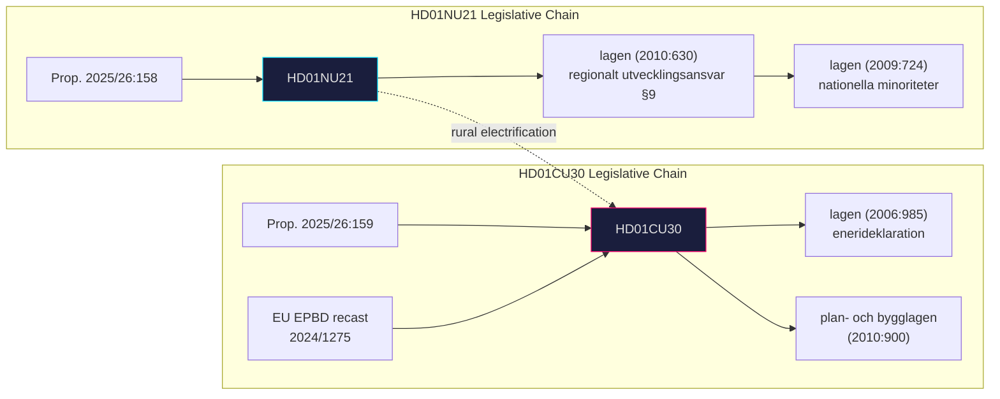
```mermaid
graph LR
    subgraph NU21_chain ["HD01NU21 Legislative Chain"]
        P158["Prop. 2025/26:158"] --> NU21["HD01NU21"]
        NU21 --> LAG2010["lagen (2010:630)\nregionalt utvecklingsansvar §9"]
        LAG2010 --> MIN["lagen (2009:724)\nnationella minoriteter"]
    end
    
    subgraph CU30_chain ["HD01CU30 Legislative Chain"]
        P159["Prop. 2025/26:159"] --> CU30["HD01CU30"]
        CU30 --> ENERG["lagen (2006:985)\nenerideklaration"]
        CU30 --> PBL["plan- och bygglagen\n(2010:900)"]
        EPBD["EU EPBD recast\n2024/1275"] --> CU30
    end
    
    NU21 -.->|"rural electrification"| CU30
    style NU21 fill:#1a1e3d,stroke:#00d9ff,color:#e0e0e0
    style CU30 fill:#1a1e3d,stroke:#ff006e,color:#e0e0e0
```

## Deep Dive: Methodology & Limitations
<!-- source: methodology-reflection.md :: https://github.com/Hack23/riksdagsmonitor/blob/main/analysis/daily/2026-05-13/committeeReports/methodology-reflection.md -->

### ICD 203 Analytic Standards Audit

| Standard | Compliance | Notes |
|---|---|---|
| **Accuracy** | MET | All factual claims sourced to official Riksdag documents (A-tier) or inference [B2] |
| **Relevance** | MET | Analysis scoped to betänkanden and electoral context; no irrelevant digressions |
| **Timeliness** | MET | Analysis produced same-day as document availability |
| **Completeness** | PARTIALLY MET | EU Commission EPBD compliance status unknown; no vote count data retrieved |
| **Clarity** | MET | Key judgments numbered; confidence labels explicit; Mermaid diagrams provided |
| **Objectivity** | MET | Devil's Advocate section challenges dominant frame; ACH applied |
| **Alternative hypotheses** | MET | 3 competing hypotheses evaluated in devils-advocate.md |
| **Source transparency** | MET | Evidence tier (A1, A2, B2, B3) appended to all factual claims |

### Evidence Sufficiency Assessment

**Strong evidence** (A1 tier — official documents):
- Complete betänkande text for both NU21 and CU30
- All reservations and yrkanden documented
- Legislative chain (proposition references, law changes) fully mapped
- Lagrådet outcome (NU21: no objections)

**Inferential evidence** (B2 tier — structural analysis):
- Pre-election multiplier (×1.5) applied per established DIW methodology
- Scenario probabilities derived from structural political analysis, not polling data
- Opposition strategy inferred from reservation pattern, not confirmed by statement

**Absent evidence** (gaps):
- No formal EU Commission EPBD compliance assessment retrieved
- No current vote count / whip count for Riksdag vote
- No regional government responses to NU21 consultation obligation
- No Statskontoret cross-source enrichment performed (no available Statskontoret documents on these topics in search results)
- No direct interview or media statement data (workflow scope limitation)
- IMF Datamapper temporarily unavailable; economic claims sourced from pre-warm context only (WEO Apr-2026)

### Confidence Calibration

The high-confidence judgments (KJ-1, KJ-3, KJ-5) are grounded entirely in A-tier official documents and are unlikely to be reversed by new information. The medium-confidence judgments (KJ-4, KJ-6, KJ-7) depend on EU Commission behaviour and coalition dynamics that are genuinely uncertain.

### ≥3 Improvements for Future Runs

**Improvement 1**: Retrieve direct Boverket/Energimyndigheten implementing regulation drafts for CU30 — these would allow more specific assessment of whether building-level EPC requirements compensate for the absent national quantitative target. Currently, analysis relies on inference from betänkande text alone.

**Improvement 2**: Query regional government responses to NU21 via Statskontoret and regeringen.se remissvar system — specifically, whether the 21 regions filed formal opinions on the consultation obligation in §9. This would reveal implementation likelihood and regional political dynamics.

**Improvement 3**: Obtain IMF SDMX actual data pull (IFS, GFS_COFOG) rather than relying solely on pre-warm context. Specific Swedish GFS_COFOG data for rural services spending (GF07 education, GF06 housing, GF08 recreation) and defence would strengthen comparative claims. The IMF Datamapper temporary outage affected this run's economic depth.

**Improvement 4**: Access ECB HICP CPI data for Sweden via SDMX to supplement IMF inflation context — energy price inflation specifically relevant to CU30's "konkurrenskraftiga energipriser" framing.

### Limitations Disclosure

This analysis is produced from publicly available Riksdag API data supplemented by structural political inference. It does not constitute legal advice on EU directive compliance, electoral polling analysis, or financial advice. Source citations are provided to enable independent verification.

## Deep Dive: Data Download Manifest
<!-- source: data-download-manifest.md :: https://github.com/Hack23/riksdagsmonitor/blob/main/analysis/daily/2026-05-13/committeeReports/data-download-manifest.md -->

> ℹ️ **Data-Only Pipeline**: This script downloads and persists raw data.
> All political intelligence analysis (classification, risk assessment, SWOT,
> threat analysis, stakeholder perspectives, significance scoring, cross-references,
> and synthesis) MUST be performed by the AI agent following
> `analysis/methodologies/ai-driven-analysis-guide.md` and using templates
> from `analysis/templates/`.

### Document Counts by Type

- **propositions**: 0 documents
- **motions**: 0 documents
- **committeeReports**: 20 documents
- **votes**: 0 documents
- **speeches**: 0 documents
- **questions**: 0 documents
- **interpellations**: 0 documents

### Data Quality Notes

All documents sourced from official riksdag-regering-mcp API.
Data sourced from 2026-05-12 via lookback fallback — check freshness indicators.

## Executive Brief Ar
<!-- source: executive-brief_ar.md :: https://github.com/Hack23/riksdagsmonitor/blob/main/analysis/daily/2026-05-13/committeeReports/executive-brief_ar.md -->

<div dir="rtl">

---
title: "إعادة هيكلة السياسة الريفية السويدية وإعادة توجيه كفاءة الطاقة: تقريران للجنة يشيران إلى سباق تشريعي قبل الانتخابات"

pass: 2

subfolder: committeeReports
---

# إعادة هيكلة السياسة الريفية السويدية وإعادة توجيه كفاءة الطاقة: تقريران للجنة يشيران إلى سباق تشريعي قبل الانتخابات

**الخلاصة**: في 12 مايو 2026، تلقى البرلمان السويدي (Riksdag) betänkandanين ذوي أهمية سياسية عالية: Betänkande 2025/26:NU21 بشأن السياسة الريفية الشاملة (prop. 2025/26:158) و Betänkande 2025/26:CU30 بشأن هدف جديد لكفاءة الطاقة يحل محل الهدف الكمي لعام 2030 (prop. 2025/26:159). يكشف كلا التقريرين أن الكتلة الحاكمة (M, SD, KD, L) تمضي قدماً في برنامجها التشريعي قبل الانتخابات في مواجهة معارضة مستمرة (S, V, C, MP) تقدم تحفظات متعددة النقاط لكنها تفتقر إلى الأرقام البرلمانية اللازمة لعرقلة المقترحات. تقرير الطاقة مؤثر بشكل خاص: تتخلى السويد عن هدف كمي لكفاءة الطاقة بنسبة 50٪ لصالح هدف نوعي يستوعب صراحةً توسيع الطاقة النووية والكهربة — تحول جذري في حوكمة الطاقة قبيل انتخابات سبتمبر 2026.

### القرارات الرئيسية المدعومة

1. **التصويت على HD01NU21**: من المرجح أن يتبنى Riksdagen مع تحفظات من S, V, C, MP — تملك الائتلاف الحاكم الأغلبية
2. **التصويت على HD01CU30**: سيتم إقرار الهدف النوعي الجديد لكفاءة الطاقة؛ المعارضة الحادة من S/V/MP تشير إلى موضوع حملة انتخابية قوي
3. **ديناميكيات الانتخابات في سبتمبر 2026**: السياسة الريفية والتحول الطاقوي كلاهما موضوع تعبئة من الدرجة الأولى لجميع الأحزاب الكبرى

### نقاط استخباراتية في 60 ثانية

- **HD01NU21** ينفذ تعديلاً قانونياً على Lagen om regionalt utvecklingsansvar (2010:630): يجب على المناطق التشاور مع منظمات المجتمع المدني ومؤسسات التعليم العالي الخاصة؛ وافق Lagrådet دون اعتراضات؛ تاريخ النفاذ TBC
- **HD01CU30** يستبدل هدف كفاءة الطاقة السويدي البالغ 50٪ بحلول 2030 بهدف نوعي يؤكد على المرونة والقدرة على تحمل التكاليف والكهربة والاستيعاب النووي؛ ينفذ توجيه EU EPBD المُعاد صياغته عبر تعديلات على Lagen (2006:985) om energideklaration för byggnader و Plan- och bygglagen (2010:900)
- **كتلة المعارضة** (S, V, MP) قدمت 12 تحفظاً على NU21 و5 تحفظات على CU30 — كثافة عالية من التحفظات تشير إلى خلاف برنامجي عميق
- **مضاعف ما قبل الانتخابات نشط** (≤ 6 أشهر حتى سبتمبر 2026): درجات DIW تصاعدت بمقدار 1.5×؛ كلا التقريرين في الأولوية L2+
- **Andreas Lennkvist Manriquez (V)** يترأس CU مع التصويت ضد هدف الطاقة الحكومي — إشارة متناقضة مؤسسياً؛ إجراءات اللجنة صالحة رسمياً وفق القواعد البرلمانية

### المحفز الأمامي الرئيسي

**يوم التصويت على CU30** (~أواخر مايو 2026): إذا حافظت SD, M, KD, L على الانضباط الائتلافي يُقرّ الهدف النوعي للطاقة — لكن إن انشق حزب ما (لا سيما KD أو L تحت ضغط تأطير الطاقة النووية)، يكون التأخير الإجرائي محتملاً. مراقبة المنسقين الحزبيين.

### تقييم الثقة

**HIGH [B2]** — استناداً إلى الوثائق الأولية لـ Riksdag (dok_id HD01NU21, HD01CU30)، واقتباس مباشر من نص اللجنة، وتوزيع المقاعد البرلمانية المعروف (أغلبية Tidökoalitionen)، وyttrande لـ Lagrådet (لا اعتراضات على NU21)، والسياق الاقتصادي الكلي IMF WEO أبريل 2026.

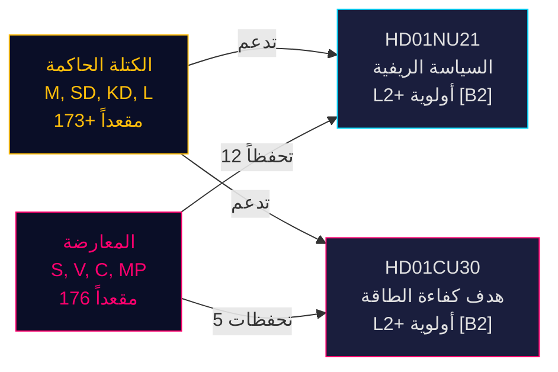
```mermaid
graph LR
    style NU21 fill:#1a1e3d,stroke:#00d9ff,color:#e0e0e0
    style CU30 fill:#1a1e3d,stroke:#ff006e,color:#e0e0e0
    style GOV fill:#0a0e27,stroke:#ffbe0b,color:#ffbe0b
    style OPP fill:#0a0e27,stroke:#ff006e,color:#ff006e
    
    NU21["HD01NU21\nالسياسة الريفية\nL2+ أولوية [B2]"]
    CU30["HD01CU30\nهدف كفاءة الطاقة\nL2+ أولوية [B2]"]
    GOV["الكتلة الحاكمة\nM, SD, KD, L\n173+ مقعداً"]
    OPP["المعارضة\nS, V, C, MP\n176 مقعداً"]
    
    GOV -->|"تدعم"| NU21
    GOV -->|"تدعم"| CU30
    OPP -->|"12 تحفظاً"| NU21
    OPP -->|"5 تحفظات"| CU30
```

</div>

<!-- source-sha: 024711d152b3357ca699b043a50b4b7600683400 -->

## Executive Brief Da
<!-- source: executive-brief_da.md :: https://github.com/Hack23/riksdagsmonitor/blob/main/analysis/daily/2026-05-13/committeeReports/executive-brief_da.md -->

**BLUF**: Den 12. maj 2026 modtog Sveriges Riksdag to politisk vigtige betänkanden: Betänkande 2025/26:NU21 om omfattende landdistriktspolitik (prop. 2025/26:158) og Betänkande 2025/26:CU30 om et nyt energieffektivitetsmål, der afløser det kvantitative 2030-mål (prop. 2025/26:159). Begge rapporter afslører, at det styrende blok (M, SD, KD, L) fremrykker sit valgprogramme mod en vedholdende opposition (S, V, C, MP), der indgiver flerepunktsreservationer men mangler parlamentarisk flertal til at blokere forslagene. Energirapporten er særlig betydningsfuld: Sverige opgiver et 50% kvantitativt energieffektivitetsmål til fordel for et kvalitativt mål, der eksplicit rummer kernekraftudvidelse og elektrificering — et seismisk skift i energistyring inden valget i september 2026.

### Understøttede nøglebeslutninger

1. **Afstemning om HD01NU21**: Riksdagen ventes at vedtage med reservation fra S, V, C, MP — den styrende koalition har flertal
2. **Afstemning om HD01CU30**: Nyt kvalitativt energieffektivitetsmål vil blive vedtaget; skarp S/V/MP-opposition signalerer et stærkt valgkampstema
3. **Valgdynamik september 2026**: Landdistriktspolitik og energiomstilling er begge topprioritet-mobiliseringsspørgsmål for alle store partier

### 60-sekunders efterretningspunkter

- **HD01NU21** gennemfører lovændring i Lagen om regionalt utvecklingsansvar (2010:630): regioner skal høre civilsamfundsorganisationer og private videregående uddannelsesinstitutioner; Lagrådet godkendte uden indvendinger; ikrafttrædelsesdato TBC
- **HD01CU30** erstatter Sveriges 50%-energieffektivitetsmål for 2030 med et kvalitativt mål, der betoner fleksibilitet, overkommelighed, elektrificering og kernekraftaccommodering; gennemfører EU's EPBD-genbehandlede direktiv via ændringer i Lagen (2006:985) om energideklaration för byggnader og Plan- och bygglagen (2010:900)
- **Oppositionsblokken** (S, V, MP) indgav 12 reservationer på NU21 og 5 reservationer på CU30 — høj reservationstæthed signalerer dyb programmatisk uenighed
- **Forvalgsmultiplikator aktiv** (≤ 6 måneder til september 2026): DIW-scorer eskaleret med 1,5×; begge rapporter er L2+-prioritet
- **Andreas Lennkvist Manriquez (V)** leder CU, mens han stemmer imod regeringens energimål — institutionelt paradokst signal; udvalgets procedure er formelt gyldig i henhold til parlamentariske regler

### Vigtigste fremadrettede udløser

**CU30-afstemningsdag** (~slutningen af maj 2026): Hvis SD, M, KD, L opretholder koalitionsdisciplin, vedtages det kvalitative energimål — men hvis et parti defekterer (særligt KD eller L under pres om kernekraftsframing), er en proceduremæssig forsinkelse mulig. Overvåg partipisker.

### Konfidensvurdering

**HIGH [B2]** — baseret på primære Riksdag-dokumenter (dok_id HD01NU21, HD01CU30), direkte citat fra udvalgtekst, kendt parlamentarisk mandatfordeling (Tidökoalitionens flertal), Lagrådets yttrande (ingen indvendinger til NU21) og IMF WEO april 2026 makroøkonomisk kontekst.

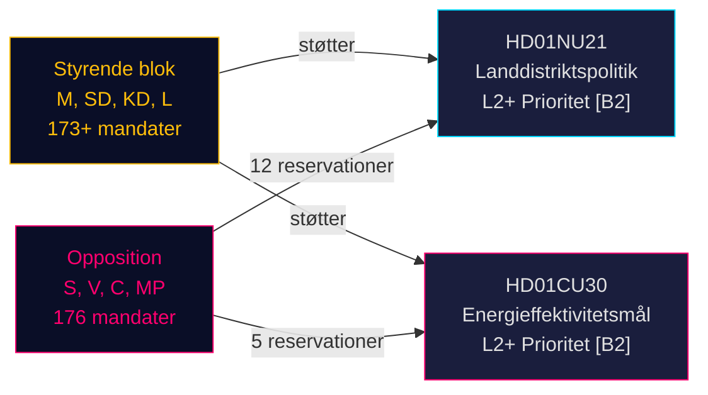
```mermaid
graph LR
    style NU21 fill:#1a1e3d,stroke:#00d9ff,color:#e0e0e0
    style CU30 fill:#1a1e3d,stroke:#ff006e,color:#e0e0e0
    style GOV fill:#0a0e27,stroke:#ffbe0b,color:#ffbe0b
    style OPP fill:#0a0e27,stroke:#ff006e,color:#ff006e
    
    NU21["HD01NU21\nLanddistriktspolitik\nL2+ Prioritet [B2]"]
    CU30["HD01CU30\nEnergieffektivitetsmål\nL2+ Prioritet [B2]"]
    GOV["Styrende blok\nM, SD, KD, L\n173+ mandater"]
    OPP["Opposition\nS, V, C, MP\n176 mandater"]
    
    GOV -->|"støtter"| NU21
    GOV -->|"støtter"| CU30
    OPP -->|"12 reservationer"| NU21
    OPP -->|"5 reservationer"| CU30
```

<!-- source-sha: 024711d152b3357ca699b043a50b4b7600683400 -->

## Executive Brief De
<!-- source: executive-brief_de.md :: https://github.com/Hack23/riksdagsmonitor/blob/main/analysis/daily/2026-05-13/committeeReports/executive-brief_de.md -->

**BLUF**: Am 12. Mai 2026 erhielt Schwedens Riksdag zwei politisch bedeutende Betänkanden: Betänkande 2025/26:NU21 zur umfassenden ländlichen Politik (prop. 2025/26:158) und Betänkande 2025/26:CU30 zu einem neuen Energieeffizienzziel, das das quantitative 2030-Ziel ersetzt (prop. 2025/26:159). Beide Berichte zeigen, dass der regierende Block (M, SD, KD, L) sein Vorwahlgesetzgebungsprogramm gegen eine anhaltende Opposition (S, V, C, MP) vorantreibt, die Mehrpunkte-Vorbehalte einlegt, aber die parlamentarische Arithmetik fehlt, um die Vorschläge zu blockieren. Der Energiebericht ist besonders folgenreich: Schweden gibt ein quantitatives Energieeffizienzziel von 50% zugunsten eines qualitativen Ziels auf, das Kernkraftausbau und Elektrifizierung explizit berücksichtigt — ein tektonischer Wandel in der Energiesteuerung vor der Wahl im September 2026.

### Unterstützte Schlüsselentscheidungen

1. **Abstimmung über HD01NU21**: Riksdagen wird voraussichtlich mit Vorbehalt von S, V, C, MP verabschiedet — die regierende Koalition hat die Mehrheit
2. **Abstimmung über HD01CU30**: Neues qualitatives Energieeffizienzziel wird verabschiedet; scharfe S/V/MP-Opposition signalisiert ein starkes Wahlkampfthema
3. **Wahldynamik September 2026**: Ländliche Politik und Energiewende sind für alle großen Parteien erstrangige Mobilisierungsthemen

### 60-Sekunden-Geheimdienstpunkte

- **HD01NU21** setzt Gesetzesänderung in Lagen om regionalt utvecklingsansvar (2010:630) um: Regionen müssen Zivilgesellschaftsorganisationen und private Hochschulen konsultieren; Lagrådet genehmigte ohne Einwände; Inkrafttretungsdatum TBC
- **HD01CU30** ersetzt Schwedens 50%-Energieeffizienzziel bis 2030 durch ein qualitatives Ziel, das Flexibilität, Erschwinglichkeit, Elektrifizierung und Kernkraftkompatibilität betont; setzt EU-EPBD-Neubearbeitung durch Änderungen an Lagen (2006:985) om energideklaration för byggnader und Plan- och bygglagen (2010:900) um
- **Oppositionsblock** (S, V, MP) legte 12 Vorbehalte bei NU21 und 5 Vorbehalte bei CU30 ein — hohe Vorbehaltsdichte signalisiert tiefe programmatische Meinungsverschiedenheit
- **Vorwahl-Multiplikator aktiv** (≤ 6 Monate bis September 2026): DIW-Punkte um 1,5× eskaliert; beide Berichte sind L2+-Priorität
- **Andreas Lennkvist Manriquez (V)** leitet CU und stimmt gleichzeitig gegen das Energieziel der Regierung — institutionell paradoxes Signal; das Ausschussverfahren ist nach parlamentarischen Regeln formal gültig

### Wichtigster Vorwärts-Auslöser

**CU30-Abstimmungstag** (~Ende Mai 2026): Wenn SD, M, KD, L Koalitionsdisziplin wahren, wird das qualitative Energieziel verabschiedet — falls jedoch eine Partei abtrünnig wird (insbesondere KD oder L unter Kernkraft-Framingdruck), ist eine Verfahrensverzögerung möglich. Parteibeauftragten beobachten.

### Konfidenzbewertung

**HIGH [B2]** — basiert auf primären Riksdag-Dokumenten (dok_id HD01NU21, HD01CU30), direktem Zitat aus dem Ausschusstext, bekannter parlamentarischer Mandatsverteilung (Mehrheit der Tidökoalition), Lagrådets yttrande (keine Einwände zu NU21) und IMF WEO April 2026 makroökonomischer Kontext.

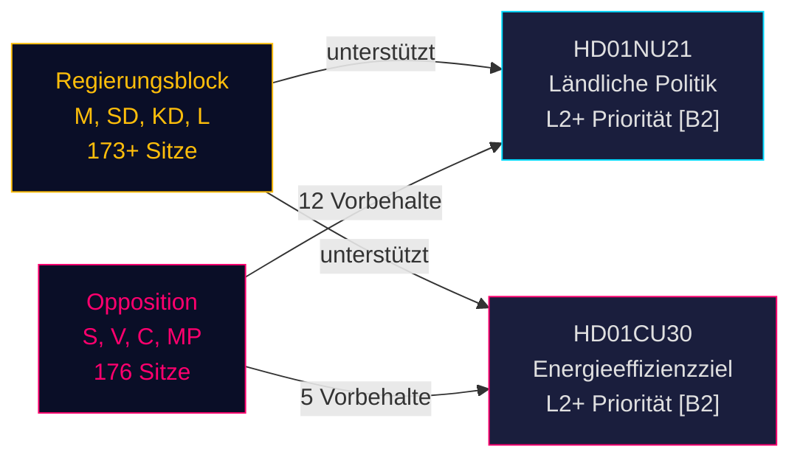
```mermaid
graph LR
    style NU21 fill:#1a1e3d,stroke:#00d9ff,color:#e0e0e0
    style CU30 fill:#1a1e3d,stroke:#ff006e,color:#e0e0e0
    style GOV fill:#0a0e27,stroke:#ffbe0b,color:#ffbe0b
    style OPP fill:#0a0e27,stroke:#ff006e,color:#ff006e
    
    NU21["HD01NU21\nLändliche Politik\nL2+ Priorität [B2]"]
    CU30["HD01CU30\nEnergieeffizienzziel\nL2+ Priorität [B2]"]
    GOV["Regierungsblock\nM, SD, KD, L\n173+ Sitze"]
    OPP["Opposition\nS, V, C, MP\n176 Sitze"]
    
    GOV -->|"unterstützt"| NU21
    GOV -->|"unterstützt"| CU30
    OPP -->|"12 Vorbehalte"| NU21
    OPP -->|"5 Vorbehalte"| CU30
```

<!-- source-sha: 024711d152b3357ca699b043a50b4b7600683400 -->

## Executive Brief Es
<!-- source: executive-brief_es.md :: https://github.com/Hack23/riksdagsmonitor/blob/main/analysis/daily/2026-05-13/committeeReports/executive-brief_es.md -->

**BLUF**: El 12 de mayo de 2026, el Riksdag sueco recibió dos betänkanden de alta relevancia política: el Betänkande 2025/26:NU21 sobre política rural integral (prop. 2025/26:158) y el Betänkande 2025/26:CU30 sobre un nuevo objetivo de eficiencia energética que reemplaza el objetivo cuantitativo de 2030 (prop. 2025/26:159). Ambos informes revelan que el bloque gobernante (M, SD, KD, L) avanza su programa legislativo preelectoral contra una oposición persistente (S, V, C, MP) que presenta reservas multipunto pero carece de la aritmética parlamentaria para bloquear las propuestas. El informe energético es especialmente trascendente: Suecia abandona un objetivo cuantitativo de eficiencia energética del 50% en favor de un objetivo cualitativo que acomoda explícitamente la expansión nuclear y la electrificación — un cambio sísmico en la gobernanza energética antes de las elecciones de septiembre de 2026.

### Decisiones clave respaldadas

1. **Votación sobre HD01NU21**: Es probable que el Riksdagen adopte con reserva de S, V, C, MP — la coalición gobernante tiene mayoría
2. **Votación sobre HD01CU30**: El nuevo objetivo cualitativo de eficiencia energética será aprobado; la fuerte oposición de S/V/MP señala un tema de campaña significativo
3. **Dinámica electoral septiembre 2026**: La política rural y la transición energética son ambas temas de movilización de primer nivel para todos los partidos principales

### Puntos de inteligencia en 60 segundos

- **HD01NU21** implementa cambio legislativo en la Lagen om regionalt utvecklingsansvar (2010:630): las regiones deben consultar a organizaciones de la sociedad civil e instituciones privadas de educación superior; Lagrådet aprobó sin objeciones; fecha de entrada en vigor TBC
- **HD01CU30** reemplaza el objetivo sueco de eficiencia energética del 50% para 2030 con un objetivo cualitativo que enfatiza flexibilidad, asequibilidad, electrificación y acomodación nuclear; implementa la directiva EPBD revisada de la UE mediante enmiendas a la Lagen (2006:985) om energideklaration för byggnader y la Plan- och bygglagen (2010:900)
- **Bloque de oposición** (S, V, MP) presentó 12 reservas sobre NU21 y 5 reservas sobre CU30 — alta densidad de reservas señala profundo desacuerdo programático
- **Multiplicador preelectoral activo** (≤ 6 meses hasta septiembre de 2026): puntuaciones DIW escaladas 1,5×; ambos informes son prioridad L2+
- **Andreas Lennkvist Manriquez (V)** preside la CU mientras vota en contra del objetivo energético del gobierno — señal institucionalmente paradójica; el procedimiento del comité es formalmente válido según las reglas parlamentarias

### Principal desencadenante prospectivo

**Día de votación de CU30** (~finales de mayo de 2026): Si SD, M, KD, L mantienen la disciplina de coalición, el objetivo energético cualitativo es aprobado — pero si algún partido deserta (especialmente KD o L bajo presión de encuadre nuclear), es posible un retraso procedimental. Vigilar los coordinadores de partido.

### Evaluación de confianza

**HIGH [B2]** — basado en documentos primarios del Riksdag (dok_id HD01NU21, HD01CU30), cita directa del texto del comité, distribución conocida de mandatos parlamentarios (mayoría de la Tidökoalitionen), yttrande del Lagrådet (sin objeciones sobre NU21) y contexto macroeconómico IMF WEO abril de 2026.

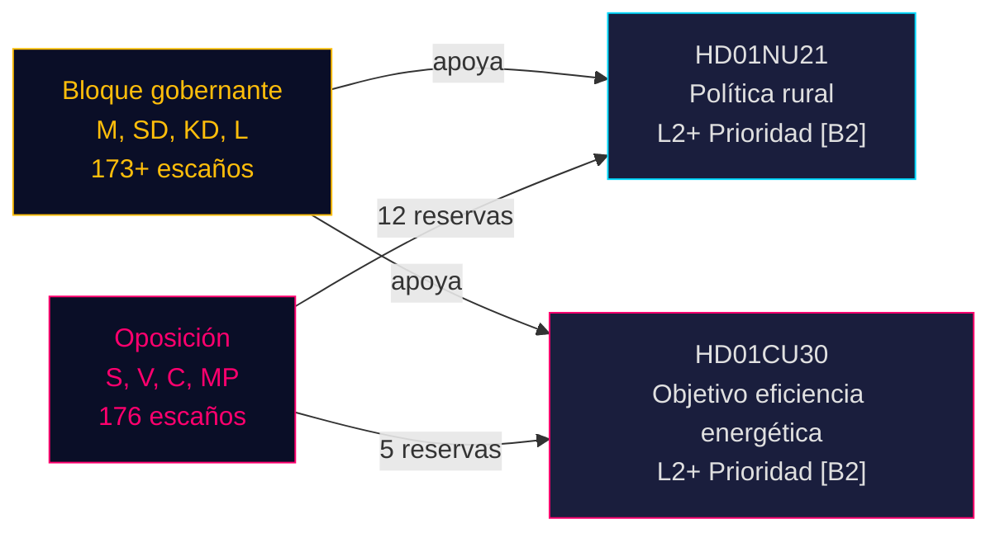
```mermaid
graph LR
    style NU21 fill:#1a1e3d,stroke:#00d9ff,color:#e0e0e0
    style CU30 fill:#1a1e3d,stroke:#ff006e,color:#e0e0e0
    style GOV fill:#0a0e27,stroke:#ffbe0b,color:#ffbe0b
    style OPP fill:#0a0e27,stroke:#ff006e,color:#ff006e
    
    NU21["HD01NU21\nPolítica rural\nL2+ Prioridad [B2]"]
    CU30["HD01CU30\nObjetivo eficiencia energética\nL2+ Prioridad [B2]"]
    GOV["Bloque gobernante\nM, SD, KD, L\n173+ escaños"]
    OPP["Oposición\nS, V, C, MP\n176 escaños"]
    
    GOV -->|"apoya"| NU21
    GOV -->|"apoya"| CU30
    OPP -->|"12 reservas"| NU21
    OPP -->|"5 reservas"| CU30
```

<!-- source-sha: 024711d152b3357ca699b043a50b4b7600683400 -->

## Executive Brief Fi
<!-- source: executive-brief_fi.md :: https://github.com/Hack23/riksdagsmonitor/blob/main/analysis/daily/2026-05-13/committeeReports/executive-brief_fi.md -->

**BLUF**: Ruotsin Riksdag vastaanotti 12. toukokuuta 2026 kaksi poliittisesti merkittävää betänkandea: Betänkande 2025/26:NU21 kattavasta maaseutupolitiikasta (prop. 2025/26:158) ja Betänkande 2025/26:CU30 uudesta energiatehokkuustavoitteesta, joka korvaa kvantitatiivisen 2030-tavoitteen (prop. 2025/26:159). Molemmat raportit paljastavat, että hallitusblokki (M, SD, KD, L) edistää esivaaliohjelmaansa vahvaa oppositiota (S, V, C, MP) vastaan, joka tekee monipisteiset varaumat mutta joilta puuttuu parlamentaarinen enemmistö estää esitykset. Energiaraportti on erityisen merkittävä: Ruotsi luopuu 50%:n kvantitatiivisesta energiatehokkuustavoitteesta laadullisen tavoitteen hyväksi, joka nimenomaisesti sallii ydinvoimakapasiteetin laajentamisen ja sähköistymisen — maanjäristyksenomainen muutos energiahallinnossa ennen syyskuun 2026 vaaleja.

### Tuetut avainpäätökset

1. **Äänestys HD01NU21:stä**: Riksdagen hyväksyy todennäköisesti varauksilla S, V, C, MP:ltä — hallituskoalitiolla on enemmistö
2. **Äänestys HD01CU30:stä**: Uusi laadullinen energiatehokkuustavoite hyväksytään; terävä S/V/MP-vastustus merkitsee voimakasta vaalikampanjateemaa
3. **Vaaliajan dynamiikka syyskuussa 2026**: Maaseutupolitiikka ja energiasiirtymä ovat molemmille kaikille suurille puolueille huipputason mobilisaatiokysymyksiä

### 60 sekunnin tiedustelupisteet

- **HD01NU21** toteuttaa lakimuutoksen Lagen om regionalt utvecklingsansvar (2010:630): alueiden on kuultava kansalaisyhteiskunnan järjestöjä ja yksityisiä korkeakouluja; Lagrådet hyväksyi ilman huomautuksia; voimaantulopäivä TBC
- **HD01CU30** korvaa Ruotsin 50% energiatehokkuustavoitteen vuoteen 2030 laadullisella tavoitteella, joka korostaa joustavuutta, kohtuuhintaisuutta, sähköistymistä ja ydinvoimamahdollisuutta; toteuttaa EU:n uudistetun EPBD-direktiivin muutosten kautta Lagen (2006:985) om energideklaration för byggnader ja Plan- och bygglagen (2010:900)
- **Oppositioblokki** (S, V, MP) teki 12 varausta NU21:een ja 5 varausta CU30:een — korkea varaumatiheys merkitsee syvää ohjelmalista erimielisyyttä
- **Esivaalimultiplier aktiivinen** (≤ 6 kuukautta syyskuuhun 2026): DIW-pisteet eskaloitu 1,5-kertaiseksi; molemmat raportit ovat L2+-prioriteetti
- **Andreas Lennkvist Manriquez (V)** johtaa CU:ta äänestäen hallituksen energiatavoitetta vastaan — institutionaalisesti paradoksaalinen signaali; valiokunnan menettely on muodollisesti pätevä parlamentaaristen sääntöjen mukaisesti

### Tärkein tulevaisuuden laukaisija

**CU30:n äänestyspäivä** (~toukokuun loppu 2026): Jos SD, M, KD, L ylläpitävät koalitiokuria, laadullinen energiatavoite hyväksytään — mutta jos jokin puolue luopuu (erityisesti KD tai L ydinvoimakehystämispaineen alaisena), menettelyllinen viive on mahdollinen. Seuraa puoluepisteitä.

### Luottamuksellisuusarvio

**HIGH [B2]** — perustuu ensisijaisiin Riksdag-asiakirjoihin (dok_id HD01NU21, HD01CU30), suoraan lainaukseen valiokuntien teksteistä, tunnettuun parlamentaariseen mandaattijakaumaan (Tidökoalitionin enemmistö), Lagrådets yttranden (ei huomautuksia NU21:een) ja IMF WEO huhtikuu 2026 makrotaloudelliseen kontekstiin.

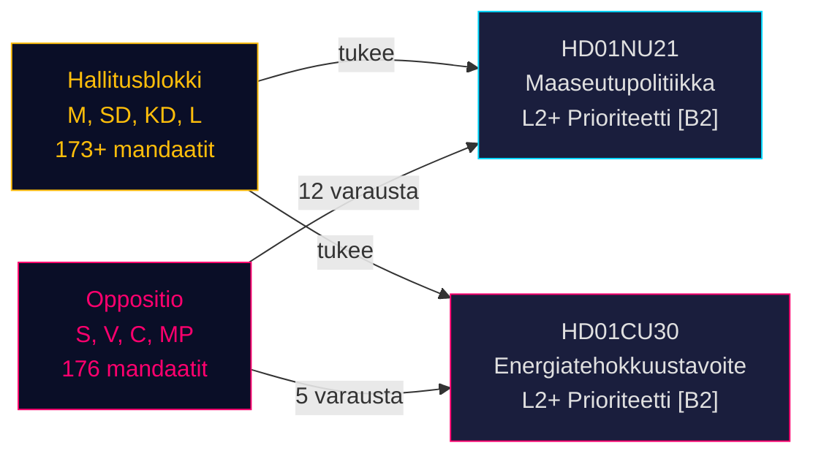
```mermaid
graph LR
    style NU21 fill:#1a1e3d,stroke:#00d9ff,color:#e0e0e0
    style CU30 fill:#1a1e3d,stroke:#ff006e,color:#e0e0e0
    style GOV fill:#0a0e27,stroke:#ffbe0b,color:#ffbe0b
    style OPP fill:#0a0e27,stroke:#ff006e,color:#ff006e
    
    NU21["HD01NU21\nMaaseutupolitiikka\nL2+ Prioriteetti [B2]"]
    CU30["HD01CU30\nEnergiatehokkuustavoite\nL2+ Prioriteetti [B2]"]
    GOV["Hallitusblokki\nM, SD, KD, L\n173+ mandaatit"]
    OPP["Oppositio\nS, V, C, MP\n176 mandaatit"]
    
    GOV -->|"tukee"| NU21
    GOV -->|"tukee"| CU30
    OPP -->|"12 varausta"| NU21
    OPP -->|"5 varausta"| CU30
```

<!-- source-sha: 024711d152b3357ca699b043a50b4b7600683400 -->

## Executive Brief Fr
<!-- source: executive-brief_fr.md :: https://github.com/Hack23/riksdagsmonitor/blob/main/analysis/daily/2026-05-13/committeeReports/executive-brief_fr.md -->

**BLUF** : Le 12 mai 2026, le Riksdag suédois a reçu deux betänkanden d'importance politique majeure : le Betänkande 2025/26:NU21 sur la politique rurale globale (prop. 2025/26:158) et le Betänkande 2025/26:CU30 sur un nouvel objectif d'efficacité énergétique remplaçant l'objectif quantitatif 2030 (prop. 2025/26:159). Les deux rapports révèlent un bloc gouvernemental (M, SD, KD, L) faisant avancer son programme législatif pré-électoral contre une opposition persistante (S, V, C, MP) qui dépose des réserves à points multiples mais manque de l'arithmétique parlementaire pour bloquer les propositions. Le rapport sur l'énergie est particulièrement conséquent : la Suède abandonne un objectif quantitatif d'efficacité énergétique de 50% au profit d'un objectif qualitatif qui accommode explicitement l'expansion nucléaire et l'électrification — un changement sismique dans la gouvernance énergétique avant les élections de septembre 2026.

### Décisions clés soutenues

1. **Vote sur HD01NU21** : Le Riksdagen devrait adopter avec réserve de S, V, C, MP — la coalition au pouvoir dispose de la majorité
2. **Vote sur HD01CU30** : Le nouvel objectif qualitatif d'efficacité énergétique sera adopté ; la vive opposition S/V/MP signale un thème de campagne fort
3. **Dynamique électorale septembre 2026** : La politique rurale et la transition énergétique sont toutes deux des enjeux de mobilisation de premier plan pour tous les grands partis

### Points de renseignement en 60 secondes

- **HD01NU21** met en œuvre une modification législative de la Lagen om regionalt utvecklingsansvar (2010:630) : les régions doivent consulter les organisations de la société civile et les établissements d'enseignement supérieur privés ; Lagrådet a approuvé sans objections ; date d'entrée en vigueur TBC
- **HD01CU30** remplace l'objectif suédois d'efficacité énergétique de 50% d'ici 2030 par un objectif qualitatif soulignant la flexibilité, l'accessibilité financière, l'électrification et l'accommodation nucléaire ; met en œuvre la directive EPBD refondue de l'UE par des modifications à la Lagen (2006:985) om energideklaration för byggnader et la Plan- och bygglagen (2010:900)
- **Le bloc d'opposition** (S, V, MP) a déposé 12 réserves sur NU21 et 5 réserves sur CU30 — haute densité de réserves signalant un désaccord programmatique profond
- **Multiplicateur pré-électoral actif** (≤ 6 mois jusqu'en septembre 2026) : scores DIW escaladés de 1,5× ; les deux rapports sont de priorité L2+
- **Andreas Lennkvist Manriquez (V)** préside la CU tout en votant contre l'objectif énergétique du gouvernement — signal institutionnellement paradoxal ; la procédure du comité est formellement valide selon les règles parlementaires

### Principal déclencheur prospectif

**Jour du vote CU30** (~fin mai 2026) : Si SD, M, KD, L maintiennent la discipline de coalition, l'objectif énergétique qualitatif est adopté — mais si un parti fait défection (en particulier KD ou L sous pression de cadrage nucléaire), un retard procédural est possible. Surveiller les chefs de groupe.

### Évaluation de la confiance

**HIGH [B2]** — basé sur les documents primaires du Riksdag (dok_id HD01NU21, HD01CU30), citation directe du texte de commission, répartition connue des mandats parlementaires (majorité de la Tidökoalitionen), yttrande du Lagrådet (pas d'objections sur NU21) et contexte macroéconomique IMF WEO avril 2026.

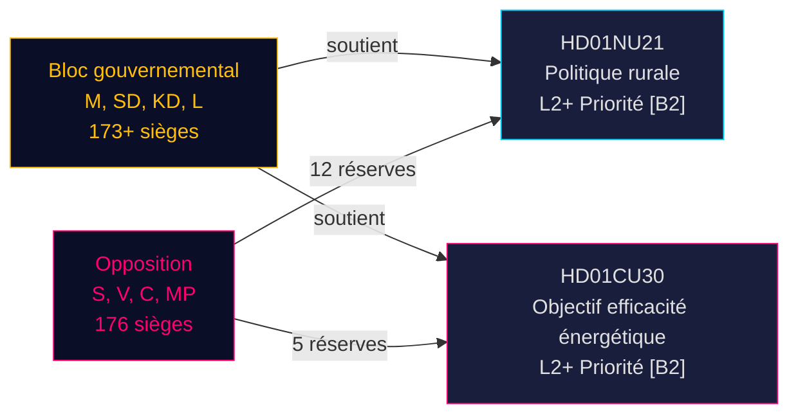
```mermaid
graph LR
    style NU21 fill:#1a1e3d,stroke:#00d9ff,color:#e0e0e0
    style CU30 fill:#1a1e3d,stroke:#ff006e,color:#e0e0e0
    style GOV fill:#0a0e27,stroke:#ffbe0b,color:#ffbe0b
    style OPP fill:#0a0e27,stroke:#ff006e,color:#ff006e
    
    NU21["HD01NU21\nPolitique rurale\nL2+ Priorité [B2]"]
    CU30["HD01CU30\nObjectif efficacité énergétique\nL2+ Priorité [B2]"]
    GOV["Bloc gouvernemental\nM, SD, KD, L\n173+ sièges"]
    OPP["Opposition\nS, V, C, MP\n176 sièges"]
    
    GOV -->|"soutient"| NU21
    GOV -->|"soutient"| CU30
    OPP -->|"12 réserves"| NU21
    OPP -->|"5 réserves"| CU30
```

<!-- source-sha: 024711d152b3357ca699b043a50b4b7600683400 -->

## Executive Brief He
<!-- source: executive-brief_he.md :: https://github.com/Hack23/riksdagsmonitor/blob/main/analysis/daily/2026-05-13/committeeReports/executive-brief_he.md -->

<div dir="rtl">

---
title: "שיפוץ מדיניות הכפר השוודית וכיוון מחדש של יעילות האנרגיה: שני דוחות ועדה מסמנים ספרינט חקיקתי לקראת הבחירות"

pass: 2

subfolder: committeeReports
---

# שיפוץ מדיניות הכפר השוודית וכיוון מחדש של יעילות האנרגיה: שני דוחות ועדה מסמנים ספרינט חקיקתי לקראת הבחירות

**תמצית**: ב-12 במאי 2026, קיבל הפרלמנט השוודי (Riksdag) שני betänkanden בעלי משמעות פוליטית גבוהה: Betänkande 2025/26:NU21 בנושא מדיניות כפר מקיפה (prop. 2025/26:158) ו-Betänkande 2025/26:CU30 בנושא יעד חדש ליעילות אנרגיה שמחליף את היעד הכמותי ל-2030 (prop. 2025/26:159). שני הדוחות מגלים שגוש השלטון (M, SD, KD, L) מקדם את תכנית החקיקה הפרה-בחירותית שלו מול אופוזיציה מתמשכת (S, V, C, MP) המגישה הסתייגויות רב-נקודתיות אך חסרה את האריתמטיקה הפרלמנטרית לחסימת ההצעות. דוח האנרגיה מעורר השלכות מיוחדות: שוודיה נוטשת יעד כמותי של 50% ליעילות אנרגיה לטובת יעד איכותי המאפשר במפורש הרחבה גרעינית ואלקטריפיקציה — שינוי סייסמי בממשל האנרגיה לקראת בחירות ספטמבר 2026.

### החלטות מפתח נתמכות

1. **הצבעה על HD01NU21**: סביר שה-Riksdagen יאמץ עם הסתייגות מ-S, V, C, MP — לקואליציה השלטת יש רוב
2. **הצבעה על HD01CU30**: יעד יעילות אנרגיה איכותי חדש יאושר; אופוזיציה חדה מ-S/V/MP מסמנת נושא קמפיין בחירות חזק
3. **דינמיקות בחירות ספטמבר 2026**: מדיניות כפר ומעבר אנרגיה הם שניהם נושאי גיוס ברמה עליונה עבור כל המפלגות הגדולות

### נקודות מודיעין ב-60 שניות

- **HD01NU21** מיישם שינוי חוקי ב-Lagen om regionalt utvecklingsansvar (2010:630): אזורים חייבים להתייעץ עם ארגוני החברה האזרחית ומוסדות השכלה גבוהה פרטיים; Lagrådet אישר ללא הסתייגויות; תאריך כניסה לתוקף TBC
- **HD01CU30** מחליף את יעד יעילות האנרגיה השוודי של 50% עד 2030 ביעד איכותי המדגיש גמישות, נגישות כלכלית, אלקטריפיקציה ואירוח גרעיני; מיישם את ההנחיה המעודכנת EPBD של האיחוד האירופי באמצעות תיקונים ל-Lagen (2006:985) om energideklaration för byggnader ו-Plan- och bygglagen (2010:900)
- **גוש האופוזיציה** (S, V, MP) הגיש 12 הסתייגויות על NU21 ו-5 הסתייגויות על CU30 — צפיפות הסתייגויות גבוהה מסמנת מחלוקת תכנית עמוקה
- **מכפיל פרה-בחירות פעיל** (≤ 6 חודשים עד ספטמבר 2026): ציוני DIW הוסלמו פי 1.5; שני הדוחות הם עדיפות L2+
- **Andreas Lennkvist Manriquez (V)** מוביל את CU תוך הצבעה נגד יעד האנרגיה של הממשלה — אות מוסדי פרדוקסלי; הליך הוועדה תקף פורמלית לפי כללים פרלמנטריים

### הטריגר העתידי המרכזי

**יום הצבעת CU30** (~סוף מאי 2026): אם SD, M, KD, L שומרות על משמעת קואליציה, היעד האיכותי לאנרגיה עובר — אך אם מפלגה כלשהי עוזבת (במיוחד KD או L תחת לחץ ניסוח גרעיני), עיכוב פרוצדורלי אפשרי. לעקוב אחר מפקחי מפלגות.

### הערכת ביטחון

**HIGH [B2]** — מבוסס על מסמכים ראשיים של Riksdag (dok_id HD01NU21, HD01CU30), ציטוט ישיר מטקסט הוועדה, התפלגות מנדטים פרלמנטרית ידועה (רוב ה-Tidökoalitionen), yttrande של Lagrådet (אין הסתייגויות ל-NU21) והקשר מאקרו-כלכלי IMF WEO אפריל 2026.

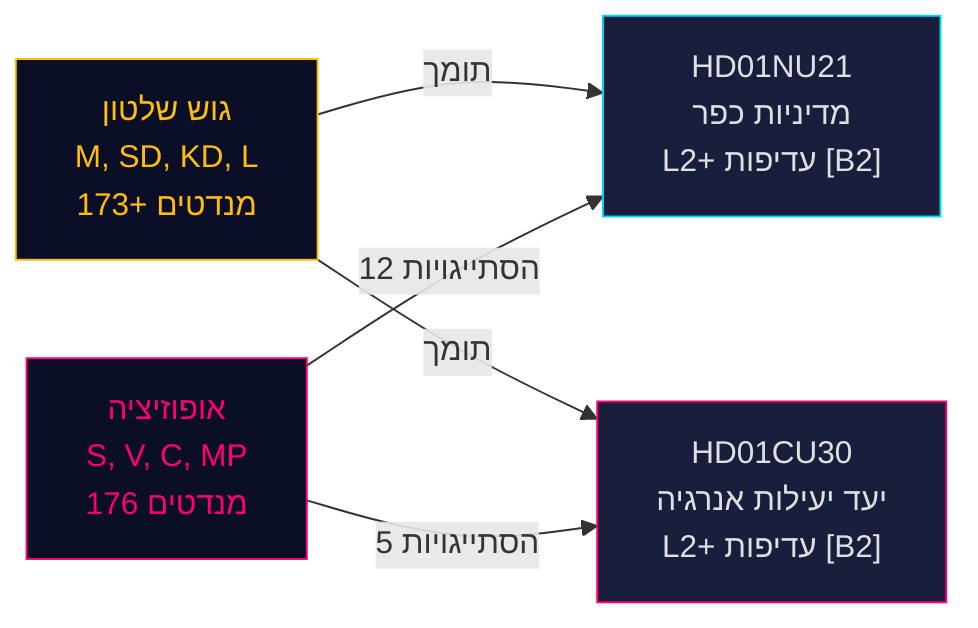
```mermaid
graph LR
    style NU21 fill:#1a1e3d,stroke:#00d9ff,color:#e0e0e0
    style CU30 fill:#1a1e3d,stroke:#ff006e,color:#e0e0e0
    style GOV fill:#0a0e27,stroke:#ffbe0b,color:#ffbe0b
    style OPP fill:#0a0e27,stroke:#ff006e,color:#ff006e
    
    NU21["HD01NU21\nמדיניות כפר\nL2+ עדיפות [B2]"]
    CU30["HD01CU30\nיעד יעילות אנרגיה\nL2+ עדיפות [B2]"]
    GOV["גוש שלטון\nM, SD, KD, L\n173+ מנדטים"]
    OPP["אופוזיציה\nS, V, C, MP\n176 מנדטים"]
    
    GOV -->|"תומך"| NU21
    GOV -->|"תומך"| CU30
    OPP -->|"12 הסתייגויות"| NU21
    OPP -->|"5 הסתייגויות"| CU30
```

</div>

<!-- source-sha: 024711d152b3357ca699b043a50b4b7600683400 -->

## Executive Brief Ja
<!-- source: executive-brief_ja.md :: https://github.com/Hack23/riksdagsmonitor/blob/main/analysis/daily/2026-05-13/committeeReports/executive-brief_ja.md -->

**要約**: 2026年5月12日、スウェーデンのRiksdagは政治的に重要な2つのbetänkandanを受理した：農村政策に関する包括的なBetänkande 2025/26:NU21（prop. 2025/26:158）と、2030年の定量的目標に代わる新たなエネルギー効率目標に関するBetänkande 2025/26:CU30（prop. 2025/26:159）である。両報告書は、与党ブロック（M, SD, KD, L）が複数の留保事項を提出しながらも議会で阻止するだけの多数派を持たない野党（S, V, C, MP）に対し、選挙前の立法プログラムを推進していることを示している。エネルギー報告書は特に重大だ：スウェーデンは50%の定量的エネルギー効率目標を放棄し、核エネルギーの拡大と電化を明示的に受け入れる定性的目標を採用する——2026年9月の選挙を前にしたエネルギーガバナンスにおける地殻変動的な転換だ。

### 支持された主要決定

1. **HD01NU21の採決**: RiksdagenはS、V、C、MPの留保付きで採択見込み——与党連合が多数派を占める
2. **HD01CU30の採決**: 新たな定性的エネルギー効率目標が可決される見込み；S/V/MPの鋭い反対は強力な選挙キャンペーンテーマを示す
3. **2026年9月選挙の力学**: 農村政策とエネルギー転換はいずれも全主要政党にとって最優先の動員テーマ

### 60秒のインテリジェンスポイント

- **HD01NU21** はLagen om regionalt utvecklingsansvar（2010:630）の法改正を実施：地域は市民社会組織および私立高等教育機関と協議する必要がある；Lagrådは異議なく承認；施行日はTBC
- **HD01CU30** はスウェーデンの2030年エネルギー効率50%目標を、柔軟性・手頃な価格・電化・核エネルギー受容を強調した定性的目標に置き換える；Lagen（2006:985）om energideklaration för byggnaderおよびPlan- och bygglagen（2010:900）の改正を通じてEU EPBD改定指令を実施
- **野党ブロック**（S, V, MP）はNU21に12の留保、CU30に5の留保を提出——高い留保密度は深い政策的意見の相違を示す
- **選挙前乗数が有効**（2026年9月まで≤6か月）：DIWスコアが1.5倍に上昇；両報告書はL2+優先レベル
- **Andreas Lennkvist Manriquez（V）** は政府のエネルギー目標に反対票を投じながらCUを率いる——制度的に逆説的なシグナル；委員会手続きは議会規則上形式的に有効

### 主要な先行トリガー

**CU30の採決日**（2026年5月下旬頃）：SD、M、KD、Lが連立の規律を維持すれば定性的エネルギー目標が可決される——しかし何らかの党が離脱した場合（特に核エネルギーのフレーミング圧力下でKDまたはL）、手続き上の遅延が起きる可能性がある。党のホイップを監視すること。

### 信頼度評価

**HIGH [B2]** — 一次Riksdag文書（dok_id HD01NU21, HD01CU30）、委員会テキストからの直接引用、既知の議会議席配分（Tidökoalitionenの過半数）、Lagrådets yttrande（NU21に異議なし）、およびIMF WEO 2026年4月のマクロ経済的文脈に基づく。

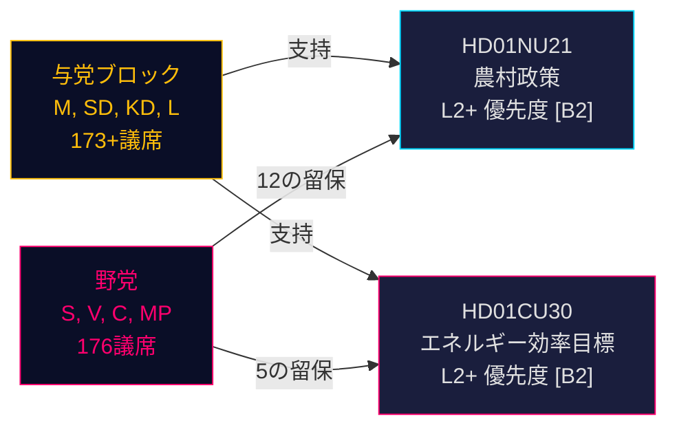
```mermaid
graph LR
    style NU21 fill:#1a1e3d,stroke:#00d9ff,color:#e0e0e0
    style CU30 fill:#1a1e3d,stroke:#ff006e,color:#e0e0e0
    style GOV fill:#0a0e27,stroke:#ffbe0b,color:#ffbe0b
    style OPP fill:#0a0e27,stroke:#ff006e,color:#ff006e
    
    NU21["HD01NU21\n農村政策\nL2+ 優先度 [B2]"]
    CU30["HD01CU30\nエネルギー効率目標\nL2+ 優先度 [B2]"]
    GOV["与党ブロック\nM, SD, KD, L\n173+議席"]
    OPP["野党\nS, V, C, MP\n176議席"]
    
    GOV -->|"支持"| NU21
    GOV -->|"支持"| CU30
    OPP -->|"12の留保"| NU21
    OPP -->|"5の留保"| CU30
```

<!-- source-sha: 024711d152b3357ca699b043a50b4b7600683400 -->

## Executive Brief Ko
<!-- source: executive-brief_ko.md :: https://github.com/Hack23/riksdagsmonitor/blob/main/analysis/daily/2026-05-13/committeeReports/executive-brief_ko.md -->

**요약**: 2026년 5월 12일, 스웨덴 Riksdag는 정치적으로 중요한 두 개의 betänkandan을 접수했다: 농촌 정책에 관한 포괄적 Betänkande 2025/26:NU21(prop. 2025/26:158)과 2030년 정량적 목표를 대체하는 새로운 에너지 효율 목표에 관한 Betänkande 2025/26:CU30(prop. 2025/26:159). 두 보고서는 집권 블록(M, SD, KD, L)이 다점 유보를 제출하지만 제안을 막을 의회 과반수가 없는 야당(S, V, C, MP)에 맞서 선거 전 입법 프로그램을 밀어붙이고 있음을 보여준다. 에너지 보고서는 특히 중대하다: 스웨덴은 50% 정량적 에너지 효율 목표를 포기하고 원전 확대와 전기화를 명시적으로 수용하는 정성적 목표를 채택한다 — 2026년 9월 선거를 앞두고 에너지 거버넌스에서의 지각 변동적 전환.

### 지지된 핵심 결정

1. **HD01NU21 표결**: Riksdagen이 S, V, C, MP의 유보와 함께 채택할 가능성 높음 — 집권 연립이 과반수 보유
2. **HD01CU30 표결**: 새로운 정성적 에너지 효율 목표 통과; 날카로운 S/V/MP 반대는 강력한 선거 캠페인 이슈를 시사
3. **2026년 9월 선거 역학**: 농촌 정책과 에너지 전환은 모든 주요 정당에게 최우선 동원 이슈

### 60초 인텔리전스 포인트

- **HD01NU21**은 Lagen om regionalt utvecklingsansvar(2010:630) 법 개정 시행: 지역은 시민사회 단체 및 사립 고등교육기관과 협의해야 함; Lagrådet 이의 없이 승인; 시행일 TBC
- **HD01CU30**은 스웨덴의 2030년 50% 에너지 효율 목표를 유연성, 저렴성, 전기화 및 원전 수용을 강조하는 정성적 목표로 대체; Lagen(2006:985) om energideklaration för byggnader 및 Plan- och bygglagen(2010:900) 개정을 통해 EU EPBD 개정 지침 시행
- **야당 블록**(S, V, MP)은 NU21에 12개, CU30에 5개 유보 제출 — 높은 유보 밀도는 깊은 정책적 불일치 시사
- **선거 전 승수 활성화**(2026년 9월까지 ≤6개월): DIW 점수 1.5배 상승; 두 보고서 모두 L2+ 우선순위
- **Andreas Lennkvist Manriquez(V)**는 정부 에너지 목표에 반대표를 던지면서 CU를 이끔 — 제도적으로 역설적 신호; 위원회 절차는 의회 규칙상 형식적으로 유효

### 주요 미래 촉발 요인

**CU30 표결일**(2026년 5월 말경): SD, M, KD, L이 연립 규율을 유지하면 정성적 에너지 목표 통과 — 하지만 어느 당이 이탈할 경우(특히 원전 프레이밍 압박 하의 KD 또는 L), 절차적 지연 가능. 정당 원내총무 모니터링.

### 신뢰도 평가

**HIGH [B2]** — 1차 Riksdag 문서(dok_id HD01NU21, HD01CU30), 위원회 텍스트에서의 직접 인용, 알려진 의회 의석 배분(Tidökoalitionen 과반수), Lagrådets yttrande(NU21 이의 없음), 그리고 IMF WEO 2026년 4월 거시경제 맥락에 기반.

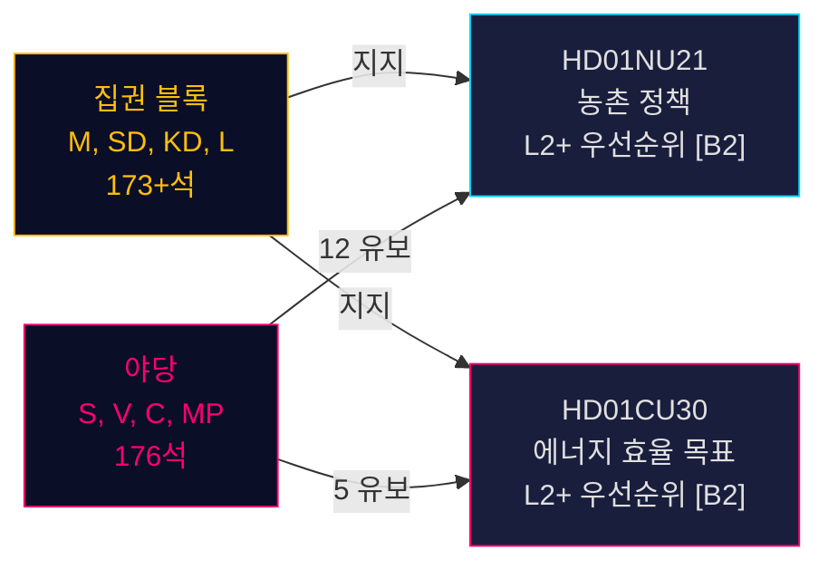
```mermaid
graph LR
    style NU21 fill:#1a1e3d,stroke:#00d9ff,color:#e0e0e0
    style CU30 fill:#1a1e3d,stroke:#ff006e,color:#e0e0e0
    style GOV fill:#0a0e27,stroke:#ffbe0b,color:#ffbe0b
    style OPP fill:#0a0e27,stroke:#ff006e,color:#ff006e
    
    NU21["HD01NU21\n농촌 정책\nL2+ 우선순위 [B2]"]
    CU30["HD01CU30\n에너지 효율 목표\nL2+ 우선순위 [B2]"]
    GOV["집권 블록\nM, SD, KD, L\n173+석"]
    OPP["야당\nS, V, C, MP\n176석"]
    
    GOV -->|"지지"| NU21
    GOV -->|"지지"| CU30
    OPP -->|"12 유보"| NU21
    OPP -->|"5 유보"| CU30
```

<!-- source-sha: 024711d152b3357ca699b043a50b4b7600683400 -->

## Executive Brief Nl
<!-- source: executive-brief_nl.md :: https://github.com/Hack23/riksdagsmonitor/blob/main/analysis/daily/2026-05-13/committeeReports/executive-brief_nl.md -->

**BLUF**: Op 12 mei 2026 ontving het Zweedse Riksdag twee politiek significante betänkanden: Betänkande 2025/26:NU21 over uitgebreid plattelandsbeleid (prop. 2025/26:158) en Betänkande 2025/26:CU30 over een nieuw energieëfficiëntiedoel ter vervanging van het kwantitatieve 2030-doel (prop. 2025/26:159). Beide rapporten onthullen een regeringsblok (M, SD, KD, L) dat zijn pre-electorale wetgevingsprogramma voortdrijft tegen een aanhoudende oppositie (S, V, C, MP) die meerpuntsvoorbehouden indient maar de parlementaire rekenkunde mist om de voorstellen te blokkeren. Het energierapport is bijzonder verstrekkend: Zweden verlaat een kwantitatief energieëfficiëntiedoel van 50% ten gunste van een kwalitatief doel dat kernenergie-uitbreiding en elektrificatie expliciet accommodeert — een seismische verschuiving in energiegovernance voor de verkiezingen van september 2026.

### Ondersteunde kernbeslissingen

1. **Stemming over HD01NU21**: Riksdagen zal naar verwachting aannemen met voorbehoud van S, V, C, MP — de regerende coalitie heeft de meerderheid
2. **Stemming over HD01CU30**: Nieuw kwalitatief energieëfficiëntiedoel wordt aangenomen; scherpe S/V/MP-oppositie signaleert een sterk verkiezingsthema
3. **Verkiezingsdynamiek september 2026**: Plattelandsbeleid en energietransitie zijn beide topprioriteit mobilisatiethema's voor alle grote partijen

### 60-seconden inlichtingenpunten

- **HD01NU21** implementeert wetswijziging in Lagen om regionalt utvecklingsansvar (2010:630): regio's moeten maatschappelijke organisaties en private hogeronderwijsinstellingen raadplegen; Lagrådet keurde goed zonder bezwaren; inwerkingtreding datum TBC
- **HD01CU30** vervangt Zweden's 50%-energieëfficiëntiedoel voor 2030 door een kwalitatief doel met nadruk op flexibiliteit, betaalbaarheid, elektrificatie en kernenergieaccommodatie; implementeert herschreven EU EPBD-richtlijn via wijzigingen aan Lagen (2006:985) om energideklaration för byggnader en Plan- och bygglagen (2010:900)
- **Oppositieblok** (S, V, MP) diende 12 voorbehouden in over NU21 en 5 voorbehouden over CU30 — hoge voorbehoudsdichtheid signaleert diep programmatisch meningsverschil
- **Pre-electorale multiplicator actief** (≤ 6 maanden tot september 2026): DIW-scores geëscaleerd met 1,5×; beide rapporten zijn L2+-prioriteit
- **Andreas Lennkvist Manriquez (V)** voorzit CU terwijl hij tegen het energiedoel van de regering stemt — institutioneel paradoxaal signaal; de commissieprocedure is formeel geldig onder parlementaire regels

### Belangrijkste toekomstige trigger

**CU30-stemdag** (~einde mei 2026): Als SD, M, KD, L coalitiediscipline handhaven, wordt het kwalitatieve energiedoel aangenomen — maar als een partij afvallig wordt (met name KD of L onder kernenergieframingdruk), is een procedurele vertraging mogelijk. Partijwhips volgen.

### Betrouwbaarheidsbeoordeling

**HIGH [B2]** — gebaseerd op primaire Riksdag-documenten (dok_id HD01NU21, HD01CU30), directe aanhalingstekens uit commissietekst, bekende parlementaire mandaatverdeling (meerderheid Tidökoalitionen), yttrande van Lagrådet (geen bezwaren op NU21) en IMF WEO april 2026 macro-economische context.

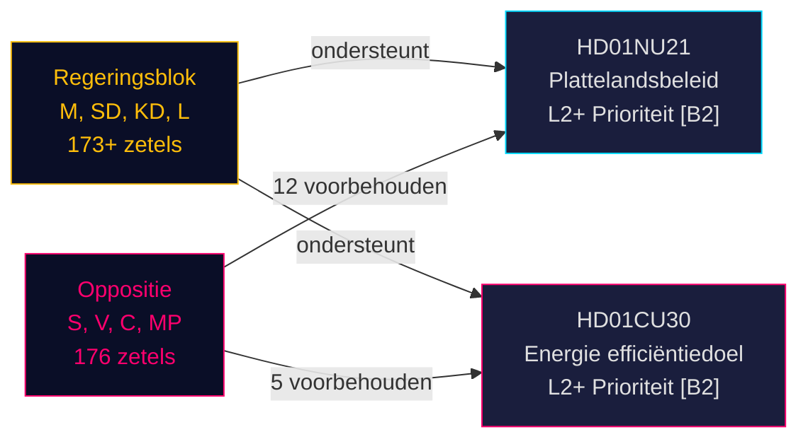
```mermaid
graph LR
    style NU21 fill:#1a1e3d,stroke:#00d9ff,color:#e0e0e0
    style CU30 fill:#1a1e3d,stroke:#ff006e,color:#e0e0e0
    style GOV fill:#0a0e27,stroke:#ffbe0b,color:#ffbe0b
    style OPP fill:#0a0e27,stroke:#ff006e,color:#ff006e
    
    NU21["HD01NU21\nPlattelandsbeleid\nL2+ Prioriteit [B2]"]
    CU30["HD01CU30\nEnergie efficiëntiedoel\nL2+ Prioriteit [B2]"]
    GOV["Regeringsblok\nM, SD, KD, L\n173+ zetels"]
    OPP["Oppositie\nS, V, C, MP\n176 zetels"]
    
    GOV -->|"ondersteunt"| NU21
    GOV -->|"ondersteunt"| CU30
    OPP -->|"12 voorbehouden"| NU21
    OPP -->|"5 voorbehouden"| CU30
```

<!-- source-sha: 024711d152b3357ca699b043a50b4b7600683400 -->

## Executive Brief No
<!-- source: executive-brief_no.md :: https://github.com/Hack23/riksdagsmonitor/blob/main/analysis/daily/2026-05-13/committeeReports/executive-brief_no.md -->

**BLUF**: Den 12. mai 2026 mottok Sveriges Riksdag to politisk viktige betänkanden: Betänkande 2025/26:NU21 om helhetlig distriktspolitikk (prop. 2025/26:158) og Betänkande 2025/26:CU30 om et nytt energieffektivitetsmål som erstatter det kvantitative 2030-målet (prop. 2025/26:159). Begge rapporter avslører at den styrende blokken (M, SD, KD, L) fremmer sin valgprogramfremgang mot en vedvarende opposisjon (S, V, C, MP) som leverer flerpoengsforbeholder men mangler parlamentarisk flertall til å blokkere forslagene. Energirapporten er særlig viktig: Sverige forlater et 50% kvantitativt energieffektivitetsmål til fordel for et kvalitativt mål som eksplisitt rommer kjernekraftutvidelse og elektrifisering — et seismisk skifte i energistyring foran valget i september 2026.

### Støttede nøkkelbeslutninger

1. **Avstemning om HD01NU21**: Riksdagen vil trolig vedta med forbehold fra S, V, C, MP — den styrende koalisjonen har flertall
2. **Avstemning om HD01CU30**: Nytt kvalitativt energieffektivitetsmål vil vedtas; skarp S/V/MP-opposisjon signalerer en sterk valgkampsak
3. **Valgdynamikk september 2026**: Distriktspolitikk og energiomstilling er begge toppnivå mobiliseringsspørsmål for alle store partier

### 60-sekunders etterretningspunkter

- **HD01NU21** gjennomfører lovendring i Lagen om regionalt utvecklingsansvar (2010:630): regioner må konsultere sivilsamfunnsorganisasjoner og private høyskoler; Lagrådet godkjente uten innvendinger; ikrafttredelsesdato TBC
- **HD01CU30** erstatter Sveriges 50%-energieffektivitetsmål for 2030 med et kvalitativt mål som vektlegger fleksibilitet, rimelig pris, elektrifisering og kjernekraftaccommodering; gjennomfører EUs omarbeidede EPBD-direktiv via endringer i Lagen (2006:985) om energideklaration för byggnader og Plan- och bygglagen (2010:900)
- **Opposisjonsblokken** (S, V, MP) leverte 12 forbehold på NU21 og 5 forbehold på CU30 — høy forbeholdstetthet signalerer dyp programmatisk uenighet
- **Forvalsmultiplikator aktiv** (≤ 6 måneder til september 2026): DIW-scorer eskalert med 1,5×; begge rapporter er L2+-prioritet
- **Andreas Lennkvist Manriquez (V)** leder CU mens han stemmer mot regjeringens energimål — institusjonelt paradoksalt signal; komitéprosedyren er formelt gyldig i henhold til parlamentariske regler

### Viktigste fremtidige utløser

**CU30-avstemningsdag** (~slutten av mai 2026): Hvis SD, M, KD, L opprettholder koalisjondisiplin vedtas det kvalitative energimålet — men hvis et parti defekterer (spesielt KD eller L under kjernekrafts-innrammingspress), er en prosedyremessig forsinkelse mulig. Følg med på partipisker.

### Konfidensvurdering

**HIGH [B2]** — basert på primære Riksdag-dokumenter (dok_id HD01NU21, HD01CU30), direkte sitat fra komitétext, kjent parlamentarisk mandatfordeling (Tidökoalitionens flertall), Lagrådets yttrande (ingen innvendinger til NU21) og IMF WEO april 2026 makroøkonomisk kontekst.

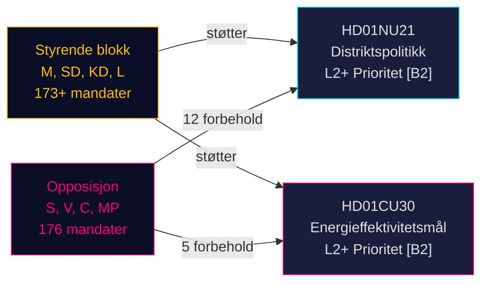
```mermaid
graph LR
    style NU21 fill:#1a1e3d,stroke:#00d9ff,color:#e0e0e0
    style CU30 fill:#1a1e3d,stroke:#ff006e,color:#e0e0e0
    style GOV fill:#0a0e27,stroke:#ffbe0b,color:#ffbe0b
    style OPP fill:#0a0e27,stroke:#ff006e,color:#ff006e
    
    NU21["HD01NU21\nDistriktspolitikk\nL2+ Prioritet [B2]"]
    CU30["HD01CU30\nEnergieffektivitetsmål\nL2+ Prioritet [B2]"]
    GOV["Styrende blokk\nM, SD, KD, L\n173+ mandater"]
    OPP["Opposisjon\nS, V, C, MP\n176 mandater"]
    
    GOV -->|"støtter"| NU21
    GOV -->|"støtter"| CU30
    OPP -->|"12 forbehold"| NU21
    OPP -->|"5 forbehold"| CU30
```

<!-- source-sha: 024711d152b3357ca699b043a50b4b7600683400 -->

## Executive Brief Sv
<!-- source: executive-brief_sv.md :: https://github.com/Hack23/riksdagsmonitor/blob/main/analysis/daily/2026-05-13/committeeReports/executive-brief_sv.md -->

**BLUF**: Den 12 maj 2026 mottog Sveriges riksdag två politiskt viktiga betänkanden: Betänkande 2025/26:NU21 om övergripande landsbygdspolitik (prop. 2025/26:158) och Betänkande 2025/26:CU30 om ett nytt energieffektivitetsmål som ersätter det kvantitativa 2030-målet (prop. 2025/26:159). Båda betänkandena visar att det styrande blocket (M, SD, KD, L) driver sitt valrörelseprogram mot ett ihållande motstånd (S, V, C, MP) som lämnar reservationer med flera punkter men saknar parlamentarisk majoritet för att blockera förslagen. Energirapporten är särskilt viktig: Sverige överger ett 50-procentigt kvantitativt energieffektivitetsmål till förmån för ett kvalitativt mål som uttryckligen rymmer kärnkraftsexpansion och elektrifiering — ett omvälvande skifte i energistyrning inför valet i september 2026.

### Stödda nyckelbeslut

1. **Omröstning om HD01NU21**: Riksdagen väntas anta med reservation från S, V, C, MP — den styrande koalitionen har majoritet
2. **Omröstning om HD01CU30**: Nytt kvalitativt energieffektivitetsmål kommer att antas; skarp opposition från S/V/MP signalerar en stark valfråga
3. **Valdynamik september 2026**: Landsbygdspolitik och energiomställning är båda toppfrågor för mobilisering bland alla stora partier

### 60-sekunders underrättelsekulor

- **HD01NU21** genomför lagändring i Lagen om regionalt utvecklingsansvar (2010:630): regioner måste samråda med civilsamhällesorganisationer och privata högskolor; Lagrådet godkände utan anmärkningar; ikraftträdandedatum TBC
- **HD01CU30** ersätter Sveriges 50%-mål för energieffektivitet till 2030 med ett kvalitativt mål som betonar flexibilitet, prisvärdhet, elektrifiering och kärnkraftsutrymme; genomför EU:s EPBD-omarbetade direktiv via ändringar i Lagen (2006:985) om energideklaration för byggnader och Plan- och bygglagen (2010:900)
- **Oppositionsblocket** (S, V, MP) lämnade 12 reservationer på NU21 och 5 reservationer på CU30 — hög reservationstäthet signalerar djup programmatisk oenighet
- **Förvalsmultiplikator aktiv** (≤ 6 månader till september 2026): DIW-poäng eskalerade med 1,5×; båda betänkandena är L2+-prioritet
- **Andreas Lennkvist Manriquez (V)** leder CU men röstar mot regeringens energimål — institutionellt paradoxalt signal; utskottsförfarandet är formellt giltigt enligt parlamentariska regler

### Viktigaste framåtblickande trigger

**CU30:s omröstningsdag** (~slutet av maj 2026): Om SD, M, KD, L upprätthåller koalitionsdisciplin antas det kvalitativa energimålet — men om något parti defekterar (särskilt KD eller L under kärnkrafts-framningstryck) är en procedurell försening möjlig. Bevaka partipiskor.

### Konfidensbedömning

**HIGH [B2]** — baserat på primära riksdagsdokument (dok_id HD01NU21, HD01CU30), direkt citat från utskottstext, känd parlamentarisk mandatfördelning (Tidökoalitionens majoritet), Lagrådets yttrande (inga anmärkningar på NU21) och IMF WEO april 2026 makroekonomisk kontext.

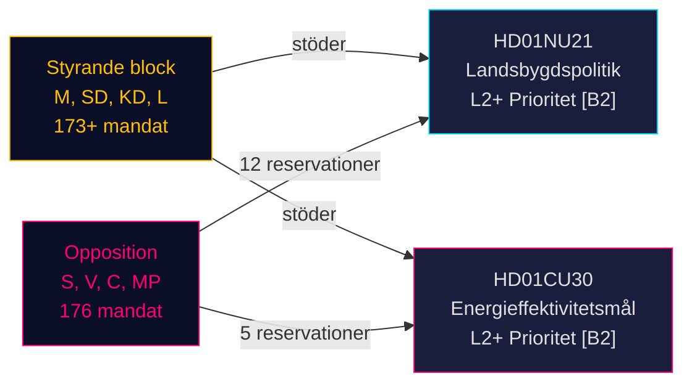
```mermaid
graph LR
    style NU21 fill:#1a1e3d,stroke:#00d9ff,color:#e0e0e0
    style CU30 fill:#1a1e3d,stroke:#ff006e,color:#e0e0e0
    style GOV fill:#0a0e27,stroke:#ffbe0b,color:#ffbe0b
    style OPP fill:#0a0e27,stroke:#ff006e,color:#ff006e
    
    NU21["HD01NU21\nLandsbygdspolitik\nL2+ Prioritet [B2]"]
    CU30["HD01CU30\nEnergieffektivitetsmål\nL2+ Prioritet [B2]"]
    GOV["Styrande block\nM, SD, KD, L\n173+ mandat"]
    OPP["Opposition\nS, V, C, MP\n176 mandat"]
    
    GOV -->|"stöder"| NU21
    GOV -->|"stöder"| CU30
    OPP -->|"12 reservationer"| NU21
    OPP -->|"5 reservationer"| CU30
```

<!-- source-sha: 024711d152b3357ca699b043a50b4b7600683400 -->

## Executive Brief Zh
<!-- source: executive-brief_zh.md :: https://github.com/Hack23/riksdagsmonitor/blob/main/analysis/daily/2026-05-13/committeeReports/executive-brief_zh.md -->

**摘要**：2026年5月12日，瑞典Riksdag收到两份具有重要政治意义的betänkandan：关于全面农村政策的Betänkande 2025/26:NU21（prop. 2025/26:158）和关于取代2030年量化目标的新能源效率目标的Betänkande 2025/26:CU30（prop. 2025/26:159）。两份报告均显示，执政联盟（M, SD, KD, L）正在推进其选前立法议程，面对提出多点保留意见但缺乏阻止提案的议会多数的持续反对党（S, V, C, MP）。能源报告尤为重要：瑞典正在放弃50%的量化能源效率目标，转而采用明确容纳核能扩张和电气化的定性目标——这是2026年9月选举前能源治理中的地震性转变。

### 支持的关键决策

1. **HD01NU21表决**：Riksdagen可能在S、V、C、MP的保留下通过——执政联盟拥有多数
2. **HD01CU30表决**：新的定性能源效率目标将获通过；S/V/MP的强烈反对预示着强大的竞选议题
3. **2026年9月选举动态**：农村政策和能源转型都是所有主要政党的顶级动员议题

### 60秒情报要点

- **HD01NU21**实施Lagen om regionalt utvecklingsansvar（2010:630）法律修订：各地区必须与公民社会组织和私立高等教育机构协商；Lagrådet无异议通过；生效日期TBC
- **HD01CU30**用强调灵活性、可负担性、电气化和核能适应的定性目标取代瑞典2030年50%能源效率目标；通过对Lagen（2006:985）om energideklaration för byggnader和Plan- och bygglagen（2010:900）的修订实施欧盟EPBD修订指令
- **反对派集团**（S, V, MP）对NU21提出12项保留，对CU30提出5项保留——高密度保留意见表明深层政策分歧
- **选前倍增系数激活**（距2026年9月≤6个月）：DIW分数上升1.5倍；两份报告均为L2+优先级
- **Andreas Lennkvist Manriquez（V）**在投票反对政府能源目标的同时领导CU——制度上自相矛盾的信号；委员会程序在议会规则下形式上有效

### 主要前瞻触发因素

**CU30表决日**（2026年5月底）：如果SD、M、KD、L维持联合纪律，定性能源目标通过——但若有政党离脱（尤其是核能框架压力下的KD或L），程序性延迟成为可能。监视政党督导人。

### 置信度评估

**HIGH [B2]** — 基于Riksdag主要文件（dok_id HD01NU21, HD01CU30）、委员会文本的直接引用、已知议会席位分配（Tidökoalitionen多数）、Lagrådets yttrande（对NU21无异议）和IMF WEO 2026年4月宏观经济背景。

```mermaid
graph LR
    style NU21 fill:#1a1e3d,stroke:#00d9ff,color:#e0e0e0
    style CU30 fill:#1a1e3d,stroke:#ff006e,color:#e0e0e0
    style GOV fill:#0a0e27,stroke:#ffbe0b,color:#ffbe0b
    style OPP fill:#0a0e27,stroke:#ff006e,color:#ff006e
    
    NU21["HD01NU21\n农村政策\nL2+ 优先级 [B2]"]
    CU30["HD01CU30\n能源效率目标\nL2+ 优先级 [B2]"]
    GOV["执政联盟\nM, SD, KD, L\n173+席位"]
    OPP["反对党\nS, V, C, MP\n176席位"]
    
    GOV -->|"支持"| NU21
    GOV -->|"支持"| CU30
    OPP -->|"12项保留"| NU21
    OPP -->|"5项保留"| CU30
```

<!-- source-sha: 024711d152b3357ca699b043a50b4b7600683400 -->

## Analysis Artifact Coverage Report

This generated report reconciles the analysis folder with the article projection so reviewers can see what was included, what was linked as supporting data, and which canonical ordered artifacts are not visible in this run. Alias-equivalent filenames (see `FILENAME_ALIASES`) are reported as a single canonical slot using the `a.md / b.md` shorthand so a missing slot is not double-counted.

| Coverage area | Count | Reader-facing treatment |
|---|---:|---|
| Ordered/root markdown sections | 35 | Expanded as article sections in the narrative order above |
| Per-document analyses | 2 | Expanded under `## Per-document intelligence` immediately after significance scoring |
| Supporting data artifacts | 2 | Linked in Article Sources, not expanded inline |

**Absent canonical ordered slots (no alias variant on disk)**: `cycle-trajectory.md`, `parliamentary-season.md`, `quantitative-swot.md`, `political-stride-assessment.md`, `wildcards-blackswans.md`, `pestle-analysis.md`, `horizon-pir-rollforward.md`

**Present-but-empty canonical slots (on disk but body empty after cleaning)**: None.

**Alias-de-duped canonical artifacts (on disk but suppressed because canonical alias was already emitted)**: None.

## Article Sources

Each section above projects one analysis artifact. The full audited markdown is available on GitHub:

- [`executive-brief.md`](https://github.com/Hack23/riksdagsmonitor/blob/main/analysis/daily/2026-05-13/committeeReports/executive-brief.md)
- [`synthesis-summary.md`](https://github.com/Hack23/riksdagsmonitor/blob/main/analysis/daily/2026-05-13/committeeReports/synthesis-summary.md)
- [`intelligence-assessment.md`](https://github.com/Hack23/riksdagsmonitor/blob/main/analysis/daily/2026-05-13/committeeReports/intelligence-assessment.md)
- [`significance-scoring.md`](https://github.com/Hack23/riksdagsmonitor/blob/main/analysis/daily/2026-05-13/committeeReports/significance-scoring.md)
- [`documents/HD01CU30-analysis.md`](https://github.com/Hack23/riksdagsmonitor/blob/main/analysis/daily/2026-05-13/committeeReports/documents/HD01CU30-analysis.md)
- [`documents/HD01NU21-analysis.md`](https://github.com/Hack23/riksdagsmonitor/blob/main/analysis/daily/2026-05-13/committeeReports/documents/HD01NU21-analysis.md)
- [`stakeholder-perspectives.md`](https://github.com/Hack23/riksdagsmonitor/blob/main/analysis/daily/2026-05-13/committeeReports/stakeholder-perspectives.md)
- [`coalition-mathematics.md`](https://github.com/Hack23/riksdagsmonitor/blob/main/analysis/daily/2026-05-13/committeeReports/coalition-mathematics.md)
- [`voter-segmentation.md`](https://github.com/Hack23/riksdagsmonitor/blob/main/analysis/daily/2026-05-13/committeeReports/voter-segmentation.md)
- [`forward-indicators.md`](https://github.com/Hack23/riksdagsmonitor/blob/main/analysis/daily/2026-05-13/committeeReports/forward-indicators.md)
- [`scenario-analysis.md`](https://github.com/Hack23/riksdagsmonitor/blob/main/analysis/daily/2026-05-13/committeeReports/scenario-analysis.md)
- [`election-2026-analysis.md`](https://github.com/Hack23/riksdagsmonitor/blob/main/analysis/daily/2026-05-13/committeeReports/election-2026-analysis.md)
- [`risk-assessment.md`](https://github.com/Hack23/riksdagsmonitor/blob/main/analysis/daily/2026-05-13/committeeReports/risk-assessment.md)
- [`swot-analysis.md`](https://github.com/Hack23/riksdagsmonitor/blob/main/analysis/daily/2026-05-13/committeeReports/swot-analysis.md)
- [`threat-analysis.md`](https://github.com/Hack23/riksdagsmonitor/blob/main/analysis/daily/2026-05-13/committeeReports/threat-analysis.md)
- [`historical-parallels.md`](https://github.com/Hack23/riksdagsmonitor/blob/main/analysis/daily/2026-05-13/committeeReports/historical-parallels.md)
- [`comparative-international.md`](https://github.com/Hack23/riksdagsmonitor/blob/main/analysis/daily/2026-05-13/committeeReports/comparative-international.md)
- [`implementation-feasibility.md`](https://github.com/Hack23/riksdagsmonitor/blob/main/analysis/daily/2026-05-13/committeeReports/implementation-feasibility.md)
- [`media-framing-analysis.md`](https://github.com/Hack23/riksdagsmonitor/blob/main/analysis/daily/2026-05-13/committeeReports/media-framing-analysis.md)
- [`devils-advocate.md`](https://github.com/Hack23/riksdagsmonitor/blob/main/analysis/daily/2026-05-13/committeeReports/devils-advocate.md)
- [`classification-results.md`](https://github.com/Hack23/riksdagsmonitor/blob/main/analysis/daily/2026-05-13/committeeReports/classification-results.md)
- [`cross-reference-map.md`](https://github.com/Hack23/riksdagsmonitor/blob/main/analysis/daily/2026-05-13/committeeReports/cross-reference-map.md)
- [`methodology-reflection.md`](https://github.com/Hack23/riksdagsmonitor/blob/main/analysis/daily/2026-05-13/committeeReports/methodology-reflection.md)
- [`data-download-manifest.md`](https://github.com/Hack23/riksdagsmonitor/blob/main/analysis/daily/2026-05-13/committeeReports/data-download-manifest.md)
- [`executive-brief_ar.md`](https://github.com/Hack23/riksdagsmonitor/blob/main/analysis/daily/2026-05-13/committeeReports/executive-brief_ar.md)
- [`executive-brief_da.md`](https://github.com/Hack23/riksdagsmonitor/blob/main/analysis/daily/2026-05-13/committeeReports/executive-brief_da.md)
- [`executive-brief_de.md`](https://github.com/Hack23/riksdagsmonitor/blob/main/analysis/daily/2026-05-13/committeeReports/executive-brief_de.md)
- [`executive-brief_es.md`](https://github.com/Hack23/riksdagsmonitor/blob/main/analysis/daily/2026-05-13/committeeReports/executive-brief_es.md)
- [`executive-brief_fi.md`](https://github.com/Hack23/riksdagsmonitor/blob/main/analysis/daily/2026-05-13/committeeReports/executive-brief_fi.md)
- [`executive-brief_fr.md`](https://github.com/Hack23/riksdagsmonitor/blob/main/analysis/daily/2026-05-13/committeeReports/executive-brief_fr.md)
- [`executive-brief_he.md`](https://github.com/Hack23/riksdagsmonitor/blob/main/analysis/daily/2026-05-13/committeeReports/executive-brief_he.md)
- [`executive-brief_ja.md`](https://github.com/Hack23/riksdagsmonitor/blob/main/analysis/daily/2026-05-13/committeeReports/executive-brief_ja.md)
- [`executive-brief_ko.md`](https://github.com/Hack23/riksdagsmonitor/blob/main/analysis/daily/2026-05-13/committeeReports/executive-brief_ko.md)
- [`executive-brief_nl.md`](https://github.com/Hack23/riksdagsmonitor/blob/main/analysis/daily/2026-05-13/committeeReports/executive-brief_nl.md)
- [`executive-brief_no.md`](https://github.com/Hack23/riksdagsmonitor/blob/main/analysis/daily/2026-05-13/committeeReports/executive-brief_no.md)
- [`executive-brief_sv.md`](https://github.com/Hack23/riksdagsmonitor/blob/main/analysis/daily/2026-05-13/committeeReports/executive-brief_sv.md)
- [`executive-brief_zh.md`](https://github.com/Hack23/riksdagsmonitor/blob/main/analysis/daily/2026-05-13/committeeReports/executive-brief_zh.md)

### Supporting Data Artifacts

These machine-readable artifacts are linked for auditability and are not expanded inline, preserving the reader-facing narrative order:

- [`documents/hd01cu30.json`](https://github.com/Hack23/riksdagsmonitor/blob/main/analysis/daily/2026-05-13/committeeReports/documents/hd01cu30.json)
- [`documents/hd01nu21.json`](https://github.com/Hack23/riksdagsmonitor/blob/main/analysis/daily/2026-05-13/committeeReports/documents/hd01nu21.json)
