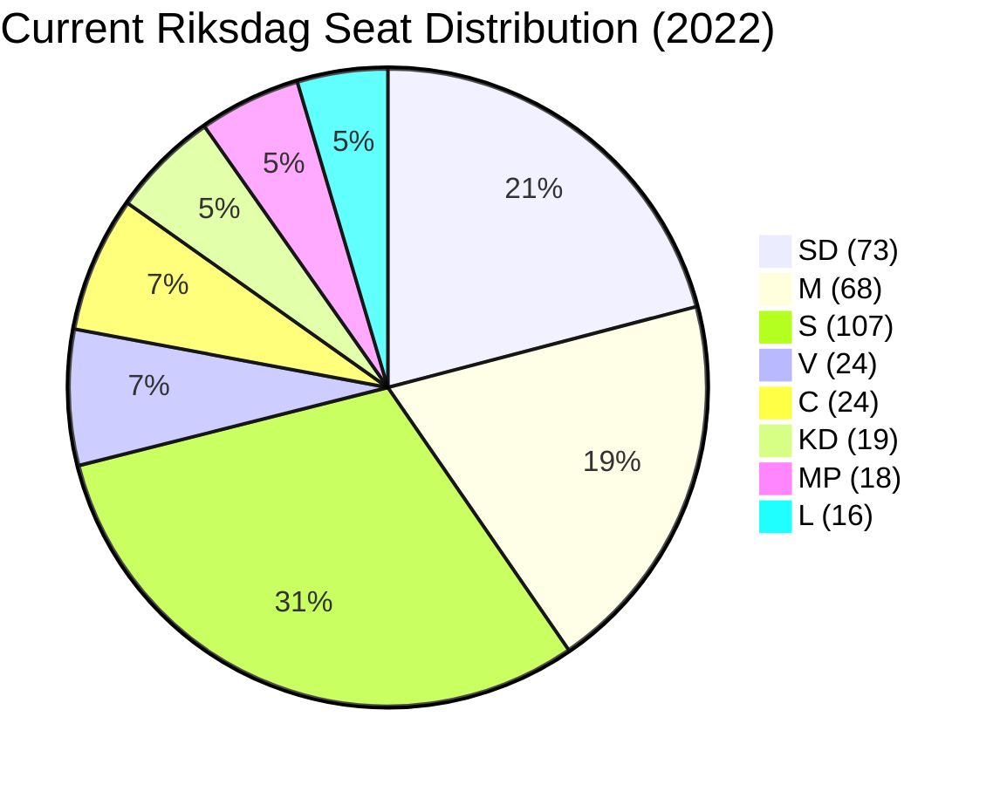

# Coalition Mathematics — Committee Reports 2026-05-13

## Current Seat Map (2022 Election Results, adjusted)

| Party | Seats | Bloc | Notes |
|-------|:---:|---|---|
| Socialdemokraterna (S) | 107 | Red-Green bloc | Largest single party |
| Sverigedemokraterna (SD) | 73 | Tidökoalition | Coalition backbone |
| Moderaterna (M) | 68 | Tidökoalition | PM party |
| Vänsterpartiet (V) | 24 | Red-Green bloc | S toleration dependency |
| Centerpartiet (C) | 24 | Swing | Supports opposition; kingmaker potential |
| Kristdemokraterna (KD) | 19 | Tidökoalition | |
| Miljöpartiet (MP) | 18 | Red-Green bloc | Borderline (4% threshold) |
| Liberalerna (L) | 16 | Tidökoalition | |
| **TOTAL** | **349** | | Majority = 175 |

**Tidökoalition baseline**: SD + M + KD + L = **176** (barely above majority)

## Pivotal-Vote Table for NU21 and CU30

| Vote | Expected outcome | Pivotal party | Margin |
|------|-----------------|---------------|-------|
| HD01NU21 adoption | **PASS** | None needed — 176 vs. 173 | +3 |
| HD01CU30 adoption | **PASS** | None needed — 176 vs. 173 | +3 |
| HD01NU21 reservation yrkanden (S/V/C/MP) | **FAIL** | C would need M to defect | C has 24 seats; needs 12+ coalition defections |
| HD01CU30 reservation yrkanden (S/V/MP) | **FAIL** | MP+V+S ≈ 149; needs C to get to 173 | C addition still insufficient (173 < 175) |

**Conclusion**: Both betänkanden will pass on current coalition math. No reservation yrkanden can pass without coalition defections. C's 24 seats are insufficient to defeat either proposal even if C votes with full opposition.

## Sensitivity: What Does Defection Require?

For CU30 to fail, the government needs defections from within Tidökoalition:
- **Scenario A**: L (16) + 2 individual M defectors → coalition drops to 159 → fails if S+V+MP+C = 173+... no, still fails (173 < 175). Requires L + KD defection + 2 M defectors → very unlikely.
- **Scenario B**: Only possible if C forms S-led budget coalition AND 10+ coalition MPs defect → probability < 1%.

**KJ-1 is robust**: The mathematical foundation for both betänkanden to pass is strong.

## Post-2026 Election Coalition Mathematics

### Scenario: Tidökoalition holds (176+ seats)
- Government formation: M continues as PM; no C needed
- Energy policy: qualitative goal stands; no renegotiation
- Rural policy: NU21 in force; implementation follows

### Scenario: Hung parliament (C kingmaker at 22–26 seats)
- C's stated energy position (quantitative targets demanded in CU30 reservation) becomes government formation condition
- Expected outcome: implementing regulation adds quantitative benchmarks to the qualitative goal framework — partial reversal of CU30 via regulation
- Rural policy: NU21 expanded with C rural investment demand; possibly OECD-compatible rural service floors

### Scenario: Red-Green government (requires C to cross floor; highly unlikely)
- Both NU21 and CU30 would be reviewed for possible replacement legislation
- Energy efficiency target would return to quantitative (S party line); nuclear policy contested

## Mermaid Seat Distribution

