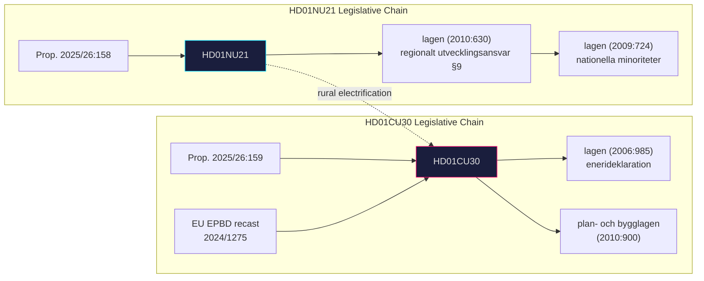

# Cross-Reference Map — Committee Reports 2026-05-13

## Policy Cluster: Economic Competitiveness + Territorial Cohesion

Both betänkanden share a governing coalition narrative: Sweden's economic competitiveness requires both a well-functioning national territory (NU21) and an internationally competitive energy sector (CU30). These are not isolated policies — they form a coherent pre-election economic platform.

## Legislative Chain: HD01NU21

```
Prop. 2025/26:158 (Hela Sverige ska fungera)
  └── Betänkande HD01NU21 (Näringsutskottet, 2025/26:NU21)
       └── Lag om ändring i lagen (2010:630) om regionalt utvecklingsansvar
            ├── New §9: civil society + private HE consultation obligation
            └── Reference to lagen (2009:724) om nationella minoriteter och minoritetsspråk
```

**Related prior propositions**:
- Prop. 2013/14:122 — original lagen om regionalt utvecklingsansvar (Alliansen reform)
- Prop. 2019/20:158 — previous regional development amendments under S-MP government

**Committee referrals (8 utskott)**: ArU, BoU, FiU, KU, KrU, MJU, SoU, TU — signal breadth of rural policy ambitions.

## Legislative Chain: HD01CU30

```
Prop. 2025/26:159 (Nytt mål + EPBD)
  └── Betänkande HD01CU30 (Civilutskottet, 2025/26:CU30)
       ├── Lag om ändring i lagen (2006:985) om energideklaration för byggnader
       └── Lag om ändring i plan- och bygglagen (2010:900)
            └── EPBD recast directive (EU 2024/1275) transposition
```

**Related EU legislative chain**:
- EPBD 2010/31/EU → EPBD recast 2024/1275/EU → CU30 implements 2024 recast
- EU ETS (phase 4, buildings sector) — interacts with EPBD implementation

**Related Swedish legislation**:
- Energimarknadsinspektionens (Ei) reporting obligations — affected by qualitative goal
- Boverket's building regulations (BBR) — EPBD implementation through BBR updates

## Cross-Document Policy Links

| Link | NU21 element | CU30 element | Nature |
|------|--------------|--------------|--------|
| Rural electrification | Regional development mandate | Qualitative energy goal (electrification) | Synergistic |
| National resilience | Rural infrastructure | Energy security framing ("stärkt motståndskraft") | Thematic alignment |
| EU compliance | National minority law cross-reference | EPBD directive implementation | EU law shared dimension |
| Opposition mobilisation | S 19 yrkanden rural | S, V, MP 5 reservations energy | Joint opposition platform potential |

## Citation Network


