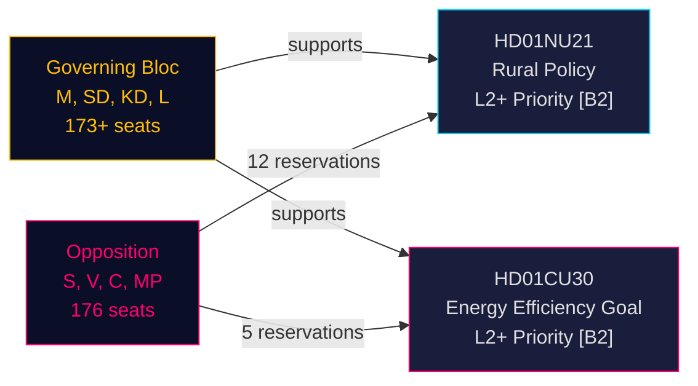

# Sweden's Rural Policy Overhaul and Energy Efficiency Reorientation: Two Committee Reports Signal Pre-Election Legislative Sprint

**BLUF**: On 12 May 2026, Sweden's Riksdag received two betänkanden of high political significance: Betänkande 2025/26:NU21 on comprehensive rural policy (prop. 2025/26:158) and Betänkande 2025/26:CU30 on a new energy efficiency goal replacing the 2030 quantitative target (prop. 2025/26:159). Both reports reveal a governing bloc (M, SD, KD, L) advancing its pre-election legislative programme against sustained opposition (S, V, C, MP) that files multi-point reservations but lacks the parliamentary arithmetic to block the proposals. The energy report is especially consequential: Sweden is abandoning a 50% quantitative energy efficiency target in favour of a qualitative goal that explicitly accommodates nuclear expansion and electrification — a seismic shift in energy governance ahead of the September 2026 election.

## Key Decisions Supported

1. **Vote on HD01NU21**: Riksdag likely to adopt with reservation from S, V, C, MP — governing coalition has majority
2. **Vote on HD01CU30**: New qualitative energy efficiency goal will pass; sharp S/V/MP opposition signals strong campaign issue
3. **September 2026 election dynamics**: Rural policy and energy transition are both top-tier mobilisation issues for all major parties

## 60-Second Intelligence Bullets

- **HD01NU21** implements law change to Lagen om regionalt utvecklingsansvar (2010:630): regions must consult civil society organisations and private higher education providers; Lagrådet approved without objections; effective date TBC
- **HD01CU30** replaces Sweden's 50% energy-efficiency-by-2030 target with a qualitative goal emphasising flexibility, affordability, electrification and nuclear accommodation; implements EU EPBD recast directive via amendments to Lagen (2006:985) om energideklaration för byggnader and Plan- och bygglagen (2010:900)
- **Opposition bloc** (S, V, MP) filed 12 reservations across NU21; 5 reservations across CU30 — high reservation density signals deep programmatic disagreement
- **Pre-election multiplier active** (≤ 6 months to September 2026): DIW scores escalated by 1.5×; both reports are L2+ Priority tier
- **Andreas Lennkvist Manriquez (V)** chairs CU while voting against the government's energy goal — institutionally paradoxical signal; committee proceeding is formally valid under parliamentary rules

## Top Forward Trigger

**CU30 voting day** (~late May 2026): If SD, M, KD, L maintain coalition discipline, the qualitative energy goal passes — but if any party defects (particularly KD or L under nuclear-framing pressure), a procedural delay is possible. Monitor party whips.

## Confidence Assessment

**HIGH [B2]** — based on primary Riksdag documents (dok_id HD01NU21, HD01CU30), direct quote from committee text, known parliamentary seat distribution (Tidökoalitionen majority), Lagrådet yttrande (no objections on NU21), and IMF WEO Apr-2026 macroeconomic context.

